# Chapter 1: Scale From Zero To Millions Of Users

> **Core Idea:** Designing a system that supports millions of users is challenging. It is a
> journey that requires continuous refinement and endless improvement. In this chapter, we
> build a system that supports a single user and gradually scale it up to serve millions of users.

---

## 🧠 The Big Picture — Evolution of Scaling

Think of it like building a **restaurant**:
- **Stage 1:** You cook, serve, and wash dishes yourself (single server)
- **Stage 2:** You hire a cashier and a cook (separate web & DB)
- **Stage 3:** Multiple branches with a central kitchen (load balancer + DB replication)
- **Stage 4:** Franchise model across cities (data centers, CDN, message queues)


---

## 1️⃣ Single Server Setup — Where It All Begins

When you're just starting out, **everything runs on a single server**: web app, database, cache — all on one machine.

### How a user request flows:

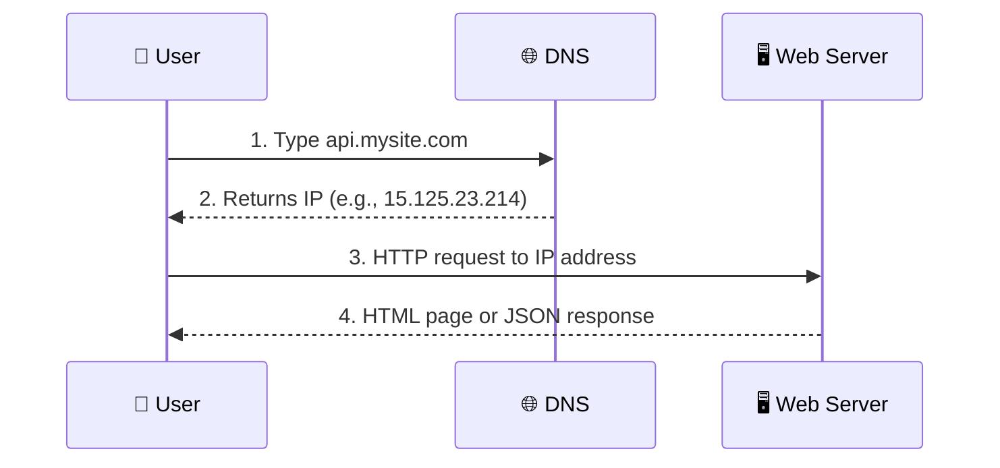

### What happens step by step:
1. **User types a URL** (e.g., `api.mysite.com`) in the browser
2. **DNS (Domain Name System)** resolves the domain name to an **IP address**
   - DNS is a paid service provided by 3rd parties (e.g., Route 53, Cloudflare)
   - It's NOT hosted on your server
3. **HTTP request** is sent to the web server using the IP address
4. **Web server** returns HTML pages or JSON response

### 🔑 Two types of traffic sources:
| Traffic Type | Description | Example |
|---|---|---|
| **Web Application** | Server-side rendering + client-side for presentation | HTML, CSS, JS served from server |
| **Mobile Application** | HTTP protocol for communication, JSON for data format | API returns JSON, mobile app renders it |

### 📝 Why JSON?
JSON is the **lingua franca** of APIs because:
- It's lightweight and human-readable
- Language-independent
- Easy to parse

**Example JSON response:**
```json
{
  "id": 12,
  "firstName": "John",
  "lastName": "Doe",
  "address": {
    "city": "New York"
  }
}
```

> **💡 Remember:** At this stage, everything is on ONE box. It's simple but fragile —
> if that one server dies, **everything goes down**. This is called a **Single Point of Failure (SPOF)**.

---

## 2️⃣ Database — Separating Web and Data Tier

As users grow, one server is not enough. The first natural step is to **separate the web/mobile traffic server (web tier) from the database server (data tier)**.

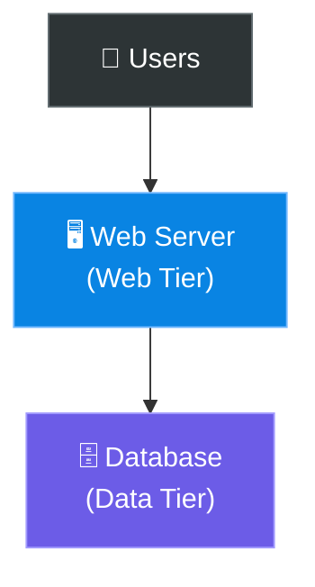

**Why separate?**
- They can be **scaled independently** (web server needs CPU, DB needs storage)
- If web server crashes, DB is still safe
- Different optimization strategies for each

### Which Database to Use?

There are **two broad categories**:

#### Relational Databases (RDBMS / SQL)
- MySQL, PostgreSQL, Oracle, SQL Server
- Data is stored in **tables and rows** with predefined schema
- Support **JOIN** operations across tables
- ACID compliant (Atomicity, Consistency, Isolation, Durability)

#### Non-Relational Databases (NoSQL)
- **Key-Value stores:** Redis, DynamoDB
- **Document stores:** MongoDB, CouchDB
- **Column stores (Wide-column):** Cassandra, HBase
- **Graph databases:** Neo4j, Amazon Neptune

### 🤔 When to choose NoSQL over SQL?

> **Default choice should be SQL** (relational). Choose NoSQL only if:

| Condition | Why NoSQL? |
|---|---|
| **Super-low latency** needed | NoSQL is optimized for speed |
| **Data is unstructured** | No relations between entities |
| **Massive amounts of data** | Need to store and serialize huge volumes |
| **Only need to serialize/deserialize** | No complex queries, just key-value lookups |

### 🍕 Pizza Analogy:
- **SQL** = A proper restaurant with a set menu, structured courses, and recipes (schema)
- **NoSQL** = A buffet where you put whatever you want on your plate (flexible schema)

---

## 3️⃣ Vertical Scaling vs Horizontal Scaling

This is one of the **most fundamental concepts** in system design.

### Vertical Scaling ("Scale Up") ⬆️
- Add **more power** to your existing machine (more CPU, RAM, Disk)
- Like upgrading from a bicycle 🚲 to a motorcycle 🏍️

### Horizontal Scaling ("Scale Out") ➡️
- Add **more machines** to your pool of resources
- Like adding more bicycles 🚲🚲🚲 to handle more riders

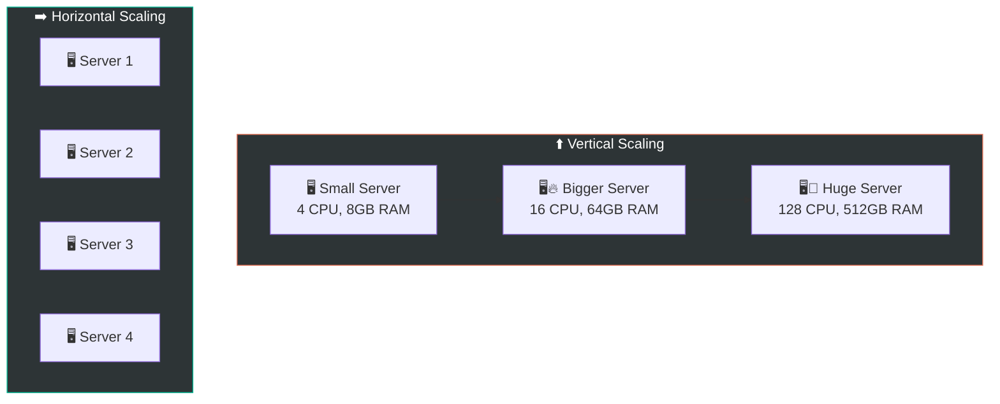

### Comparison:

| Aspect | Vertical Scaling | Horizontal Scaling |
|---|---|---|
| **Implementation** | Simple — just upgrade hardware | Complex — needs load balancing, distributed logic |
| **Hardware Limit** | ❌ Has a hard ceiling (you can't add infinite CPU to one machine) | ✅ Virtually unlimited |
| **Failover / Redundancy** | ❌ No failover (SPOF) | ✅ Built-in redundancy |
| **Cost** | 💰💰💰 Exponentially expensive | 💰 More cost-effective at scale |
| **Downtime** | ❌ Need to stop server to upgrade | ✅ Can add servers without downtime |

> **⚡ Key Insight:** Vertical scaling is a good starting point for small apps, but due to the
> **hard limit** and **SPOF risk**, horizontal scaling is essential for large-scale applications.

---

## 4️⃣ Load Balancer — The Traffic Cop 🚦

A load balancer **evenly distributes incoming traffic** among web servers.

### Before Load Balancer (Problem):
- Users connect directly to the web server
- If that server goes down → **website is offline**
- If too many users → **server overloaded**

### After Load Balancer (Solution):

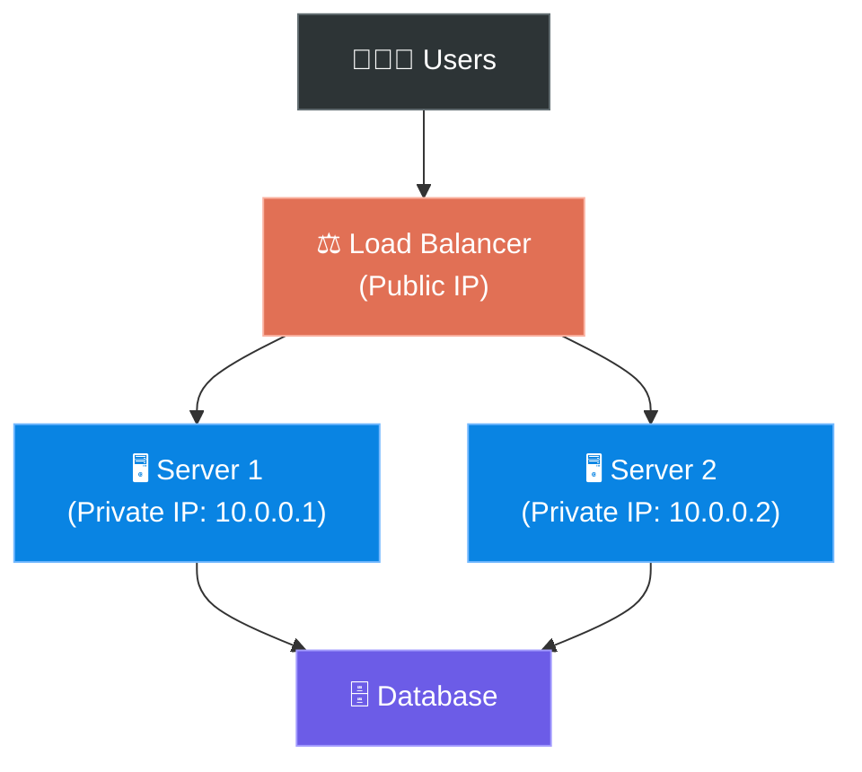

### 🔑 Key Details:

1. **Users connect to the Load Balancer's public IP** — NOT directly to servers
2. **Web servers are on private IPs** — not reachable directly from the internet (security!)
3. The LB communicates with servers using **private IPs**

### How it solves problems:

| Problem | Solution |
|---|---|
| **Server goes down** | LB detects failure via health checks and routes traffic to healthy servers |
| **Traffic surge** | Add more servers to the pool; LB distributes traffic automatically |
| **SPOF eliminated** | If Server 1 dies, Server 2 handles all traffic; meanwhile, a new healthy server is added |

### 🍕 Restaurant Analogy:
The Load Balancer is like a **host/hostess at a restaurant** — they don't cook or serve,
but they **direct customers to available tables** (servers), ensuring no single table is overwhelmed.

### Common Load Balancing Algorithms:

| Algorithm | How It Works | Best For |
|---|---|---|
| **Round Robin** | Routes requests in circular order (1→2→3→1→2→3...) | Equal-capacity servers |
| **Weighted Round Robin** | Assigns more requests to stronger servers | Mixed-capacity servers |
| **Least Connections** | Sends to server with fewest active connections | Variable-length requests |
| **IP Hash** | Same client IP always goes to same server | Session persistence |
| **Random** | Randomly picks a server | Simple, surprisingly effective |

---

## 5️⃣ Database Replication — Safety in Numbers 📚

Now web tier is handled, but the database is still a **Single Point of Failure**. Let's fix that!

Database replication follows a **master/slave** (or **primary/replica**) model.

### The Model:

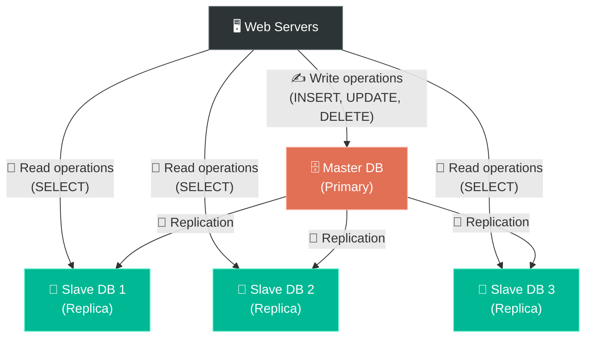

### How it works:
- **Master DB:** Handles ALL **write** operations (INSERT, UPDATE, DELETE)
- **Slave DBs:** Handle ALL **read** operations (SELECT)
- Master **replicates** data to all slaves
- **Most apps have way more reads than writes** (~90% reads), so having multiple slaves makes sense

### 🔑 Why is this important?

| Benefit | Explanation |
|---|---|
| **Better Performance** | Reads are distributed across multiple slaves (parallel processing) |
| **Reliability / High Availability** | Data is replicated across multiple locations. If one DB is destroyed, data is preserved |
| **Availability** | Even if one DB goes offline, you can still access data from other replicas |

### 🚨 What happens if a database goes offline?

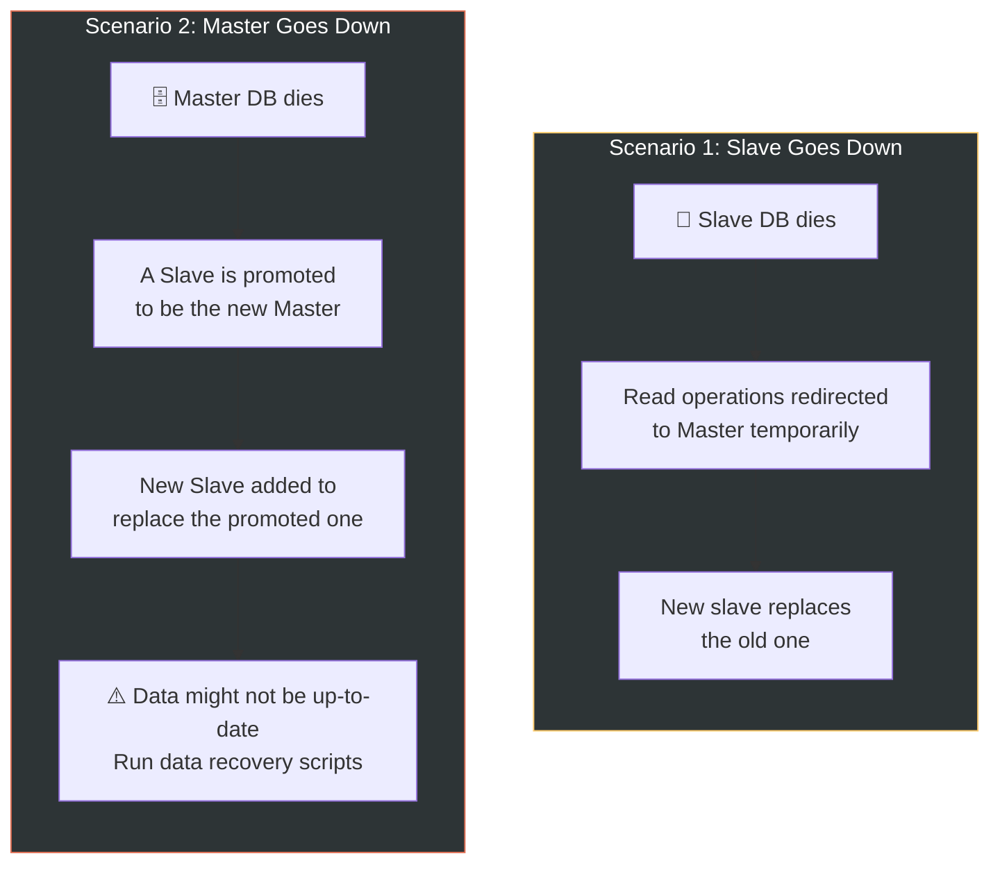

> **⚠️ Production Complexity:** In reality, promoting a slave to master is more complex.
> The data in the slave might not be up to date. Missing data needs to be updated by running
> **data recovery scripts**. Some solutions like **multi-masters** and **circular replication**
> can help, but they add complexity.

---

## 6️⃣ Cache — Speed Demon ⚡

### What is a Cache?
A cache is a **temporary storage area** that stores the results of **expensive queries** or
**frequently accessed data** in memory so that subsequent requests are served much faster.

### 🍕 Analogy:
Cache is like a **sticky note on your desk**. Instead of going to the filing cabinet (database)
every time you need a phone number, you write frequently-used numbers on a sticky note (cache)
for instant access.

### Why Cache?
Every time a page loads, one or more database calls are made. **Application performance is greatly
affected by calling the database repeatedly.** Cache can solve this problem.

### Cache Tier Architecture:

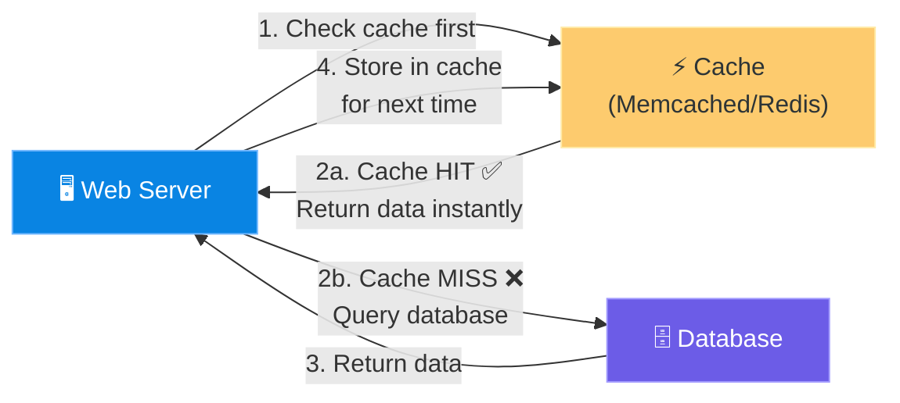

### Read-Through Cache Strategy (most common):

```
1. Web server receives a request
2. Check if data exists in cache
   ├── YES (Cache HIT) → Return cached data ⚡ (super fast!)
   └── NO  (Cache MISS) → Query Database
                          → Store result in cache
                          → Return data to client
```

### 🔑 Considerations for Using Cache:

| Consideration | Details |
|---|---|
| **When to use cache** | When data is **read frequently but modified infrequently**. Cached data is in volatile memory — don't use it for persisting important data |
| **Expiration policy** | Set TTL (Time To Live). Too short → frequent DB hits. Too long → stale data. **Balance is key!** |
| **Consistency** | Data store and cache can become inconsistent. Keeping them in sync is a challenge, especially across multiple regions |
| **Mitigating failures** | A single cache server = SPOF. Use **multiple cache servers across data centers**. Also **overprovision memory** to handle spikes |
| **Eviction policy** | When cache is full, which data to remove? **LRU (Least Recently Used)** is most popular. Others: LFU (Least Frequently Used), FIFO (First In First Out) |

### Cache Eviction Policies Visualized:

```
LRU (Least Recently Used) — Most Popular!
┌────────────────────────────────────┐
│ Cache: [A, B, C, D, E]            │
│ Access D → D moves to front       │
│ Cache: [D, A, B, C, E]            │
│ New item F? Remove E (least used) │
│ Cache: [F, D, A, B, C]            │
└────────────────────────────────────┘

LFU (Least Frequently Used)
┌────────────────────────────────────┐
│ Tracks frequency of access        │
│ A:5, B:3, C:1, D:8, E:2          │
│ Cache full? Remove C (freq = 1)   │
└────────────────────────────────────┘

FIFO (First In, First Out)
┌────────────────────────────────────┐
│ Like a queue — first added = first │
│ removed, regardless of usage       │
└────────────────────────────────────┘
```

---

## 7️⃣ Content Delivery Network (CDN) — The Global Courier 🌍

### What is a CDN?
A CDN is a **network of geographically dispersed servers** used to deliver **static content**
(images, videos, CSS, JavaScript files).

### 🍕 Analogy:
CDN is like **Amazon warehouses**. Instead of shipping every package from one central warehouse
(origin server), Amazon places items in **local warehouses** near customers for faster delivery.

### How CDN Works:

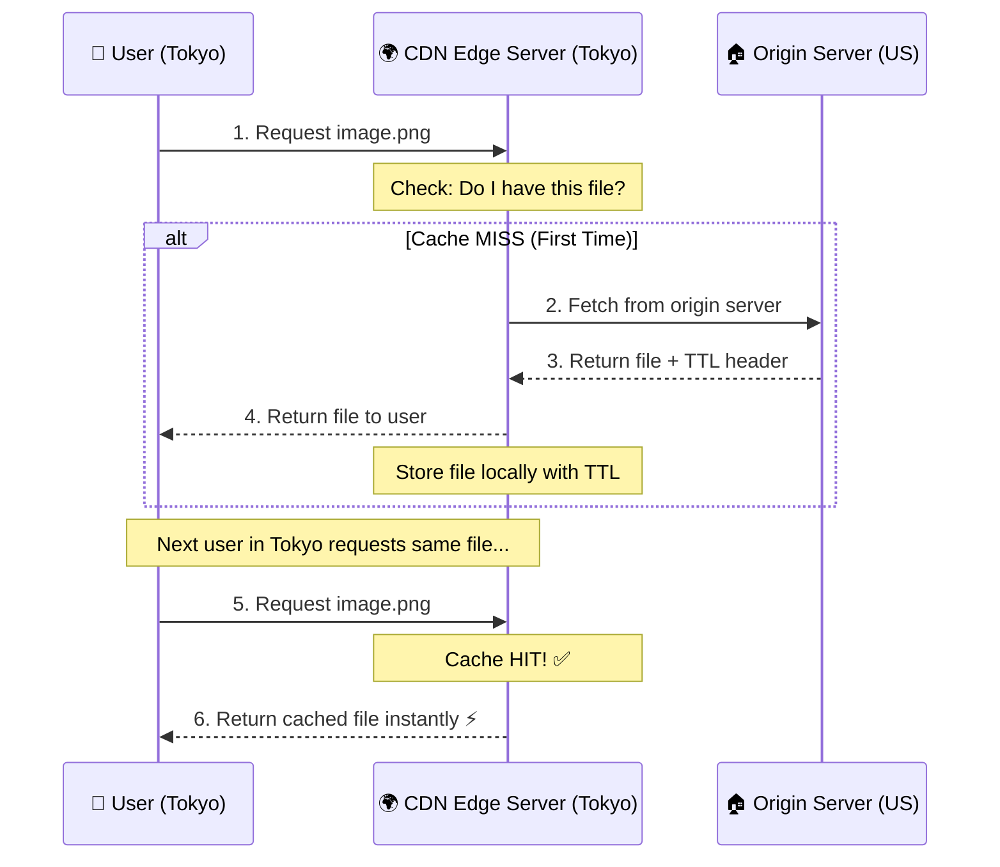

### CDN Workflow Explained:

```
User A (Paris) requests /logo.png
  → CDN Edge in Paris: "I don't have it" (MISS)
  → CDN fetches from Origin Server (US)
  → CDN stores it locally with TTL (say 24 hours)
  → Returns to User A

User B (Paris) requests /logo.png (1 hour later)
  → CDN Edge in Paris: "I have it!" (HIT)
  → Returns instantly ⚡ — no need to contact origin!

After 24 hours → TTL expires → file removed from CDN edge
Next request → cycle repeats
```

### 🔑 CDN Considerations:

| Consideration | Details |
|---|---|
| **Cost** | CDNs are run by 3rd parties (CloudFront, Akamai, Cloudflare). You pay for data transfer. Avoid caching infrequently used assets |
| **Appropriate TTL** | Too long → content might be stale. Too short → frequent origin hits. Use **versioning** (e.g., `image_v2.png`) for cache-busting |
| **CDN Fallback** | If CDN goes down, clients should fetch from origin server directly |
| **Invalidating files** | Use CDN API to invalidate objects, or use **object versioning** (`item.css?v=2`) |

### The Full Architecture So Far:

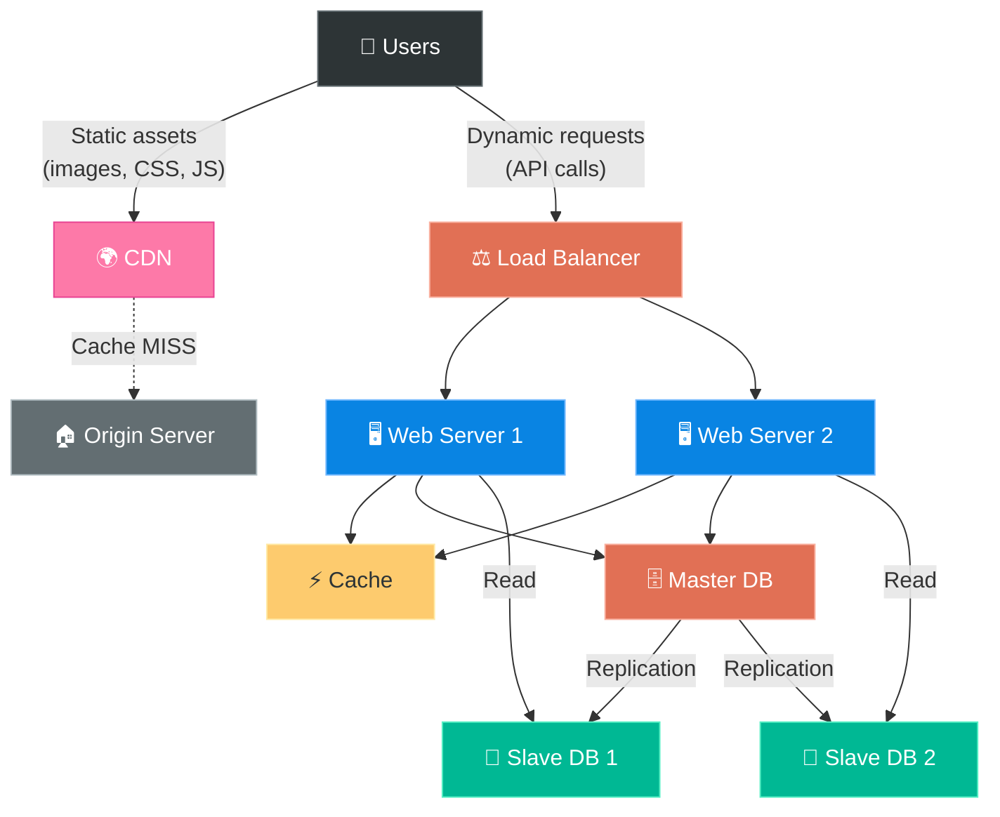

---

## 8️⃣ Stateless Web Tier — Freedom from Sticky Sessions 🔓

### The Problem: Stateful Architecture

In a **stateful** server, the server **remembers** the client's data (session) from one request
to the next. The session data is stored **in the server's memory**.

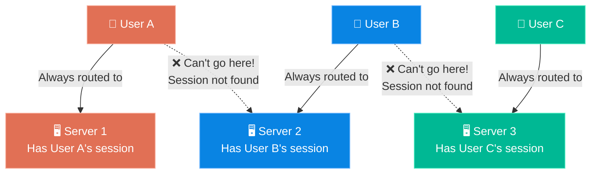

**Problems with Stateful:**
- ❌ User A **MUST always** be routed to Server 1 (sticky sessions)
- ❌ Adding or removing servers is **hard** (user sessions would be lost)
- ❌ Handling server failures is **complex**

### The Solution: Stateless Architecture

In a **stateless** architecture, the servers don't store any session data. Instead, session
state is moved to a **shared data store** (like Redis, Memcached, or a NoSQL DB).

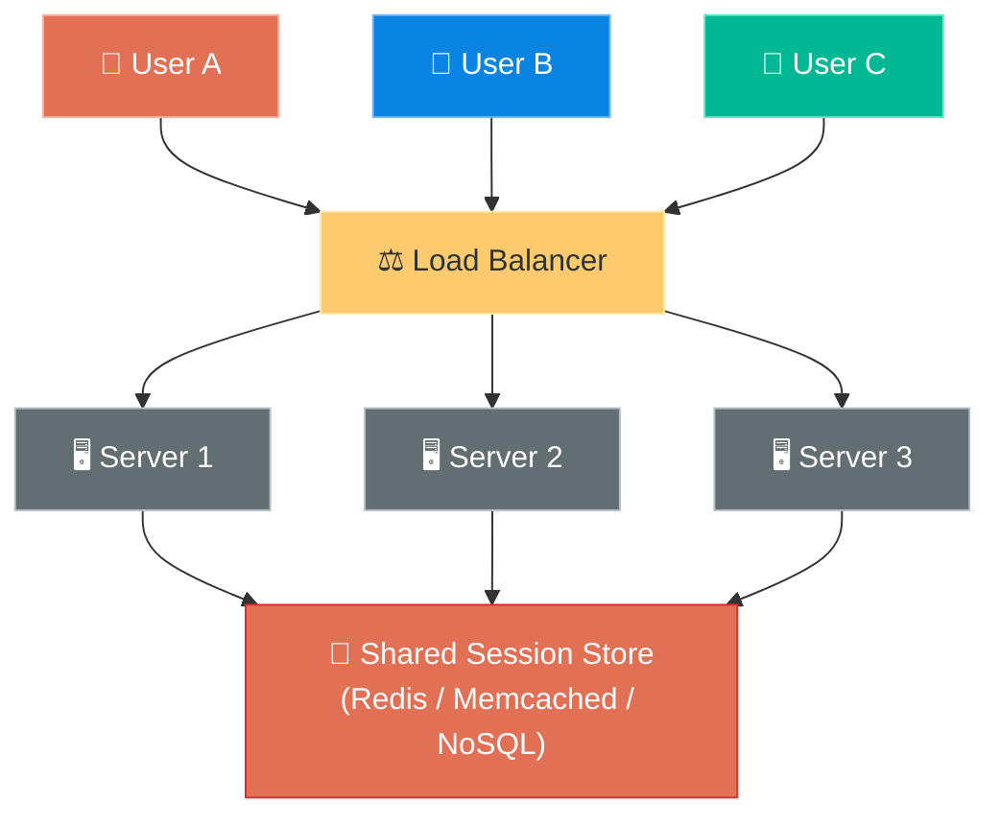

**Benefits of Stateless:**
- ✅ Any user can be routed to **any server**
- ✅ **Easy to scale** — just add/remove servers
- ✅ **Simple failover** — if a server dies, no session data is lost
- ✅ **Auto-scaling** becomes possible

### 🍕 Analogy:
- **Stateful** = A personal doctor who has your medical history in their notebook.
  If that doctor is unavailable, the new doctor knows nothing about you.
- **Stateless** = A hospital with a **central electronic health records system**.
  Any doctor can look up your history and treat you.

> **💡 Rule of Thumb:** Always prefer **stateless** architecture. Store state externally.
> This is a prerequisite for horizontal scaling.

---

## 9️⃣ Data Centers — Going Global 🌍

When your app serves users across the world, you need **multiple data centers** in different
geographic locations.

### How It Works:

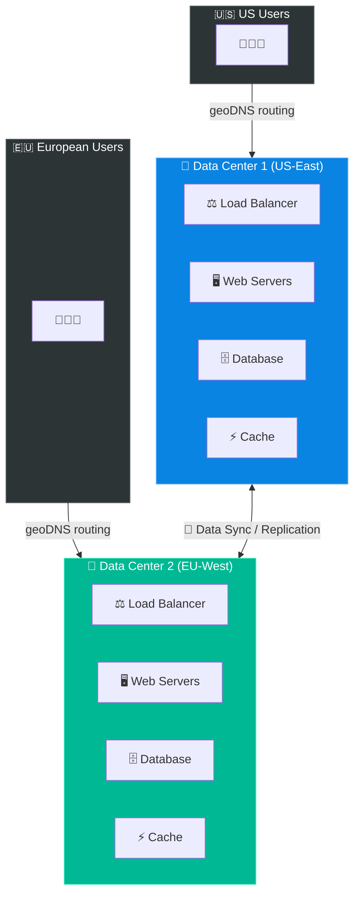

### geoDNS Routing:
**geoDNS** routes users to the **nearest data center** based on their geographic location.
- US users → US data center (lower latency)
- European users → EU data center (lower latency)

### 🚨 What if a Data Center goes down?

All traffic is **redirected** to the healthy data center.

```
Normal: US → DC1, EU → DC2
DC2 fails: US → DC1, EU → DC1 (all traffic to DC1)
```

### Technical Challenges of Multi-DC:

| Challenge | Description |
|---|---|
| **Traffic redirection** | Need tools like geoDNS to direct traffic correctly. Must handle failover gracefully |
| **Data synchronization** | Users from different regions could use different local databases. How to keep data in sync? Use **asynchronous replication** across DCs |
| **Test & deployment** | Need to test your app in multiple DC environments. **Automated deployment** tools are essential to keep services consistent |

> **🌟 Real-World Example:** Netflix replicates data across multiple data centers.
> If one DC goes down, traffic is seamlessly redirected — users don't even notice!

---

## 🔟 Message Queue — Decoupling the Beast 📬

A message queue is a **durable component** stored in memory that supports **asynchronous communication**.
It serves as a **buffer** and distributes asynchronous requests.

### The Architecture:

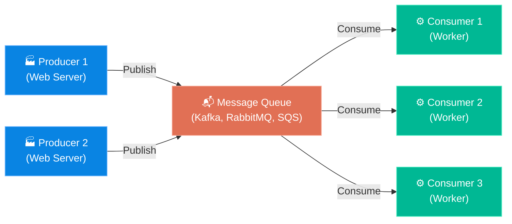

### How it works:
1. **Producers** create messages and publish them to the queue
2. **Consumers** subscribe to and process messages from the queue
3. Producers and consumers can be **scaled independently**

### 🍕 Analogy:
Message Queue is like a **postal service**:
- **You (Producer)** drop a letter in the mailbox
- **Post Office (Queue)** holds the letter
- **Recipient (Consumer)** picks it up when they're ready
- You don't need to wait for the recipient to be home!

### Why is this powerful?

```
WITHOUT Message Queue (Tight Coupling):
┌─────────────┐     ┌─────────────┐
│  Web Server  │────▶│  Photo      │  ← If photo processing is slow,
│              │     │  Processing │    web server is BLOCKED! 🛑
└─────────────┘     └─────────────┘

WITH Message Queue (Loose Coupling):
┌─────────────┐     ┌───────────┐     ┌─────────────┐
│  Web Server  │────▶│  Message  │────▶│  Photo      │
│              │     │  Queue    │     │  Processing │
└─────────────┘     └───────────┘     └─────────────┘
    ↑                                      ↑
    Responds to                            Processes at
    user immediately! ✅                   its own pace! ✅
```

### Key Benefits:

| Benefit | Description |
|---|---|
| **Decoupling** | Producer doesn't need to know about consumer and vice versa |
| **Scalability** | Scale producers and consumers independently |
| **Reliability** | If consumer is temporarily down, messages are **retained** in the queue |
| **Buffer** | Handles traffic spikes — queue absorbs the burst |

### Real-World Use Case:
**Photo customization** — User uploads a photo that needs cropping, sharpening, blurring, etc.
These are time-consuming tasks. The web server publishes "photo processing" jobs to the queue,
and **photo processing workers** pick them up asynchronously.
- If the queue grows → add more workers (consumers)
- If the queue is mostly empty → reduce workers (save resources)

---

## 1️⃣1️⃣ Logging, Metrics, and Automation 📊

As your system grows, investing in these tools becomes **essential**:

### Logging 📝
- Track **error logs** at the server level or use centralized logging tools
- Tools: **ELK Stack** (Elasticsearch, Logstash, Kibana), **Splunk**, **Datadog**
- Aggregate logs from multiple servers to a centralized service for easy search and viewing

### Metrics 📈
Collecting metrics helps you understand:

| Metric Type | Examples |
|---|---|
| **Host-level** | CPU usage, memory usage, disk I/O |
| **Aggregated-level** | Overall performance of the database tier, cache tier, etc. |
| **Business-level** | Daily active users (DAU), revenue, retention rate |

### Automation 🤖
When the system is large and complex, build **automation tools** to improve productivity:

| Tool Type | Purpose |
|---|---|
| **CI/CD** | Continuous Integration / Continuous Deployment. Automate building, testing, deploying |
| **Build Automation** | Every code check-in is verified by automated builds and tests |
| **Monitoring & Alerting** | Get alerted when something goes wrong before users notice |

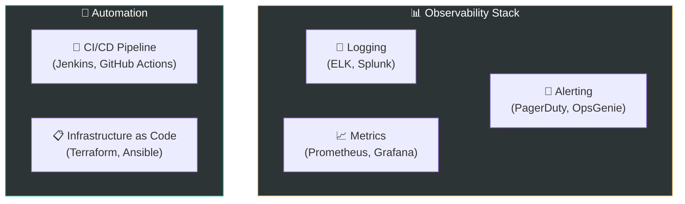

---

## 1️⃣2️⃣ Database Scaling — The Final Boss 🗄️

There are two approaches to database scaling: **vertical** and **horizontal**.

### Vertical Scaling (Scale Up)
- Add more CPU, RAM, storage to the existing database server
- Example: Amazon RDS allows up to **24 TB of RAM**
- **Limitations:**
  - Hardware limits
  - Greater risk of SPOF
  - Overall cost is high (powerful machines are expensive)

### Horizontal Scaling (Sharding) — The Real Deal 🔪

**Sharding** separates large databases into smaller, more easily managed parts called **shards**.
Each shard shares the same schema, but the actual data is **unique** to each shard.

### How Sharding Works:

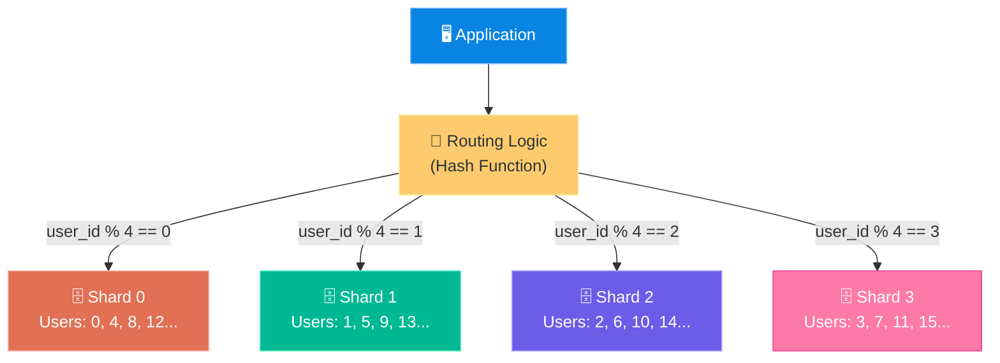

### Sharding Key (Partition Key):
The **most important factor** when implementing sharding is the choice of **sharding key**.

- The sharding key (e.g., `user_id`) determines **which shard** a piece of data goes to
- A good sharding key **distributes data evenly** across shards
- `user_id % number_of_shards` is the simplest hash function

### 🍕 Analogy:
Sharding is like a **university with multiple libraries**, each storing books for specific
departments. The department name (sharding key) tells you which library to go to.

### 🚨 Challenges of Sharding:

| Challenge | Description | Example |
|---|---|---|
| **Resharding** | Need to reshard when: a shard is exhausted, or data distribution is uneven. Use **consistent hashing** to mitigate | Shard 0 has 10M rows, Shard 1 has 100 rows |
| **Celebrity Problem (Hotspot Key)** | One shard gets overwhelmed because of a "hot" key | All queries for Katy Perry, Justin Bieber land on Shard 2 |
| **Join and De-normalization** | Once data is sharded across DBs, **JOINs across shards are hard** | Need user + order data? They might be on different shards |

### Solutions to Sharding Challenges:

```
Celebrity/Hotspot Problem:
  → Allocate a shard for each celebrity
  → Or further partition the celebrity's shard

Resharding:
  → Use Consistent Hashing (Chapter 5!)
  → Minimizes data movement when adding/removing shards

Cross-Shard Joins:
  → De-normalize the database
  → Store redundant data to avoid joins
  → Accept eventual consistency
```

---

## 🏗️ The Complete Architecture — Putting It All Together

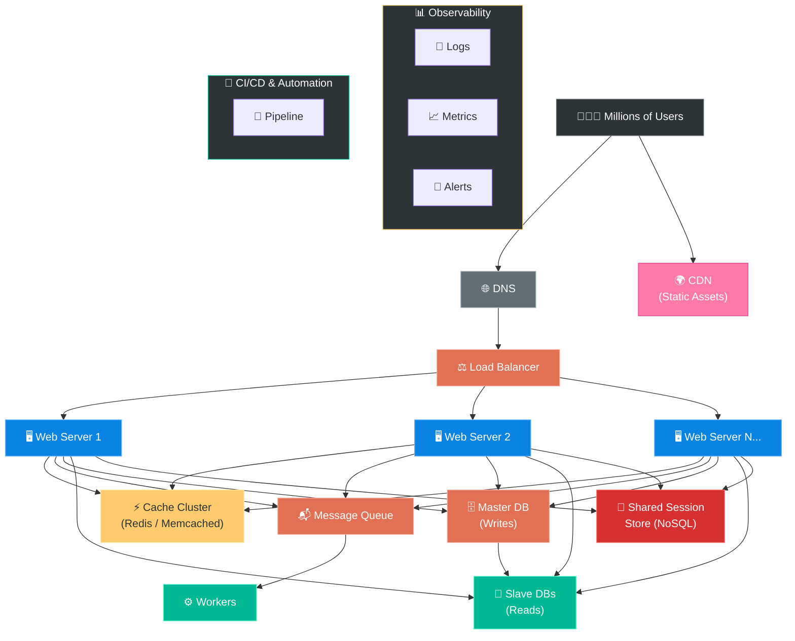

---

## 📋 Summary — The Journey of Scaling (Quick Revision Table)

| Step | What We Added | Problem It Solves | Key Concept |
|---|---|---|---|
| **1** | Single Server | Gets us started | Everything on one box |
| **2** | Separate DB | Independent scaling of web & data tiers | Separation of concerns |
| **3** | Load Balancer | Server failure + traffic distribution | Horizontal scaling of web tier |
| **4** | DB Replication | DB failure + read performance | Master/Slave, read replicas |
| **5** | Cache | Slow database queries | Temporary in-memory storage |
| **6** | CDN | Slow static content delivery globally | Geo-distributed edge servers |
| **7** | Stateless Tier | Session management + scaling | Move state to shared store |
| **8** | Data Centers | Latency for global users | geoDNS, data replication |
| **9** | Message Queue | Tight coupling, blocking operations | Async, producer-consumer |
| **10** | Logging/Metrics | Debugging, monitoring at scale | Observability |
| **11** | DB Sharding | Database can't hold all data | Partition data across DBs |

---

## 🧠 Memory Tricks — How to Remember This Chapter

### The "SLDCCSMDLMS" Mnemonic:
> **S**ingle server → **L**oad balancer → **D**atabase replication → **C**ache →
> **C**DN → **S**tateless → **M**ulti-DC → **D**ecoupling (MQ) →
> **L**ogging → **M**etrics → **S**harding

### Or remember it as a story:
> A developer named **SAM** started with a **Single** server. As users grew, he added a
> **Load balancer** and **Database replicas**. To speed things up, he added **Cache** and
> **CDN**. He made his servers **Stateless** and expanded to **Multiple Data Centers**.
> He used **Message Queues** for background jobs, added **Logging and Metrics** for
> visibility, and finally **Sharded** his database when it got too big.

### The Restaurant Evolution:
```
👨‍🍳 Stage 1: You alone (Single Server)
👨‍🍳👩‍🍳 Stage 2: Hired a cook (Web + DB separated)
🏪 Stage 3: Multiple counters with a host (Load Balancer)
📖 Stage 4: Copied the recipe book (DB Replication)
📋 Stage 5: Menu displayed outside (Cache — quick lookup)
🚚 Stage 6: Food trucks in neighborhoods (CDN)
🎫 Stage 7: Digital ordering system (Stateless — any counter serves any customer)
🌍 Stage 8: Multiple branches (Data Centers)
📬 Stage 9: Kitchen order tickets (Message Queue)
📊 Stage 10: CCTV + Inventory tracking (Logging & Metrics)
🔪 Stage 11: Each branch handles specific cuisines (Sharding)
```

---

## ❓ Interview Quick-Fire Questions

**Q1: What's the difference between vertical and horizontal scaling?**
> Vertical = adding more power to one machine. Horizontal = adding more machines.
> Horizontal is preferred for large scale due to no hardware limit and built-in redundancy.

**Q2: Why is stateless architecture preferred?**
> Because any server can handle any request. No sticky sessions needed.
> Makes auto-scaling, failover, and deployment much easier.

**Q3: What's the difference between Cache and CDN?**
> Cache stores dynamic/computed data (DB query results) in memory. CDN stores static
> assets (images, CSS, JS) on geographically distributed edge servers.

**Q4: When would you NOT use a relational database?**
> When you need super-low latency, your data is unstructured, you need to store massive
> amounts of data, or you only need to serialize/deserialize data (key-value).

**Q5: What is the biggest challenge in database sharding?**
> Choosing the right sharding key. A bad key leads to uneven distribution (hotspots).
> Also, cross-shard joins become impossible, requiring de-normalization.

**Q6: How does database replication improve availability?**
> Data is replicated across multiple servers. If the master goes down, a slave is promoted.
> If a slave goes down, reads are redirected. Data survives even if hardware fails.

---

> **📖 Next Chapter: Back-of-the-Envelope Estimation →**
