# 📝 Short Notes — Scale From Zero To Millions Of Users

---

## 1. Single Server
- Everything (web, DB, cache) on **one machine**
- User → DNS → IP → Web Server → Response
- ❌ **SPOF** — one server dies, everything dies

## 2. Separate Web & Database
- Web tier + Data tier on **different servers**
- Scale them **independently**
- **SQL** (MySQL, PostgreSQL) = structured, JOINs, ACID
- **NoSQL** (MongoDB, Redis, Cassandra) = unstructured, low-latency, massive scale
- 🔑 **Default = SQL.** Use NoSQL only for: super-low latency, unstructured data, massive volume, simple key-value

## 3. Vertical vs Horizontal Scaling
| | Vertical (Scale Up) | Horizontal (Scale Out) |
|---|---|---|
| How | More CPU/RAM to one server | Add more servers |
| Limit | ❌ Hard ceiling | ✅ Unlimited |
| SPOF | ❌ Yes | ✅ No |
| Cost | 💰💰💰 Expensive | 💰 Cost-effective |

## 4. Load Balancer
- Distributes traffic across web servers (users → LB → servers)
- Users hit LB's **public IP**, servers have **private IPs**
- If a server dies → LB routes to healthy ones
- Algorithms: **Round Robin**, Weighted RR, Least Connections, IP Hash

## 5. Database Replication (Master-Slave)
- **Master** → all WRITES (insert, update, delete)
- **Slaves** → all READS (select) — most apps are ~90% reads
- Master replicates data → Slaves
- Slave dies → reads go to master temporarily
- Master dies → slave promoted to master (run data recovery scripts)
- ✅ Better performance, reliability, availability

## 6. Cache
- In-memory store (Redis, Memcached) for **frequently read, rarely modified** data
- Flow: Check cache → HIT? return instantly ⚡ → MISS? query DB → store in cache
- **TTL**: too short = frequent DB hits, too long = stale data
- **Eviction**: LRU (most popular), LFU, FIFO
- ⚠️ Don't use cache as primary data store (volatile memory!)

## 7. CDN (Content Delivery Network)
- Geo-distributed edge servers for **static assets** (images, CSS, JS, videos)
- User → nearest CDN edge → HIT? serve instantly → MISS? fetch from origin, cache it
- Use **TTL** + **versioning** (`style.css?v=2`) for cache busting
- Providers: CloudFront, Cloudflare, Akamai

## 8. Stateless Web Tier
- ❌ **Stateful**: server stores session → user MUST go to same server (sticky sessions)
- ✅ **Stateless**: session stored in **shared store** (Redis/NoSQL) → any server can serve any user
- Enables: easy scaling, auto-scaling, simple failover
- 🔑 **Always prefer stateless!**

## 9. Data Centers
- Multiple DCs in different geo-locations (US-East, EU-West, etc.)
- **geoDNS** routes users to nearest DC
- DC fails → traffic redirected to healthy DC
- Challenge: **data sync across DCs** (use async replication)

## 10. Message Queue
- Async, durable buffer between **Producers** and **Consumers**
- Tools: Kafka, RabbitMQ, SQS
- Producer publishes → Queue holds → Consumer processes at own pace
- ✅ Decoupling, independent scaling, handles traffic spikes
- Example: photo processing — web server publishes job, workers process async

## 11. Logging, Metrics & Automation
- **Logging**: centralized error logs (ELK, Splunk)
- **Metrics**: host-level (CPU, RAM), aggregated (DB perf), business (DAU, revenue)
- **Automation**: CI/CD pipelines, automated testing, infrastructure as code

## 12. Database Sharding
- Split one big DB into **smaller shards** (same schema, different data)
- **Sharding key** (e.g., `user_id % N`) determines which shard
- 🔑 Good sharding key = **even data distribution**
- Challenges:
  - **Resharding**: uneven data → use consistent hashing
  - **Hotspot/Celebrity**: one shard overloaded → further partition
  - **Cross-shard JOINs**: impossible → de-normalize data

---

## ⚡ One-Line Summary Per Concept

| # | Concept | One-Liner |
|---|---|---|
| 1 | Single Server | Everything on one box — simple but fragile |
| 2 | Separate DB | Web and data on different servers — scale independently |
| 3 | Load Balancer | Traffic cop that distributes requests across servers |
| 4 | DB Replication | Master writes, slaves read — survive failures |
| 5 | Cache | In-memory shortcut to avoid hitting DB repeatedly |
| 6 | CDN | Geo-edge servers for fast static content delivery |
| 7 | Stateless | Move session out of servers → any server serves anyone |
| 8 | Data Centers | Go global with geoDNS routing to nearest DC |
| 9 | Message Queue | Async buffer — decouple producers and consumers |
| 10 | Observability | Logs + Metrics + Alerts = know what's happening |
| 11 | Sharding | Split DB into pieces using a partition key |

---

## 🧠 Quick Mnemonic

> **"Servers Love Databases, Cached CDNs Stay Multi-Queued, Logging Metrics Shards"**
>
> **S**ingle Server → **L**oad Balancer → **D**B Replication → **C**ache → **C**DN →
> **S**tateless → **M**ulti-DC → **Q**ueue → **L**ogging → **M**etrics → **S**harding

---

## 🏗️ Final Complete Architecture Diagram

```mermaid
graph TB
    %% --- User Layer ---
    Users["👤👤👤 Millions of Users"]

    %% --- DNS & CDN ---
    Users -->|"Resolve domain"| DNS["🌐 DNS<br/>(Route 53)"]
    Users -->|"Static: images, CSS, JS"| CDN["🌍 CDN<br/>(CloudFront / Cloudflare)"]
    CDN -.->|"Cache MISS"| OriginS3["🪣 Object Storage<br/>(S3 / Origin)"]

    %% --- Load Balancer ---
    DNS -->|"Returns IP"| LB["⚖️ Load Balancer<br/>(Public IP)"]

    %% --- Stateless Web Servers ---
    LB --> WS1["🖥️ Web Server 1<br/>(Private IP)"]
    LB --> WS2["🖥️ Web Server 2<br/>(Private IP)"]
    LB --> WSN["🖥️ Web Server N<br/>(Private IP)"]

    %% --- Shared Session Store ---
    WS1 & WS2 & WSN --> SessionStore["🔴 Session Store<br/>(Redis / Memcached)<br/>Stateless Tier"]

    %% --- Cache Tier ---
    WS1 & WS2 & WSN -->|"Check cache first"| CacheCluster["⚡ Cache Cluster<br/>(Redis / Memcached)"]

    %% --- Database Tier: Master + Slaves ---
    WS1 & WS2 & WSN -->|"✍️ Writes"| MasterDB["🗄️ Master DB<br/>(Primary)"]
    WS1 & WS2 & WSN -->|"📖 Reads"| SlaveDB1["📗 Slave DB 1"]
    WS1 & WS2 & WSN -->|"📖 Reads"| SlaveDB2["📗 Slave DB 2"]
    MasterDB -->|"🔄 Replication"| SlaveDB1
    MasterDB -->|"🔄 Replication"| SlaveDB2

    %% --- Sharding Layer ---
    MasterDB -->|"Shard 0: user_id%4=0"| Shard0["🔪 Shard 0"]
    MasterDB -->|"Shard 1: user_id%4=1"| Shard1["🔪 Shard 1"]
    MasterDB -->|"Shard 2: user_id%4=2"| Shard2["🔪 Shard 2"]
    MasterDB -->|"Shard 3: user_id%4=3"| Shard3["🔪 Shard 3"]

    %% --- Message Queue ---
    WS1 & WS2 & WSN -->|"Publish tasks"| MQ["📬 Message Queue<br/>(Kafka / RabbitMQ / SQS)"]
    MQ -->|"Consume"| W1["⚙️ Worker 1"]
    MQ -->|"Consume"| W2["⚙️ Worker 2"]
    MQ -->|"Consume"| W3["⚙️ Worker N"]

    %% --- Multi Data Center ---
    LB -.->|"geoDNS failover"| DC2["📍 Data Center 2<br/>(Geo-Replica)<br/>Mirror of entire stack"]
    MasterDB <-->|"Async Replication"| DC2

    %% --- Observability ---
    WS1 & WS2 & WSN -.-> Logs["📝 Centralized Logging<br/>(ELK / Splunk)"]
    WS1 & WS2 & WSN -.-> Metrics["📈 Metrics & Monitoring<br/>(Prometheus / Grafana)"]
    Logs & Metrics --> Alerts["🔔 Alerting<br/>(PagerDuty)"]

    %% --- CI/CD ---
    CICD["🤖 CI/CD Pipeline<br/>(GitHub Actions / Jenkins)"] -.->|"Deploy"| WS1 & WS2 & WSN

    %% --- Styles ---
    style Users fill:#2d3436,stroke:#636e72,color:#fff
    style DNS fill:#636e72,stroke:#b2bec3,color:#fff
    style CDN fill:#fd79a8,stroke:#e84393,color:#fff
    style OriginS3 fill:#636e72,stroke:#b2bec3,color:#fff
    style LB fill:#e17055,stroke:#fab1a0,color:#fff
    style WS1 fill:#0984e3,stroke:#74b9ff,color:#fff
    style WS2 fill:#0984e3,stroke:#74b9ff,color:#fff
    style WSN fill:#0984e3,stroke:#74b9ff,color:#fff
    style SessionStore fill:#d63031,stroke:#ff7675,color:#fff
    style CacheCluster fill:#fdcb6e,stroke:#ffeaa7,color:#2d3436
    style MasterDB fill:#e17055,stroke:#fab1a0,color:#fff
    style SlaveDB1 fill:#00b894,stroke:#55efc4,color:#fff
    style SlaveDB2 fill:#00b894,stroke:#55efc4,color:#fff
    style Shard0 fill:#6c5ce7,stroke:#a29bfe,color:#fff
    style Shard1 fill:#6c5ce7,stroke:#a29bfe,color:#fff
    style Shard2 fill:#6c5ce7,stroke:#a29bfe,color:#fff
    style Shard3 fill:#6c5ce7,stroke:#a29bfe,color:#fff
    style MQ fill:#e17055,stroke:#fab1a0,color:#fff
    style W1 fill:#00b894,stroke:#55efc4,color:#fff
    style W2 fill:#00b894,stroke:#55efc4,color:#fff
    style W3 fill:#00b894,stroke:#55efc4,color:#fff
    style DC2 fill:#0984e3,stroke:#74b9ff,color:#fff
    style Logs fill:#636e72,stroke:#b2bec3,color:#fff
    style Metrics fill:#636e72,stroke:#b2bec3,color:#fff
    style Alerts fill:#fdcb6e,stroke:#ffeaa7,color:#2d3436
    style CICD fill:#00b894,stroke:#55efc4,color:#fff
```

---

> 📖 **Detailed notes** → [scale_from_zero_to_millions_of_users.md](./scale_from_zero_to_millions_of_users.md)
