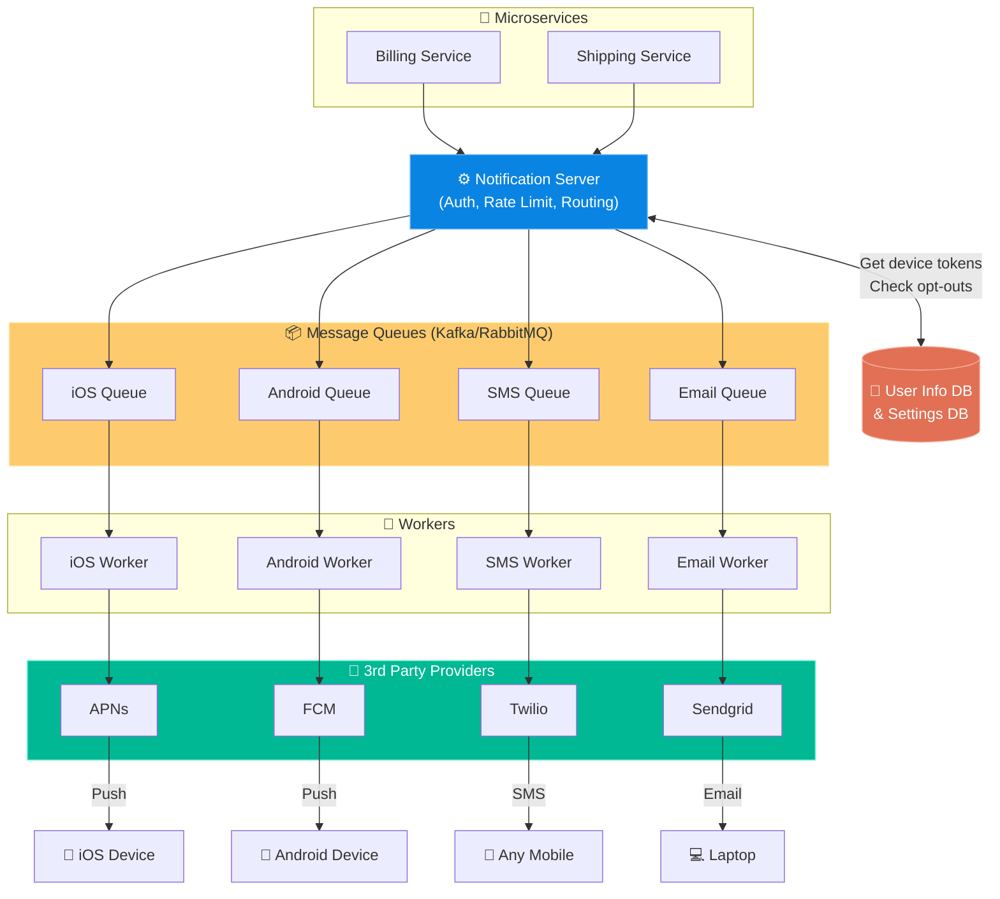

# Chapter 10: Design a Notification System

> **Core Idea:** Modern applications don't wait for users to open them—they proactively reach out. A Notification System is essentially a massive, highly-reliable routing engine. It takes a "trigger" from a microservice (e.g., "Transaction Approved"), retrieves the user's contact info, formats the message, and reliably routes it to third-party delivery services (Apple, Google, Twilio, SendGrid) without losing a single message during traffic spikes.

---

## 🧠 The Big Picture — Plumbers, Not Postmen

A critical realization for this interview: **You are not building the systems that actually ping the user's phone.**
- If you build an iOS app, Apple demands you use **APNs** (Apple Push Notification service).
- For Android, you must use **FCM** (Firebase Cloud Messaging).
- For text messages, you use **Twilio**.

### 🍕 The Logistics Hub Analogy:
Think of your Notification System like an Amazon Fulfillment Center. Amazon doesn't drive the package to your doorstep—they hand it over to FedEx, UPS, or USPS (the Third-Party Providers). 
Your job is to build the **Fulfillment Center**: making sure the package gets authorized, boxed up (templating), put on the right conveyor belt (message queues), and safely handed to FedEx (Third-party API). 

---

## 🎯 Step 1: Understand the Problem & Scope

### Clarifying the Requirements:

```
You:  "What types of notifications do we support?"
Int:  "Push notifications, SMS messages, and Emails."

You:  "Is it a real-time system?"
Int:  "Soft real-time. We want it delivered ASAP, but slight delays during peak loads are acceptable."

You:  "What is the scale?"
Int:  "10 Million mobile pushes, 1 Million SMS, and 5 Million emails per day."

You:  "Can users opt out?"
Int:  "Yes, users can selectively opt out of specific notification channels."
```

---

## 🏗️ Step 2: High-Level Design Architecture

### 1️⃣ Third-Party Delivery Providers
Before designing our system, we must establish our "FedEx/UPS" providers:

| Notification Type | Third-Party Provider | Payload Requirement |
|---|---|---|
| **iOS Push** | Apple Push Notification service (APNs) | Requires `Device Token` |
| **Android Push** | Firebase Cloud Messaging (FCM) | Requires `Device Token` |
| **SMS** | Twilio, Nexmo, Sinch | Requires `Phone Number` |
| **Email** | Sendgrid, Mailchimp | Requires `Email Address` |

### 2️⃣ Contact Info Collection
When a user installs the app or signs up, we must collect their device tokens and phone numbers. We store these in a **User Profile Database**.
- *Database Schema Note:* One user can have multiple devices (an iPad and an iPhone). The DB must handle a 1-to-Many mapping for `user_id` -> `device_tokens`.

### 3️⃣ The Proposed Architecture (Decoupled with Queues)

If all our microservices (Billing, Shipping, Social) tried to call APNs directly, the system would collapse and code would be deeply duplicated. Instead, we insert a **Notification Server** and **Message Queues**.



### Why use Message Queues? (Crucial Interview Point!)
We **must** heavily decouple the Notification Server from the Workers using queues (like Kafka or RabbitMQ).
1. **Shock Absorption:** If Twilio goes down or slows down, the Notification Server doesn't block. It just drops messages into the queue.
2. **Blast Radius Isolation:** Notice how we use **separate queues** for iOS, Android, SMS, and Email. If the Email provider breaches their API limit and crashes, the Email Queue backs up, but iOS and SMS pushes continue perfectly unaffected!

---

## 🔬 Step 3: Deep Dive into Reliability & Scaling

A notification system is essentially useless if it frequently loses messages. The deep dive focuses on **Reliability, Retries, and Templates**.

### 1️⃣ **Reliability: No Data Loss allowed!**
What happens if the internal SMS Worker crashes before it sends the message to Twilio? The message is lost forever.
> **Solution: Notification Log Database.** 
> When the worker pulls a message from the queue, it saves the message in a `Notification_Log` database with status `PENDING`. When Twilio returns a `200 OK`, the worker updates the DB to `SENT`. If a message stays `PENDING` for too long, a background job re-queues it.

### 2️⃣ The Retry Mechanism (At-Least-Once Delivery)
What happens if APNs (Apple) returns a `500 Internal Server Error`?
> **Solution:** The worker catches the error and pushes the message into an explicit **Retry Queue**, implementing an **Exponential Backoff** strategy (wait 2 mins -> wait 4 mins -> wait 8 mins) to avoid hammering a recovering third-party API. Note: Due to retries, a user *might* receive the same notification twice. We guarantee "At-Least-Once" delivery; guaranteeing absolute "Exactly-Once" delivery is mathematically nearly impossible across third-party boundaries.

### 3️⃣ Security (AppKey & AppSecret)
We cannot let malicious hackers ping our Notification Server to send spam to our users.
> **Solution:** The Notification Server must verify the `AppKey` and `AppSecret` of internal microservices. Similarly, our Workers use authenticated TLS certificates to communicate with APNs and FCM securely.

### 4️⃣ Notification Templates
Instead of having the "Billing Service" write out exactly: `"Hi John, your order 1234 is shipped."`
> **Solution:** The Billing Service just sends: `{type: "SHIPPED", user: "John", order: "1234"}`. The Notification Server pulls a preformatted localized Template: `"Hi %s, your order %s is shipped"`. This keeps styling consistent and easy to change without altering the core microservice code.

### 5️⃣ Respecting User Settings (Opt-Outs)
There is nothing more annoying than an app that ignores your notification settings.
> **Solution:** Inside the `User Info DB`, we store a `Notification_Settings` table. Before the Notification Server pushes a message to the Kafka queues, it **must** check if `user.allow_promotional_emails == false`. If false, the message is dropped *before* using queue resources.

### 6️⃣ Rate Limiting
If a user is tagged in 100 photos in one minute, getting 100 buzzes will make them uninstall your app.
> **Solution:** Implement a **Receiver Rate Limiter** alongside the Notification Server. Limit notifications to a specific user to e.g., 5 per hour. After 5, either drop them or batch them into a single "You have 95 new tags" push.

### 7️⃣ Events Tracking & Analytics
Product managers need to know the funnel: *Push Sent -> Push Delivered -> Push Opened -> User Clicked*.
> **Solution:** The third-party providers (APNs/FCM) provide delivery callbacks (webhooks). The mobile app itself triggers events when the user clicks the push. We build an **Analytics Service** that ingests these events (usually via Kafka) to power data dashboards.

### 8️⃣ Horizontally Scaling the Notification Server
In the diagram, the Notification Server looks like a single box. At 15 million pushes a day, a single server will die.
> **Solution:** Ensure the Notification Server is completely **Stateless**. Store absolutely no session data in the server's memory. This allows us to put the server behind a Load Balancer and spin up or tear down 10, 50, or 100 instances of the server automatically based on traffic spikes.

---

## 📋 Summary — Quick Revision Table

| Problem / Requirement | Solution |
|---|---|
| **Sending the actual push** | Hand it over to APNs (iOS), FCM (Android), Twilio (SMS), Sendgrid (Email). |
| **System Overload during spikes** | Use **Message Queues** (Kafka/RabbitMQ) as a buffer between sender and workers. |
| **Third-Party API Outages** | Separate queues per channel. If Sendgrid dies, APNs/SMS queues still process freely. |
| **Preventing Data Loss** | Persist messages to a **Notification Log DB**. Implement **Exponential Backoff Retries**. |
| **Annoying Users** | Check Opt-Out databases early. Implement receiver **Rate Limiting**. |
| **Code duplication** | Use **Notification Templates** so microservices only send raw data IDs, not strings. |

---

## 🧠 Memory Tricks — How to Remember This Chapter

### The 4 FedEx Carriers 🚚
- **Apple:** APNs
- **Google/Android:** FCM
- **SMS:** Twilio
- **Email:** Sendgrid

### The 3 R's of Notification Deep Dives 🔴
If asked to deep dive on notifications, remember:
1. **R**etry (Exponential backoff via retry queues).
2. **R**eliability (Notification DB logs to prevent data loss).
3. **R**ate Limiting (Don't spam the user's phone).

---

## ❓ Interview Quick-Fire Questions

**Q1: Why do we use separate message queues for iOS, Android, SMS, and Email?**
> To isolate the blast radius. If our SMS provider (Twilio) experiences an outage or we hit our API rate limit, the SMS queue will back up. If we used one unified queue, the blocked SMS messages would stall the delivery of iOS and Email pushes. Separate queues ensure one failing channel doesn't impact the others.

**Q2: How do you guarantee a notification is never dropped if a worker crashes?**
> We ensure "At-Least-Once" delivery by persisting the notification logic state. When a worker reads from the queue, it logs the message into a database as `PENDING`. Only after APNs/Twilio returns a `200 OK` do we update it to `SENT`. If the worker crashes, a background sweeper will notice the stale `PENDING` state and re-queue it.

**Q3: How do you avoid DDoSing a third-party provider like APNs if your system fires 10 million pushes at once?**
> The message queues inherently act as shock absorbers (buffers). Furthermore, the workers pulling from those queues are configured with strict rate limiters that match the API limits enforced by our APNs/Twilio contracts, ensuring we process the queue at a safe, steady throughput.

**Q4: A microservice wants to send a push notification. Should it query the user database for the device token?**
> No. The microservice should only send the `user_id` and the event trigger to the centralized Notification Server. The Notification Server is uniquely responsible for querying the user database for device tokens, checking opt-out settings, and applying templates. This perfectly decouples responsibilities.

**Q5: Can you guarantee exactly-once delivery across your entire system to the user's phone?**
> Generally, no. In distributed systems dealing with third-party APIs over mobile networks, "exactly-once" is fundamentally unachievable without massive overhead. If Twilio successfully sends a text but the network drops their `200 OK` acknowledgment to us, our retry mechanism will fire again. We settle for "At-Least-Once" delivery and try to minimize duplicates.

---

> **📖 Previous Chapter:** [← Chapter 9: Design a Web Crawler](/HLD/chapter_9/design_a_web_crawler.md)
>
> **📖 Next Chapter:** [Chapter 11: Design a News Feed System →](/HLD/chapter_11/)
