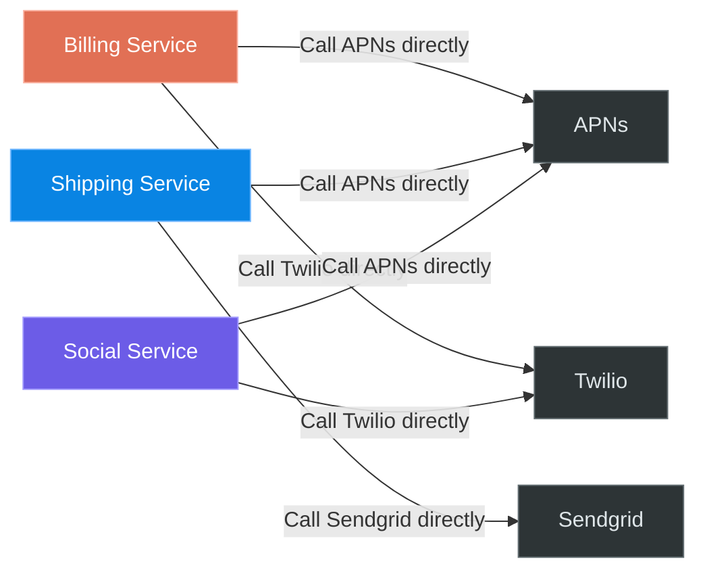
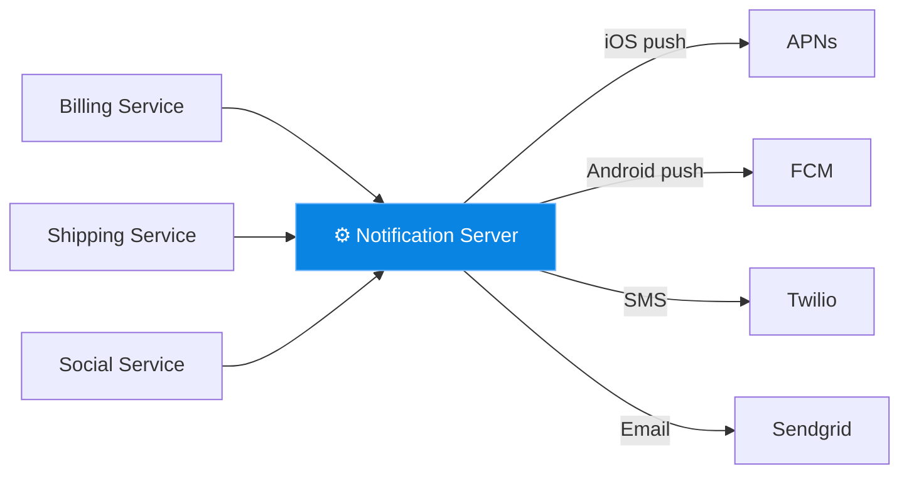
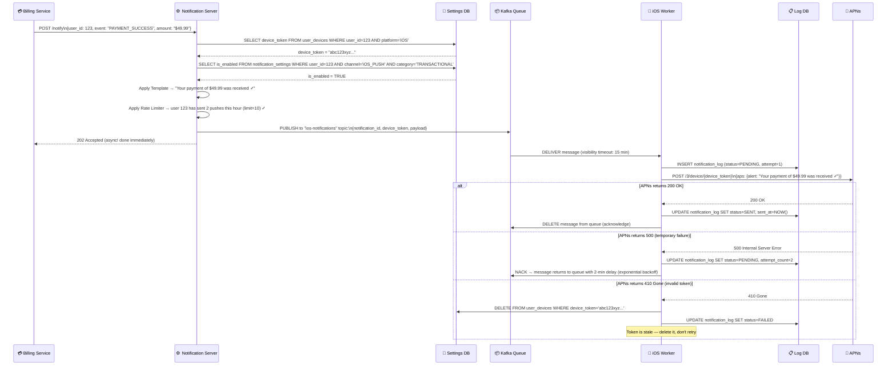
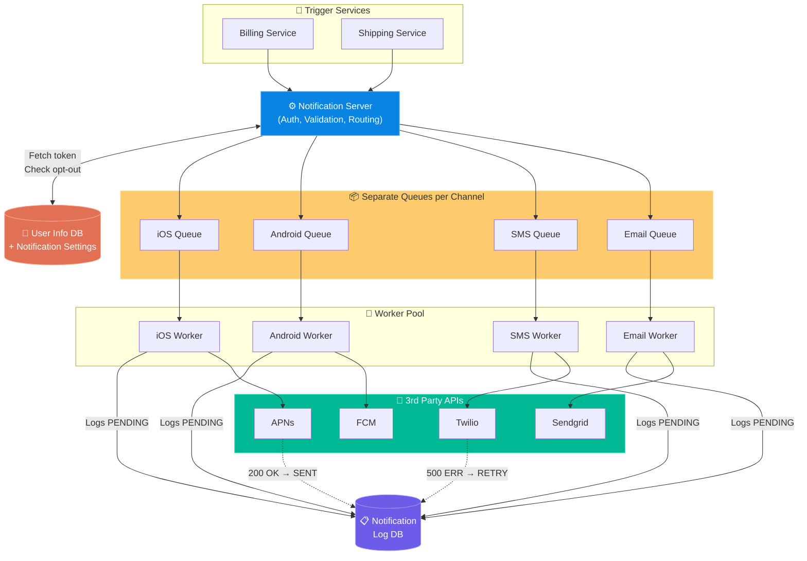

# Chapter 10: Design a Notification System

> **Core Idea:** Modern applications proactively reach out to users via Push Notifications, SMS, and Email. A Notification System is a massive, highly-reliable routing engine. But getting to an elegant architecture isn't obvious — we need to build it step by step, identifying and solving problems along the way.

---

## 🧠 The Big Picture — What Are We Building?

### 🍕 The Postal System Analogy:
Think of a notification like a letter. You have **three types of mail carriers**:
- **iOS Push** → Apple's private courier service (**APNs**)
- **Android Push** → Google's private courier service (**FCM**)
- **SMS** → The national postal service (**Twilio/Nexmo**)
- **Email** → The standard post office (**Sendgrid/Mailchimp**)

**Critical Insight:** You don't build the courier system. You are building the **sorting office** — the system that decides who gets a letter, what it says, and which courier to hand it to.

### The Mandatory Third-Party Providers:
Before designing anything, understand that the actual delivery of notifications is **legally and technically enforced** by device manufacturers. You have no choice but to use:

| Notification Type | Third-Party Provider | What the Provider Needs |
|---|---|---|
| **iOS Push** | APNs (Apple Push Notification service) | A `Device Token` (given to you by iOS SDK on app install) |
| **Android Push** | FCM (Firebase Cloud Messaging) | A `Device Token` (given by Android SDK) |
| **SMS** | Twilio, Nexmo, Sinch | `Phone Number` |
| **Email** | Sendgrid, Mailchimp | `Email Address` |

> **Contact Info Collection:** When a user installs your app or signs up, you must collect and store their `device_token` and `phone_number` in a **User Profile DB**. Note: one user can have multiple devices (iPad + iPhone), so it's a `1-to-Many` relationship: one `user_id` maps to multiple `device_tokens`.

---

## 🎯 Step 1: Understand the Problem & Scope

### Clarifying the Requirements:

```
You:  "What types of notifications do we support?"
Int:  "Push notifications (iOS + Android), SMS, and Emails."

You:  "Is it strictly real-time?"
Int:  "Soft real-time. Delivered ASAP, but slight delays during spikes are acceptable."

You:  "Who triggers notifications — the user or the system?"
Int:  "Both. A user can schedule a notification, but mostly it's system events (payment confirmation, shipping update)."

You:  "What is the scale?"
Int:  "10 Million mobile pushes, 1 Million SMS, and 5 Million emails per day."

You:  "Can users opt out of specific notification types?"
Int:  "Yes, users can selectively opt out of notification channels."
```

### 🧮 Back-of-the-Envelope Estimates

| Channel | Daily Volume | Per Second |
|---|---|---|
| Mobile Push (iOS + Android) | 10 Million / day | ~115 pushes/sec |
| SMS | 1 Million / day | ~12 SMS/sec |
| Email | 5 Million / day | ~58 emails/sec |
| **Total** | **16 Million / day** | **~185 notifications/sec** |

---

## 🏗️ Step 2: High-Level Design — The Naïve Approach (And Why It Fails)

### The First Idea: Direct Calls from Microservices

The simplest idea: every microservice that needs to send a notification (Billing, Shipping, Social) directly calls APNs, Twilio, or Sendgrid.



### ❌ Why This Breaks Immediately:

| Problem | Explanation |
|---|---|
| **Massive Code Duplication** | Every service has to implement APNs, FCM, Twilio, AND Sendgrid SDKs. If Twilio changes its API, you update 10 services. |
| **No Central Rate Limiting** | If Billing and Social both decide to fire 1M pushes at the same time, you'll DDoS your own APNs account and get banned. |
| **No Retry Logic** | If APNs returns a `500 Internal Server Error`, each service needs its own retry mechanism. You will inevitably drop notifications. |
| **No Opt-Out Checking** | Each service needs to independently query the User Settings DB before sending. This will never be implemented consistently. |
| **Tight Coupling** | If APNs goes down, your Billing Service's entire code path gets stuck waiting for the HTTP timeout. |

### ✅ The Fix: A Centralized Notification Server

The solution is to introduce a **single Notification Server** that all microservices call. This server becomes the singular expert in:
1. Auth/API key management for all third-party providers
2. User opt-out & preference checking
3. Rate limiting
4. Message formatting (Templates)
5. Routing to the correct provider



**Simple. Clean. But still broken.** This version has a critical flaw: the Notification Server itself is now a **bottleneck and SPOF (Single Point of Failure)**. Let's identify the problems.

### ❌ Problems with the Single Notification Server:

| Problem | Scenario |
|---|---|
| **Cascading Delays** | If Sendgrid's API slows down, every Email call from the Notification Server blocks. This backs up the queue of iOS and SMS pushes too. |
| **No Buffering on Traffic Spikes** | Amazon Prime Day fires 10M notifications in 5 minutes. The server panics and crashes or starts dropping messages. |
| **Data Loss on Crash** | The server crashes mid-processing. All "in-flight" notifications are lost with no record of what was sent and what wasn't. |

---

## 🗄️ Step 2B: Data Model — Storing Contact Info

Before we can send any notification, we need to know *where* to send it. The device token lifecycle is:

```
1. User installs app on iPhone → iOS SDK auto-generates a Device Token
2. App calls: NotificationServer.registerDevice(user_id, device_token, platform="iOS")
3. Stored in DB → linked to user_id
```

### Database Schema

```sql
-- Users table (basic user identity)
CREATE TABLE users (
    user_id     BIGINT PRIMARY KEY,
    email       VARCHAR(255),
    phone       VARCHAR(20),
    locale      VARCHAR(10),          -- "en-US", "fr-FR" for template localization
    created_at  DATETIME
);

-- Devices table (one user can have many devices)
CREATE TABLE user_devices (
    device_id       BIGINT PRIMARY KEY AUTO_INCREMENT,
    user_id         BIGINT NOT NULL,
    device_token    VARCHAR(500) NOT NULL,    -- APNs/FCM device token (rotates periodically!)
    platform        ENUM('iOS', 'Android', 'Web'),
    last_active_at  DATETIME,
    INDEX idx_user_devices (user_id)
);

-- Notification preferences per user per channel
CREATE TABLE notification_settings (
    user_id     BIGINT NOT NULL,
    channel     ENUM('iOS_PUSH', 'ANDROID_PUSH', 'SMS', 'EMAIL'),
    category    ENUM('MARKETING', 'TRANSACTIONAL', 'SOCIAL'),
    is_enabled  BOOLEAN DEFAULT TRUE,
    PRIMARY KEY (user_id, channel, category)
);

-- Notification log (the durability guarantee)
CREATE TABLE notification_log (
    log_id          BIGINT PRIMARY KEY AUTO_INCREMENT,
    notification_id VARCHAR(64) UNIQUE,      -- Idempotency key
    user_id         BIGINT,
    channel         ENUM('iOS_PUSH', 'ANDROID_PUSH', 'SMS', 'EMAIL'),
    template_id     VARCHAR(100),
    payload         JSON,
    status          ENUM('PENDING', 'SENT', 'DELIVERED', 'FAILED'),
    attempt_count   INT DEFAULT 0,
    created_at      DATETIME,
    sent_at         DATETIME,
    INDEX idx_status_created (status, created_at)   -- for sweeper job
);
```

> **Why does `device_token` rotate?** APNs rotates device tokens periodically for security. When a worker receives `410 Gone` from APNs (token invalid), it must delete the old token from `user_devices` and wait for the app to re-register a fresh one. Failing to do this causes: token pile-up in DB, silent notification failures, and wasted bandwidth.

---

## 🔄 Step 2C: The Full Notification Flow — Sequence Diagram



---

## 🔬 Step 3: The Optimized Architecture — Decoupling with Message Queues

The root cause of all the above problems is **tight coupling** between the Notification Server and the providers. When we use **Message Queues** as a buffer, the Notification Server never talks to providers directly. It just drops messages and "forgets" about them.

### The Full Decoupled Architecture:



### Why Separate Queues for Each Channel? (Blast Radius Isolation)
This is one of the most important decisions in the whole chapter. Notice: **one queue per channel type**.

> **The Fire Drill Scenario:** Imagine Sendgrid goes down for 2 hours. With a single shared queue, ALL notifications (iOS pushes, SMS) would pile up behind the blocked email messages and never get sent.
> With separate queues, the `Email Queue` backs up while the `iOS Queue` and `SMS Queue` continue processing at full speed. The blast radius of one provider's failure is completely contained.

---

## 🧱 Step 4: Deep Dive — Solving Each Remaining Problem

### 1️⃣ Reliability — Zero Data Loss
**Problem:** A worker crashes after pulling a message from the queue, before it sends to Twilio. The message is gone forever.

**The Logic Evolution:**
- First thought: Just log everything. → But where? In the Worker's memory? It just crashed.
- Better thought: Log into a database **before** doing anything else.

> **Solution: The Notification Log DB**
> 1. Worker pulls message from queue.
> 2. Immediately writes to `Notification_Log` DB with status = `PENDING`.
> 3. Calls Twilio API.
> 4. On `200 OK` → Updates DB to `SENT`.
> 5. Background sweeper job: Every 5 minutes, scan for rows stuck in `PENDING` for too long, and re-queue them.

### 2️⃣ Retry Mechanism — Handling Third-Party Failures
**Problem:** APNs returns `HTTP 500`. What do we do?

**The Logic Evolution:**
- First thought: Retry immediately. → This DDoSes a server that's already struggling.
- Better thought: Wait a bit before retrying. → How long? Static delay? What if it's still down?
- Best solution: **Exponential Backoff.**

> **Solution:** Worker catches the error. Sends the message to a dedicated **Retry Queue** with an increasing delay:
> - 1st retry: Wait 2 minutes
> - 2nd retry: Wait 4 minutes  
> - 3rd retry: Wait 8 minutes
> - Give up after N retries → Mark as `FAILED` and alert on-call engineers.

> **⚠️ Delivery Guarantee:** Because of retries, a user *might* receive the same notification twice. We guarantee **"At-Least-Once"** delivery. **"Exactly-Once"** across third-party boundaries and unreliable mobile networks is mathematically near-impossible.

### 3️⃣ Notification Templates — Eliminating Duplication
**Problem:** The "Shipping Service" hardcodes: `"Hi John, your order #1234 has shipped!"` in English. What about French users? What if the wording changes?

> **Solution:** Services send raw structured data: `{event: "SHIPPED", user: "John", order: "1234"}`. The Notification Server fetches the appropriate localized template for that event type and the user's language, rendering it before dispatching.

### 4️⃣ Opt-Out / User Settings — Respecting Preferences
**Problem:** The user turned off "Promotional Emails" 6 months ago. A marketing campaign fires anyway.

**The Logic Evolution:**
- Should we check settings on the worker? → Too late. The message is already in the queue, wasting memory.
- Check settings on the Notification Server, **before** enqueuing.

> **Solution:** The `Notification Server` checks the `User_Settings` table first. If `allow_promotional_emails == false`, discard the event immediately — no queue resources consumed at all.

### 5️⃣ Rate Limiting — Protecting the User
**Problem:** A user is tagged in 100 photos in 1 minute. Their phone vibrates 100 times. They uninstall your app.

> **Solution:** The Notification Server implements a **per-user per-channel rate limiter** (e.g., max 5 pushes per user per hour). Once the limit is hit, either discard the notification or batch them: `"You have 95 new tags — View All"`.

### 6️⃣ Security — Preventing Abuse
**Problem:** Any external actor could hit your Notification Server and send spam to your users.

> **Solution:** Require every caller to present an `AppKey` / `AppSecret`. Workers authenticate to APNs and FCM using TLS certificates rotated regularly. The Notification Server validates the API key signature before processing any request.

### 7️⃣ Analytics & Events Tracking
**Problem:** How does the product team know if their push campaigns are effective?

> **Solution:** Build a full funnel event stream:
> - `Sent` → We called APNs.
> - `Delivered` → APNs delivery webhook callback arrives.
> - `Opened` → The mobile SDK fires an event when user taps the notification.
> - `Clicked CTA` → User pressed the button inside the notification.
>
> Workers publish these lifecycle events to **Kafka**. A downstream **Analytics Service** consumes and aggregates them for PM dashboards.

### 8️⃣ Scaling — Stateless Notification Server
**Problem:** At 16 million notifications per day, a single `Notification Server` box will saturate.

**The Logic Evolution:**
- First thought: Get a bigger server. → Vertical scaling has limits.
- Better thought: Run multiple servers. → Can we? Only if the server holds no state.

> **Solution:** Deliberately design the Notification Server to be **completely stateless** (no in-memory session data, no sticky connections). Store all state in the external `User Info DB` and `Notification Log DB`. This allows 10, 50, or 100 identical server instances to sit behind a Load Balancer, scaling horizontally with zero coordination.

---

## 📋 Summary — Full Problem → Solution Map

| Problem | Root Cause | Solution |
|---|---|---|
| **Code duplication across services** | No centralized notification logic | Centralized **Notification Server** |
| **Cascading failures between channels** | Single shared code path | **Separate Message Queue per channel** |
| **Data loss if worker crashes** | No persistence before action | **Notification Log DB** with `PENDING/SENT/FAILED` states |
| **Hammering a down provider** | Immediate retries | **Exponential Backoff Retry Queue** |
| **Hardcoded message strings** | Strings in business services | **Notification Templates** with localization |
| **Ignoring user opt-outs** | Settings checked too late | Check **User Settings DB before** enqueuing |
| **Spamming users** | No delivery limits | **Per-user Rate Limiter** on Notification Server |
| **External abuse** | No API authentication | **AppKey/AppSecret** + TLS worker certs |
| **No campaign analytics** | Push-and-forget design | Kafka event stream → **Analytics Service** |
| **Single server bottleneck** | Stateful server | **Stateless server** + Load Balancer |

---

## 🧠 Memory Tricks

### The 4 FedEx Carriers 🚚
`APNs` (iOS) → `FCM` (Android) → `Twilio` (SMS) → `Sendgrid` (Email)

### Design Evolution (3 steps): **"Direct → Central → Decouple"**
1. **Direct** calls from each service → Broken (duplication, no retries)
2. **Central** Notification Server → Still broken (tight coupling, cascading failures)
3. **Decouple** with per-channel queues → ✅ Production-ready

### The 3 R's of Deep Dive: 🔴
- **R**etry (Exponential backoff)
- **R**eliability (Log DB → no data loss)
- **R**ate Limiting (per-user, per-channel throttle)

---

## ❓ Interview Quick-Fire Questions

**Q1: Why do we need separate Message Queues for iOS, Android, SMS, and Email?**
> To contain the blast radius of a provider failure. If Sendgrid goes down, only the Email Queue backs up. iOS, Android, and SMS queues continue processing at full speed, completely unaffected. With one shared queue, a Sendgrid outage would stall *all* notifications.

**Q2: How do you guarantee a notification is never lost if a worker crashes?**
> We implement At-Least-Once delivery using a Notification Log DB. The worker writes the event to the DB with status `PENDING` before doing anything. It updates to `SENT` only after the provider returns `200 OK`. A background sweeper re-queues any events stuck in `PENDING` beyond a timeout threshold.

**Q3: Why should we check User Opt-Out settings on the Notification Server, not the worker?**
> The Notification Server acts as a gatekeeper *before* the queue. If we check opt-outs on the worker side, we've already consumed queue resources (memory, throughput) for a message we are about to throw away. Checking early (on the server, before enqueuing) is both cheaper and more correct.

**Q4: Why must the Notification Server be stateless?**
> Stateless servers can be cloned infinitely behind a load balancer with zero coordination. At 16M notifications/day, we might need 50 server instances during peak traffic. If the server held stateful sessions or in-memory data, you couldn't just add more boxes — you'd need sticky sessions, state sync, and distributed locks. Statelessness makes horizontal scaling trivial.

**Q5: Can we guarantee exactly-once delivery?**
> Generally no. If APNs delivers the push but its `200 OK` response gets dropped by a network failure, our retry mechanism will re-send. The user gets the notification twice. We tolerate this by building idempotent event handling on the mobile client side and by guaranteeing "At-Least-Once" from the server side.

---

> **📖 Previous Chapter:** [← Chapter 9: Design a Web Crawler](/HLD/chapter_9/design_a_web_crawler.md)
>
> **📖 Next Chapter:** [Chapter 11: Design a News Feed System →](/HLD/chapter_11/)
