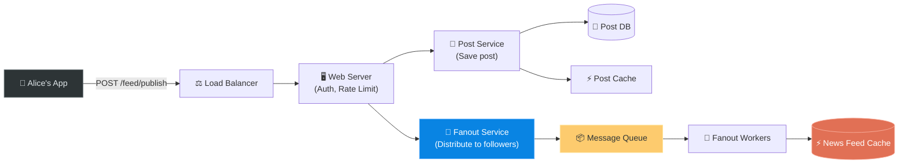
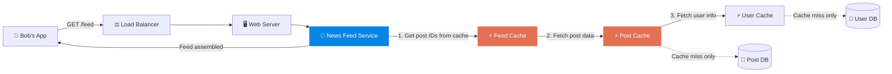
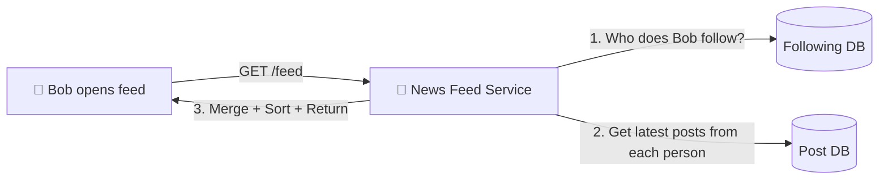
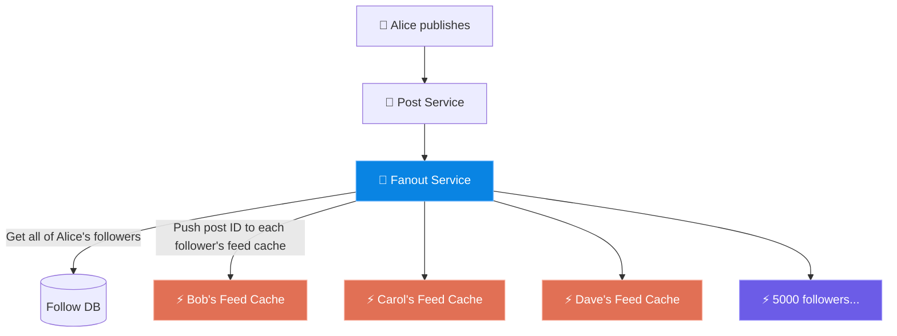
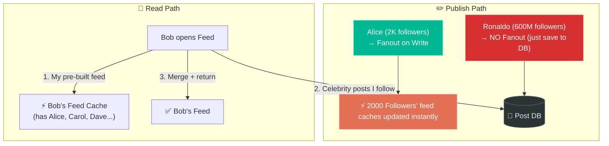

# Chapter 11: Design a News Feed System

> **Core Idea:** A News Feed System (like Facebook's Timeline, Twitter's Home Feed, or Instagram's Feed) aggregates posts from people you follow and presents them to you in a ranked/chronological order. This chapter is a masterclass in **write-heavy vs. read-heavy tradeoffs**, the **Fanout Problem**, and **cache-first architecture**.

---

## 🧠 The Big Picture — What Are We Actually Building?

A News Feed System has exactly **two core operations**:

| Operation | Trigger | Example |
|---|---|---|
| **Feed Publishing** | User creates a post | You post a photo on Instagram |
| **News Feed Building** | User opens the app | You scroll and see posts from people you follow |

### 🍕 The Newspaper Analogy:
Imagine a newspaper company with 100 million subscribers.
- **Publishing (Writing):** A reporter files a story. The editor's desk assigns it to sections.
- **Reading:** Every morning, a subscriber picks up their personalized newspaper.

The challenge: **How do you get the right stories to the right 100 million people every morning?**
- Do you pre-print one newspaper per person the night before? (**Fanout on Write**)
- Or do you keep one master newspaper and let each person select their stories on demand? (**Fanout on Read**)

This is the **central design question** of this chapter.

---

## 🎯 Step 1: Understand the Problem & Scope

### Clarifying the Requirements:

```
You:  "Is this a mobile app, web app, or both?"
Int:  "Both."

You:  "What are the important features?"
Int:  "A user can publish posts and see their friends' posts in their news feed."

You:  "Is the news feed sorted by time or by some ranking/relevance?"
Int:  "Assume chronological order for simplicity."

You:  "How many friends can a user have?"
Int:  "Maximum 5,000 friends."

You:  "What is the traffic volume?"
Int:  "10 million DAU (Daily Active Users)."

You:  "Can posts contain images or videos?"
Int:  "Posts can contain media files (images, videos)."
```

### 🧮 Back-of-the-Envelope Estimates

| Metric | Calculation | Result |
|---|---|---|
| **Publish QPS** | 10M DAU × 1 post avg / 86,400 sec | `~115 writes/sec` |
| **Read QPS** | 10M DAU × 10 scroll sessions / 86,400 sec | `~1,157 reads/sec` |
| **Read : Write Ratio** | | `~10:1` — Read-heavy! |
| **Storage (media)** | 115 posts/sec × avg 1MB media | `~10 GB/sec of media` |

> **Takeaway:** This is a **heavily read-skewed** system. The # of users reading the feed vastly outnumbers users posting. Our architecture must optimize for fast reads above all else.

---

## 🏗️ Step 2: High-Level Design — Two Main Flows

The entire system decomposes into two independent flows.

### Flow 1: Feed Publishing (Write Path)
*User Alice creates a new post.*



### Flow 2: News Feed Building (Read Path)
*User Bob opens the app and sees his feed.*



---

## 🔬 Step 3: The Deep Dive — The Fanout Problem (The Heart of This Chapter)

**Fanout** is the act of pushing one post to all followers of the poster. When Alice (who has 5,000 friends) posts something, that single post must effectively be "delivered" to 5,000 news feeds. This is the hardest engineering problem in this chapter.

There are **three approaches**. Let's build up the reasoning step by step.

---

### 🔴 Approach A: Fanout on Read (Pull Model)

**Naive Idea:** Don't do any work when Alice publishes. When Bob opens his feed, at that moment, go collect all posts from everyone Bob follows.



**Step-by-Step Fetch Logic:**
```
1. Query: SELECT followee_ids FROM follow_table WHERE follower_id = Bob   -> [Alice, Carol, Dave, ...]
2. Query: SELECT posts FROM post_table WHERE user_id IN (Alice, Carol, Dave...) 
          ORDER BY timestamp DESC LIMIT 20
3. Merge the N result sets together and sort by time again
4. Return to Bob
```

**✅ Pros:**
| Advantage | Why |
|---|---|
| Publishing is instant | Alice doesn't do any extra work when posting. Just write to `Post DB`. |
| Always fresh data | Bob always sees the most recent posts with no cache staleness issues. |
| Celebrity-safe | A celebrity with 5 million followers doesn't trigger any extra write work. |

**❌ Cons — Why It Breaks at Scale:**
| Problem | Explanation |
|---|---|
| **Massive read amplification** | Bob follows 500 people. Each "open feed" fires 500 database queries (or one massive JOIN). At 10M DAU each opening the app 10x/day = 100M heavy reads/sec. Catastrophic. |
| **Slow read latency** | Merging + sorting posts from 500 different people on every request makes feed loading feel sluggish. |
| **Cannot cache easily** | If Bob and Carol both follow Alice, they each re-query Alice's posts independently. No sharing. |

---

### 🟡 Approach B: Fanout on Write (Push Model)

**The Opposite Idea:** Do all the work at publish time. When Alice posts, immediately push her post ID into each of her 5,000 followers' "News Feed cache" so that reading is instant.



**The News Feed Cache structure per user (e.g. Bob's feed)**:
```
Redis Key: "feed:user_id:bob"
Value: Sorted Set of Post IDs ordered by timestamp

Example:
feed:bob → [ post_id_1847, post_id_1842, post_id_1839, post_id_1823 ... ]
(Bob only stores the ~20 most recent post IDs in his feed cache)
```

Bob reading his feed now costs only **one** Redis lookup instead of 500 DB queries!

**✅ Pros:**
| Advantage | Why |
|---|---|
| **Blazing fast reads** | Feed retrieval = one Redis key lookup. No DB calls, no joining, no sorting. |
| **Pre-computed & cacheable** | Each user's feed is pre-assembled and ready. |

**❌ Cons — The Celebrity / Hotspot Problem:**
| Problem | Explanation |
|---|---|
| **Write amplification** | A celebrity (e.g. Cristiano Ronaldo: 600M followers) posting one photo triggers **600 million** writes to Redis! This is a thundering herd problem. |
| **Wasted writes** | If a follower hasn't opened the app in 3 months, we still wrote to their feed cache. |
| **Cache coherency** | If a post is deleted, we need to find and remove it from millions of individual feed caches. |

---

### 🟢 Approach C: Hybrid Model (The Winner ⭐)

**Insight:** The Push model is perfect for "normal" users. The Pull model is perfect for "celebrity" users. Use both!

**The Rule:**
> - If the user being followed has **fewer than a threshold** (e.g., 10,000 followers) → **Fanout on Write** (Push)
> - If the user being followed has **more than the threshold** (e.g., celebrity) → **Fanout on Read** (Pull)

**How it works end-to-end:**

**At Publish Time:**
1. Alice posts (normal user, 2,000 followers) → Fanout service pushes to all 2,000 followers' Feed Caches immediately.
2. Ronaldo posts (celebrity, 600M followers) → **No fanout**. Post is only saved to `Post DB`.

**At Read Time (Bob opens his feed):**
1. News Feed Service fetches Bob's pre-built Feed Cache (contains posts from Alice, Carol, Dave...).
2. News Feed Service **also** queries: "Does Bob follow any celebrities?" → [Ronaldo, Messi, BTS...]
3. Fetches the latest posts from those celebrities directly from Post DB.
4. Merges the two lists, sorts by timestamp, and returns.



---

## 🗄️ Step 4: Data Storage Design

Different types of data have different access patterns, so we use different storage solutions:

### SQL vs. NoSQL Choice:
| Data Type | Storage Choice | Reason |
|---|---|---|
| **User Data** (name, email, settings) | **MySQL** | Relational. Moderately sized. |
| **Follow Relationships** | **MySQL or Graph DB** | `follower_id -> followee_id` table. Simple JOIN. |
| **Posts** (text, metadata) | **MySQL** (or Cassandra for scale) | Posts are immutable once written; can be sharded by `user_id`. |
| **Media** (images, videos) | **CDN + Object Storage** (S3) | Binary files stored in cold storage, CDN for fast global delivery. |
| **Feed Caches** | **Redis** | Lightning fast sorted sets. Ephemeral data (can be rebuilt). |
| **Post Caches** | **Redis** | Key-value lookup. `post_id -> post_data`. |

---

## 🚀 Step 5: The Complete Cache Architecture

Caching is central to this design. We cache at multiple levels:

```
Level 1 (Hottest): News Feed Cache
  → Redis Sorted Set per user: "feed:user_X" = [post_id_1, post_id_2, ...]
  → Stores only the 20 most recent post IDs (not the content!)
  
Level 2: Post Content Cache
  → Redis Hash per post: "post:1234" = {text, media_url, author_id, timestamp}
  → Holds post data for recent/popular posts
  
Level 3: User Profile Cache
  → Redis Hash per user: "user:567" = {name, avatar_url, bio}
  → Author info needed to render any post
  
Level 4: Social Graph Cache
  → Redis Set: "followers:user_X" = {follower_1, follower_2, ...}
  → Needed for Fanout Service
```

**Why Not Store Full Posts in the Feed Cache?**
If Alice has 5,000 followers and posts 3 times a day, storing the full post in every follower's cache = `5,000 × 3 × avg 1KB = 15MB per day` extra cache usage. By storing only `post_id` (a tiny integer), we separate concerns: the Feed Cache stores *what* to show (IDs), and the Post Cache stores *how* to render it.

---

## 🛠️ Step 6: Handling Hot Keys (Advanced)

### Problem: Thundering Herd on Celebrity Post
Even with the Hybrid model, at *read time*, when Ronaldo posts, millions of users suddenly query `post_id = Ronaldo's_latest_post` from the Post Content Cache simultaneously. This single Redis key gets hammered.

> **Solution 1 - Consistent Hashing/Replication:** Replicate the hot post across multiple Redis nodes so different users hit different replicas.
>
> **Solution 2 - Local In-Process Cache:** The web server itself caches the single most-recent post from top celebrities in its own memory (`HashMap`) for 1 second. Absorbs the massive burst without any Redis calls.

---

## 📋 Summary — Full Decision Table

| Topic | Decision | Why |
|---|---|---|
| **Feed Publishing** | Write to Post DB + trigger Fanout | Single source of truth, then distribute |
| **Fanout Model** | **Hybrid** (Push for normal users, Pull for celebrities) | Balances write amplification vs. read latency |
| **Feed Storage** | Redis Sorted Sets | O(log N) insertion, O(1) retrieval. Cache only post IDs, not full content |
| **Celebrity Post Delivery** | On-demand pull at read time | Avoid 600M writes per Ronaldo post |
| **Post Content Storage** | MySQL + Cassandra for scale | Immutable writes, shardable by user_id |
| **Media Storage** | CDN + S3 Object Storage | Binary blobs don't belong in relational DB |
| **Hot Key Problem** | In-process cache + Redis replication | Absorb thundering herd at the app server level |

---

## 🧠 Memory Tricks

### The 3 Fanout Models: **"Read, Write, Hybrid"** 📖✏️ 🔀
- **Read (Pull):** "Gather posts when user opens app." Fast writes, slow reads.
- **Write (Push):** "Deliver to all followers when post is published." Slow writes, fast reads. But destroys Celebrity accounts.
- **Hybrid:** Normal users → Push. Celebrities → Pull. Best of both worlds. ✅

### The Cache Layers: **"Feed → Post → User"** (Top-Down) 🏆
1. **Feed Cache** = List of post IDs per user.
2. **Post Cache** = Post content per ID.
3. **User Cache** = Author info per user ID.

---

## ❓ Interview Quick-Fire Questions

**Q1: What is the core tradeoff between Fanout on Write vs Fanout on Read?**
> Fanout on Write (Push) pre-computes feeds at publish time = slow writes, very fast reads. Fanout on Read (Pull) computes feeds at read time = instant writes, slow and expensive reads. Neither is universally better — the optimal choice is always the hybrid model for systems with a mix of normal and celebrity users.

**Q2: Why do we store only `post_id` in the News Feed Cache instead of the full post content?**
> To separate concerns and minimize redundant data. If Alice has 5,000 followers, storing her full post in every follower's cache wastes enormous space and creates cache coherency nightmares (if Alice edits her post, you'd need to invalidate 5,000 cache entries). Storing just the `post_id` keeps the Feed Cache tiny, while a single shared `Post Content Cache` holds the actual content.

**Q3: How do you handle a celebrity with 100 million followers?**
> The Hybrid model. Famous accounts (identified by exceeding a follower threshold) are excluded from the Write Fanout process entirely. Their posts are only written to the Post DB. When a user reads their feed, the system supplements their pre-computed feed cache with a small, targeted real-time query for celebrity posts they follow.

**Q4: Why use a CDN for media?**
> User photos and videos (binary blob data) are extremely large files and accessed repeatedly. Storing them in a relational DB is wasteful and slow. CDNs distribute these large files across hundreds of global edge servers, ensuring a user in Mumbai pulls images from a Mumbai CDN node, not a server in the US — dramatically reducing latency for the most data-heavy part of the response.

**Q5: How do you know which users are "celebrities" vs. "normal" users?**
> A user's follower count is stored in the User DB and cached in the User Cache. The Fanout Service checks the follower count at the time of publishing. If it exceeds the threshold (e.g., 10,000), it skips the write fanout. Note: this threshold should be tunable based on system load; you don't hardcode it.

---

> **📖 Previous Chapter:** [← Chapter 10: Design a Notification System](/HLD/chapter_10/design_a_notification_system.md)
>
> **📖 Next Chapter:** [Chapter 12: Design a Chat System →](/HLD/chapter_12/)
