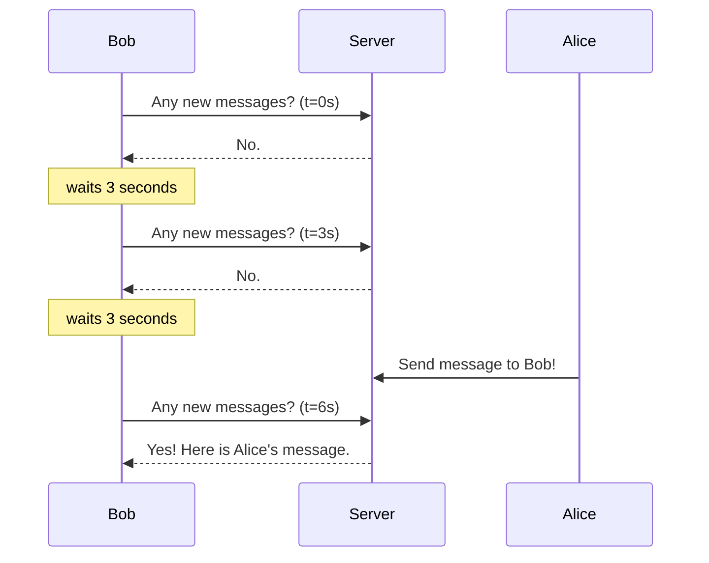
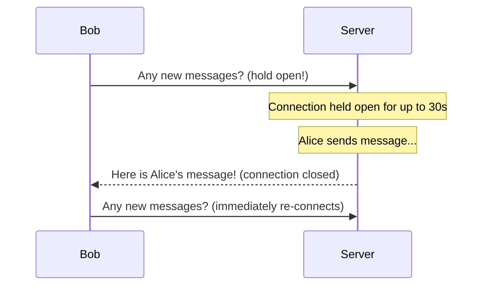
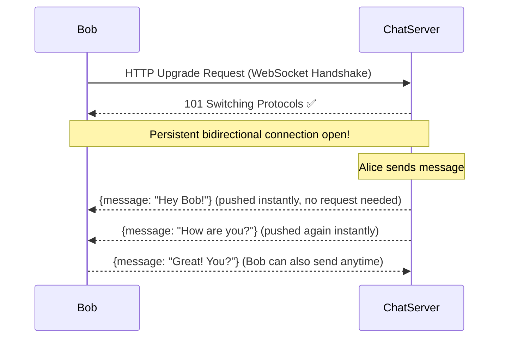
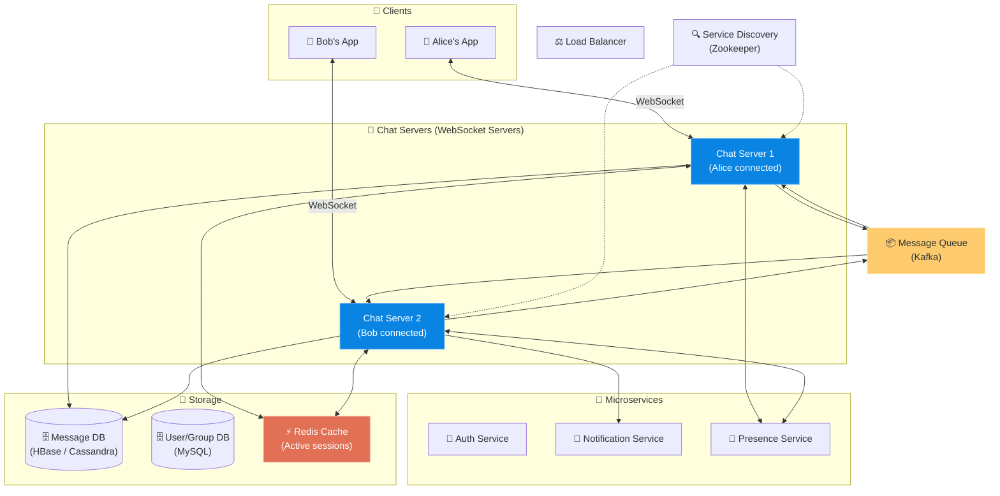

# Chapter 12: Design a Chat System

> **Core Idea:** A Chat System (like WhatsApp, Facebook Messenger, or Slack) enables real-time messaging between users. The central challenge isn't "storing messages" — that's easy. The hard part is **reliably delivering messages to an online recipient instantly**, managing **online presence**, and ensuring **message ordering** across a distributed system.

---

## 🧠 The Big Picture — What Makes Chat Hard?

### 🍕 The Walkie-Talkie Analogy:
Traditional web communication works like **a letter**. Alice visits Bob's mailbox (server), drops a letter (request), and Bob goes and checks his mailbox periodically.

Chat needs to work more like a **walkie-talkie**: when Alice speaks (sends a message), **Bob's device instantly receives it** — even though Bob never specifically "requested" a new message. This is called a **Server-Push** model, and it fundamentally breaks how traditional HTTP works.

The entire first half of this chapter is about answering: **"How do you push data from a server to a client without the client asking for it?"**

---

## 🎯 Step 1: Understand the Problem & Scope

### Clarifying the Requirements:

```
You:  "What kind of chat app? 1-on-1, group, or both?"
Int:  "Both 1-on-1 and group chat."

You:  "Is this a mobile app, web app, or both?"
Int:  "Both."

You:  "What is the scale?"
Int:  "50 million DAU."

You:  "For group chat, is there a member limit?"
Int:  "Max 100 members per group."

You:  "Do we support attachments (images, videos)?"
Int:  "Only text messages for now."

You:  "Do we need online presence (online/offline indicator)?"
Int:  "Yes."

You:  "Do we need message history / multi-device sync?"
Int:  "Yes — if Bob logs in from his laptop, he should see messages he received on his phone."
```

### 📋 Finalized Requirements:
- 1-on-1 and group chat (up to 100 members)
- Real-time message delivery (low latency)
- Online presence indicators
- Message history persisted and synced across devices
- 50 million DAU

---

## 🏗️ Step 2: The Core Challenge — Polling vs. WebSocket

Before designing anything, we must solve the fundamental problem: **How does the server push messages to Bob's device without Bob asking for them?**

There are three approaches. Let's walk through the evolution.

---

### ❌ Approach 1: HTTP Short Polling

**Idea:** Bob's app repeatedly asks the server "Any new messages for me?" every few seconds.



**Problems:**
| Problem | Detail |
|---|---|
| **Wasted bandwidth** | Most requests return "No." — 99% of polls are empty. |
| **High server load** | 50M users × 1 request/3sec = 16.7M HTTP requests/sec, just for polling! |
| **Slow delivery** | A message can arrive up to 3 seconds late in the worst case. |

---

### ⚠️ Approach 2: HTTP Long Polling

**Idea:** Instead of the server immediately returning "No messages", it **holds the connection open** for up to 30 seconds, waiting for a message. The moment one arrives, it sends it and closes the connection. Bob immediately re-opens a new long poll.



**Improvements over Short Polling:**
- Message delivery is near-instant (no 3-second delay).
- Far fewer wasted "No." responses.

**Remaining Problems:**
| Problem | Detail |
|---|---|
| **Still HTTP** | Each HTTP request has a header overhead of ~800 bytes. At 50M connections, this is massive. |
| **Hard to push** | The server holds thousands of open connections. Load balancers get confused when they try to route. |
| **One request per message** | After each message, the connection must be torn down and re-established — TCP handshake overhead per message. |

---

### ✅ Approach 3: WebSocket (The Winner)

**Idea:** Establish a single, long-lived, bidirectional connection between the client and server **once** — then send messages in both directions at any time with ultra-low overhead.



**How WebSocket works:**
1. Client initiates connection with `HTTP GET /chat` with an `Upgrade: websocket` header.
2. Server responds `101 Switching Protocols`.
3. **The HTTP connection is now "upgraded" to a WebSocket.** Same TCP socket, different protocol.
4. Both sides can now push data anytime with minimal overhead frames (~2 bytes overhead vs. 800-byte HTTP headers).

**WebSocket vs. Long Polling:**
| Feature | Long Polling | WebSocket |
|---|---|---|
| **Transport** | HTTP (new request per message) | TCP (persistent socket) |
| **Overhead per message** | ~800 bytes (HTTP headers) | ~2 bytes (frame header) |
| **Server push** | Requires holding connection, awkward | Native built-in capability |
| **Latency** | Re-connection overhead | Sub-millisecond |

> **⭐ Decision:**  
> - **Sending messages** (Client → Server): HTTP or WebSocket (both work, WebSocket is simpler)  
> - **Receiving messages** (Server → Client): **WebSocket is the clear winner.** Also used in a persistent connection model for mobile clients.

---

## 🏛️ Step 3: The High-Level Architecture

Now that we know *how* to push messages, let's design the complete system.



### The Key Components:
| Component | Role |
|---|---|
| **WebSocket Servers (Chat Servers)** | Maintain persistent connections with all online clients. Push/receive messages. |
| **Service Discovery (Zookeeper)** | When Bob connects, which Chat Server should he connect to? Zookeeper maintains a real-time map of all Chat Servers and their active connections. |
| **Message Queue (Kafka)** | Routes messages between Chat Servers. Chat Server 1 (Alice) publishes; Chat Server 2 (Bob) subscribes. |
| **Presence Service** | Manages and broadcasts online/offline status for all users. |
| **Notification Service** | If Bob is OFFLINE, push a mobile push notification (APNs/FCM) instead. |
| **Message DB (HBase/Cassandra)** | Persists all messages for history and sync. Write-optimized. |

---

## 🔬 Step 4: Deep Dive — The Message Flow

Let's trace a message from Alice → Bob step by step.

### 1-on-1 Message Flow:

```
Alice types "Hey Bob" and hits Send.

STEP 1: Alice's app sends the message over her WebSocket to Chat Server 1.
STEP 2: Chat Server 1 gets a Message ID from the ID Generator (Chapter 7!) and timestamps it.
STEP 3: Chat Server 1 persists the message to the Message DB.
STEP 4: Chat Server 1 publishes the message to the Message Queue (Kafka topic: "user:bob").

Is Bob online?
├── YES: Chat Server 2 (which holds Bob's WebSocket) is subscribed to "user:bob" topic.
│         It pulls the message and pushes it down Bob's WebSocket. Bob sees it instantly.
└── NO:  Notification Service is subscribed. It fires an APNs/FCM push notification.
```

### Group Message Flow:
```
Alice sends "Meeting at 3pm!" to a group [Alice, Bob, Carol, Dave].

STEP 1: Alice's app sends message to Chat Server.
STEP 2: Chat Server queries Group Service: "Who are members of this group?"
         Returns: [Bob, Carol, Dave]
STEP 3: For each member, check Presence Service: "Is Bob online? Is Carol online?"
STEP 4: For each ONLINE member → publish to their personal Kafka topic (one per user).
STEP 5: For each OFFLINE member → fire push notification.
```

> **⚠️ Group Chat at Scale:** With 100 members per group, one group message triggers 100 Kafka publishes. At 50M DAU, this is manageable. But a system like Discord with 1M-member servers needs a more sophisticated fan-out strategy (similar to the News Feed Celebrity Problem in Chapter 11!).

---

## 🗄️ Step 5: Message Storage Design

### Why NOT Use MySQL for Messages?
Messages are a write-heavy workload (50M users × avg 40 messages/day = 2 Billion writes/day). MySQL's B-Tree index updates become a bottleneck at this volume.

### Why HBase or Cassandra?
| Feature | HBase/Cassandra | MySQL |
|---|---|---|
| **Write throughput** | Extremely high (LSM-tree based) | Moderate (B-Tree updates) |
| **Read pattern** | Scan by key range (e.g., "all messages in chat X") | Flexible queries |
| **Horizontal scaling** | Native sharding | Complex manual sharding |
| **Data model** | Key-Value / Wide-column | Relational |

### The Message Data Model:
```sql
-- For 1-on-1 chat:
Table: message
  message_id    BIGINT    -- Snowflake ID (Chapter 7!) — globally unique + time-sortable
  channel_id    BIGINT    -- conversation between user A and user B
  from_user_id  BIGINT
  content       TEXT
  created_at    TIMESTAMP

Primary Key: (channel_id, message_id)
-- This lets us efficiently fetch "all messages in a channel, ordered by time"

-- For group chat:
Table: group_message  
  message_id    BIGINT    -- Snowflake ID
  group_id      BIGINT
  from_user_id  BIGINT
  content       TEXT
  created_at    TIMESTAMP

Primary Key: (group_id, message_id)
```

> **Why use Snowflake message_id instead of `created_at` for ordering?**
> Two messages can arrive at the same millisecond. `created_at` timestamps can collide. A Snowflake ID is guaranteed to be unique AND time-sortable, making it a perfect primary key for message ordering.

---

## 👤 Step 6: Online Presence — The Heartbeat Mechanism

### The Problem:
How do you know if Bob is "online"? You can't trust the WebSocket connection alone — mobile apps lose connections constantly when switching between Wifi and cellular.

### The Logic Evolution:
- **First Idea:** Bob is online if his WebSocket is connected. → But the connection silently drops when Bob's subway goes underground. You'd falsely show him as "online" for minutes.
- **Better Idea:** Bob's client sends a periodic **heartbeat ping** to the Presence Service.
- **The Rule:** If no heartbeat received for > 30 seconds, mark user as `OFFLINE`.

```
Bob's client sends every 5 seconds:
  → POST /presence/heartbeat { user_id: Bob }

Presence Service stores in Redis:
  → SET presence:bob "ONLINE" EX 30  (auto-expires in 30 seconds)

Presence Service logic:
  → If heartbeat arrives: reset TTL to 30s
  → If Bob's subway cuts connection: no heartbeat → TTL expires → Bob shows as OFFLINE
```

### Presence Fan-Out:
When Bob goes online/offline, who gets notified?
> **The Problem:** Bob has 500 friends. Notifying all 500 that "Bob is now online" is expensive.
>
> **The Solution:** Only notify friends *currently on Bob's contact list page*. Use a **Subscribe model** — when Alice opens the chat with Bob, her client subscribes to Bob's presence channel. When she closes it, she unsubscribes.

---

## 📐 Step 7: Service Discovery — Which Server Should Bob Connect To?

When Bob opens the app, his client connects to the Load Balancer, which has to route him to a specific Chat Server. How does it decide?

> **Zookeeper** maintains a real-time registry of all available Chat Servers. It also tracks the number of active WebSocket connections on each server. The Load Balancer asks Zookeeper: "Which Chat Server has the most capacity?" and routes Bob there.
>
> This is efficient because Chat Servers are stateful (they maintain WebSocket connections). The Load Balancer can't route Bob randomly — it needs to route him to a server with capacity, not an overloaded one.

---

## 📱 Step 8: Message Sync Across Devices (Multi-Device Support)

**Scenario:** Bob reads messages on his iPhone at noon. At 3pm, he opens his laptop for the first time. How does his laptop know which messages are "new" vs. "already read"?

```
Each device stores locally: last_message_id_seen = 1234

When Bob's laptop connects:
  → GET /messages?channel_id=456&after_message_id=1234
  → Server returns all messages with message_id > 1234
  → Laptop's inbox is now fully caught up!
```

> **This works perfectly because Snowflake message_ids are time-ordered.** "Give me everything after message 1234" = "Give me everything after this exact moment in time."

---

## 📋 Summary — Key Decisions

| Problem | Solution | Why |
|---|---|---|
| **Real-time server push** | **WebSocket** (persistent bidirectional TCP) | HTTP polling is too expensive; WebSocket has 2-byte frame overhead vs. 800-byte HTTP headers |
| **Message routing between servers** | **Kafka message queue** (per-user topic) | Decouples Chat Servers; absorbs spikes; guarantees delivery |
| **Message ordering** | **Snowflake IDs** (Chapter 7) as primary key | Unique + time-sortable; avoids timestamp collision |
| **Message storage** | **HBase / Cassandra** | Write-optimized at 2B messages/day; native wide-column for efficient range scans |
| **Service discovery** | **Zookeeper** | Maintains real-time registry of all Chat Servers and their capacity |
| **Online presence** | **Redis TTL + Heartbeat** | 5-second heartbeat; auto-expire in 30s if connection silently dropped |
| **Offline delivery** | **Notification Service (APNs/FCM)** | Push notification when recipient's Presence Service shows OFFLINE |
| **Multi-device sync** | **`last_message_id` per device** | "Fetch messages after ID X" catchup on login |

---

## 🧠 Memory Tricks

### 3 Levels of Real-Time: **"Poll → Long → Socket"**
- **Short Polling:** "Are we there yet?" (every 3 secs)
- **Long Polling:** "I'll wait here until you say yes." (hold connection, expensive teardown)
- **WebSocket:** "Let's leave the line open and just talk." ✅

### 4 Services Around the Chat Server: **"ZPNK"**
- **Z**ookeeper (Service discovery)
- **P**resence Service (Online status)
- **N**otification Service (Offline push)
- **K**afka (Message routing)

---

## ❓ Interview Quick-Fire Questions

**Q1: Why is WebSocket better than Long Polling for real-time chat?**
> WebSocket establishes a persistent bidirectional TCP connection. After the one-time handshake, messages flow in both directions with only ~2 bytes of frame overhead. Long Polling requires a complete HTTP request/response cycle per message, including ~800 bytes of headers, TCP teardown, and re-establishment. At 50M users, this difference is enormous.

**Q2: How does Kafka route Alice's message to Bob's specific Chat Server?**
> Each user has a dedicated Kafka topic (e.g., `"user:bob"`). When Alice sends a message to Bob, Chat Server 1 publishes it to the `user:bob` topic. Chat Server 2, which hosts Bob's WebSocket, is a subscriber to the `user:bob` topic. It receives the message and pushes it down Bob's connection. This elegantly decouples the sending server from the receiving server.

**Q3: Why is Cassandra/HBase better than MySQL for storing messages?**
> At 2 billion messages per day, MySQL's write performance deteriorates due to B-Tree index updates on random inserts. Cassandra and HBase use Log-Structured Merge (LSM) trees, which batch and flush writes sequentially to disk — far more efficient for append-heavy write workloads. They also natively shard horizontally, whereas MySQL requires complex custom sharding.

**Q4: How does the presence system avoid falsely showing a user as "online"?**
> Each client sends a heartbeat ping to the Presence Service every 5 seconds. The Presence Service stores this in Redis with a TTL of 30 seconds: `SET presence:bob "ONLINE" EX 30`. If Bob's phone loses connectivity (silent drop — no explicit disconnect), the heartbeats stop. After 30 seconds, the Redis key auto-expires and Bob is automatically marked offline.

**Q5: How do you sync message history when Bob logs in from a new device?**
> Each device tracks its own `last_message_id_seen` (stored locally). On login, the device calls the server: `GET /messages?channel_id=X&after_id={last_message_id_seen}`. Since Snowflake message IDs are globally time-ordered, "give me everything after ID 1234" semantically means "give me everything I missed" — a precisely bounded, efficient database range scan.

---

> **📖 Previous Chapter:** [← Chapter 11: Design a News Feed System](/HLD/chapter_11/design_a_news_feed_system.md)
>
> **📖 Next Chapter:** [Chapter 13: Design a Search Autocomplete System →](/HLD/chapter_13/)
