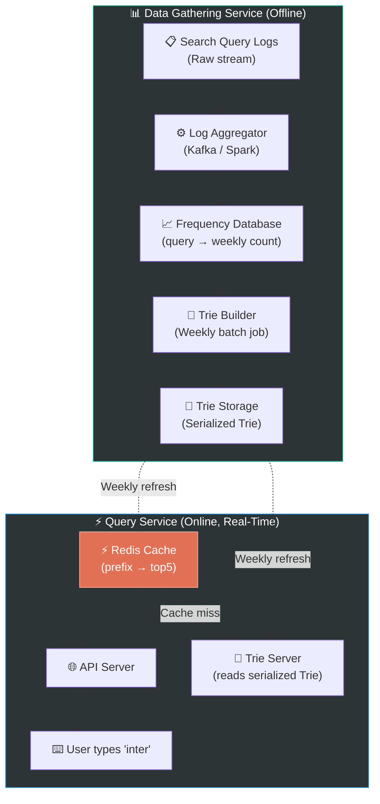

# Chapter 13: Design a Search Autocomplete System

> **Core Idea:** When you type "intervi" in Google's search bar, it instantly suggests "interview questions", "interview tips", etc. This is a **Search Autocomplete** (or Typeahead) system. The magic behind it is a data structure called a **Trie** (prefix tree). This chapter is a deep dive into how to build that data structure at internet scale with low-latency reads and a separate data pipeline for keeping it fresh.

---

## 🧠 The Big Picture — Two Distinct Problems

Search Autocomplete decomposes into exactly **two independent problems**:

| Problem | When | Difficulty |
|---|---|---|
| **1. Query/Read:** "User typed 'inter' → return top 5 suggestions instantly" | Every keystroke (real-time, high QPS) | Must be extremely fast (< 100ms) |
| **2. Data Gathering/Write:** "How do we know 'interview questions' is more popular than 'interactive art'?" | Offline (batch, minutes/hours delay OK) | Must be accurate and scalable |

> **Key Insight:** These two problems have fundamentally different latency requirements. Separating them is the architectural core of this chapter.

---

## 🎯 Step 1: Understand the Problem & Scope

### Clarifying the Requirements:

```
You:  "Is this for a mobile app, web, or both?"
Int:  "Both."

You:  "How many suggestions should we return?"
Int:  "Top 5."

You:  "How do we decide which 5? Is it personalized?"
Int:  "Sorted by historical query frequency. No personalization for now."

You:  "Do we support multiple languages / Unicode?"
Int:  "Assume English characters only for now."

You:  "Does the system support spell-checking?"
Int:  "No. Autocomplete only (prefix match, not fuzzy match)."

You:  "What is the scale?"
Int:  "10 million DAU."
```

### 🧮 Back-of-the-Envelope Estimates

| Metric | Calculation | Result |
|---|---|---|
| **Searches per day** | 10M users × 10 searches avg | 100M searches/day |
| **Queries per second (QPS)** | 100M / 86,400 sec | ~1,160 QPS |
| **Peak QPS** | 1,160 × 2 | ~2,320 QPS |
| **Queries per keystroke** | Each search averages ~20 keystrokes | ~23,200 autocomplete API calls/sec |

> **Takeaway:** Each search fires ~20 autocomplete requests (one per keystroke). Read QPS is enormous. The system must return results **< 100 milliseconds** to feel instant.

---

## 🏗️ Step 2: The Naive Approach — Why It Fails

### First Attempt: SQL LIKE Query
When a user types "inter", the most obvious approach:

```sql
SELECT query, frequency
FROM search_history
WHERE query LIKE 'inter%'
ORDER BY frequency DESC
LIMIT 5;
```

**This is catastrophically slow at scale:**
| Problem | Explanation |
|---|---|
| **Full table scan** | MySQL must scan the entire `search_history` table (billions of rows) for every single keystroke. |
| **23,000 such queries/sec** | At our scale, the database would melt immediately. |
| **Can't cache by prefix easily** | Thousands of different prefixes — caching doesn't help much. |

> **We need a data structure purpose-built for fast prefix matching. Enter: the Trie.**

---

## 🔤 Step 3: The Trie — The Foundation

### What is a Trie?
A **Trie** (pronounced "try", from re**trie**val) is a tree-shaped data structure where:
- Each **node represents a single character**.
- Each **path from root to a node represents a prefix or a complete word**.
- Each **leaf node (or marked node) represents a complete valid search query**.

### 🍕 The Filing Cabinet Analogy:
Imagine a filing cabinet where each drawer is labeled A-Z. Inside drawer "I", each folder is labeled A-Z (forming "IA", "IB", ..., "IN"...). Inside "IN", each sub-folder is "INA", "INB", ..., "INT"...

When you look for everything starting with "INT", you go: drawer I → folder N → sub-folder T. You **never touch** anything in A-H, J-Z. This is the power of a Trie — **you only explore the relevant branch**.

### Trie Structure for 5 Search Terms:

```
search terms: ["interview", "interview questions", "interesting", "internet", "intern"]

                    ROOT
                     │
                     i
                     │
                     n
                     │
                     t
                   / | \
                 e   e   e  (multiple paths from 't')
                 r   r   r
           ...   │       │
               view    net*      (*) = complete word "internet"
               / │ \
             *  qu  view
        "inter"       │
                    tions*
                  "interview questions"
```

### Building a Trie (The Algorithm):
```python
class TrieNode:
    def __init__(self):
        self.children = {}          # character -> TrieNode
        self.is_end_of_word = False # is this a complete search query?
        self.count = 0              # how many times was this query searched?

class Trie:
    def __init__(self):
        self.root = TrieNode()

    def insert(self, word, frequency):
        node = self.root
        for char in word:
            if char not in node.children:
                node.children[char] = TrieNode()
            node = node.children[char]
        node.is_end_of_word = True
        node.count = frequency

    def search_suggestions(self, prefix):
        node = self.root
        # 1. Navigate to the prefix node
        for char in prefix:
            if char not in node.children:
                return []  # No suggestions
            node = node.children[char]
        
        # 2. DFS from prefix node to collect all words
        results = []
        self._dfs(node, prefix, results)
        
        # 3. Sort by frequency, return top 5
        results.sort(key=lambda x: x[1], reverse=True)
        return [word for word, freq in results[:5]]

    def _dfs(self, node, current_prefix, results):
        if node.is_end_of_word:
            results.append((current_prefix, node.count))
        for char, child in node.children.items():
            self._dfs(child, current_prefix + char, results)
```

**Time Complexity:** 
- Navigate to prefix: `O(p)` where `p` = length of prefix
- DFS to collect all matches: `O(c)` where `c` = total characters in all matching words
- Sort results: `O(n log n)` where `n` = number of matching words
- **Total: `O(p + c)` — fast!**

---

## ⚠️ Step 4: Problems with the Basic Trie at Scale

The basic Trie is elegant, but has two critical flaws at Google/Amazon scale:

### Problem 1: DFS is Too Slow for Common Prefixes
Typing "a" in Google's search bar matches **millions of queries**. The DFS would visit every single one before returning top 5. With billions of search terms, even `O(c)` becomes unacceptably slow.

### Problem 2: The Trie is Too Large to Fit in Memory
If we store the full search corpus in memory, the trie might require hundreds of gigabytes.

---

## 🚀 Step 5: Optimized Trie — Caching Top-K at Each Node

### The Key Optimization: Store Top 5 at Every Node

Instead of doing a DFS at query time, we **pre-compute and cache** the top 5 most popular queries at every single node in the Trie.

```
Before optimization:
  Node 'i' → children {n, b, t, ...} (no cached suggestions)

After optimization:
  Node 'i' → children {n, b, t, ...}
            → top5_cache: ["iphone", "instagram", "internet", "interview", "ipad"]

  Node 'in' → children {t, s, ...}
             → top5_cache: ["interview", "internet", "internet explorer", "india", "instagram"]

  Node 'int' → children {e, r, ...}
              → top5_cache: ["interview", "internet", "interesting", "interior", "interview questions"]
```

**The Lookup is Now `O(p)` Only:**
```
User types "int":
1. Navigate: root → i → n → t  (3 hops = length of prefix = p)
2. READ the pre-cached top5_cache at node 't'
3. Return → ["interview", "internet", "interesting", "interior", "interview questions"]
Done! Zero DFS needed.
```

### Optimization 2: Limit Trie Depth
Most meaningful searches are relatively short. We cap the maximum depth of the Trie at 50 characters. Any query longer than 50 chars is truncated at indexing time. This keeps the trie bounded.

### Trade-off: Read vs. Write
Pre-caching top-5 at every node makes reads blazing fast but makes **writes expensive**: inserting a new popular query requires updating the `top5_cache` at **every ancestor node** all the way up to the root.
> **Solution:** Accept a delay. Don't update the trie in real-time. Use an **offline batch update pipeline** (explained next).

---

## 🏛️ Step 6: The Full System Architecture

The system splits into exactly two services:



---

## 🔬 Step 7: Data Gathering Service (The Write Path)

We **cannot** update the Trie on every single search. At 100M searches/day, real-time trie updates would be catastrophic.

### The Pipeline:
**Step 1 — Collect Raw Logs:**
Every search query is written to a raw log file/stream (Kafka topic): 
```
2026-04-12 08:00:01  user_123  query:"interview questions"
2026-04-12 08:00:02  user_456  query:"internet explorer"
2026-04-12 08:00:02  user_789  query:"interview questions"
```

**Step 2 — Aggregate with Apache Spark (Weekly Batch):**
Process logs for the past week and compute frequency per query:
```
"interview questions"     →  12,450,000 searches this week
"internet explorer"       →   8,230,000 searches this week
"interesting facts"       →   4,100,000 searches this week
```

**Step 3 — Build New Trie:**
Using the frequency database, build a fresh Trie with all `top5_cache` pre-computed at every node.

**Step 4 — Blue/Green Deploy:**
Replace the old Trie with the new one using a **blue-green swap** (two Trie servers, atomically switch traffic). Zero downtime.

> **Why weekly and not daily?** Typeahead suggestions don't need to be updated hourly. Users expect "interview questions" to appear — not the most viral topic from 10 minutes ago. Weekly batch is a reasonable tradeoff between freshness and complexity.

---

## ⚡ Step 8: Query Service (The Read Path — Optimizing for Speed)

### Layer 1: Browser/Client Cache
For typed prefixes like "inter", the browser caches the API result locally. If the user types "inter", gets suggestions, then backspaces and re-types "inter", the browser returns the cached result instantly — **zero network call**.

```javascript
// Client-side cache (simple example)
const queryCache = new Map();

async function getAutocompleteSuggestions(prefix) {
    if (queryCache.has(prefix)) {
        return queryCache.get(prefix);  // instant!
    }
    const result = await fetch(`/api/autocomplete?q=${prefix}`);
    queryCache.set(prefix, result);
    return result;
}
```

### Layer 2: Redis Cache (Server-Side)
The API server checks Redis before touching the Trie:
```
Key: "autocomplete:inter"
Value: ["interview questions", "internet", "interesting", "interior", "interview tips"]
TTL: 7 days (refreshed on weekly Trie rebuild)
```
Cache hit rate is extremely high here — "inter" is typed by millions of users, so after the first lookup, every subsequent request is served from Redis in < 1ms.

### Layer 3: Trie Server (Cache Miss Only)
Only on cache miss does the request reach the Trie Server, which:
1. Navigates to the prefix node `O(p)`  
2. Reads the pre-cached `top5_cache` at that node  
3. Writes the result back to Redis  
4. Returns the result  

---

## 🌐 Step 9: Trie Sharding (Scaling the Data Layer)

The Trie itself can contain billions of nodes. We need to shard it.

### Strategy 1: Shard by First Character
- Shard 1: All queries starting with `a, b, c, d, e`
- Shard 2: All queries starting with `f, g, h, i, j`
- ...

**Problem:** Distribution is uneven. Many more queries start with `s` (search, shop, show...) than `z`. "S-shard" becomes a hotspot.

### Strategy 2: Shard by Historical Data Distribution (Smarter)
Analyze the historical search log to find **where natural split points** exist.
- Shard 1: All queries with prefix `a to hm` (this range contains N/k queries)
- Shard 2: All queries with prefix `hn to q` (also N/k queries)
- Shard 3: All queries with prefix `r to z` (also N/k queries)

A **Shard Map** (stored in Zookeeper) tells the API server which shard handles which prefix range. This ensures **even data distribution** regardless of character frequency.

---

## 🧱 Step 10: Handling Special Cases

### Newly Trending Queries (Real-Time Freshness)
**Problem:** "ChatGPT" went viral overnight. The weekly Trie hasn't been rebuilt yet, so it doesn't appear in suggestions.
> **Solution:** Maintain a small **Real-Time Layer** (separate KV store) updated every hour with top trending queries. The Query Service blends the Trie results with the real-time results.

### Filtering Inappropriate Content
**Problem:** Offensive or spam queries appear in user search logs.
> **Solution:** Before the Trie Builder ingests data from the Frequency DB, pass it through a **content filter** (blocklist of banned terms, ML classifier). Any flagged query is excluded from the Trie build.

### Support for Multiple Languages
> **Solution:** Build a separate Trie per supported language. Use the user's locale setting (from browser/profile) to route to the correct Trie shard.

---

## 📋 Summary — Key Decisions Table

| Design Decision | Choice | Why |
|---|---|---|
| **Core data structure** | **Trie** with pre-cached top-5 per node | O(p) query time; no DFS at request time |
| **Write path delay** | Weekly batch rebuild (not real-time) | Can't update billions of trie nodes per search event |
| **Real-time freshness** | Small real-time trending layer alongside Trie | Handles viral queries between Trie rebuilds |
| **Read caching** | Browser cache + Redis → Trie server | 3-tier caching; Trie server only touched on cold misses |
| **Trie sharding** | Smart shard by prefix range (balanced splits) | Avoids hotspots of popular starting characters |
| **Trie deployment** | Blue-Green swap (two servers, atomic switch) | Zero downtime during weekly refresh |

---

## 🧠 Memory Tricks

### The Two Services — **"Gather → Serve"** 📊→⚡
- **Data Gathering Service:** Offline, batch, weekly. Spark aggregates logs → Builds Trie → Stores on disk.
- **Query Service:** Online, real-time, < 100ms. Browser cache → Redis → Trie. Cache all the way down.

### Why Top-K Caching Works — **"Pre-compute Don't Compute"** 🏎️
> At write time: calculate top 5 for every node → expensive but done once weekly.
> At read time: just read the cached answer → `O(p)` and < 1ms.

---

## ❓ Interview Quick-Fire Questions

**Q1: What is a Trie and why is it perfect for autocomplete?**
> A Trie is a tree where each path from root to a node represents a string prefix. By navigating character-by-character to the prefix node, we can find all matching queries in O(p) time — where p is the prefix length — without scanning any non-matching entries. This is vastly faster than SQL `LIKE 'prefix%'` scans on large tables.

**Q2: Why do we cache top-5 suggestions at every Trie node instead of doing DFS at query time?**
> At query time, we must respond in < 100ms. A DFS on a node with millions of descendants (e.g., the 'a' node) would be far too slow. By pre-computing and caching the top-5 at every node during the offline batch rebuild, each query becomes simply: navigate to node O(p) + read cached array O(1). DFS is fully eliminated from the critical path.

**Q3: How do you keep the autocomplete data fresh without rebuilding the Trie on every search?**
> Search logs are continuously written to a Kafka stream. A weekly Spark batch job processes these logs to compute query frequencies, builds a fresh Trie with pre-cached top-5 per node, and uses a Blue-Green deployment to swap the old Trie with the new one atomically. A small real-time trending layer supplements the Trie for ultra-fresh viral queries between weekly rebuilds.

**Q4: How would you shard the Trie if it's too large for a single server?**
> Naive sharding by first character creates hotspots ('s','t' are far more common than 'x','z'). Instead, we analyze historical search distribution and define prefix ranges that contain equal numbers of queries. For example, Shard 1 handles 'a' to 'hm', Shard 2 handles 'hn' to 'q', Shard 3 handles 'r' to 'z'. A Shard Map in Zookeeper tells the API server which shard to query for any given prefix.

**Q5: How does caching work in the Query Service pipeline?**
> We use three levels of caching: (1) **Browser cache** — the client caches prefix→suggestion mappings locally; if the user re-types the same prefix, no network call is made at all. (2) **Redis cache** — all popular prefix→suggestions are cached server-side with a TTL matching the weekly Trie rebuild cycle. (3) **Trie server** — the actual Trie, consulted only on a Redis cache miss.

---

> **📖 Previous Chapter:** [← Chapter 12: Design a Chat System](/HLD/chapter_12/design_a_chat_system.md)
>
> **📖 Next Chapter:** [Chapter 14: Design YouTube →](/HLD/chapter_14/)
