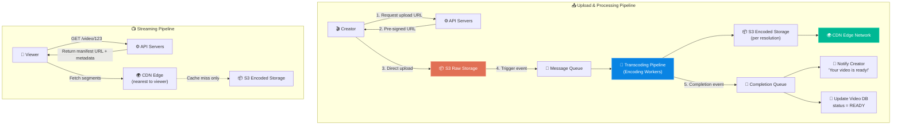
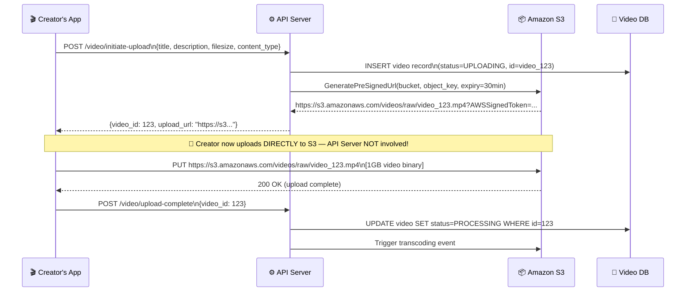
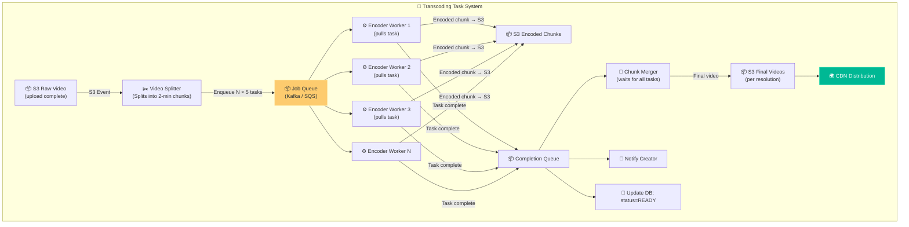
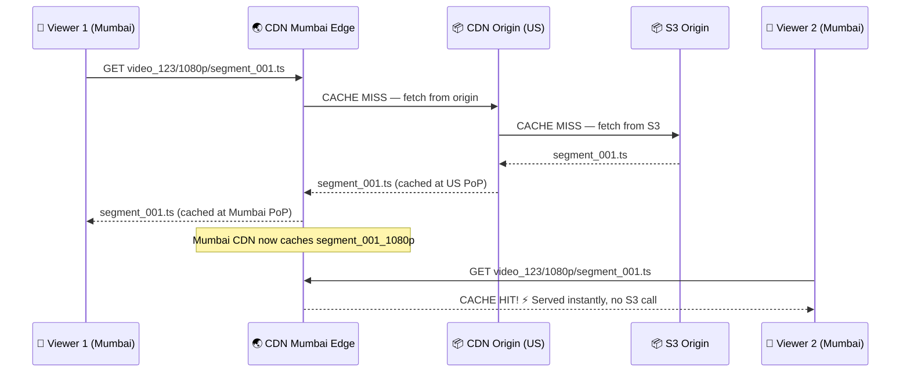

# Chapter 14: Design YouTube

> **Core Idea:** YouTube is a video sharing platform where creators upload content and over 2 billion users stream it on demand. Scale: 500 hours of video uploaded every minute, and 1 billion hours watched every day. This chapter is a masterclass in **video processing pipelines**, **adaptive streaming protocols**, **CDN architecture**, and managing the massive asymmetry between rare writes (uploads) and billions of reads (streams).

---

## 🧠 The Big Picture — Two Completely Different Beasts

YouTube is not one system — it's two systems operating at completely different timescales and with completely different bottlenecks:

| System | Who | When | Bottleneck |
|---|---|---|---|
| **Upload + Processing** | Content Creator | Rare (one upload per video) | CPU-bound (encoding), storage I/O |
| **Streaming + Viewing** | All Viewers | Constant, at massive scale | Bandwidth, latency, cache hit rate |

### 🍕 The Film Studio + Theater Chain Analogy

A movie is created **once** by a film studio (costly, slow, CPU/human-intensive). Then it's distributed to **thousands of theaters worldwide** (cheap per-screening, just replaying).

- **Film Studio = Your Upload + Transcoding Pipeline.** Raw footage → professionally encoded film reels.
- **Worldwide Theater Chain = Your CDN.** One origin copy → served locally in every city.

The movie studio doesn't make a new copy of the film for each audience member. But it does make one high-quality copy specifically for 4K IMAX theaters, another for standard projectors, another for small-town venues. This is **transcoding** — producing multiple quality versions from one source.

---

## 🎯 Step 1: Understand the Problem & Scope

### Clarifying the Requirements:

```
You:  "What features do we need to support?"
Int:  "Upload videos and watch videos. We'll skip comments and likes for now."

You:  "What clients? Mobile, web, smart TV?"
Int:  "All three."

You:  "How many DAU?"
Int:  "5 million DAU (Daily Active Users)."

You:  "What is the typical video upload size and duration?"
Int:  "Max 1GB per video for now."

You:  "What resolutions are supported?"
Int:  "Most standard resolutions and formats. The system should support 
       360p, 480p, 720p, 1080p, and 4K output."

You:  "Do we need encryption?"
Int:  "Yes."

You:  "How long must we retain videos?"
Int:  "Indefinitely — unless the creator deletes them."
```

### 🧮 Back-of-the-Envelope Estimates

| Metric | Calculation | Result |
|---|---|---|
| **New video uploads/day** | 5M users × 1% upload × 1 video | **50,000 videos/day** |
| **Storage for raw uploads** | 50,000 × avg 300MB (raw video) | **~15 TB of raw video / day** |
| **Storage for all encoded versions** | Each video encoded to 5 resolutions × avg 200MB | **50,000 × 5 × 200MB = 50 TB/day** |
| **Total 5-year storage** | 65 TB/day × 365 × 5 | **~120 Petabytes** |
| **Daily stream volume** | 5M DAU × 30 min × avg 1 Mbps bitrate | **~11 Petabytes streamed/day** |
| **CDN bandwidth cost** | 11 PB × $0.02/GB | **~$220,000 / day** |

> **Key Takeaway 1:** At $220,000/day in CDN costs, **every 10% improvement in CDN cache efficiency saves $22,000/day**. CDN optimization is a direct financial imperative.
>
> **Key Takeaway 2:** 120 PB of storage over 5 years means we must use **tiered, cost-optimized object storage** rather than expensive SSD databases.

---

## 🏗️ Step 2: High-Level Architecture — The Two Pipelines



---

## 🔬 Step 3: Deep Dive — Video Upload Flow

### Part A: Why Not Upload Through the API Server?

**Naive Approach — Creator → API Server → S3:**
```
Creator's Browser
    │
    │  uploads 1GB video.mp4
    ▼
API Server (receives 1GB, then forwards to S3)
    │
    │  re-uploads 1GB to S3
    ▼
S3 Object Storage
```

**This has 3 catastrophic problems:**

| Problem | Impact |
|---|---|
| **Double bandwidth** | 1GB travels network twice. API server receives AND re-transmits 1GB. Costs twice as much per upload. |
| **Thread starvation** | One API server thread is blocked holding a 1GB file upload for several minutes. With 100 concurrent uploads, 100 threads are frozen — serving no other users. |
| **Memory pressure** | If the API server buffers the whole file (not streaming), it needs 1GB of RAM per concurrent upload. 100 concurrent uploads = 100GB RAM needed just for buffering. |

---

### Part B: The Solution — Pre-Signed URLs (Direct Upload to S3)

Instead of routing the upload through API servers, we use **S3 Pre-Signed URLs** to let the creator upload directly to S3.

**What is a Pre-Signed URL?**
It's a temporary, cryptographically signed URL that authorizes a specific operation on a specific S3 object for a limited time.

Think of it as a **day-pass wristband** at an amusement park. The park's security desk (API server) issues you a wristband (pre-signed URL). You can now enter specific rides (S3 bucket) directly, without going back through security every time. The wristband expires after 30 minutes.

**The Pre-Signed URL Flow:**



**Benefits Confirmed:**
- API server sends/receives ~2KB of JSON total. No binary data ever touches it.
- S3 handles 100 concurrent 1GB uploads natively with no API server capacity concerns.
- The pre-signed URL is scoped: only allows PUT to this exact path, expires in 30 minutes.

---

### Part C: Multipart Upload for Large Files

**Problem:** Uploading a 1GB file as a single HTTP PUT is fragile. If the connection drops at byte 900MB, the upload fails and must restart from scratch.

**Solution — S3 Multipart Upload:**
Large files are split into **parts** (e.g., 5MB each) and uploaded independently. Only failed parts need to be retried.

```
1GB video → splits into 200 parts × 5MB each

Part 1 (5MB) ──┐
Part 2 (5MB) ──┤
Part 3 (5MB) ──┼─→ S3 Multipart Upload Manager
...             ├      (up to 1,000 parts in parallel)
Part 200 (5MB)─┘

If part 147 fails → retry ONLY part 147 (not the full 1GB)!
Once all 200 parts uploaded → S3 combines into one object
```

---

## 🔤 Step 4: The Transcoding Pipeline — The Heart of YouTube

This is the most complex and most important section of the chapter.

### Part A: Why Transcoding is Necessary

When a creator uploads a video, it might be:
- **Codec:** HEVC (H.265) — not supported by iOS Safari
- **Container:** `.MOV` — iOS specific, Windows doesn't play
- **Resolution:** 4K (3840×2160) — too heavy for a 3G mobile phone
- **Bitrate:** 80 Mbps — requires 80Mbps download speed

YouTube must serve **the same video** to:
- A 4K Smart TV on a fiber connection (wants: 4K, H.264, 20 Mbps)
- A desktop browser (wants: 1080p, H.264, 8 Mbps)
- An Android phone on LTE (wants: 720p, H.265, 2 Mbps)
- A user on 3G in rural India (wants: 360p, H.264, 0.5 Mbps)

**Transcoding = Converting the raw uploaded video into multiple standardized output versions, one per resolution/codec combination.**

### Part B: What Happens During Encoding?

A video file has two components:
1. **Container (file format):** `.mp4`, `.mov`, `.avi`, `.webm` — the wrapper that holds the streams together
2. **Codec (compression algorithm):** H.264, H.265/HEVC, VP9, AV1 — how pixels are compressed

**Common Output Targets:**

| Profile | Resolution | Codec | Bitrate | Target Audience |
|---|---|---|---|---|
| 4K Ultra HD | 3840×2160 | H.264 / AV1 | 15-20 Mbps | 4K TV, Premium users |
| 1080p Full HD | 1920×1080 | H.264 | 4-8 Mbps | Desktop, Good WiFi |
| 720p HD | 1280×720 | H.264 / H.265 | 1.5-3 Mbps | Mobile, Tablet |
| 480p SD | 854×480 | H.264 | 0.5-1 Mbps | Mobile, Slow connections |
| 360p | 640×360 | H.264 | 0.3-0.5 Mbps | Very slow connections, 3G |

**Why does encoding take so long?**
To compress a 1-second clip, the encoder:
1. Takes the raw frame (1920×1080 pixels × 3 color channels = 6.2MB per frame)
2. Computes the difference from the previous frame (delta encoding)
3. Creates I-frames (full reference frames) every few seconds
4. Applies DCT (Discrete Cosine Transform) — a heavy mathematical operation
5. Performs motion estimation (where did objects move from last frame?)
6. Generates compressed output

For a 1-hour video at 30fps = 108,000 frames, each requiring heavy math. **Even on a powerful CPU, encoding 1 hour of video takes 4-6 hours.**

---

### Part C: The DAG (Directed Acyclic Graph) Model — Solving the Speed Problem

**The Insight:** Rather than encoding the full video sequentially on one machine (6 hours for a 1-hour video), we can:
1. **Split** the video into small chunks (2 minutes each)
2. **Encode each chunk in parallel** across different machines
3. **Merge** the encoded chunks back together

This collapses a 6-hour job into a ~20-minute job by using 20+ machines simultaneously.

We model this as a **DAG (Directed Acyclic Graph)** — a graph of tasks with defined dependencies:

```
                         ┌─────────────────────────────────────────────────────┐
                         │             TRANSCODING DAG                          │
                         └─────────────────────────────────────────────────────┘

RAW VIDEO.mp4 ──► [Video Splitter] ──► chunk_001.mp4
                                  ──► chunk_002.mp4
                                  ──► chunk_003.mp4
                                  ──► chunk_004.mp4
                                       ...

For EACH chunk (running in parallel across machine pool):
chunk_001.mp4 ──► [Encode 4K]   ──► chunk_001_4k.mp4    ─┐
chunk_001.mp4 ──► [Encode 1080p] ──► chunk_001_1080p.mp4 ─┤
chunk_001.mp4 ──► [Encode 720p]  ──► chunk_001_720p.mp4  ─┤► [Chunk Merger]
chunk_001.mp4 ──► [Encode 480p]  ──► chunk_001_480p.mp4  ─┤
chunk_001.mp4 ──► [Encode 360p]  ──► chunk_001_360p.mp4  ─┘

RAW VIDEO.mp4 ──► [Audio Extractor] ──► audio_raw.aac
audio_raw.aac ──► [Audio Encoder]   ──► audio_final_256kbps.aac ──► [Chunk Merger]

RAW VIDEO.mp4 ──► [Thumbnail Generator] ──► thumb_01.jpg ──► S3
                                        ──► thumb_02.jpg ──► S3

After ALL chunks encoded at ALL resolutions:
[Chunk Merger] ──► video_123_4k.mp4    ──► S3 + CDN
               ──► video_123_1080p.mp4 ──► S3 + CDN
               ──► video_123_720p.mp4  ──► S3 + CDN
               ──► video_123_480p.mp4  ──► S3 + CDN
               ──► video_123_360p.mp4  ──► S3 + CDN
```

**The Math:**
```
1-hour video without chunking (single machine): 6 hours encoding time

1-hour video with chunking:
→ Split into 30 × 2-minute chunks
→ Each chunk takes: 6 hours / 30 = 12 minutes
→ 30 chunks × 5 resolution each = 150 encoding tasks
→ Distributed across 150 worker machines: ~12 minutes wall-clock time!
→ **6 HOURS compressed to ~12 MINUTES** 🚀
```

---

### Part D: The Task Queue Architecture



### Part E: Error Handling in the Transcoding Pipeline

**Problem:** A transcoding worker crashes mid-job. The chunk was never finished.

**Solution — At-Least-Once Processing with Visibility Timeout:**
1. When a worker pulls a task from the queue, the task is **hidden** (not deleted) for 15 minutes.
2. If the worker completes successfully → explicitly **deletes** the task from the queue.
3. If the worker crashes → after 15 minutes, the task **becomes visible again** and another worker picks it up.
4. If a task fails 5 times → moved to a **Dead Letter Queue (DLQ)** for manual inspection and alerting.

```
Queue State:
Task[chunk_14_720p] → STATUS: PROCESSING (invisible, worker_7 working on it)
  └─ If worker_7 crashes:
       After 15min → Task becomes VISIBLE again → worker_12 picks it up
       After 5 fails → DLQ: "chunk_14_720p FAILED permanently — alert engineers"
```

---

## 📺 Step 5: Video Streaming Protocol — The Full Deep Dive

### Part A: Why Not Just Download the Whole Video?

**Naive approach:** User clicks "Play" → browser downloads `video_123_1080p.mp4` → plays it.

**Problems:**
| Problem | Real Impact |
|---|---|
| **Wait time** | A 1GB video at 10Mbps takes 800 seconds (13 minutes) to download before playback starts. |
| **Wasted bandwidth** | User watches 2 minutes then closes tab. You paid to transfer 60 minutes of video data. |
| **No quality adaptation** | User starts on WiFi, walks outside onto 3G. Video freezes — can't drop to lower quality mid-download. |
| **Range requests needed** | User clicks 1:23:45 on the timeline. You'd have to download the first 1.5 hours before reaching that timestamp. |

---

### Part B: HTTP Adaptive Bitrate Streaming — HLS and DASH

**The Solution: Segment the video and adapt quality dynamically.**

Both HLS (HTTP Live Streaming, invented by Apple) and MPEG-DASH work on the same principle:

**Step 1 — During Transcoding: Generate Segments**
Each resolution version is cut into small segments (typically 6-10 seconds of video each):

```
video_123_1080p.mp4 → segment_001.ts, segment_002.ts, ... segment_600.ts
video_123_720p.mp4  → segment_001.ts, segment_002.ts, ... segment_600.ts
video_123_480p.mp4  → segment_001.ts, segment_002.ts, ... segment_600.ts
```

**Step 2 — Generate a Manifest File (Playlist)**
An `.m3u8` index file tells the player what qualities are available and where each segment is:

```m3u8
# Master Playlist: video_123/master.m3u8
#EXTM3U
#EXT-X-VERSION:3

# Available resolution streams:
#EXT-X-STREAM-INF:BANDWIDTH=500000,RESOLUTION=640x360,CODECS="avc1.42c01e"
https://cdn.youtube.com/video_123/360p/playlist.m3u8

#EXT-X-STREAM-INF:BANDWIDTH=1000000,RESOLUTION=854x480,CODECS="avc1.42c01e"
https://cdn.youtube.com/video_123/480p/playlist.m3u8

#EXT-X-STREAM-INF:BANDWIDTH=3000000,RESOLUTION=1280x720,CODECS="avc1.4d001f"
https://cdn.youtube.com/video_123/720p/playlist.m3u8

#EXT-X-STREAM-INF:BANDWIDTH=8000000,RESOLUTION=1920x1080,CODECS="avc1.640028"
https://cdn.youtube.com/video_123/1080p/playlist.m3u8
```

Each resolution's sub-playlist:
```m3u8
# Sub Playlist: video_123/1080p/playlist.m3u8
#EXTM3U
#EXT-X-VERSION:3
#EXT-X-TARGETDURATION:6

#EXTINF:6.000,
https://cdn.youtube.com/video_123/1080p/segment_001.ts

#EXTINF:6.000,
https://cdn.youtube.com/video_123/1080p/segment_002.ts

#EXTINF:6.000,
https://cdn.youtube.com/video_123/1080p/segment_003.ts
... (600 entries)
```

**Step 3 — The Player Algorithm (The Magic)**
The client video player runs this loop continuously:

```python
def player_loop():
    buffer_target = 30  # seconds of video to keep buffered
    
    while video_not_finished:
        buffered_seconds = measure_current_buffer()
        available_bandwidth = measure_last_download_speed()
        
        # Pick the best quality that fits in available bandwidth
        target_bitrate = available_bandwidth * 0.8  # 80% of measured speed (safety margin)
        
        if target_bitrate > 8_000_000:     resolution = "1080p"
        elif target_bitrate > 3_000_000:   resolution = "720p"
        elif target_bitrate > 1_000_000:   resolution = "480p"
        else:                              resolution = "360p"
        
        if buffered_seconds < 10:
            # Buffer getting low → download next segment urgently
            download_segment(resolution, next_segment_index)
        elif buffered_seconds < buffer_target:
            # Normal buffering
            download_segment(resolution, next_segment_index)
        else:
            sleep(1)  # Buffer is full, wait a second
```

**Real Example — Commuter Journey:**
```
8:00 AM - User at home WiFi (50 Mbps)
   → Player measures 50 Mbps → Downloads segment_001 at 1080p (8 Mbps). Buffer fills fast.

8:10 AM - User takes phone on subway, 4G LTE drops to 5 Mbps
   → Player measures 5 Mbps → Next segment downloaded at 720p (3 Mbps).
   → Still smooth playback! User barely notices quality drop.

8:12 AM - Train enters tunnel, connection drops to 1 Mbps
   → Player measures 1 Mbps → Next segment downloaded at 480p (0.5 Mbps).
   → Player has 25 seconds of 720p buffered → zero stall for ~25 seconds!
   → If tunnel lasts > 25 seconds, player waits (the "buffering spinner").

8:15 AM - Train exits tunnel, LTE returns
   → Player immediately starts downloading 1080p again.
   → Buffer refills. Quality improves seamlessly.
```

---

### Part C: Seeking / Random Access

**User clicks 1:23:45 on the progress bar.** How does the player jump?

```
1. Player looks at the manifest (already downloaded at load time)
2. Calculate: 1:23:45 = 5025 seconds / 6 seconds per segment = segment_837
3. Fetch segment_837 directly: GET cdn.youtube.com/video_123/1080p/segment_837.ts
4. Playback starts from segment_837 immediately!
```

No need to download segments 1 through 836. **Seeking is O(1): just request the right segment number.**

---

## 🌍 Step 6: CDN Architecture — The Global Distribution Layer

### Part A: What is a CDN and Why Is It Non-Negotiable?

A CDN is a globally distributed network of **edge servers** (also called PoPs — Points of Presence). These servers cache video segments close to viewers geographically.

**Without CDN:** Viewer in Mumbai watches a video. Each segment fetched from US-East-1 (Virginia USA). Round-trip latency: ~250ms. For smooth 1080p video, the player needs segments every 6 seconds. 250ms latency means 4% of playback time is "waiting for the network." Noticeable buffering.

**With CDN:** Viewer in Mumbai fetches from CDN Mumbai (same city). Round-trip latency: ~2ms. 99.97% of playback time is actually playing video. Zero buffering.

### Part B: CDN Cache Fill — How Segments Get to the Edge



After the first viewer in a region watches any part of a video, every subsequent viewer in that region gets it from local cache. For a viral video with 1 million views, S3 origin might be called only **once per segment per CDN region**. All remaining views are pure cache hits.

### Part C: CDN Pricing and the 80-20 Rule

CDN edges have limited storage. You can't cache every video on every edge.

**The Pareto Principle in action:**
> The top 20% of videos account for ~80% of all views.

**Strategy:**
- **Hot videos (top 20%):** Proactively pushed to **all CDN edge nodes worldwide.** Creator posts a video → after processing, immediately distribute to every major CDN PoP.
- **Warm videos (next 30%):** Cached at **regional CDN nodes** (e.g., North America cluster, Europe cluster), fetched on demand from US origin if missing.
- **Cold videos (bottom 50%):** **Served directly from S3 origin.** These are old videos with few monthly views. CDN bandwidth cost would be wasted caching them.

```
Top 20% (viral/popular):    CDN Mumbai, London, NYC, Tokyo, Sydney... (100+ PoPs)
Middle 30% (regional):      CDN by continent (5-10 PoPs)
Bottom 50% (long tail):     Served from S3 origin (pay CDN transfer ONLY when someone watches)
```

---

## 🗄️ Step 7: Data Storage Architecture

### Part A: Video File Storage — Object Storage (Not Databases!)

**Why not store videos in MySQL?**
| MySQL | Object Storage (S3) |
|---|---|
| Stores structured rows (text, numbers) | Stores arbitrary binary blobs of any size |
| Max row size ~65KB | Files up to 5 TB per object |
| Index updates for every write | Simple key-value with HTTP API |
| Horizontal scaling is complex | Infinitely horizontally scalable |
| Expensive SSD required | Cheap tiered storage (HDD, tape for cold) |

**Storage Tiers:**
```
Hot Tier:  Amazon S3 Standard        → Recently uploaded videos, popular videos
           Cost: $0.023/GB/month

Warm Tier: Amazon S3 Infrequent Access → Videos > 30 days old, moderate views
           Cost: $0.0125/GB/month (46% cheaper!) 
           Trade-off: Small extra fee ($0.01/GB) when actually retrieved

Cold Tier: Amazon S3 Glacier         → Videos > 1 year old, rarely watched
           Cost: $0.004/GB/month (83% cheaper than Standard!)
           Trade-off: 3-5 hour retrieval time (acceptable for old obscure videos)
```

This tiered approach dramatically reduces storage costs. 80% of stored video is rarely accessed — putting it in Glacier saves massive money.

---

### Part B: Metadata Storage — Database Design

Unlike video files, metadata is small, structured, and queried frequently.

**Video Table (MySQL):**
```sql
CREATE TABLE videos (
    video_id        BIGINT PRIMARY KEY,   -- Snowflake ID (Chapter 7!)
    creator_id      BIGINT NOT NULL,       -- FK to users table
    title           VARCHAR(300) NOT NULL,
    description     TEXT,
    status          ENUM('UPLOADING', 'PROCESSING', 'READY', 'FAILED'),
    raw_s3_key      VARCHAR(500),          -- s3://raw/video_123.mp4
    duration_sec    INT,                   -- video length
    created_at      DATETIME,
    INDEX idx_creator (creator_id),
    INDEX idx_status_created (status, created_at)
);
```

**Video Resolutions Table:**
```sql
CREATE TABLE video_resolutions (
    id              BIGINT PRIMARY KEY AUTO_INCREMENT,
    video_id        BIGINT NOT NULL,
    resolution      ENUM('360p', '480p', '720p', '1080p', '4K'),
    cdn_url         VARCHAR(500),          -- CDN URL for this resolution's manifest
    s3_key          VARCHAR(500),          -- S3 key for this resolution's folder
    file_size_bytes BIGINT,
    status          ENUM('PROCESSING', 'READY'),
    UNIQUE KEY unique_vid_res (video_id, resolution)
);
```

**For Like/View Counts — Redis, NOT MySQL:**

Why does YouTube show "1.2M views" not "1,247,832 views"? 
Because **counting exact views in real-time in SQL would destroy your database.**

```sql
-- NEVER do this for high-traffic tables:
UPDATE videos SET view_count = view_count + 1 WHERE video_id = 123;
-- At 10M views/day = 116 UPDATE statements/second → hot row contention → deadlocks
```

**Solution using Redis:**
```
INCR video:123:views        → atomic, lock-free, O(1)
GET video:123:views         → O(1) read
```

Periodically (every 30 seconds), a background job flushes Redis counts to MySQL:
```sql
UPDATE videos SET view_count = view_count + {redis_delta} WHERE video_id = {id};
```

**Comments Table (Cassandra / MySQL with sharding):**
```
Primary Key: (video_id, comment_id)  -- comment_id is Snowflake ID = time-sortable
→ "Get all comments for video X ordered by time" is a single range scan
```

---

## 🔒 Step 8: Security and Content Protection

### Part A: Authentication and Authorization for Uploads

```
Creator uploads? → Must prove identity (JWT token from Auth Service)
Pre-signed URL is per-creator: URL is signed with a hash of {bucket, path, creator_id, expiry}
If creator_id doesn't match → S3 rejects the upload
```

### Part B: DRM (Digital Rights Management)

For premium content (movies, sports), the video stream must be **encrypted**. A user who intercepts the network traffic should see only garbage bytes, not watchable video.

**How DRM works:**

```
UPLOAD TIME:
1. Transcoder generates a unique Content Encryption Key (CEK) for this video
2. Encodes video → encrypts each segment with AES-128-CBC using the CEK
3. Securely stores CEK in a DRM License Server (NOT public)
4. Publishes encrypted segments to CDN

PLAYBACK TIME:
1. Viewer's player requests video
2. Player calls DRM License Server: "I want to play video_123, here's my auth token"
3. License Server verifies: "Is this user subscribed? Are they on an authorized device?"
4. If authorized → returns CEK (over HTTPS) to the player
5. Player uses CEK to decrypt segments in real-time as they're downloaded
6. If user doesn't have a valid subscription → License Server denies → encrypted segments are useless
```

Common DRM systems:
- **Widevine** (Google) — used by Chrome, Android
- **FairPlay** (Apple) — used by Safari, iOS
- **PlayReady** (Microsoft) — used by Edge, Windows

### Part C: Copyright Detection (Content ID System)

**Problem:** Users upload copyrighted content (full movies, songs, sports clips). Rights holders want either: (a) block the video, (b) monetize it on their behalf, or (c) track the views.

**Solution — Audio/Video Fingerprinting:**

```
REGISTRATION:
1. Rights holder submits official copy of "Avengers: Endgame" to Content ID
2. System extracts fingerprint: ~60 floating point values per second that uniquely identify the content
3. Fingerprint stored in a Reference Database

ON EVERY UPLOAD:
1. Transcoding Pipeline extracts fingerprint of newly uploaded video
2. Fingerprint compared against Reference Database (approximate nearest neighbor search)
3. If match found (> 90% similarity threshold):
   a. Informs Rights Holder: "User_456 uploaded your content"
   b. Rights Holder Policy: BLOCK / MONETIZE / TRACK
4. If no match: video is published normally
```

The fingerprinting comparison uses algorithms like **SimHash** or specialized audio fingerprinting algorithms (like those in Shazam).

---

## 🚀 Step 9: Scalability Deep Dive

### Part A: The Transcoding Farm

The transcoding workers are **stateless, horizontally scalable EC2 instances**. 

- **Scale-Out:** When Queue depth > 1,000 jobs → Auto Scaling Group adds 100 more worker instances.
- **Scale-In:** When Queue depth < 100 jobs → Terminate idle workers (no wasted cost).
- **Spot Instances:** Transcoding is latency-tolerant (5 minute wait is OK). Use AWS Spot Instances (up to 90% cheaper than on-demand). If a spot instance is reclaimed mid-job → the task re-appears in the queue after visibility timeout and gets picked up by another worker.

### Part B: Video Streaming Performance Optimization

| Optimization | Mechanism | Impact |
|---|---|---|
| **TCP BBR Congestion Control** | Google's Bottleneck Bandwidth and Round-trip propagation time algorithm vs. traditional TCP CUBIC | +30% throughput on congested networks |
| **HTTP/2 multiplexing** | Multiple segment requests in one TCP connection | Reduced connection overhead |
| **Segment prefetching** | Player downloads segments 3-5 ahead of playback position | Near-zero stall time |
| **Edge computing** | Rate the video metadata at CDN edge (not origin) | Shaves 200ms off initial load |
| **Manifest file caching** | Cache master.m3u8 at CDN with 5 min TTL | Reduce origin hits for metadata |

---

## 📋 Summary — Complete Decision Table

| Problem | Decision | Why |
|---|---|---|
| **Large file upload** | Pre-Signed URL (creator → S3 directly) | API servers never handle binary data |
| **Upload fault tolerance** | S3 Multipart Upload (5MB parts) | Only retry failed parts, not whole file |
| **Transcoding speed** | DAG of parallel chunk workers | 6 hours → 12 minutes via parallelism |
| **Transcoding fault tolerance** | Queue Visibility Timeout + DLQ | At-least-once processing, no lost jobs |
| **Streaming protocol** | HLS/DASH Adaptive Bitrate (ABR) | Quality adapts to user's current bandwidth |
| **Video delivery** | CDN edge network (200+ PoPs) | Serve from nearest city, not US datacenter |
| **CDN cost optimization** | Tiered: hot→all edges, cold→S3 direct | Pareto 80-20 rule; don't cache unpopular videos |
| **Video file storage** | S3 + tiered (Standard→IA→Glacier) | Binary blobs, massive scale, cost tiers |
| **Video metadata** | MySQL | Structured, relational, moderate scale |
| **Like/View counters** | Redis INCR + periodic MySQL flush | Lock-free counters, no SQL hot-row contention |
| **DRM/Copyright** | AES-128 encryption + License Server | Only authorized devices can decrypt stream |
| **Copyright detection** | Audio/Video fingerprinting (Content ID) | Approximate nearest neighbor search against reference DB |

---

## 🧠 Memory Tricks

### The Upload Journey: **"P-S-D-T-C"** 🎬
- **P**re-signed URL (Direct upload to S3)
- **S**plitter (Chunk the video)
- **D**AG Workers (Parallel encode)
- **T**rigger completion queue (Merger → DB → Notify)
- **C**DN Distribution (Push to edges)

### The Streaming Protocol: **"Manifest → Segment → Adapt"** 📺
1. Player downloads the **manifest** file (the restaurant menu)
2. Player requests one **segment** at a time (6 seconds of video)
3. Player **adapts** quality based on measured download speed after each segment

### The Storage Tiers: **"Hot-Warm-Cold = Standard-IA-Glacier"** 🌡️
- **Standard** (Hot): Currently viral, recent uploads → Fast access, higher cost
- **IA** (Warm): Videos 30+ days old → 46% cheaper, small retrieval surcharge
- **Glacier** (Cold): Old long-tail videos, rarely watched → 83% cheaper, hours to retrieve

---

## ❓ Interview Quick-Fire Questions

**Q1: Why do we need pre-signed URLs for video uploads instead of uploading to our API servers?**
> A 1GB video upload through an API server travels the network twice — once from creator to server, once from server to S3 — doubling bandwidth cost. API server threads block for minutes holding the upload, starving other requests. Pre-signed URLs grant creators temporary, scoped permission to PUT a specific S3 object directly. The API server handles only kilobytes of metadata, never binary data.

**Q2: Explain how Adaptive Bitrate Streaming prevents buffering on a cellular connection.**
> ABR protocols (HLS/DASH) split the video into 6-10 second segments at multiple quality levels. The player downloads one segment at a time, measures the download speed, and selects the best quality the current bandwidth supports for the next segment. When the user moves from WiFi to LTE, the measured bandwidth drops, so the player switches to a lower-bitrate segment — maintaining smooth playback instead of buffering. The player also keeps a buffer of ~30 seconds so momentary bandwidth drops don't interrupt viewing.

**Q3: How does the DAG transcoding model reduce encoding time from hours to minutes?**
> Encoding is CPU-bound and proportional to video duration. A single machine encoding a 1-hour video might take 6 hours. By first splitting the raw video into 2-minute chunks (30 chunks for 1 hour), we create 30 × 5 = 150 independent encoding tasks. These are distributed to 150 worker machines running in parallel, with each task completing in ~12 minutes wall-clock time vs. 6 hours sequentially. The DAG ensures the merger waits for all chunks before combining.

**Q4: How does CDN caching reduce origin load from millions of requests to almost nothing?**
> A CDN edge node caches each video segment locally. The first viewer in Mumbai causes a cache miss — the segment is fetched from S3 origin and then cached at the Mumbai PoP. Every subsequent viewer in Mumbai is served from the local cache — S3 is never contacted again for that segment. For a viral video with 1 million viewers in India, S3 might receive only one request per segment (~600 requests per resolution), serving the remaining 999,999 views from cache.

**Q5: Why use Redis for view counts instead of MySQL?**
> MySQL `UPDATE view_count = view_count + 1` acquires a row-level write lock, causing contention when thousands of concurrent users trigger counts simultaneously. At 10M views/day, that's ~116 updates/second on the same row — a classic "hot row" problem causing deadlocks and degraded performance. Redis `INCR video:123:views` is an atomic O(1) operation with no locking. Multiple million increments per second are handled without contention. A background job periodically flushes the Redis delta into MySQL for persistence.

---

> **📖 Previous Chapter:** [← Chapter 13: Design a Search Autocomplete System](/HLD/chapter_13/design_a_search_autocomplete_system.md)
>
> **📖 Next Chapter:** [Chapter 15: Design Google Drive →](/HLD/chapter_15/)
