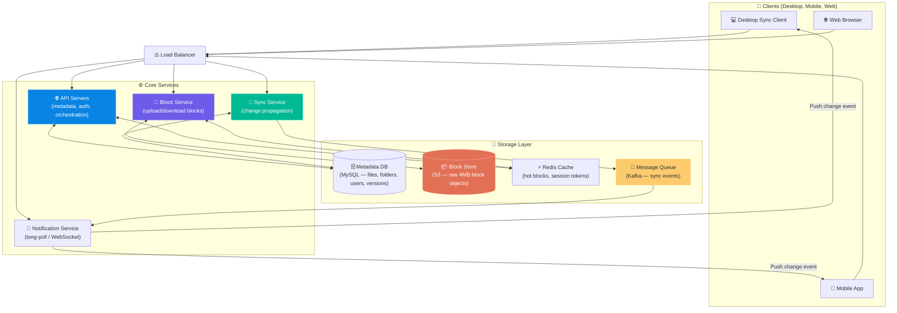
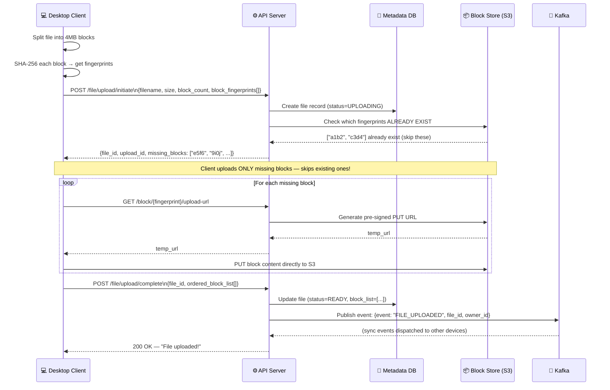
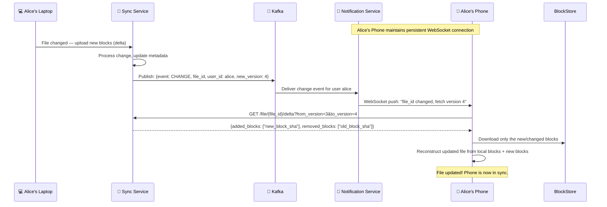
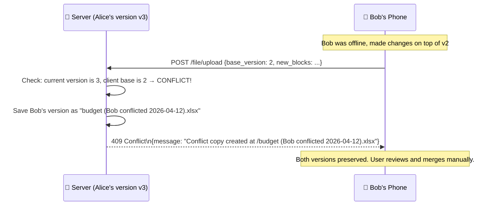

# Chapter 15: Design Google Drive

> **Core Idea:** Google Drive is a cloud file storage and synchronization service. Users upload files from any device and seamlessly access / edit them from any other device. Under the hood, it combines **chunked file storage**, **delta synchronization**, **block-level deduplication**, and **real-time change propagation** to deliver a system that feels effortless while managing petabytes of user data at massive scale.

---

## 🧠 The Big Picture — It's Much More Than a Cloud Folder

People often think Google Drive is just "your files stored online." But the engineering challenge is much richer:

1. **Upload any file** — from a 1KB `.txt` to a 10GB video.
2. **Sync changes** — edit a file on your laptop, see the change within seconds on your phone.
3. **Bandwidth efficiency** — if you change one word in a 500MB PowerPoint, you shouldn't have to re-upload 500MB.
4. **Deduplication** — if 10M users each upload the same publicly available PDF, store it just once.
5. **Conflict resolution** — two users edit the same shared document offline simultaneously. Who wins?
6. **Security** — files must be encrypted in transit and at rest.

### 🍕 The Magic Photocopier Analogy

Imagine a magical photocopier connected to every location you work at (home, office, phone).

- You modify page 7 of your document. The photocopier doesn't re-copy the entire 500-page binder — it copies only page 7 and sends it to all your other locations. **(Delta sync — only sync changes)**
- The photocopier knows that "page 7 of the quarterly report" is identical across 10,000 employees' binders. It stores just one physical copy and gives everyone access to it. **(Deduplication)**
- You modify the document simultaneously with a colleague. The photocopier notices the conflict and keeps both versions for you to resolve. **(Conflict resolution)**

---

## 🎯 Step 1: Understand the Problem & Scope

### Clarifying the Requirements:

```
You:  "What are the key features we need?"
Int:  "Upload/download files, file sync across devices, and file sharing."

You:  "Is this mobile, web, or both?"
Int:  "All platforms: web, mobile, and desktop sync client."

You:  "How much storage does each user get?"
Int:  "10GB free per user."

You:  "What file types are supported?"
Int:  "All file types."

You:  "Do we need to support file versioning (undo changes)?"
Int:  "Yes."

You:  "How many users do we have?"
Int:  "50 million registered users, 10 million DAU."

You:  "Do we need ACID guarantees for file operations?"
Int:  "Yes. File uploads/deletes should not result in corrupt or partial states."
```

### 📋 Finalized Requirements

| Requirement | Detail |
|---|---|
| Upload / Download | Any file type, up to 10GB per file |
| Sync | Changes on one device propagate to all other devices |
| Delta Sync | Only upload/download the changed portions of a file, not the whole file |
| Deduplication | Identical files/blocks stored only once across the system |
| Versioning | Keep N previous versions per file (users can roll back) |
| Sharing | Share files/folders with other users (read/write permissions) |
| Security | Encryption in transit (HTTPS/TLS) and at rest (AES-256) |
| Availability | High availability. Users lose productivity if Drive is down. |

### 🧮 Back-of-the-Envelope Estimates

| Metric | Calculation | Result |
|---|---|---|
| **Total storage** | 50M users × 10GB each | **500 Petabytes** |
| **Daily uploads (files)** | 10M DAU × 2 files avg | 20M file uploads/day |
| **Daily upload volume** | Avg file size ~500KB | 20M × 500KB = **10 TB/day** |
| **Write QPS** | 20M / 86,400 sec | ~230 writes/sec |
| **Read QPS** | ~10× write (read-heavy) | ~2,300 reads/sec |

> **Takeaway:** 500 PB of storage is the dominant technical challenge. We must use **block deduplication** and **tiered storage** aggressively to manage this cost.

---

## 🏗️ Step 2: High-Level Design — The Naïve Approach (And Why It Fails)

### First Idea: Files Stored as Monolithic Objects

The simplest design: User uploads a file → stored as one big object in S3 → URL returned.

```
User uploads "my_report.pptx" (200MB)
    → API server receives 200MB
    → Writes 200MB to S3 as one object
    → Done.

User edits slide 3 (changes 10 words) → new file is 200MB
    → Upload the ENTIRE 200MB again!
    → Store the ENTIRE 200MB again!
```

**Problems at scale:**
| Problem | Impact |
|---|---|
| **Bandwidth waste** | Changing one word in a 200MB file re-uploads 200MB every time. At 10M DAU, catastrophic bandwidth cost. |
| **Storage waste** | Each version stores a full copy. 10 versions × 200MB = 2GB per file per user. |
| **No deduplication** | 10M users each have a copy of the same 100MB PDF. You store 10M × 100MB = 1 Petabyte for one file. |
| **Slow sync** | Mobile device downloads the full 200MB file even if 199.9MB is unchanged. |
| **Upload unreliable** | Network drops at 195MB → restart the entire 200MB upload from scratch. |

---

## 🔤 Step 3: The Solution — Block-Level Storage

### Part A: The Core Concept — Splitting Files into Blocks

Instead of treating a file as one monolithic object, we split every file into **fixed-size blocks** (typically 4MB each).

```
my_report.pptx (200MB)
→ Block_001 (4MB) → SHA-256 fingerprint: a1b2c3d4...
→ Block_002 (4MB) → SHA-256 fingerprint: e5f6g7h8...
→ Block_003 (4MB) → SHA-256 fingerprint: a1b2c3d4...  ← SAME as Block_001!
→ Block_004 (4MB) → SHA-256 fingerprint: 9i0j1k2l...
... (50 blocks total)
```

**Key observations:**
1. Blocks are identified by their **SHA-256 content hash** (fingerprint), not by name.
2. If two blocks have **the same content → they have the same hash → store only once** (deduplication!).
3. A file is represented as an ordered **list of block IDs** (its "recipe").

The file metadata record looks like:
```json
{
  "file_id": "file_987",
  "name": "my_report.pptx",
  "version": 3,
  "block_list": ["a1b2c3d4", "e5f6g7h8", "a1b2c3d4", "9i0j1k2l", ...],
  "total_blocks": 50
}
```

To reconstruct the file: fetch blocks in order from the block store and concatenate them.

---

### Part B: Deduplication — The Financial Killer Feature

**Block-level deduplication algorithm on upload:**

```python
def upload_file(file_path):
    blocks = split_into_4mb_blocks(file_path)
    block_ids_to_upload = []
    
    for block in blocks:
        fingerprint = sha256(block.content)
        
        if block_store.exists(fingerprint):
            # Block already stored (maybe from this user, maybe from another user!)
            print(f"Block {fingerprint} already exists — SKIP UPLOAD")
        else:
            # New block — upload to block store
            block_store.put(fingerprint, block.content)
            print(f"Block {fingerprint} — UPLOADED")
        
        block_ids_to_upload.append(fingerprint)
    
    # Save file metadata (just the ordered list of block IDs)
    metadata_db.save(file_id, block_ids_to_upload)
```

**The Storage Saving in Real Numbers:**
```
Scenario: 10 million users each upload the same 100MB PDF (e.g., a government form)

Without deduplication:
  10M users × 100MB = 1,000,000 GB = ~1 Petabyte stored

With block deduplication:
  100MB / 4MB per block = 25 blocks
  Those 25 blocks are stored ONCE (400MB total!)
  All 10M users' metadata records just point to the same 25 block IDs.
  Storage used: 400MB instead of 1 Petabyte — a 2,500,000× reduction!
```

---

### Part C: Delta Sync — Only Uploading What Changed

**The Problem:** After a 200MB file is first uploaded, the user changes 3 slides (about 12MB of content across 3 blocks). How do we avoid re-uploading 200MB?

**The Delta Sync Algorithm:**

```
Original file:     [Block_A, Block_B, Block_C, Block_D, ..., Block_50]
After user edits: [Block_A, Block_B, Block_C', Block_D, ..., Block_50]
                                              ↑
                                         Changed block!
                                     (Block_C' has new content, new SHA-256)

Client-side computation:
1. Re-compute SHA-256 of every local block.
2. Compare with server's block list for this file version.
3. Find which blocks changed (Block_C in this case).
4. Upload ONLY the changed blocks (Block_C' = 4MB).
5. Send new block list to server: [Block_A, Block_B, Block_C', Block_D, ..., Block_50]

Result: Only 4MB uploaded instead of 200MB → 98% bandwidth saving!
```

This is what Google Drive, Dropbox, and OneDrive all fundamentally do under the hood.

---

## 🏛️ Step 4: Full System Architecture



---

## 🔬 Step 5: Deep Dive — File Upload Flow (Complete)

### The Full Upload Sequence (with Resumable Uploads):



### Resumable Upload — Handling Network Failures:

```
Upload of 200MB file (50 blocks of 4MB each):

Normal flow:
Block 1 ✅ → Block 2 ✅ → Block 3 ✅ → ... → Block 32 ✅
→ Network DROPS at block 33!

With resumable uploads:
Client keeps local state: {upload_id: "abc123", last_completed_block: 32}

On reconnection:
Client → API: "resume upload abc123 — I've uploaded blocks 1-32"
API → BlockStore: "Blocks 1-32 already in S3?"
BlockStore → API: "Confirmed"
API → Client: "Continue from block 33"
Client resumes from block 33 → ... → Block 50 ✅
→ Only blocks 33-50 re-uploaded (not 1-50)
```

---

## 🔄 Step 6: Deep Dive — File Sync (The Core Challenge)

### The Problem: Multi-Device Consistency

Alice uses Google Drive on her laptop and her phone. She edits a spreadsheet on the laptop. Her phone must "notice" this change and update its local copy — even if the phone was offline when the edit happened.

### How Does the Phone Know Something Changed?

**Option A — Polling:** Phone asks the server every 30 seconds, "Any changes to my files?"
- Simple to implement.
- But 10M DAU × 2 requests/min = 20M requests/min = huge server cost for mostly empty responses.

**Option B — Long Polling:** Phone holds a connection open, server pushes when something changes.
- Better, but connection management is complex.

**Option C — WebSocket Connection to Notification Service** (Used by Google Drive)
- Sync client maintains a persistent WebSocket connection.
- When the server detects a change (via Kafka event), it pushes a lightweight "change event" to the specific client.
- Client then fetches the changed blocks using delta sync.

### The Full Sync Flow:



---

### The Metadata Synchronization Database

The key table that drives all sync is the **file_version** table. Every change creates a new version record:

```sql
CREATE TABLE file_versions (
    version_id     BIGINT PRIMARY KEY AUTO_INCREMENT,
    file_id        BIGINT NOT NULL,
    version_num    INT NOT NULL,
    block_list     JSON NOT NULL,        -- ordered list of block fingerprints
    created_at     DATETIME NOT NULL,
    created_by     BIGINT NOT NULL,      -- user who made the change
    change_type    ENUM('CREATE', 'UPDATE', 'DELETE'),
    UNIQUE KEY unique_file_version (file_id, version_num),
    INDEX idx_file_versions (file_id, version_num DESC)
);
```

**Delta computation:**
```sql
-- Get blocks that changed from version 3 to version 4
SELECT
    JSON_ARRAY_DIFF(v4.block_list, v3.block_list) AS changed_blocks
FROM file_versions v3, file_versions v4
WHERE v3.file_id = v4.file_id
  AND v3.version_num = 3
  AND v4.version_num = 4;
```

---

## ⚔️ Step 7: Conflict Resolution — The Hardest Problem

### Setting the Scene
Alice and Bob both share a folder. Both go offline simultaneously. 
- Alice edits `budget.xlsx` on her laptop (no internet).
- Bob edits `budget.xlsx` on his phone (no internet).
- Both come back online at the same time and try to sync.

**Who wins?**

### Option A — Last Write Wins (LWW)

The change with the later timestamp replaces the earlier one. Bob's edit is overwritten by Alice's if Alice synced 1 second later.

**Problems:**
- This silently loses work. Bob's edits vanish with no warning.
- Clock skew between devices means the "later" timestamp may not be actually later.
- **Google Docs does NOT use this for documents** — it uses CRDT (operational transformations).

### Option B — Google Drive's Approach: Keeping Competing Versions

For files (not Google Docs), Google Drive takes the pragmatic choice:
1. **Detect the conflict:** The server checks "does the client's base version match the current server version?" If not, there's a conflict.
2. **Preserve ALL versions:** Don't overwrite. Create a conflict copy: `budget.xlsx (Bob's conflicted copy 2026-04-12).xlsx`
3. **Notify both users** with a banner: "There's a conflict — please review both versions and merge manually."



### Option C — Collaborative Documents (Google Docs): CRDT / OT

For live collaborative editing (Google Docs, not Drive files), conflict resolution uses **Operational Transformation (OT)** or **CRDTs (Conflict-free Replicated Data Types)**:

**OT Example:**
```
Initial text: "Hello World"

Alice (offline): Inserts " Beautiful" at position 5 → "Hello Beautiful World"
Bob (offline):   Deletes "World" (positions 6-10) → "Hello "

When both sync:
- Alice's operation: Insert " Beautiful" at position 5
- Bob's operation: Delete 5 chars at position 6

OT transforms Bob's operation against Alice's:
→ Bob's delete must be adjusted because Alice inserted 10 chars before position 6
→ Transformed Bob's operation: Delete 5 chars at position 16 (not 6)

Combined result: "Hello Beautiful " ← both edits applied without data loss!
```

---

## 🗄️ Step 8: Storage Architecture in Depth

### Block Store Design

Every uploaded block is stored in S3 using its SHA-256 fingerprint as the key:

```
S3 Object Key: /blocks/{sha256_fingerprint}
Example:       /blocks/a3f4c9d8e7b0...

Benefits of using hash as key:
- Content-addressable: identical content → identical key → automatic deduplication
- No naming conflicts
- Easy verification: download block, re-hash → must match the key
```

**Block Cache (Redis):**
Hot blocks (recently accessed, frequently accessed) are cached in Redis with an LRU eviction policy:
```
Redis key: "block:{sha256}"
Redis value: raw 4MB block bytes (compressed)

Cache hit  → serve in < 1ms
Cache miss → fetch from S3 (30-100ms) → cache it
```

### Metadata Database Schema

```sql
-- Users
CREATE TABLE users (
    user_id     BIGINT PRIMARY KEY,
    email       VARCHAR(255) UNIQUE NOT NULL,
    name        VARCHAR(100),
    quota_bytes BIGINT DEFAULT 10737418240  -- 10GB default
);

-- Files and Folders (unified tree structure)
CREATE TABLE file_nodes (
    node_id      BIGINT PRIMARY KEY,            -- Snowflake ID (Chapter 7!)
    parent_id    BIGINT,                        -- NULL for root folder
    owner_id     BIGINT NOT NULL,
    name         VARCHAR(255) NOT NULL,
    node_type    ENUM('FILE', 'FOLDER'),
    is_deleted   BOOLEAN DEFAULT FALSE,         -- soft delete
    created_at   DATETIME,
    updated_at   DATETIME,
    INDEX idx_parent (parent_id, is_deleted),
    INDEX idx_owner (owner_id)
);

-- File versions (immutable log of all versions)
CREATE TABLE file_versions (
    version_id   BIGINT PRIMARY KEY AUTO_INCREMENT,
    node_id      BIGINT NOT NULL,
    version_num  INT NOT NULL,
    block_list   JSON,                          -- ["sha256_1", "sha256_2", ...]
    size_bytes   BIGINT,
    created_at   DATETIME,
    created_by   BIGINT,
    UNIQUE KEY uq_node_version (node_id, version_num)
);

-- Sharing permissions
CREATE TABLE shares (
    share_id     BIGINT PRIMARY KEY AUTO_INCREMENT,
    node_id      BIGINT NOT NULL,              -- file or folder being shared
    grantee_id   BIGINT NOT NULL,             -- user receiving access
    permission   ENUM('READ', 'WRITE', 'ADMIN'),
    created_at   DATETIME
);
```

### Soft Deletion and Trash

Files are NEVER immediately deleted from S3 when a user clicks "Delete":
1. `is_deleted = TRUE` in `file_nodes` table (soft delete). File disappears from UI.
2. File sits in "Trash" for 30 days (user can restore with one click).
3. After 30 days, a background garbage collector:
   - Finds all orphaned blocks (blocks not referenced in any active file_version's block_list).
   - Deletes them from S3.
   - Marks the file_nodes record permanently removed.

**Why not delete immediately?**
- User accidentally deletes an important file → can recover it.
- Reference counting on blocks is hard. A block might be referenced by multiple file versions across multiple users. You need to ensure zero references before deleting.

---

## 🔒 Step 9: Security Architecture

### Encryption In Transit
All communication uses **HTTPS/TLS 1.3**. Client ↔ API server, API server ↔ S3 — always encrypted.

### Encryption At Rest (AES-256)

Every block stored in S3 is encrypted using **AES-256-GCM**:
```
At upload time:
1. Block Store Service generates a unique Data Encryption Key (DEK) per block.
2. Encrypts block content: ciphertext = AES-256-GCM(DEK, block_content)
3. The DEK itself is encrypted using a Key Encryption Key (KEK) from AWS KMS.
4. Stores: encrypted block content + encrypted DEK (together as S3 object metadata).

At download time:
1. Block Service fetches the encrypted block + encrypted DEK.
2. KMS decrypts the DEK (verifying caller has KMS permission).
3. Block Service decrypts content: AES-256-GCM decrypt(DEK, ciphertext)
4. Returns plaintext block to client.
```

**Why two levels of encryption (DEK + KEK)?**
If you need to rotate your master key (KEK), you don't need to re-encrypt every block. You just re-encrypt all the DEKs with the new KEK — a much smaller operation. This is called **Envelope Encryption**.

### Access Control for Shared Files

```
Request: User Bob tries to download file_id 789
API Server checks:
    1. SELECT * FROM shares WHERE node_id=789 AND grantee_id=Bob
    2. Also check parent folder shares (inherited permissions)
    3. If no share record → 403 Forbidden
    4. If share.permission = 'READ' and request is DELETE → 403 Forbidden
```

---

## 🚀 Step 10: Advanced Topics

### Part A: Handling Very Large Files (> 10GB with Chunked Multipart Upload)

S3 supports **multipart upload** for objects up to 5TB. We use the same approach:
1. File split into N blocks (4MB each). Each block uploaded independently.
2. If one block's upload fails → retry only that block.
3. Network drops after 80% → resume from block 40. Only blocks 40-N re-uploaded.

This is essential for large video files like 4GB home movies.

### Part B: Storage Quota Calculation

Each user has a 10GB quota. How do we track it without recalculating from scratch on each upload?

```sql
-- Quota table:
CREATE TABLE user_quotas (
    user_id    BIGINT PRIMARY KEY,
    used_bytes BIGINT DEFAULT 0
);

-- On file upload (new blocks only):
UPDATE user_quotas
  SET used_bytes = used_bytes + {sum_of_new_block_sizes}
  WHERE user_id = {uploader};

-- Note: shared blocks are tricky — if Alice and Bob both 
-- "own" the same duplicated block, whose quota does it count against?
-- Convention: Count against the first uploader. 
-- Subsequent users who deduplicate to the same block use zero quota.
```

### Part C: CDN for Hot Files

Frequently accessed files (e.g., a shared company logo, a report cached by all employees) benefit from CDN delivery just like YouTube videos:
- Block Store uses a CDN in front of S3 for hot blocks.
- Cache-Control header: `max-age=3600` for blocks (immutable content → cache forever, content hash guarantees correctness).
- Block content never changes (new block = new hash = new cache key). No cache invalidation needed for blocks!

### Part D: The Message Queue — Decoupling Upload from Sync

**Why use Kafka between Upload and Sync?**

Imagine 100,000 users upload files simultaneously. Without a queue:
- Sync Service gets 100,000 simultaneous requests → crushed.

With Kafka:
- Upload → publishes to `file-change` Kafka topic (instant, non-blocking).
- Sync Service consumes at its own pace from the queue.
- If Sync Service is slow → events buffer in Kafka (durable, persistent).
- No events are lost even if Sync Service restarts.

---

## 📋 Summary — Full Decision Table

| Problem | Decision | Why |
|---|---|---|
| **Large file uploads** | Block chunking (4MB blocks) + Pre-signed URL per block | Enables delta sync, deduplication, resumable uploads |
| **Bandwidth efficiency** | Delta sync (upload only changed blocks) | 98% bandwidth savings for small edits to large files |
| **Storage deduplication** | SHA-256 content-addressing (same content = same key) | Can achieve millions× storage savings for common files |
| **Resumable uploads** | Track block-level upload progress per upload session | Network failure → resume from last successful block |
| **File versioning** | Immutable `file_versions` table (block list per version) | Roll back to any previous version via block list |
| **Conflict resolution (files)** | Create conflict copy, notify users | Preserve all user work; let users merge manually |
| **Conflict resolution (docs)** | Operational Transformation (OT) / CRDT | Real-time collaborative editing without data loss |
| **Sync notification** | WebSocket connection to Notification Service via Kafka | Instant push of change events, decoupled from upload path |
| **File deletion** | Soft delete (30-day trash) → GC for orphaned blocks | Recover from accidental deletes; safe reference-counted block deletion |
| **Security** | AES-256 at rest via Envelope Encryption + HTTPS | Block-level encryption; easy key rotation |
| **Scalability** | Stateless API servers + S3 block store + Kafka | Horizontal scaling at every layer |

---

## 🧠 Memory Tricks

### The 4 Pillars of Google Drive: **"C-D-S-C"** 🏛️
- **C**hunking (Split files into 4MB blocks, addressed by SHA-256 hash)
- **D**eduplication (Same hash = same block = store once)
- **S**ync (Delta sync: upload only changed blocks between versions)
- **C**onflict handling (Conflict copies for files, OT for live collaborative docs)

### Block Lifecycle: **"SHA → Store → List"** 🔑
1. **SHA**: Hash each block content → fingerprint is the identity
2. **Store**: Upload only blocks that don't already exist (deduplication check first)
3. **List**: File = Ordered list of block SHAs stored in metadata DB

### Encryption Remember: **"DEK+KEK = Envelope"** 🔐
- **DEK** encrypts each block (unique per block)
- **KEK** encrypts the DEK (one master key in KMS)
- Envelope = rotate KEK without re-encrypting every block

---

## ❓ Interview Quick-Fire Questions

**Q1: How does block-level deduplication save storage and bandwidth?**
> Each file is split into 4MB blocks. Each block is hashed with SHA-256 — its fingerprint is its identity. Before uploading, the client sends fingerprints to the server. If a block fingerprint already exists in the block store (uploaded by the same user or by anyone else), it's skipped entirely. Only new, unique blocks are uploaded. For files common across millions of users (e.g., standard PDFs), we may store just one copy while serving millions.

**Q2: Explain delta sync and why it's critical for performance.**
> Delta sync means only uploading the specific blocks that changed between file versions. A user edits one paragraph in a 500MB document — only the one or two 4MB blocks containing that paragraph change (new SHA-256 hash). The client computes the block diff and uploads only those 4-8MB, not 500MB. On the download side, other devices only download the changed blocks to reconstruct the new version locally. This saves ~98% of bandwidth for small edits to large files.

**Q3: How do you handle concurrent edits to the same file?**
> For regular files (not Google Docs), we detect conflicts by version numbers — if the client's base version doesn't match the server's current version, we preserve both by creating a "conflict copy" (e.g., `file_Bob_conflicted.xlsx`) and notify both users. For live collaborative documents (Google Docs), we use Operational Transformation (OT): each edit operation is transformed against concurrent operations so all changes are applied in a consistent, combined result without data loss.

**Q4: Why is the Sync Service decoupled from the Upload path via Kafka?**
> Without Kafka, a 100,000-user upload spike hits the Sync Service synchronously — potentially crashing it. With Kafka, the Upload path simply publishes a change event (a small JSON message) to Kafka instantly and continues. The Sync Service consumes events from Kafka at its own capacity, buffering any backlog in Kafka's durable log. If the Sync Service restarts, it resumes from its last committed offset — no events are lost.

**Q5: How does block-level encryption use "envelope encryption" and why?**
> Each 4MB block is encrypted with a unique Data Encryption Key (DEK) using AES-256-GCM. The DEK itself is encrypted with a master Key Encryption Key (KEK) stored in AWS KMS. This is "envelope encryption." The benefit: if you need to rotate the master key (a security best practice), you only need to re-encrypt the DEKs (small metadata), not re-encrypt every 4MB block. Re-encrypting petabytes of block data for a key rotation would take months — envelope encryption makes it a trivial operation.

---

> **📖 Previous Chapter:** [← Chapter 14: Design YouTube](/HLD/chapter_14/design_youtube.md)
>
> **📖 This is the final chapter of Alex Xu's System Design Interview Volume 1!**
