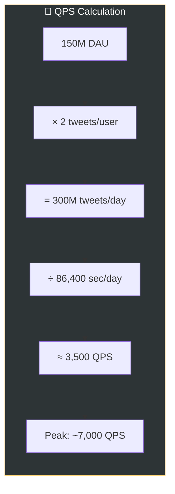
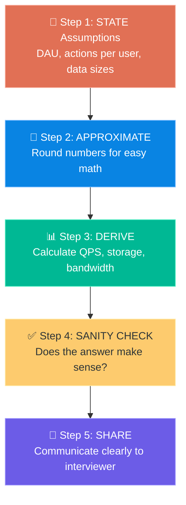

# Chapter 2: Back-of-the-Envelope Estimation

> **Core Idea:** In a system design interview, sometimes you are asked to estimate system
> capacity or performance requirements using a **back-of-the-envelope estimation**. This means
> doing rough calculations using **thought experiments** and **common performance numbers**
> to get a good feel for which design will meet your requirements.

---

## 🧠 What Does "Back-of-the-Envelope" Mean?

Imagine you're at a coffee shop ☕ and someone asks *"Can our system handle 1 million users?"*
You don't have a computer. You grab a **napkin** (or the back of an envelope ✉️) and start
doing rough math with rounded numbers to get an **approximate answer**.

> **It's NOT about being exact.** It's about getting the **right order of magnitude**
> (are we talking GBs or TBs? Hundreds or millions of requests?).

### Why is this important?
- Helps you **evaluate different design options** with numbers
- Shows the interviewer your **analytical thinking**
- Prevents you from building something that's **10x over-engineered or 10x under-powered**
- **Jeff Dean** (Google Senior Fellow) recommends this as an essential skill

---

## 1️⃣ Power of Two — The Foundation of All Calculations

In computing, everything is built on **powers of 2**. You MUST know these by heart.

### 📊 The Complete Table:

| Power | Exact Value | Approx. Value | Unit Name | Common Name |
|---|---|---|---|---|
| 2¹⁰ | 1,024 | ~1 Thousand | 1 KB (Kilobyte) | **Kilo** |
| 2²⁰ | 1,048,576 | ~1 Million | 1 MB (Megabyte) | **Mega** |
| 2³⁰ | 1,073,741,824 | ~1 Billion | 1 GB (Gigabyte) | **Giga** |
| 2⁴⁰ | 1,099,511,627,776 | ~1 Trillion | 1 TB (Terabyte) | **Tera** |
| 2⁵⁰ | ~1.13 × 10¹⁵ | ~1 Quadrillion | 1 PB (Petabyte) | **Peta** |

### 🧠 How to Remember This:

```
Think of it as a staircase — each step is 1024× bigger:

 1 PB   ← Entire Netflix library
 /
1 TB    ← Your hard drive
 /
1 GB    ← A movie file
 /
1 MB    ← A high-res photo
 /
1 KB    ← A short email
 /
1 Byte  ← A single character ('A')
 /
1 Bit   ← A single 0 or 1
```

### 🍕 Real-Life Analogies:

| Unit | Real-Life Equivalent |
|---|---|
| **1 Byte** (8 bits) | A single character like 'A' or '7' |
| **1 KB** (1024 bytes) | A short text message or a very small email |
| **1 MB** (1024 KB) | A high-quality photo, or a 1-minute MP3 song |
| **1 GB** (1024 MB) | A full-length HD movie, or ~1000 books |
| **1 TB** (1024 GB) | ~500 hours of HD video, or ~250,000 photos |
| **1 PB** (1024 TB) | Half of all US research libraries combined |

### 💡 Quick Mental Math Trick:
> **Every 10 powers of 2 ≈ multiply by 1000**
> - 2¹⁰ ≈ 1K (Thousand)
> - 2²⁰ ≈ 1M (Million)
> - 2³⁰ ≈ 1G (Billion)
> - 2⁴⁰ ≈ 1T (Trillion)

---

## 2️⃣ Latency Numbers Every Programmer Should Know ⏱️

These are the **speed benchmarks** of computing. Originally compiled by **Jeff Dean** at Google.
These numbers tell you **how fast different operations are**.

### 📊 The Table (2020 Approximations):

| Operation | Time | Human Analogy |
|---|---|---|
| **L1 cache reference** | 0.5 ns | Blinking your eye 👁️ |
| **Branch mispredict** | 5 ns | Snapping your fingers |
| **L2 cache reference** | 7 ns | Snapping your fingers |
| **Mutex lock/unlock** | 100 ns | Taking a breath |
| **Main memory (RAM) reference** | 100 ns | Taking a breath |
| **Compress 1KB with Zippy** | 10 μs (10,000 ns) | Drinking a sip of water 💧 |
| **Send 2KB over 1 Gbps network** | 20 μs | Drinking a sip of water |
| **Read 1 MB sequentially from memory** | 250 μs | Stretching your arms 🙆 |
| **Round trip within same datacenter** | 500 μs | Standing up from your chair |
| **Disk seek** | 10 ms (10,000 μs) | Walking to the fridge 🚶 |
| **Read 1 MB sequentially from network** | 10 ms | Walking to the fridge |
| **Read 1 MB sequentially from disk** | 30 ms | Making a cup of coffee ☕ |
| **Send packet CA → Netherlands → CA** | 150 ms | Going to the store 🏪 |

### 📐 Time Unit Conversions (MUST KNOW):

```
1 second (s)        = 1,000 milliseconds (ms)
1 millisecond (ms)  = 1,000 microseconds (μs)
1 microsecond (μs)  = 1,000 nanoseconds (ns)

So:
1 second = 1,000 ms = 1,000,000 μs = 1,000,000,000 ns
```

### Visualizing the Speed Differences:

```
FAST ⚡━━━━━━━━━━━━━━━━━━━━━━━━━━━━━━━━━━━━━━━━━━━━━━━━━━━━━━ SLOW 🐌

L1 Cache     RAM      SSD       Network     Disk Seek    Cross-continent
0.5 ns      100 ns    ~150 μs    10 ms       10 ms         150 ms
 │            │          │         │           │              │
 ▼            ▼          ▼         ▼           ▼              ▼
[Instant]  [Fast]   [Notable]  [Visible]  [Noticeable]   [Waiting...]
```

### 🔑 Key Takeaways from These Numbers:

> **These are the 6 Golden Conclusions:**

| # | Conclusion | Why It Matters |
|---|---|---|
| 1 | **Memory is fast, disk is slow** | RAM is ~100x faster than disk. Always prefer in-memory operations |
| 2 | **Avoid disk seeks if possible** | Disk seek = 10ms = VERY slow. Use SSDs or keep data in memory |
| 3 | **Simple compression is fast** | Compress data before sending it over the network — the compression time is negligible |
| 4 | **Compress data before sending over network** | Sending compressed data is faster than sending raw data, even with compression overhead |
| 5 | **Data centers are usually in different regions** | Cross-region round trip = ~150ms. Minimize cross-DC communication |
| 6 | **Sequential reads are much faster than random reads** | For both disk and memory, reading data sequentially is orders of magnitude faster |

### 🍕 The "Trip Duration" Analogy:

Imagine each operation as a **trip**:

```
┌────────────────────────────────────────────────────────────────────┐
│                                                                    │
│  L1 Cache    = Reaching into your pocket                (instant)  │
│  L2 Cache    = Picking up something from your desk     (instant)   │
│  RAM         = Walking to the bookshelf in your room    (1 sec)    │
│  SSD Read    = Walking to the kitchen                   (15 sec)   │
│  Disk Seek   = Driving to the local library             (16 min)   │
│  Network     = Driving to the next city                 (16 min)   │
│  Disk Read   = Driving to a different state             (50 min)   │
│  Cross-DC    = Flying to another continent              (4 hours)  │
│                                                                    │
│  If L1 cache = 1 second, then Disk seek = ~7.6 YEARS!              │
│                                                                    │
└────────────────────────────────────────────────────────────────────┘
```

> **🤯 Mind-blowing perspective:** If an L1 cache reference took **1 second** of human time,
> then a disk seek would take approximately **7.6 years**, and a cross-continent round trip
> would take **11.5 years**! That's how MASSIVE the speed difference is.

---

## 3️⃣ Availability Numbers — The Nine's of Uptime 🟢

### What is Availability?
**Availability** is the percentage of time a system is operational and accessible.
It's measured in **"nines"** — the number of 9s in the percentage.

Most services aim for **99% to 99.999%** availability.

### 📊 The Availability Table:

| Availability % | Name | Downtime / Year | Downtime / Month | Downtime / Week | Downtime / Day |
|---|---|---|---|---|---|
| 99% | **Two nines** | 3.65 days | 7.31 hours | 1.68 hours | 14.40 min |
| 99.9% | **Three nines** | 8.77 hours | 43.83 min | 10.08 min | 1.44 min |
| 99.99% | **Four nines** | 52.60 min | 4.38 min | 1.01 min | 8.64 sec |
| 99.999% | **Five nines** | 5.26 min | 26.30 sec | 6.05 sec | 864.0 ms |
| 99.9999% | **Six nines** | 31.56 sec | 2.63 sec | 604.8 ms | 86.4 ms |

### 🍕 Real-World SLAs (Service Level Agreements):

| Service | Typical SLA |
|---|---|
| AWS EC2 | 99.99% (Four nines) |
| Google Cloud | 99.95% - 99.99% |
| Stripe (Payments) | 99.99%+ |
| Most web apps | 99.9% (Three nines) |
| Pacemaker / Life-critical systems | 99.9999% (Six nines) |

### 🔑 Key Insight:

```
Going from 99.9% → 99.99% looks like a tiny change (0.09%)
But it means reducing downtime from 8.77 HOURS/year to 52 MINUTES/year.

That's a ~10x improvement!

Each additional "nine" is 10x harder and 10x more expensive to achieve.
```

### How to Calculate Downtime:

```
Downtime = Total Time × (1 - Availability)

Example: 99.99% availability per year
= 365 days × 24 hours × 60 min × (1 - 0.9999)
= 525,600 min × 0.0001
= 52.56 minutes of downtime per year
```

### SLA Math with Multiple Components:

If your system has components in **series** (all must work), multiply their availabilities:

```
Overall Availability = Component1 × Component2 × Component3 × ...

Example:
  Web Server: 99.9%
  Database:   99.9%
  Cache:      99.9%

  System = 0.999 × 0.999 × 0.999 = 0.997 = 99.7%

  ⚠️ Each component REDUCES overall availability!
     3 components at 99.9% each = only 99.7% system availability
```

> **💡 Tip:** This is why **redundancy** matters. Having backup components
> (load balancers, replicas) INCREASES availability, while having more
> serial components DECREASES it.

---

## 4️⃣ Commonly Used Numbers for Estimation 📏

### Data Size Estimates:

| Data Type | Approximate Size |
|---|---|
| A single ASCII character | 1 byte |
| A Unicode character (UTF-8 avg) | 2-4 bytes |
| A short tweet/message (140 chars) | ~140 bytes |
| A metadata record (user profile) | ~1 KB |
| A high-res JPEG photo | ~2-5 MB |
| A 1-minute video (SD) | ~25 MB |
| A 1-minute video (HD) | ~150 MB |
| A 1-minute video (4K) | ~400 MB |

### Traffic / Scale Estimates:

| Metric | Quick Approximation |
|---|---|
| Seconds in a day | ~86,400 ≈ **~100,000 (10⁵)** |
| Seconds in a year | ~31.5 million ≈ **~3 × 10⁷** |
| Daily Active Users (DAU) → QPS | DAU × (avg queries per user) / 86,400 |
| Peak QPS | Usually **2x to 5x** the average QPS |

### 💡 The Magic Number: 86,400

```
Seconds in a day:
= 24 hours × 60 minutes × 60 seconds
= 86,400 seconds

For quick math, just round to 100,000 (10⁵)
This makes division MUCH easier!

Example: 100 million requests per day
QPS = 100,000,000 / 100,000 = 1,000 QPS (simple!)
Actual: 100,000,000 / 86,400 ≈ 1,157 QPS (close enough!)
```

---

## 5️⃣ Example: Estimate Twitter QPS and Storage 🐦

This is the kind of estimation you'd do in an interview. Let's walk through it step by step.

### Assumptions:
- **300 million** monthly active users (MAU)
- **50%** of users use Twitter daily → **150 million DAU**
- Each user posts **2 tweets per day** on average
- **10%** of tweets contain media (photos/videos)
- Data is stored for **5 years**

### Step 1: Estimate QPS (Queries Per Second)

```
Daily tweets = 150 million DAU × 2 tweets/user = 300 million tweets/day

QPS = 300,000,000 / 86,400
    ≈ 300,000,000 / 100,000    (using our quick approximation)
    ≈ 3,000 QPS (write)

Peak QPS = 2 × Average QPS = ~6,000 QPS
```



### Step 2: Estimate Storage (for tweets)

```
Tweet text size:
  tweet_id        = 64 bytes
  text            = 140 bytes
  user_id         = 64 bytes
  timestamp       = 8 bytes
  metadata        = ~24 bytes
  ─────────────────────────
  Total per tweet ≈ 300 bytes (let's round to simplify)


Daily text storage:
= 300 million tweets × 300 bytes
= 90,000,000,000 bytes
= 90 GB per day (just text!)

Media storage (10% of tweets have media):
= 300 million × 10% × 3 MB (avg photo/video)
= 30 million × 3 MB
= 90,000,000 MB
= 90 TB per day (media dominates storage!)
```

### Step 3: Storage for 5 Years

```
Text:  90 GB/day  × 365 × 5 = ~164 TB over 5 years
Media: 90 TB/day  × 365 × 5 = ~164 PB over 5 years

Total ≈ ~164 PB (media is 99.9% of storage!)
```

### 📊 Summary of Twitter Estimation:

| Metric | Value |
|---|---|
| DAU | 150 million |
| Tweets per day | 300 million |
| Average Write QPS | ~3,500 |
| Peak Write QPS | ~7,000 |
| Daily text storage | ~90 GB |
| Daily media storage | ~90 TB |
| 5-year text storage | ~164 TB |
| 5-year media storage | ~164 PB |

> **🔑 Key Insight:** Media storage **absolutely dominates** text storage.
> This is why companies like Twitter invest heavily in **CDNs, object storage (S3),
> and media compression**.

---

## 6️⃣ Step-by-Step Framework for ANY Estimation 📐

Use this **framework** every time you need to do back-of-the-envelope estimation:

### The SADSS Framework:



### Detailed Steps:

#### Step 1: STATE your assumptions clearly
- How many users? (MAU, DAU)
- How many actions per user per day?
- What's the size of each data item?
- What's the read-to-write ratio?

#### Step 2: APPROXIMATE with round numbers
- Use powers of 2 and 10 to simplify
- 86,400 ≈ 100,000
- Don't worry about precision — focus on **order of magnitude**

#### Step 3: DERIVE the key metrics
- **QPS** = total requests / seconds in a day
- **Storage** = data size × number of items × retention period
- **Bandwidth** = QPS × average data size per request
- **Memory for cache** = QPS × data size × cache duration

#### Step 4: SANITY CHECK
- Does the number feel right?
- Compare with known systems (Google: millions QPS, startup: hundreds QPS)
- If you get 1 billion QPS for a startup — something is wrong!

#### Step 5: SHARE your work
- Write down the assumptions
- Label your units (GB, TB, QPS)
- Show your calculation steps

---

## 7️⃣ Practice Problems (With Solutions) 🏋️

### Practice 1: Estimate YouTube Storage

**Assumptions:**
- 500 hours of video uploaded per minute (real stat!)
- Average video quality: 720p
- 1 minute of 720p ≈ 50 MB
- Store videos for eternity (no deletion)

**Solution:**
```
Videos per day:
= 500 hours/minute × 60 min/hour × 24 hours
= 720,000 hours of video per day

Storage per day:
= 720,000 hours × 60 min/hour × 50 MB/min
= 720,000 × 3,000 MB
= 2,160,000,000 MB
= 2,160 TB ≈ ~2 PB per day!

Per year: 2 PB × 365 ≈ 730 PB ≈ ~0.7 Exabytes/year!
```

### Practice 2: Estimate WhatsApp Message QPS

**Assumptions:**
- 2 billion MAU, 1.5 billion DAU
- Each user sends ~50 messages/day

**Solution:**
```
Total messages/day = 1.5 billion × 50 = 75 billion messages/day

QPS = 75,000,000,000 / 86,400
    ≈ 75,000,000,000 / 100,000
    ≈ 750,000 QPS

Peak QPS ≈ 750,000 × 3 = ~2.25 million QPS!

Average message size ≈ 100 bytes (text)
Daily storage = 75 billion × 100 bytes = 7.5 TB/day (text only)
```

### Practice 3: Estimate Instagram Photo Storage

**Assumptions:**
- 500 million DAU
- 10% of users upload a photo daily
- Average photo size: 3 MB
- Store for 10 years

**Solution:**
```
Photos per day = 500M × 10% = 50 million photos/day

Daily storage = 50 million × 3 MB = 150,000,000 MB = 150 TB/day

10-year storage = 150 TB × 365 × 10 = 547,500 TB ≈ ~548 PB

Note: Multiple resolutions stored (thumbnail, medium, original)
Actual storage ≈ 548 PB × 3 versions ≈ ~1.6 Exabytes!
```

---

## 8️⃣ Common Estimation Formulas — Cheat Sheet 📋

### 🔧 The Essential Formulas:

```
┌─────────────────────────────────────────────────────────────────────┐
│                                                                     │
│  QPS (Queries Per Second):                                          │
│  ──────────────────────────                                         │
│  QPS = DAU × (queries per user per day) / 86,400                    │
│  Peak QPS = QPS × 2  (or × 3 for spiky workloads)                   │
│                                                                     │
│  ─────────────────────────────────────────────────────────────────  │
│                                                                     │
│  Storage:                                                           │
│  ──────────                                                         │
│  Daily Storage = DAU × (% active) × (data per action) × (actions)   │
│  Total Storage = Daily Storage × 365 × years                        │
│                                                                     │
│  ─────────────────────────────────────────────────────────────────  │
│                                                                     │
│  Bandwidth:                                                         │
│  ──────────                                                         │
│  Bandwidth = QPS × (avg response size)                              │
│  Express in: Mbps or Gbps (bits per second)                         │
│                                                                     │
│  ─────────────────────────────────────────────────────────────────  │
│                                                                     │
│  Cache Memory:                                                      │
│  ─────────────                                                      │
│  Cache = QPS × (avg data size) × (cache duration in seconds)        │
│  Rule of thumb: Cache the top 20% (Pareto Principle: 80/20 rule)    │
│  → Cache memory = 0.2 × Daily data × avg data size                  │
│                                                                     │
│  ─────────────────────────────────────────────────────────────────  │
│                                                                     │
│  Servers Needed:                                                    │
│  ───────────────                                                    │
│  Servers = Peak QPS / (QPS capacity per server)                     │
│  Typical server handles: 500-1000 QPS (web), 50-100 QPS (DB)        │
│                                                                     │
└─────────────────────────────────────────────────────────────────────┘
```

### 🔢 Handy Conversion Quick Reference:

| From | To | Multiply By |
|---|---|---|
| GB/day → TB/year | | × 0.365 |
| million/day → QPS | | ÷ 86,400 (≈ ÷ 100K) |
| Bytes/sec → Mbps | | × 8 / 1,000,000 |
| MB → Bytes | | × 1,000,000 (≈ 10⁶) |
| GB → MB | | × 1,000 (≈ 10³) |

---

## 9️⃣ Common Mistakes to Avoid ⚠️

| Mistake | Why It's Bad | Fix |
|---|---|---|
| **Being too precise** | Wasting time calculating exact decimals | Round! Use powers of 2 and 10 |
| **Forgetting units** | "The answer is 500" → 500 what? | Always label: 500 QPS, 500 GB, etc. |
| **Not stating assumptions** | Interviewer can't follow your logic | Say them out loud BEFORE calculating |
| **Mixing up bits and bytes** | 1 byte = 8 bits. Bandwidth is in bits! | Remember: **B**ig **B**yte, small **b**it |
| **Ignoring peak traffic** | Systems must handle peaks, not averages | Peak ≈ 2-5× average |
| **Forgetting about read vs write** | Reads are usually 10-100× more than writes | State your read-to-write ratio |
| **Not considering media** | Text is tiny; media dominates storage | Always estimate media storage separately |

---

## 🔟 Tips from the Book (Alex Xu's Advice) 💡

> **1. Rounding and Approximation**
> - Don't try to get exact results. Precision is NOT the goal
> - Round to nearest power of 10 or 2 for simplicity
> - Example: 99,987 / 9.1 → just say 100,000 / 10 = 10,000

> **2. Write Down Your Assumptions**
> - Before calculating, list all assumptions clearly
> - This shows structured thinking and lets the interviewer correct you early

> **3. Label Your Units**
> - ALWAYS write units next to numbers
> - 5 → 5 what? **5 MB/s? 5 QPS? 5 million users?**
> - Ambiguity causes confusion and errors

> **4. Commonly Asked Estimations**
> - QPS (Queries Per Second)
> - Peak QPS
> - Storage requirements
> - Cache requirements
> - Number of servers needed

---

## ❓ Interview Quick-Fire Questions

**Q1: How many seconds are in a day?**
> 86,400 seconds. For quick math, round to ~100,000 (10⁵).

**Q2: If you have 100M DAU and each user makes 10 requests/day, what's the QPS?**
> QPS = 100M × 10 / 86,400 ≈ 1 billion / 100K ≈ ~10,000 QPS.
> Peak QPS ≈ 20,000 - 30,000.

**Q3: What does "four nines" availability mean?**
> 99.99% uptime = ~52.6 minutes of downtime per year.

**Q4: Why is media storage much larger than text storage?**
> A tweet text ≈ 300 bytes, but a photo ≈ 3 MB (10,000× larger).
> Even if only 10% of tweets have media, media dominates 99%+ of storage.

**Q5: Should you be precise in back-of-the-envelope estimation?**
> NO! The goal is to get the right ORDER OF MAGNITUDE (is it GB or TB?).
> Round aggressively. Use 10⁵ instead of 86,400.

**Q6: If each component has 99.9% availability and you have 4 serial components, what's overall availability?**
> 0.999⁴ = 0.996 = 99.6% → Downtime increases from 8.77 hours to ~35 hours/year!

**Q7: How do you estimate cache size?**
> Use the 80/20 rule (Pareto Principle): cache the top 20% of hot data.
> Cache size = 0.2 × daily requests × average data size per request.

---

## 🧠 Memory Tricks

### The "PLACE" Acronym for What to Estimate:
> **P**eak QPS
> **L**atency requirements
> **A**vailability (nines)
> **C**ache memory
> **E**stimated storage

### Speed Hierarchy (Fastest → Slowest):
> **"Lucy's Cat Really Dislikes Napping"**
> **L1** cache → **C**PU L2 → **R**AM → **D**isk → **N**etwork (cross-DC)

### Powers of 2:
> **"King Mega Gave Ten Pets"**
> **K**ilo (2¹⁰) → **M**ega (2²⁰) → **G**iga (2³⁰) → **T**era (2⁴⁰) → **P**eta (2⁵⁰)

### Quick Estimation Process:
```
1. 📝 Write assumptions
2. 🔢 Round everything
3. 📊 Calculate: QPS → Storage → Bandwidth → Cache
4. ✅ Sanity check
5. 📢 Communicate clearly
```

---

## 📋 Complete Quick Reference Card

```
╔══════════════════════════════════════════════════════════════╗
║              ESTIMATION CHEAT SHEET                          ║
╠══════════════════════════════════════════════════════════════╣
║                                                              ║
║  SECONDS IN A DAY     = 86,400 ≈ 10⁵                         ║
║  SECONDS IN A YEAR    = ~31.5M ≈ 3 × 10⁷                     ║
║                                                              ║
║  1 KB = 10³ bytes     1 MB = 10⁶ bytes                       ║
║  1 GB = 10⁹ bytes     1 TB = 10¹² bytes                      ║
║                                                              ║
║  QPS      = DAU × actions ÷ 86,400                           ║
║  Peak QPS = QPS × 2~5                                        ║
║  Storage  = Daily data × 365 × years                         ║
║  Cache    = 20% × daily data  (80/20 rule)                   ║
║  Bandwidth = QPS × response size                             ║
║                                                              ║
║  SPEED:   L1 > L2 > RAM > SSD > Disk > Network > Cross-DC    ║
║                                                              ║
║  99.9%    = 8.77 hours downtime/year                         ║
║  99.99%   = 52.6 minutes downtime/year                       ║
║  99.999%  = 5.26 minutes downtime/year                       ║
║                                                              ║
║  RAM is ~100x faster than Disk                               ║
║  Always compress before sending over network                 ║
║  Media storage >>> Text storage                              ║
║                                                              ║
╚══════════════════════════════════════════════════════════════╝
```

---

> **📖 Previous Chapter:** [← Chapter 1: Scale From Zero To Millions](/HLD/chapter_1/scale_from_zero_to_millions_of_users.md)
>
> **📖 Next Chapter:** [Chapter 3: A Framework for System Design Interviews →](/HLD/chapter_3/a_framework_for_system_design_interviews.md)
