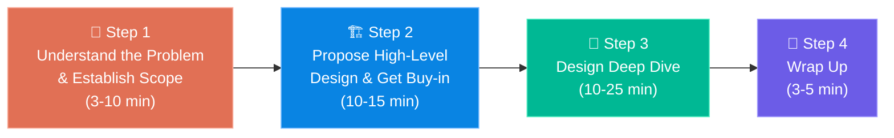
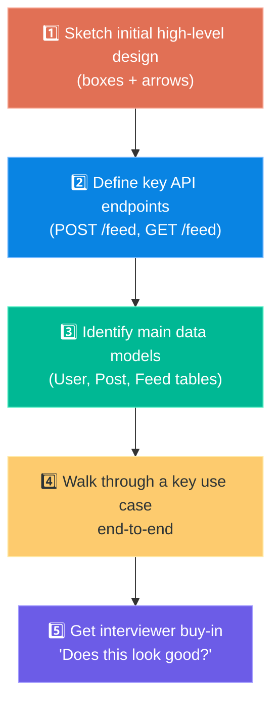
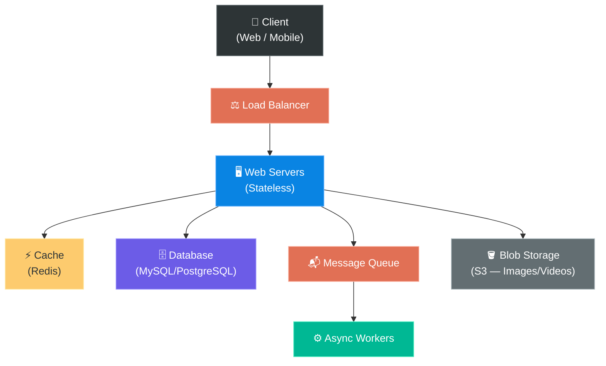
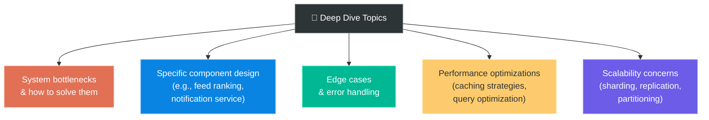
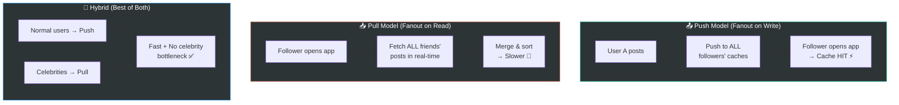
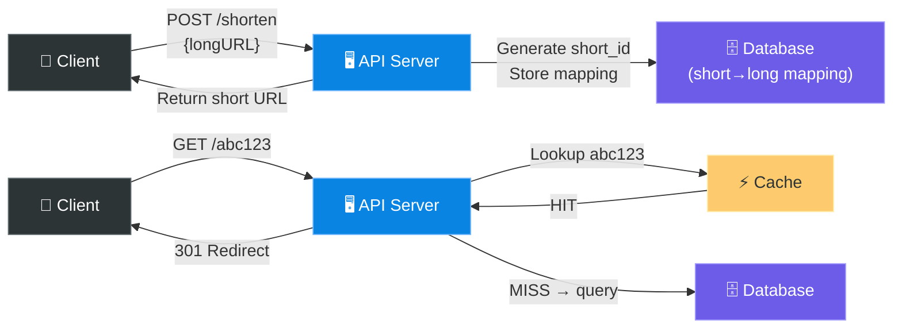
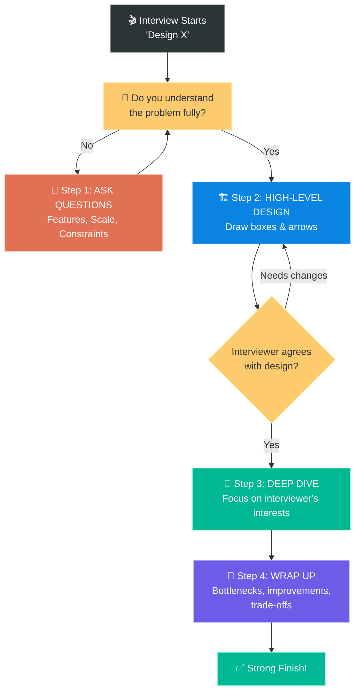

# Chapter 3: A Framework for System Design Interviews

> **Core Idea:** A system design interview is NOT a test with one correct answer.
> It's an **open-ended conversation** where you demonstrate your ability to design
> a system collaboratively. This chapter gives you a **repeatable 4-step framework**
> that works for ANY system design question.

---

## 🧠 First, Let's Understand What the Interview Really Is

### ❌ What It Is NOT:
- It's NOT a coding test
- It's NOT about memorizing architectures
- It's NOT about having ONE perfect answer
- There is **no "correct" answer** — different solutions have different trade-offs

### ✅ What It Actually Is:
- A **simulation** of real-life problem solving
- A conversation to evaluate **how you THINK**
- A test of your ability to **collaborate**, **communicate**, and **navigate ambiguity**
- A way to see if you can **design systems at scale** under uncertainty

### 🍕 Analogy:
Think of it like being an **architect showing a client their dream house**:
- You ask what they want (bedrooms? pool? budget?)
- You sketch a blueprint together
- You zoom into specific rooms for detail
- You discuss trade-offs (bigger kitchen = smaller living room)
- The client (interviewer) is your **collaborator**, not your enemy!

### What Interviewers Are REALLY Evaluating:

| Signal | What They Look For |
|---|---|
| **Communication** | Can you explain complex ideas clearly? |
| **Problem Analysis** | Can you break an ambiguous problem into manageable pieces? |
| **Design Skills** | Can you propose a reasonable high-level design? |
| **Trade-off Analysis** | Can you discuss pros/cons of different approaches? |
| **Depth of Knowledge** | Can you deep dive into specific components? |
| **Collaboration** | Do you treat the interviewer as a teammate? |

> **💡 Red Flag:** A candidate who jumps straight into a solution without asking questions
> gives a **huge red signal**. It shows they make assumptions without understanding requirements.

---

## 🗺️ The 4-Step Framework — Your Battle Plan



### Time Budget (for a 45-minute interview):

```
┌─────────────────────────────────────────────────────────────────┐
│                    45 MINUTE INTERVIEW                          │
├───────────┬──────────────┬─────────────────┬───────────┤
│  Step 1   │    Step 2    │     Step 3      │  Step 4   │
│  3-10 min │   10-15 min  │    10-25 min    │  3-5 min  │
│  SCOPE    │   DESIGN     │    DEEP DIVE    │  WRAP UP  │
│  🎯       │   🏗️         │    🔬           │  🎁       │
└───────────┴──────────────┴─────────────────┴───────────┘
```

---

## 🎯 Step 1: Understand the Problem & Establish Design Scope (3-10 min)

### WHY This Step Matters:

> In a system design interview, **answering quickly is NOT a good thing**.
> Answering without understanding the problem is a **BIG red flag**.
> Slow down. Think deeply. Ask questions.

The question is **intentionally vague**. For example:
- *"Design a news feed system"* — For what platform? What scale? What features?
- *"Design a chat system"* — 1-on-1? Group chat? File sharing? Read receipts?

**Your job:** Convert a vague question into a **well-scoped problem** by asking the right questions.

### 🍕 Analogy:
Imagine someone says *"Build me a vehicle."*
- A bicycle? A car? A truck? A rocket? 🚀
- For how many people?
- What terrain?
- What budget?

If you start building without asking, you might build a bicycle when they wanted a truck!

### What Questions to Ask:

Here's a **universal question checklist** that works for almost ANY system design question:

#### 🔹 Feature Questions:
| Question | Why It Matters |
|---|---|
| What are the **most important features** to build? | Scope — don't try to design everything |
| Who are the **users**? | Affects UI, platform, and priorities |
| How many **users**? (DAU/MAU) | Scale determines architecture choices |
| What **platforms**? (Web, Mobile, Both) | Affects API design, payload format |

#### 🔹 Scale Questions:
| Question | Why It Matters |
|---|---|
| How many **DAU** (Daily Active Users)? | Drives QPS, server count |
| What's the **read-to-write ratio**? | Read-heavy? Cache aggressively. Write-heavy? Focus on write path |
| What's the expected **data volume**? | Storage decisions (SQL, NoSQL, blob store) |
| Is the traffic **bursty** or **steady**? | Queue design, auto-scaling needs |

#### 🔹 Technical Constraints:
| Question | Why It Matters |
|---|---|
| What's the **existing tech stack**? | Existing company constraints |
| Are there **latency requirements**? | Real-time (<100ms) vs batch processing |
| What **availability** do we need? | 99.9% vs 99.99% — affects redundancy |
| Do we need to handle **international** traffic? | Multi-DC, CDN, localization |

### 📋 Example: "Design a News Feed System"

**Questions you should ask:**
```
You:  "Is this for mobile, web, or both?"
Int:  "Both."

You:  "What are the important features?"
Int:  "A user can publish a post and see friends' posts on the news feed."

You:  "Is the news feed sorted by chronological order or by some ranking?"
Int:  "Sorted by reverse chronological order for simplicity."

You:  "How many friends can a user have?"
Int:  "Up to 5,000."

You:  "What's the traffic volume? How many DAU?"
Int:  "10 million DAU."

You:  "Can the feed contain images, videos, or just text?"
Int:  "Both text and media — images and videos."
```

**Now you have a CLEAR scope:**
- Web + Mobile
- Publish posts + view feed
- Reverse chronological order
- Max 5,000 friends
- 10M DAU
- Support images and videos

> **💡 Pro Tip:** Write down the requirements as you ask. This shows organization and
> prevents you from forgetting them later.

---

## 🏗️ Step 2: Propose High-Level Design & Get Buy-in (10-15 min)

### Goal: Lay out a **blueprint** of the system

In this step, you:
1. Develop a **high-level design** and reach agreement with the interviewer
2. Draw **box diagrams** showing key components (clients, APIs, servers, data stores, etc.)
3. Do **back-of-the-envelope calculations** to verify your design can handle the scale

### 🔑 Key Principles:

| Principle | Description |
|---|---|
| **Collaborate** | Treat the interviewer as your teammate. Ask "Does this approach make sense?" |
| **Start simple** | Begin with the simplest design that works, then iterate |
| **Draw diagrams** | Visuals make everything clearer — use a whiteboard or shared doc |
| **Sketch APIs** | Define the main API endpoints (even roughly) |
| **Don't over-engineer** | At this stage, don't worry about edge cases or deep optimizations |

### The Process:



### 1️⃣ Sketch the High-Level Design

Draw the key components and how they connect:



### 2️⃣ Sketch Key API Endpoints

```
POST /v1/feed/publish
  → body: { user_id, content, media_urls }
  → Publishes a new post

GET /v1/feed
  → params: user_id, page_token, page_size
  → Returns the news feed for a user

POST /v1/friendship
  → body: { user_id, friend_id }
  → Adds a friend
```

### 3️⃣ Identify Data Model (roughly)

```
User Table:       { user_id, name, email, created_at }
Post Table:       { post_id, user_id, content, media_url, created_at }
Friendship Table: { user_id, friend_id, created_at }
Feed Cache:       { user_id → [post_id_1, post_id_2, ...] }
```

### 4️⃣ Walk Through a Use Case

> "Let me walk through what happens when User A publishes a post..."
> 1. Client sends POST to /v1/feed/publish
> 2. Load balancer routes to a web server
> 3. Web server validates the request & stores the post in DB
> 4. If there's media, upload to blob storage (S3)
> 5. Web server publishes a "new post" event to the message queue
> 6. Feed generation workers consume the event and update followers' feed caches
> 7. When User B opens their feed, GET /v1/feed returns cached feed data

### 5️⃣ Get Interviewer Buy-In

> **SAY:** *"Does this high-level approach look reasonable to you?
> Are there any areas you'd like me to focus on?"*

This is CRUCIAL. The interviewer might:
- ✅ Agree → move on to deep dive
- 🔄 Redirect → "I'd like you to focus on the feed generation" → adjust your focus
- ❓ Challenge → "What happens at 100M users?" → great, now you know what to deep dive

### 🍕 Analogy:
This step is like showing a **house blueprint** to a client:
- "Here's the kitchen, here's the bedroom, here's the living room"
- "The plumbing runs here, the wiring goes there"
- You're NOT picking paint colors or tiles yet (that's Step 3)
- The client says "Looks good, but I really care about the kitchen — let's discuss that more"

---

## 🔬 Step 3: Design Deep Dive (10-25 min)

### Goal: Zoom into **specific components** and discuss them in detail

By now, you should have:
- ✅ Agreed on the overall design with the interviewer
- ✅ Identified which areas to focus on (the interviewer usually hints at this!)

### 🔑 What to Deep Dive Into:

The interviewer will usually guide you. But typical deep dive topics include:



### How to Approach the Deep Dive:

| Do This | Don't Do This |
|---|---|
| Focus on areas the **interviewer cares about** | Don't ramble about everything equally |
| Discuss **trade-offs** (pros vs cons) | Don't present one approach as "the only way" |
| Show **breadth AND depth** | Don't go so deep into one thing that you run out of time |
| Explain your **reasoning** | Don't just say "I'd use Redis" — explain WHY |
| Use **data and numbers** to back decisions | Don't just hand-wave |

### 📋 Example Deep Dive: "Feed Publishing — Push vs Pull"

This is a classic deep dive for news feed design:

#### Model 1: Fanout on Write (Push Model)
```
When User A posts:
  → IMMEDIATELY push the post to ALL followers' feed caches
  → Followers open app → feed is pre-computed ⚡ (fast read!)

Pros: ✅ Feed is pre-computed, reads are super fast
Cons: ❌ If user has 10M followers (celebrity), writing to 10M caches is slow
      ❌ Wasted resources if follower is inactive (never reads their feed)
```

#### Model 2: Fanout on Read (Pull Model)
```
When User B opens their feed:
  → System PULLS posts from all friends' timelines on-the-fly
  → Merges and sorts them in real-time

Pros: ✅ No wasted work for inactive users
      ✅ No celebrity problem
Cons: ❌ Feed generation is slow (fetching from many sources)
      ❌ Higher read latency
```

#### Model 3: Hybrid (What most real systems use!)
```
For normal users:  Use Push model (fanout on write)
For celebrities:   Use Pull model (fanout on read)

Why? A celebrity with 100M followers would take too long to push.
     Instead, fetch celebrity posts at READ time and merge with
     the pre-computed feed.
```



### 🍕 Analogy:
- **Push** = A newspaper delivered to your doorstep every morning (pre-computed)
- **Pull** = Going to the library and collecting articles from every journalist yourself (on-demand)
- **Hybrid** = Regular news delivered to your door + you go fetch special articles from famous journalists when you want them

> **💡 This is exactly the kind of trade-off discussion interviewers LOVE.**
> Showing you can analyze pros/cons and pick the right approach for the right scenario
> is more impressive than any "perfect" answer.

---

## 🎁 Step 4: Wrap Up (3-5 min)

### Goal: Leave a **strong final impression**

The interviewer might ask follow-up questions or ask you to discuss additional points.
**Don't just stop — use this time wisely!**

### What to Do in the Wrap-Up:

#### 1️⃣ Summarize Your Design
> *"Let me quickly recap: We have a load-balanced web tier, a push-based feed service
> with hybrid handling for celebrities, Redis for feed caching, and S3 for media storage."*

#### 2️⃣ Identify Bottlenecks & Improvements
Show self-awareness by pointing out what could be improved:

| Potential Discussion | Example |
|---|---|
| **System bottlenecks** | "The database could become a bottleneck — we might need sharding" |
| **Error handling** | "What happens if the message queue goes down? We'd need dead letter queues" |
| **Future scale** | "If we go from 10M to 100M users, we'd need multi-DC replication" |
| **Monitoring** | "I'd add metrics on feed generation latency and cache hit ratio" |

#### 3️⃣ Discuss Potential Extensions
- What if we add analytics?
- What about internationalization?
- How would we handle spam/abuse?
- What about GDPR and data privacy?

#### 4️⃣ Recap the Trade-offs

> *"We chose push over pull for normal users because it gives faster reads,
> but it trades off write amplification. For celebrities, we switch to pull
> to avoid the fan-out problem."*

### What NOT to Do:

| ❌ Don't | Why |
|---|---|
| Say "I'm done" and go silent | You lose the chance to show more knowledge |
| Insist your design is perfect | No design is perfect — show self-awareness |
| Start redesigning everything | You don't have time — just mention improvements |
| Bring up completely new topics | Stay focused on what you've built |

### 🍕 Analogy:
The wrap-up is like the **final scene of a movie** — it should tie everything together
and leave the audience (interviewer) satisfied. A strong ending is memorable!

---

## ✅ Do's and Don'ts — The Complete List

### ✅ DO:

| # | Do | Why |
|---|---|---|
| 1 | **Ask for clarification** | Never assume. The question is intentionally vague |
| 2 | **Understand the requirements** | Know what you're building before you build it |
| 3 | **Communicate!** | Say what you're thinking. The interviewer can't read your mind |
| 4 | **Suggest multiple approaches** | Show you can think of alternatives, then pick one with reasoning |
| 5 | **Design with the interviewer** | Treat them as a teammate, not an examiner |
| 6 | **Start with the most important things first** | Don't spend 20 min on a minor component |
| 7 | **State your assumptions** | "I'm assuming 10M DAU and a 10:1 read-write ratio" |
| 8 | **Do back-of-the-envelope estimation** | Numbers make your design credible |
| 9 | **Discuss trade-offs** | Every choice has pros and cons — acknowledge them |
| 10 | **Think out loud** | Let the interviewer follow your thought process |

### ❌ DON'T:

| # | Don't | Why |
|---|---|---|
| 1 | **Jump into solution without clarifying** | 🚩 Biggest red flag! Shows you make assumptions |
| 2 | **Go into too much detail on a single component** | You'll run out of time |
| 3 | **Be silent** | The interviewer needs to hear your thought process |
| 4 | **Think you're done when you're not** | Always wrap up with bottlenecks & improvements |
| 5 | **Be unprepared on common topics** | Know basics: LB, cache, DB, queues, CDN |
| 6 | **Give up too easily** | If stuck, talk through it. Ask for hints. That's normal! |
| 7 | **Think the interview is an exam** | It's a **collaborative design session** |
| 8 | **Over-engineer from the start** | Start simple, then add complexity as needed |
| 9 | **Ignore interviewer hints** | If they say "What about X?", they WANT you to discuss X |
| 10 | **Forget about non-functional requirements** | Scalability, availability, latency, consistency |

---

## 🔄 The Framework Applied — Full Walk-Through Example

Let's apply all 4 steps to **"Design a URL Shortener (like bit.ly)"**:

### Step 1: Understand & Scope (5 min)
```
You:  "What are the core features?"
Int:  "Shorten a URL, redirect to original URL."

You:  "What's the traffic volume?"
Int:  "100 million URLs generated per day."

You:  "How long should shortened URLs be valid?"
Int:  "As long as possible — let's say 10 years."

You:  "Any URL format requirements?"
Int:  "As short as possible."

You:  "Can users customize the short URL?"
Int:  "No, auto-generated is fine."

REQUIREMENTS SUMMARY:
- Core: Shorten URLs + redirect
- 100M new URLs / day
- 10 years retention
- Short as possible
- Read-heavy (people click links more than they create them)
```

### Step 2: High-Level Design (10 min)


### Step 3: Deep Dive (15 min)
```
Deep dive into:
1. How to generate unique short IDs? (hash? counter? base62?)
2. Hash collision handling
3. Database choice (SQL vs NoSQL — key-value lookup → NoSQL fits well)
4. Cache strategy (read-heavy → cache aggressively)
5. 301 vs 302 redirect (301 = permanent, browser caches it; 302 = temporary)
```

### Step 4: Wrap Up (3 min)
```
"If we had more time, I'd explore:
 - Analytics (track click counts, geography, devices)
 - Rate limiting (prevent abuse)
 - URL expiration and cleanup
 - API authentication"
```

---

## 📊 The Framework as a Decision Tree



---

## 🧰 Universal Components Toolkit

Every system design uses some combination of these building blocks.
**Know what each does and WHEN to use it:**

| Component | Purpose | When to Use |
|---|---|---|
| **Load Balancer** | Distribute traffic across servers | Multiple web servers |
| **Web Servers** | Handle API requests | Always |
| **Database (SQL)** | Structured data with relationships | Need JOINs, ACID, complex queries |
| **Database (NoSQL)** | Flexible schema, fast key-value | Simple lookups, high scale, unstructured data |
| **Cache (Redis)** | Speed up frequent reads | Read-heavy workloads |
| **CDN** | Serve static files globally | Images, videos, CSS, JS |
| **Message Queue** | Async processing | Heavy background tasks, decoupling |
| **Blob Storage (S3)** | Store files (images, videos) | Any media/file storage |
| **Search Index (ES)** | Full-text search | Search functionality |
| **Notification Service** | Push notifications, emails | Alerts, engagement |
| **Rate Limiter** | Prevent abuse | Public APIs, login attempts |
| **Monitoring** | Track health and performance | Always in production |

---

## ❓ Interview Quick-Fire Questions

**Q1: What is the first thing you should do when given a system design question?**
> Ask clarifying questions! NEVER jump into a solution. Understand the scope,
> features, scale, and constraints first.

**Q2: How should you treat the interviewer?**
> As a **teammate and collaborator**, not an examiner. Work together to design
> the system. Ask "Does this approach make sense?" regularly.

**Q3: What are the 4 steps of the framework?**
> 1. Understand & scope (3-10 min)
> 2. High-level design & buy-in (10-15 min)
> 3. Deep dive (10-25 min)
> 4. Wrap up (3-5 min)

**Q4: What should you do in the wrap-up?**
> Summarize your design, identify bottlenecks, suggest improvements,
> discuss trade-offs, and mention what you'd add with more time
> (monitoring, analytics, error handling, etc.)

**Q5: What's the biggest red flag in a system design interview?**
> Jumping into a solution without asking any questions. It shows the
> candidate makes assumptions and doesn't understand requirements.

**Q6: Should you memorize system designs?**
> NO! Understand the **building blocks** (LB, cache, DB, queue, CDN)
> and know when to use each one. Then apply them to any problem.

**Q7: What if you get stuck during the interview?**
> Don't go silent! Talk through your thought process. Ask for hints.
> The interviewer WANTS you to succeed — they're your collaborator.

---

## 🧠 Memory Tricks

### The 4 Steps as a Story:
> **"Uncle Sam Digs Worms"** 🪱
> **U**nderstand → **S**ketch design → **D**eep dive → **W**rap up

### Or Remember "USDW" — Like U.S. Dollar Winning 💵
> **U** = Understand the problem
> **S** = Sketch high-level design
> **D** = Deep dive into components
> **W** = Wrap up with improvements

### The Do's (Top 5):
> **"CACDS"** — "Collaborative Architects Create Delightful Systems"
> **C**larify → **A**ssume & state → **C**ommunicate → **D**iscuss trade-offs → **S**tart simple

### Time Allocation:
```
Total: ~45 minutes

Step 1:  ██░░░░░░░░░░░░░░░░░░  (~7 min)    — Scope
Step 2:  ░░██████░░░░░░░░░░░░  (~12 min)   — Design
Step 3:  ░░░░░░░░████████████  (~22 min)   — Deep Dive
Step 4:  ░░░░░░░░░░░░░░░░░░██  (~4 min)    — Wrap Up

Key: Most time goes to Steps 2 & 3!
```

---

## 📋 Quick Pocket Reference Card

```
╔══════════════════════════════════════════════════════════════╗
║          SYSTEM DESIGN INTERVIEW FRAMEWORK                   ║
╠══════════════════════════════════════════════════════════════╣
║                                                              ║
║  STEP 1 — SCOPE (3-10 min)                                  ║
║    → Ask: Features? Users? Scale? Constraints?               ║
║    → Write down requirements                                 ║
║                                                              ║
║  STEP 2 — HIGH-LEVEL DESIGN (10-15 min)                      ║
║    → Draw boxes & arrows                                     ║
║    → Define APIs (POST /endpoint, GET /endpoint)             ║
║    → Sketch data model                                       ║
║    → Walk through a use case                                 ║
║    → Get interviewer buy-in!                                 ║
║                                                              ║
║  STEP 3 — DEEP DIVE (10-25 min)                              ║
║    → Focus on what interviewer cares about                   ║
║    → Discuss trade-offs (pros/cons)                          ║
║    → Use numbers (QPS, storage, latency)                     ║
║    → Show depth of knowledge                                 ║
║                                                              ║
║  STEP 4 — WRAP UP (3-5 min)                                  ║
║    → Summarize design                                        ║
║    → Identify bottlenecks                                    ║
║    → Suggest improvements                                    ║
║    → Discuss what-ifs                                        ║
║                                                              ║
║  GOLDEN RULES:                                               ║
║    ✅ NEVER jump into solution without questions             ║
║    ✅ Treat interviewer as teammate                          ║
║    ✅ Think out loud — always communicate                    ║
║    ✅ Discuss trade-offs, not "perfect" answers              ║
║    ✅ Start simple, then add complexity                      ║
║                                                              ║
╚══════════════════════════════════════════════════════════════╝
```

---

> **📖 Previous Chapter:** [← Chapter 2: Back-of-the-Envelope Estimation](/HLD/chapter_2/back_of_the_envelope_estimation.md)
>
> **📖 Next Chapter:** [Chapter 3: Design a Rate Limiter →](/HLD/chapter_4/)
