# Chapter 4: Design a Rate Limiter

> **Core Idea:** In a networked system, a rate limiter is used to **control the rate of traffic**
> sent by a client or a service. If the API request count exceeds the threshold defined by the
> rate limiter, all the excess calls are **blocked**. It's the bouncer at the club door — letting
> in only the right number of people.

---

## 🧠 The Big Picture — Why Do We Need a Rate Limiter?

Imagine you run a popular restaurant. If you let **everyone** in at once, the kitchen would
be overwhelmed, waiters would be overloaded, and the quality of service would **crash**. So
what do you do? You put a **hostess at the door** who controls how many people can enter per hour.

That hostess is your **Rate Limiter**.

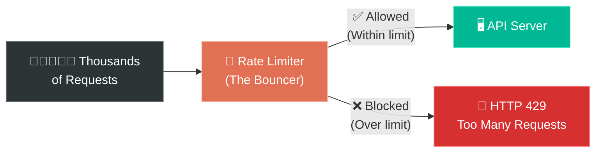

### Real-World Examples of Rate Limiting:

| Service | Rate Limiting Rule | What Happens If Exceeded |
|---|---|---|
| **Twitter/X** | 300 tweets / 3 hours per account | Posting blocked temporarily |
| **Google Docs API** | 300 read requests / minute per user | `HTTP 429` error returned |
| **GitHub API** | 5,000 requests / hour (authenticated) | Requests rejected until reset |
| **Login Pages** | 5 failed attempts / 15 minutes | Account locked temporarily |
| **Stripe** | 100 API calls / second | Excess calls dropped |

---

## 🎯 Step 1: Understand the Problem & Establish Design Scope

Before diving into design, we need to ask the **right questions** (as we learned in Chapter 3!).

### Clarifying Questions to Ask:

```
You:  "Are we designing a client-side or server-side rate limiter?"
Int:  "Server-side API rate limiter."

You:  "Does it throttle based on IP, user ID, or other properties?"
Int:  "It should be flexible — support different rules."

You:  "What's the scale? Are we designing for a startup or large company?"
Int:  "It must handle a large number of requests."

You:  "Will the rate limiter be a separate service or part of the application code?"
Int:  "Up to your design judgment."

You:  "Do we need to inform users who are throttled?"
Int:  "Yes, return appropriate errors."

You:  "Should rate limiting work in a distributed environment (multiple servers)?"
Int:  "Yes."
```

### 📋 Finalized Requirements:

| Requirement | Detail |
|---|---|
| **Accurately limit requests** | Based on configured thresholds (e.g., 5 req/sec) |
| **Low latency** | Must NOT slow down HTTP response times |
| **Use as little memory as possible** | Efficient data structures |
| **Distributed rate limiting** | Shared across multiple servers/processes |
| **Exception handling** | Show clear error to users when throttled |
| **High fault tolerance** | If rate limiter fails, system shouldn't crash |

---

## 🤔 Where to Put the Rate Limiter?

There are three broad options for where to implement rate limiting:

### Option 1: Client-Side

```
❌ Generally NOT reliable
   → Client requests can easily be forged
   → You don't control the client in most cases
   → A malicious actor will bypass client-side limits
```

### Option 2: Server-Side

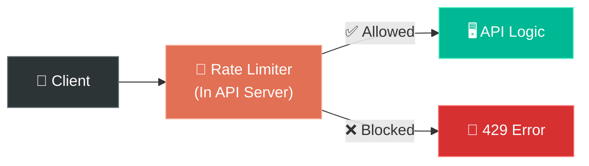

### Option 3: Middleware (API Gateway) ⭐ Most Common


### What is an API Gateway?

An **API Gateway** is a fully managed middleware service that supports:
- ✅ Rate limiting
- ✅ SSL termination
- ✅ Authentication
- ✅ IP whitelisting
- ✅ Serving static content

Cloud providers (AWS API Gateway, Google Cloud Endpoints, Azure API Management) offer this out of the box.

### 🤔 How to Decide Where to Put It?

| Factor | Guidance |
|---|---|
| **Current tech stack** | If you already have an API gateway, add rate limiting there |
| **Build vs Buy** | If you have engineering resources, build your own. Otherwise, use a commercial API gateway |
| **Microservices with API Gateway?** | Rate limiting is usually already built into the gateway |
| **Team bandwidth** | Building your own rate limiter takes time. Outsource if you don't have resources |

> **💡 Key Takeaway:** There's no definitive answer. It depends on your company's technology
> stack, engineering resources, priorities, and goals. All three approaches are valid.

---

## 🏗️ Step 2: High-Level Design

### The Core Idea: How Rate Limiting Works

At its simplest, a rate limiter is a **counter + timer**:

```
For each client/user:
  1. Track how many requests they've made
  2. If counter < limit → ALLOW the request, increment counter
  3. If counter >= limit → REJECT the request (HTTP 429)
  4. Reset counter after the time window expires
```

### Where to Store the Counters?

Database? ❌ Too slow — disk access for every request is unacceptable.

**In-memory cache like Redis!** ✅

| Why Redis? | Explanation |
|---|---|
| **Super fast** | In-memory, sub-millisecond latency |
| **INCR command** | Atomically increments a counter |
| **EXPIRE command** | Auto-delete keys after TTL (time window reset) |
| **Distributed** | Works across multiple servers |

### The Basic Flow:

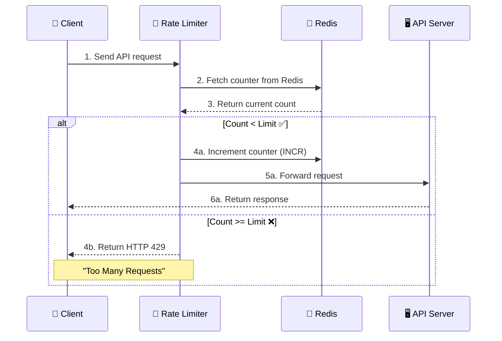

---

## 🧮 Rate Limiting Algorithms — The Heart of the System

There are **5 major algorithms** used in rate limiting. Each has different trade-offs.
Let's understand every single one deeply.

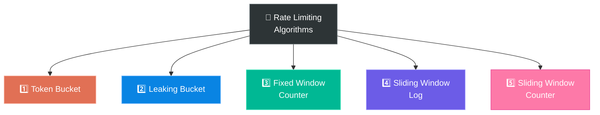

---

### 1️⃣ Token Bucket Algorithm

This is the **most widely used** algorithm. Amazon and Stripe both use it.

#### 🍕 The Water Bottle Analogy:
Imagine you have a **water bottle** (bucket) that holds 4 cups of water (tokens):
- Every second, someone **refills** 2 cups into the bottle (refill rate)
- Every time you take a drink (make a request), **one cup of water is consumed** (one token removed)
- If the bottle is empty → **you can't drink** (request rejected)!
- If the bottle is full and more water is poured → **water overflows** (extra tokens are discarded)

#### How It Works:

```
PARAMETERS:
  - Bucket Size = 4 (max tokens)
  - Refill Rate  = 2 tokens/second

TIME  | ACTION           | TOKENS | RESULT
------+------------------+--------+---------
0.0s  | Bucket starts    |   4    | —
0.1s  | Request #1       |   3    | ✅ Allowed
0.2s  | Request #2       |   2    | ✅ Allowed
0.3s  | Request #3       |   1    | ✅ Allowed
0.4s  | Request #4       |   0    | ✅ Allowed
0.5s  | Request #5       |   0    | ❌ REJECTED (no tokens!)
1.0s  | +2 tokens refill |   2    | — (refilled)
1.1s  | Request #6       |   1    | ✅ Allowed
```

#### Visual Representation:

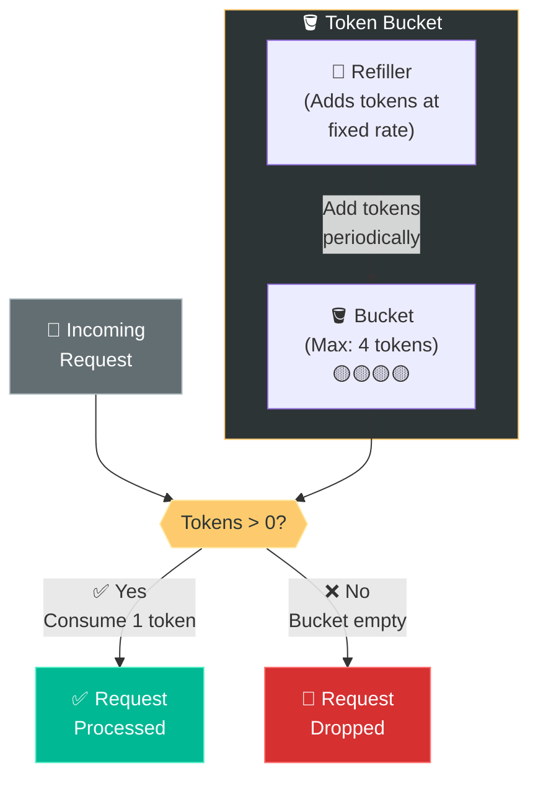

#### How Many Buckets Do We Need?

This depends on your rate-limiting rules:

| Scenario | Buckets Needed |
|---|---|
| **Different limits per API endpoint** | 1 bucket per user per endpoint (e.g., 3 posts/sec, 150 friend requests/day) |
| **Global limit based on IP** | 1 bucket per IP address |
| **System-wide limit** | 1 global bucket shared by all (e.g., max 10,000 req/sec for the entire system) |

#### Pros & Cons:

| ✅ Pros | ❌ Cons |
|---|---|
| Easy to implement | Tuning `bucket size` and `refill rate` can be challenging |
| Memory efficient | Need to find the right balance for your use case |
| Allows **burst** of traffic (up to bucket size) | — |
| Widely used (Amazon, Stripe) | — |

---

### 2️⃣ Leaking Bucket Algorithm

#### 🍕 The Leaky Faucet Analogy:
Imagine a **bucket with a small hole at the bottom**:
- Water (requests) is **poured in from the top** at varying rates
- Water **leaks out from the bottom** at a **constant, fixed rate**
- If too much water is poured → **bucket overflows** → excess water (requests) is discarded!

The key idea: **requests are processed at a fixed outflow rate**, regardless of incoming burst.

#### How It Works:

```
PARAMETERS:
  - Queue Size (Bucket Size) = 4
  - Outflow Rate = 2 requests/second (processed at fixed rate)

INCOMING REQUESTS:
  Request #1 → Added to queue     [R1, _, _, _]     ✅ Queued
  Request #2 → Added to queue     [R1, R2, _, _]    ✅ Queued
  Request #3 → Added to queue     [R1, R2, R3, _]   ✅ Queued
  Request #4 → Added to queue     [R1, R2, R3, R4]  ✅ Queued
  Request #5 → Queue FULL!        [R1, R2, R3, R4]  ❌ DROPPED!

PROCESSING (at constant rate):
  → R1 processed → [R2, R3, R4, _]  (slot opens up)
  → R2 processed → [R3, R4, _, _]
  Request #6 → Added to queue     [R3, R4, R6, _]   ✅ Queued
```

#### Visual Representation:

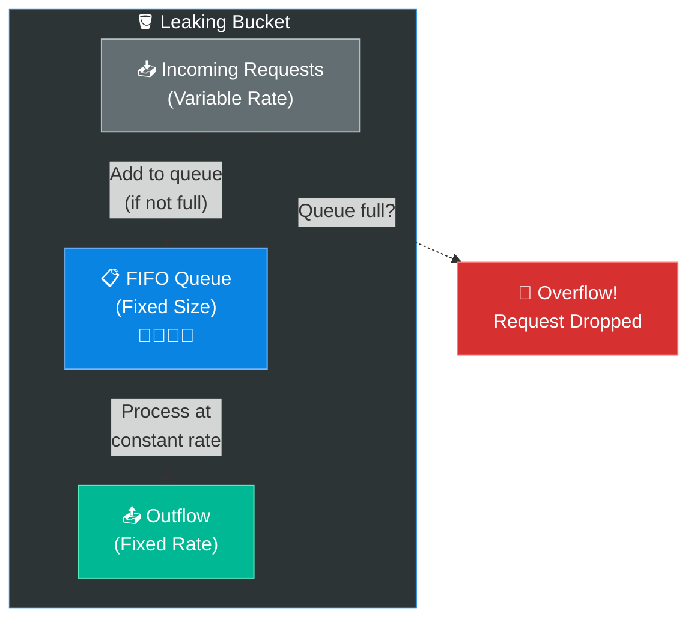

#### Token Bucket vs Leaking Bucket:

| Aspect | Token Bucket | Leaking Bucket |
|---|---|---|
| **Core Mechanism** | Tokens are added and consumed | Queue with fixed outflow rate |
| **Burst Handling** | ✅ Allows bursts (up to bucket size) | ❌ No bursts — processes at fixed rate |
| **Processing Rate** | Variable (depends on tokens available) | **Constant** — always same speed |
| **Implementation** | Counter-based | Queue-based (FIFO) |
| **Best For** | APIs that tolerate bursts | Systems needing **stable outflow** (e.g., payment processing) |
| **Used By** | Amazon, Stripe | Shopify |

#### Pros & Cons:

| ✅ Pros | ❌ Cons |
|---|---|
| Memory efficient (limited queue size) | A burst of traffic fills the queue with old requests; recent requests might be rate-limited |
| Stable outflow rate — good for predictable processing | Two parameters to tune (`queue size` + `outflow rate`) — not easy to get right |
| Implemented with a simple FIFO queue | Old requests in queue may starve if processing is slow |

---

### 3️⃣ Fixed Window Counter Algorithm

#### 🍕 The Parking Lot Analogy:
Imagine a **parking lot** that allows **max 3 cars per hour**:
- The hour starts at `2:00 PM` and ends at `3:00 PM` — that's the **window**
- Each car that enters increments the counter
- When 3 cars have entered → **gate closes** until the next hour!
- At `3:00 PM` → counter **resets to 0**, gate opens again

#### How It Works:

```
PARAMETERS:
  - Window Size = 1 second
  - Max Requests = 3 per window

TIMELINE:                    1 second window
                    ┌──────────────────────────────┐
TIME:    1.0s  1.1s  1.2s  1.3s  1.4s  1.5s  1.8s  2.0s  2.1s
REQUEST:  #1    #2    #3    #4    #5    —      —     #6    #7
COUNTER:   1     2     3     3     3    —      —      1     2
RESULT:   ✅    ✅    ✅    ❌    ❌    —      —     ✅    ✅
                                                      ↑
                                              Counter reset to 0!
```

#### Visual Representation:

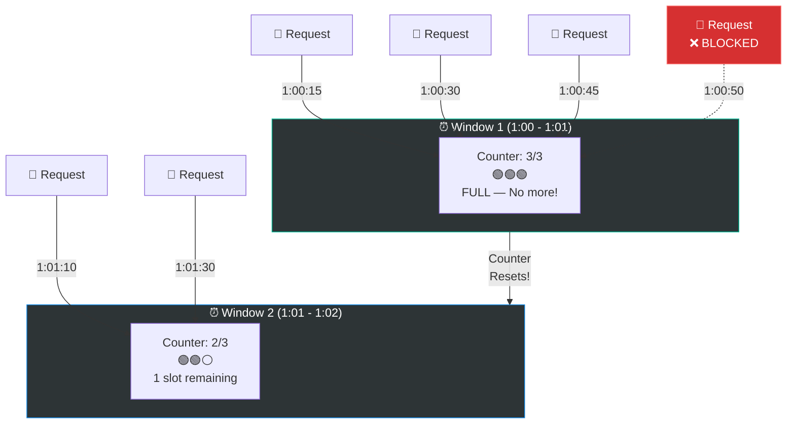

#### ⚠️ The Critical Problem: Boundary Burst!

This is the **biggest flaw** of Fixed Window Counter — a spike of traffic at the **edge of two windows** can allow **DOUBLE the allowed rate**!

```
PARAMETERS: Max 5 requests per minute

Window 1: [1:00 — 1:01)        Window 2: [1:01 — 1:02)
                        │
    ...quiet...  5 reqs │ 5 reqs  ...quiet...
                 ↑      │      ↑
              1:00:50   │   1:01:10
                        │
                        ↓
    In the 20-second span from 1:00:50 to 1:01:10,
    the system received 10 requests!
    That's DOUBLE the limit of 5/min!

    Window 1 sees 5 requests → ✅ within limit
    Window 2 sees 5 requests → ✅ within limit
    BUT... in reality, 10 requests passed in ~20 seconds! 💥
```

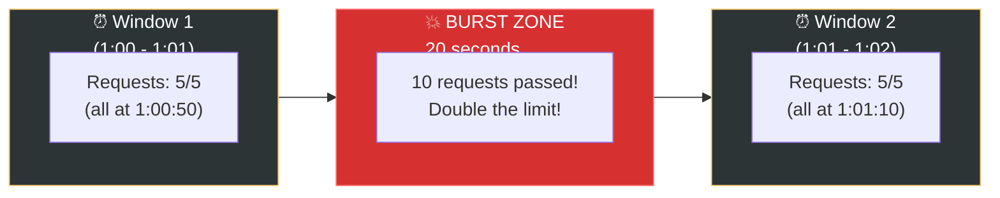

#### Pros & Cons:

| ✅ Pros | ❌ Cons |
|---|---|
| Memory efficient | ❌ Boundary burst problem — allows double traffic at window edges |
| Easy to understand and implement | Not precise for strict rate-limiting requirements |
| Resetting at the end of each window fits certain use cases | — |

---

### 4️⃣ Sliding Window Log Algorithm

This algorithm **fixes the boundary burst problem** of the Fixed Window Counter.

#### 🍕 The Security Camera Analogy:
Instead of just counting cars per hour (fixed window), imagine a **security camera** that
records the **exact timestamp** of every car that enters:
- When a new car arrives, the guard reviews the footage
- They look at **the last 60 seconds** (sliding window) of footage
- If they count ≥ 5 cars in that rolling window → **gate closes**!

The window **slides with time** — it's always "the last N seconds/minutes" from NOW.

#### How It Works:

```
PARAMETERS:
  - Window Size = 1 minute
  - Max Requests = 2 per window

SORTED TIMESTAMPS LOG:

TIME    | ACTION                        | LOGS                            | RESULT
--------+-------------------------------+---------------------------------+--------
1:00:01 | Request arrives               | [1:00:01]                       | ✅ (1 ≤ 2)
1:00:30 | Request arrives               | [1:00:01, 1:00:30]              | ✅ (2 ≤ 2)
1:00:50 | Request arrives               | [1:00:01, 1:00:30, 1:00:50]     | ❌ (3 > 2)
1:01:02 | Request arrives               | [1:00:30, 1:00:50, 1:01:02]     | ❌ (3 > 2)
        | ↑ 1:00:01 is removed          |                                 |
        | (it's older than 1 min ago!)  |                                 |
1:01:31 | Request arrives               | [1:00:50, 1:01:02, 1:01:31]     | ❌ (3 > 2)
        | ↑ 1:00:30 is now too old,     |                                 |
        |   removed from log            |                                 |
1:01:51 | Request arrives               | [1:01:02, 1:01:31, 1:01:51]     | ❌ (3 > 2)
        | ↑ 1:00:50 removed             |                                 |
1:02:03 | Request arrives               | [1:01:31, 1:01:51, 1:02:03]     | ❌ (3 > 2)
        | ↑ 1:01:02 removed             |                                 |
1:02:32 | Request arrives               | [1:01:51, 1:02:03, 1:02:32]     | ❌ (3 > 2)
1:02:52 | Request arrives               | [1:02:03, 1:02:32, 1:02:52]     | ❌ (3 > 2)
        | ↑ 1:01:51 removed             |                                 |
```

Wait — once we hit the limit, how do requests ever get through again? The key is that **old timestamps keep expiring**. Eventually, enough timestamps fall outside the window that new requests are allowed:

```
CONTINUING...

TIME    | ACTION                        | LOGS                            | RESULT
--------+-------------------------------+---------------------------------+--------
1:03:05 | Request arrives               | [1:02:32, 1:02:52, 1:03:05]     | ❌ (3 > 2)
        | ↑ 1:02:03 removed             |                                 |
1:03:33 | Request arrives               | [1:02:52, 1:03:05, 1:03:33]     | ❌ (3 > 2)
        | ↑ 1:02:32 removed             |                                 |
1:03:53 | Request arrives               | [1:03:05, 1:03:33, 1:03:53]     | ❌ (3 > 2)
        | ↑ 1:02:52 removed             |                                 |

Hmm - seems like we're stuck! But if the client STOPS for a while...

TIME    | ACTION                        | LOGS                            | RESULT
--------+-------------------------------+---------------------------------+--------
(long pause — no requests for 2 minutes)
1:05:55 | Request arrives               | [1:05:55]                       | ✅ (1 ≤ 2)
        | ↑ All old timestamps expired! |                                 |
```

> **Key insight:** The client must **slow down** to allow old timestamps to fall out of the window.
> That's exactly the point — the rate limiter forces the client to respect the rate!

#### Visual Representation:

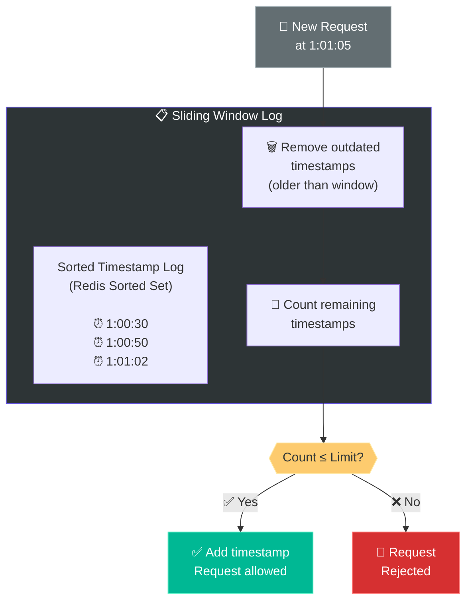

#### Pros & Cons:

| ✅ Pros | ❌ Cons |
|---|---|
| ✅ **Very accurate** — no boundary burst issue | ❌ **Memory hungry** — stores timestamp for EVERY request, even rejected ones |
| ✅ Rate limiting is precise at any point in time | ❌ Not practical for high-traffic systems (millions of timestamps!) |

---

### 5️⃣ Sliding Window Counter Algorithm

This is the **best of both worlds** — combines Fixed Window Counter + Sliding Window Log.

#### 🍕 The Weighted Average Analogy:
Instead of storing every timestamp (expensive!) or using rigid windows (inaccurate!),
we take a **weighted average** of the current and previous window's counts.

Think of it like a **weather forecast** that considers both today's AND yesterday's conditions,
weighted by how close we are to each day.

#### How It Works:

```
PARAMETERS:
  - Window Size = 1 minute
  - Max Requests = 7 per minute

WINDOWS:
  Previous window (0:59 - 1:00): 5 requests
  Current window  (1:00 - 1:01): 3 requests

CURRENT TIME: 1:00:15 (we are 15 seconds into the current minute → 25% into window)

FORMULA:
  Requests in sliding window = 
      (Requests in current window) + 
      (Requests in previous window) × (overlap percentage with previous window)

  = 3 + (5 × 0.75)
  = 3 + 3.75
  = 6.75

  6.75 < 7 → ✅ REQUEST ALLOWED!
```

#### Visual Explanation:

```
                   1 minute window
    ←─────────────────────────────────────→

    Previous Window          Current Window
    [0:59:00 — 1:00:00)      [1:00:00 — 1:01:00)
    ████████████████████     ▓▓▓▓▓░░░░░░░░░░░░░░░
         5 requests          3 requests so far

    Current time: 1:00:15 (15 sec into current window)

    ←──── 75% overlap ────→←── 25% ──→
    ███████████████████████ ▓▓▓▓▓
    We use 75% of previous + 100% of current

    Weighted count = 3 + (5 × 75%) = 3 + 3.75 = 6.75
    Limit = 7
    6.75 < 7 → ✅ ALLOWED
```

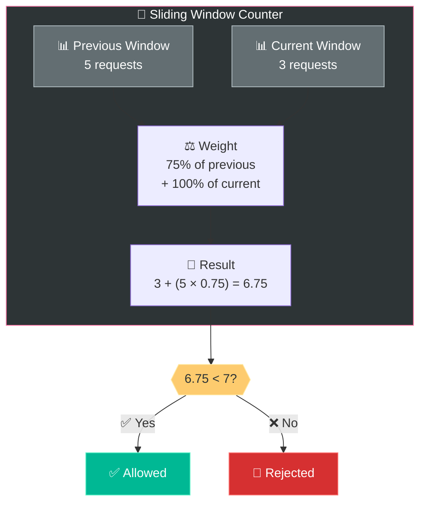

#### Pros & Cons:

| ✅ Pros | ❌ Cons |
|---|---|
| ✅ Smooths out traffic spikes | ❌ Only an approximation (not 100% exact) |
| ✅ Memory efficient (only 2 counters per window) | ❌ Assumes requests are evenly distributed in previous window |
| ✅ No boundary burst problem | — |

> **📊 Fun Fact:** According to experiments by Cloudflare, this algorithm is only wrong in
> about **0.003%** of requests — so the approximation is practically perfect!

---

### 📊 Algorithm Comparison — The Ultimate Table

| Feature | Token Bucket | Leaking Bucket | Fixed Window | Sliding Log | Sliding Window Counter |
|---|---|---|---|---|---|
| **Accuracy** | Good | Good | ⚠️ Boundary burst | ✅ Perfect | ✅ Very good (~99.997%) |
| **Memory** | ✅ Low (counter) | ✅ Low (queue) | ✅ Very low | ❌ High (all timestamps) | ✅ Low (2 counters) |
| **Burst Handling** | ✅ Allows bursts | ❌ No bursts | ⚠️ Allows at edges | ❌ Strict | ⚠️ Smooth |
| **Complexity** | Simple | Simple | Simplest | Medium | Medium |
| **Used By** | Amazon, Stripe | Shopify | — | — | Cloudflare |
| **Best For** | General purpose | Stable outflow | Simple use cases | High accuracy | Production systems |

---

## 🏗️ Step 3: Deep Dive — Detailed Architecture Design

Now let's design the **complete system** for a distributed rate limiter.

### High-Level Architecture:

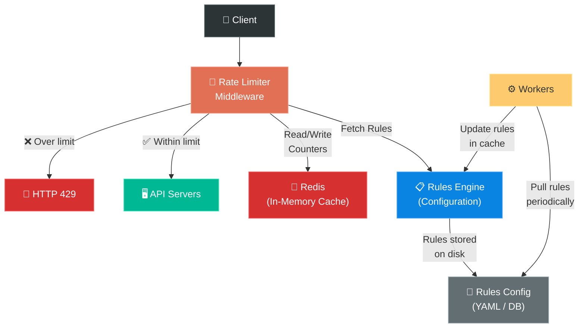

### Component Breakdown:

#### 1️⃣ Rules Configuration

Rate limiting rules are typically written in **config files** and saved to disk.

Example rules (YAML format — similar to what Lyft's open-source rate limiter uses):

```yaml
# Rule 1: Marketing messages limit
domain: messaging
descriptors:
  - key: message_type
    value: marketing
    rate_limit:
      unit: day
      requests_per_unit: 5

# Rule 2: Login attempts limit  
domain: auth
descriptors:
  - key: action
    value: login
    rate_limit:
      unit: minute
      requests_per_unit: 5
```

This means:
- Users can send a maximum of **5 marketing messages per day**
- Users can make a maximum of **5 login attempts per minute**

#### 2️⃣ Rate Limiter Middleware — The Decision Maker

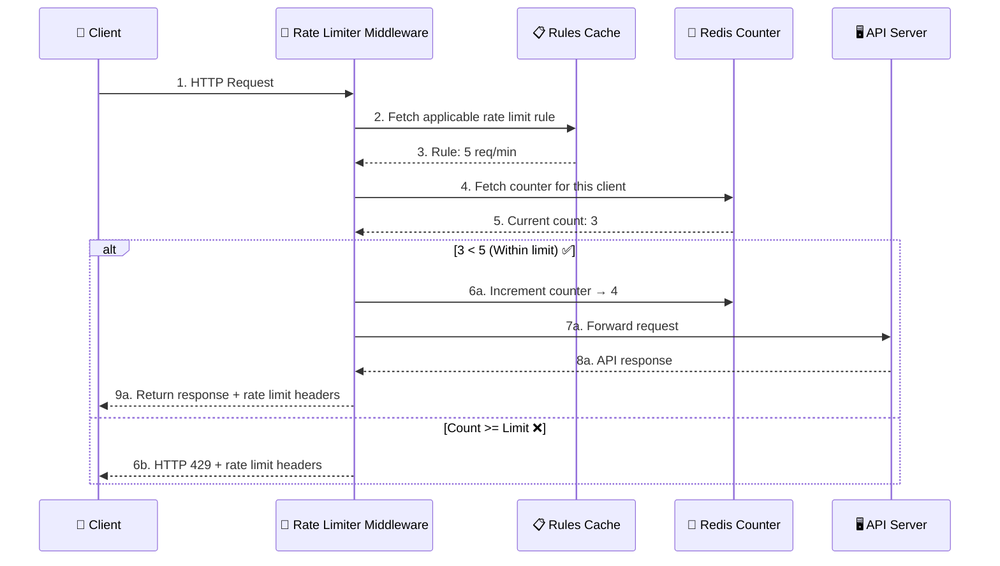

### HTTP Response Headers — Talking Back to the Client

When you make an API call, the response includes special headers that tell you about
the rate limit status:

```http
HTTP/1.1 200 OK
X-Ratelimit-Remaining: 4
X-Ratelimit-Limit: 10
X-Ratelimit-Retry-After: 30
```

| Header | Meaning | Example |
|---|---|---|
| `X-Ratelimit-Remaining` | How many requests you can still make in the current window | `4` (you have 4 requests left) |
| `X-Ratelimit-Limit` | Maximum requests allowed per window | `10` (max 10 per minute) |
| `X-Ratelimit-Retry-After` | Seconds to wait before you can make another request (only set when throttled) | `30` (wait 30 seconds) |

When a user is **rate limited**, they receive:

```http
HTTP/1.1 429 Too Many Requests
X-Ratelimit-Remaining: 0
X-Ratelimit-Limit: 10
X-Ratelimit-Retry-After: 30
Content-Type: application/json

{
  "error": "Too Many Requests",
  "message": "Rate limit exceeded. Please retry after 30 seconds."
}
```

---

## 🔍 Deep Dive: Distributed Rate Limiting Challenges

Building a rate limiter for a **single server** is simple. But in a distributed environment
with **multiple servers and multiple rate limiters**, things get tricky.

### Challenge 1: Race Condition 🏎️

#### 🍕 The Double-Spending Analogy:
Imagine two cashiers (servers) checking your bank balance **at the same time**:
- Both see balance = $100
- Both approve a $100 withdrawal
- You end up spending $200 from a $100 account!

The same thing happens with rate limiter counters:

```
RACE CONDITION SCENARIO:
  Rate Limit: 3 requests per minute
  Current counter in Redis: 2

  Time 0ms: Request A arrives at Server 1
  Time 0ms: Request B arrives at Server 2

  Server 1: READ counter from Redis → 2
  Server 2: READ counter from Redis → 2    (both read at the same time!)

  Server 1: 2 < 3, ALLOW! WRITE counter = 3
  Server 2: 2 < 3, ALLOW! WRITE counter = 3

  RESULT: Counter shows 3, but actually 4 requests passed!
  One request SHOULD have been blocked! 💥
```

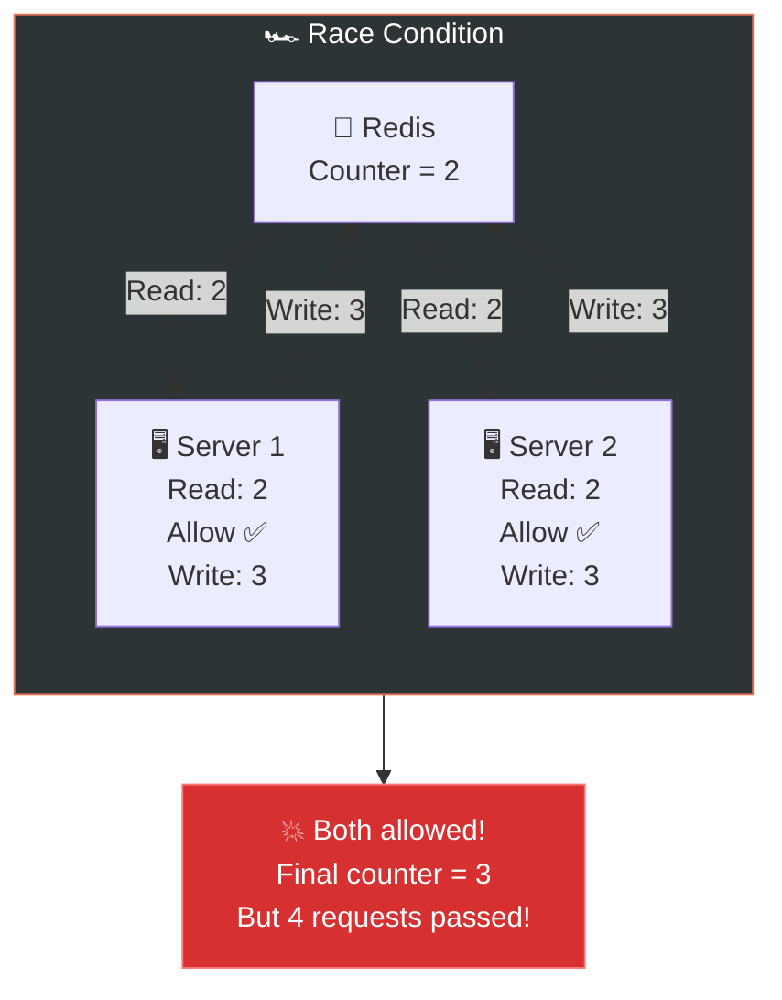

#### Solutions to Race Conditions:

**Solution 1: Lua Script in Redis (Most Common)**

Redis can execute **Lua scripts atomically** — meaning the READ + CHECK + WRITE happens
as one uninterruptible operation.

```lua
-- Atomic rate limiting in Redis with Lua
local key = KEYS[1]
local limit = tonumber(ARGV[1])
local window = tonumber(ARGV[2])

local current = tonumber(redis.call('GET', key) or "0")

if current < limit then
    redis.call('INCR', key)
    redis.call('EXPIRE', key, window)
    return 1  -- ALLOWED
else
    return 0  -- REJECTED
end
```

**Solution 2: Redis Sorted Sets**

Use sorted sets with timestamps for sliding window implementations.

**Solution 3: Locks (Not Recommended)**

Locks slow down the system significantly and should be avoided for high-throughput rate limiters.

| Solution | Performance | Accuracy | Complexity |
|---|---|---|---|
| **Lua Scripts** ⭐ | ✅ Fast (atomic in Redis) | ✅ Exact | Low |
| **Sorted Sets** | ✅ Good | ✅ Exact | Medium |
| **Distributed Locks** | ❌ Slow | ✅ Exact | High |

---

### Challenge 2: Synchronization Problem 🔄

When you have **multiple rate limiter servers** (for redundancy), each might have its
own Redis instance or cache. How do they stay in sync?

```
CLIENT → Load Balancer
           ├── Rate Limiter 1 (with Redis Instance A)
           └── Rate Limiter 2 (with Redis Instance B)

If the client alternates between RL1 and RL2,
each sees only HALF the traffic!
Client could send 2× the allowed rate!
```

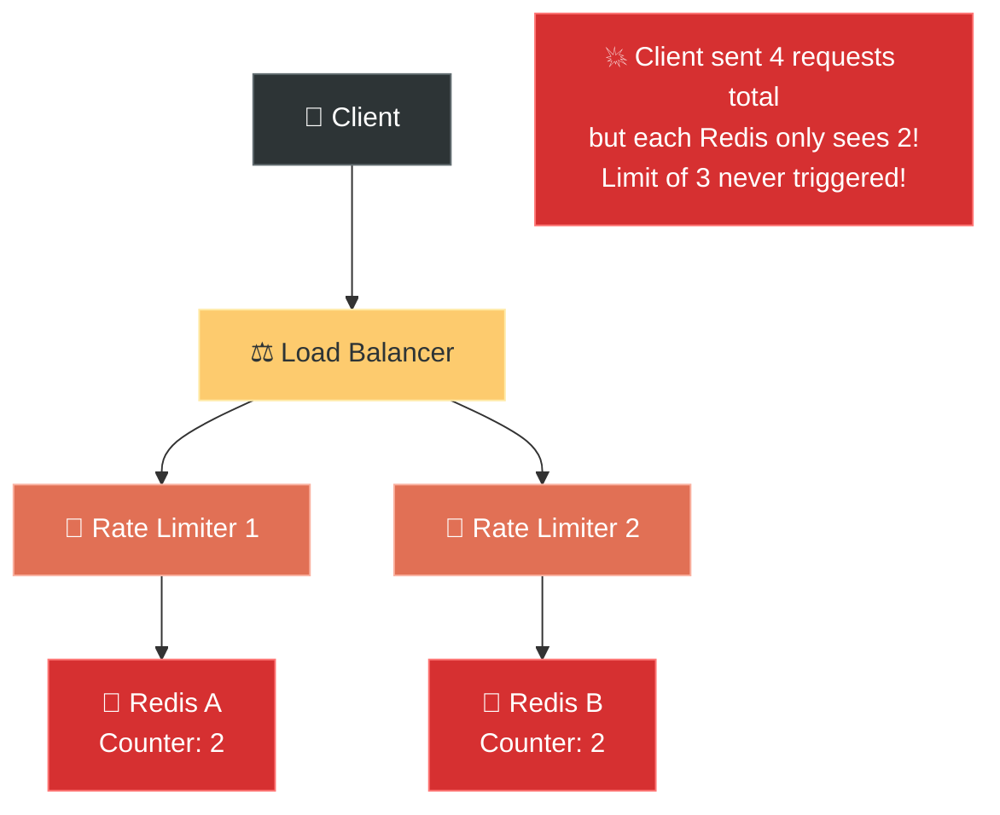

#### Solution: Use a Centralized Redis Cluster

All rate limiter instances should read/write to the **same centralized Redis cluster**:

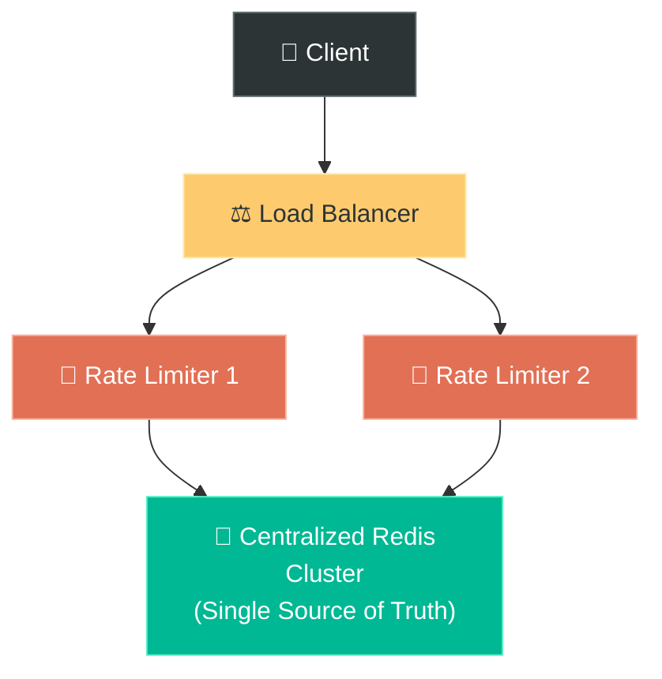

---

## ⚡ Performance Optimization

### Handling Edge Cases and Special Scenarios:

#### 1️⃣ What Happens to Rate-Limited Requests?

Depending on use case, rate-limited requests can be handled differently:

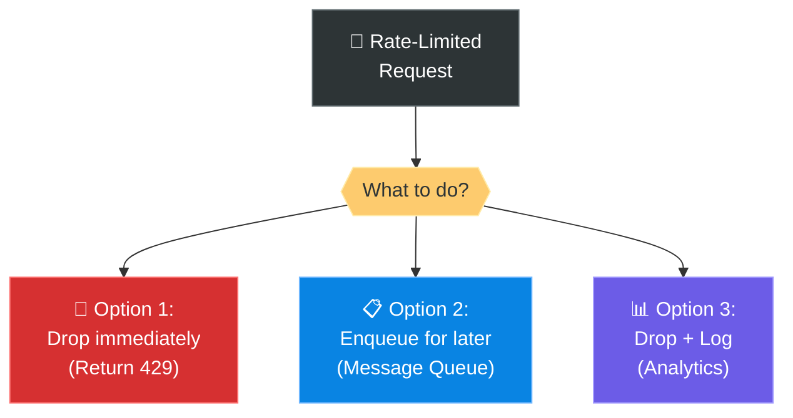

If requests are **important** (like order processing), you might want to **enqueue** them
in a message queue to process later, rather than dropping them outright.

#### 2️⃣ Rate Limiting by Different Dimensions

You can apply different rate limits at multiple levels:

| Dimension | Example | Use Case |
|---|---|---|
| **Per User ID** | 100 requests/min per user | Standard API protection |
| **Per IP Address** | 1,000 requests/min per IP | Protects against DDoS from a single source |
| **Per API Endpoint** | POST /payment: 10/min, GET /feed: 100/min | Protect expensive endpoints more |
| **Per Application** | App A: 5,000/min, App B: 10,000/min | Different tiers for API consumers |
| **Global** | 1,000,000 requests/min total | Protect entire infrastructure |

#### 3️⃣ Multi-Tier Rate Limiting

In practice, large systems layer **multiple rate limiters**:

```
Tier 1: Per-IP Rate Limiting     (at CDN/Edge — e.g., Cloudflare)
  ↓
Tier 2: Per-User Rate Limiting   (at API Gateway — e.g., AWS API Gateway)
  ↓
Tier 3: Per-Endpoint Limiting    (at Application Level — custom middleware)
```

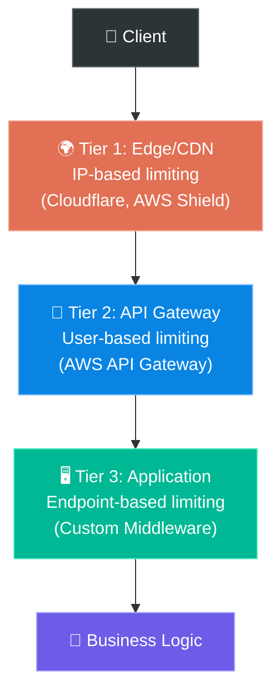

---

## 🔔 Monitoring & Alerting

After deploying a rate limiter, it's **critical** to monitor its effectiveness:

### Key Metrics to Track:

| Metric | Why It Matters |
|---|---|
| **Total requests allowed vs dropped** | Are the rules too strict or too lenient? |
| **Drop rate by user/IP** | Identify abusers or legitimate users being rate-limited |
| **Redis latency** | Is the rate limiter adding too much latency? |
| **Redis memory usage** | Are we running out of memory? |
| **False positive rate** | Are legitimate users being incorrectly blocked? |

### When to Tune Rules:

```
IF drop_rate is very HIGH:
  → Rules might be too strict
  → Or there's a legitimate traffic spike (e.g., flash sale)
  → Review and increase limits temporarily

IF drop_rate is very LOW:
  → Rules might be too lenient
  → Not providing adequate protection
  → Consider tightening limits

IF specific users are consistently blocked:
  → Could be a power user → consider premium tiers
  → Could be a bot → investigate!
```

---

## 🏗️ The Complete Architecture — Putting It All Together

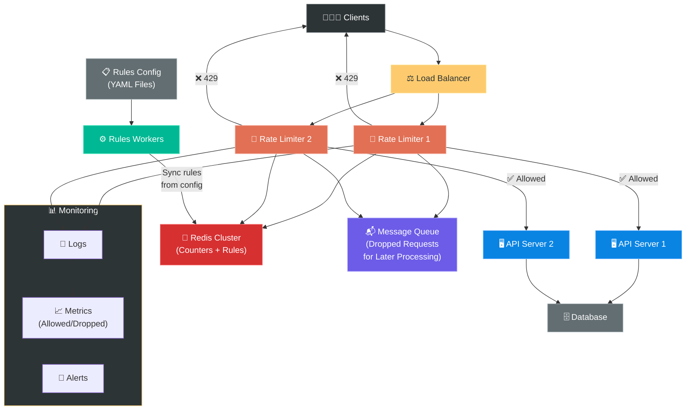

---

## 📋 Summary — Quick Revision Table

| Topic | Key Takeaway |
|---|---|
| **What is a Rate Limiter?** | Controls traffic rate; blocks excess requests |
| **Why do we need it?** | Prevent DoS, reduce cost, prevent server overload |
| **Where to put it?** | Client (❌), Server (✅), Middleware/API Gateway (⭐ best) |
| **Token Bucket** | Tokens refill at fixed rate; allows bursts; most popular (Amazon, Stripe) |
| **Leaking Bucket** | Queue-based; constant outflow rate; no bursts (Shopify) |
| **Fixed Window Counter** | Simple counter per time window; ⚠️ boundary burst problem |
| **Sliding Window Log** | Stores all timestamps; most accurate; ❌ memory hungry |
| **Sliding Window Counter** | Weighted average of 2 windows; accurate + efficient (Cloudflare) |
| **Race Condition** | Solved with Redis Lua scripts (atomic operations) |
| **Synchronization** | Use centralized Redis cluster (single source of truth) |
| **HTTP Headers** | `X-Ratelimit-Remaining`, `X-Ratelimit-Limit`, `X-Ratelimit-Retry-After` |
| **Monitoring** | Track drop rate, Redis latency, false positives |

---

## 🧠 Memory Tricks — How to Remember This Chapter

### The 5 Algorithms — "**T**ony **L**ikes **F**ish **S**alad **S**andwiches" 🐟🥪
> **T**oken Bucket → **L**eaking Bucket → **F**ixed Window → **S**liding Log → **S**liding Counter

### The Rate Limiter Story:
> A bouncer named **REDIS** stood at the club door. He had a **TOKEN BUCKET** that
> refilled every second. When the crowd rushed in, some got their tokens (**✅ allowed**),
> but when tokens ran out → **🛑 HTTP 429!** He kept a **log** of everyone's entry time
> and used a **sliding window** to count heads. If two bouncers worked the door,
> they shared ONE counting clicker (**centralized Redis**) so nobody sneaked in twice.

### The Restaurant Analogy Map:

```
🍕 Token Bucket     = Food tokens at a buffet (use one per plate, refilled hourly)
🚰 Leaking Bucket   = A sink with a constant drain rate (water in = requests)
🅿️ Fixed Window     = Parking lot with hourly slots (resets each hour)
📷 Sliding Window Log = Security camera footage (exact timestamps)
📊 Sliding Counter   = Weighted average of recent + current hour
```

### Key Numbers to Remember:

```
╔═══════════════════════════════════════════════╗
║  RATE LIMITER — KEY NUMBERS                   ║
╠═══════════════════════════════════════════════╣
║                                               ║
║  HTTP 429 = "Too Many Requests"               ║
║                                               ║
║  3 Response Headers:                          ║
║    • X-Ratelimit-Remaining                    ║
║    • X-Ratelimit-Limit                        ║
║    • X-Ratelimit-Retry-After                  ║
║                                               ║
║  5 Algorithms:                                ║
║    Token Bucket, Leaking Bucket,              ║
║    Fixed Window, Sliding Log,                 ║
║    Sliding Window Counter                     ║
║                                               ║
║  2 Distributed Challenges:                    ║
║    Race Condition → Lua Scripts               ║
║    Synchronization → Centralized Redis        ║
║                                               ║
╚═══════════════════════════════════════════════╝
```

---

## ❓ Interview Quick-Fire Questions

**Q1: What is a rate limiter and why do we need one?**
> A rate limiter controls the number of requests a client can send to a server within a
> given time period. We need it to prevent DoS attacks, reduce costs (fewer requests =
> less server load), and prevent server overload.

**Q2: What are the 5 rate limiting algorithms?**
> Token Bucket, Leaking Bucket, Fixed Window Counter, Sliding Window Log, and Sliding
> Window Counter. Token Bucket is the most widely used (Amazon, Stripe).

**Q3: What's the difference between Token Bucket and Leaking Bucket?**
> Token Bucket allows **bursts** of traffic up to the bucket size and is counter-based.
> Leaking Bucket processes requests at a **constant rate** using a queue (FIFO).
> Token Bucket = variable speed, Leaking Bucket = constant speed.

**Q4: What's the problem with the Fixed Window Counter?**
> The **boundary burst problem** — a spike of traffic at the edge of two consecutive windows
> can allow **double** the intended rate of requests through.

**Q5: How does Sliding Window Counter solve the boundary problem?**
> By taking a **weighted average** of the current and previous window's request counts.
> The weight for the previous window is based on how much the sliding window overlaps with it.

**Q6: What are the two main challenges in distributed rate limiting?**
> 1. **Race Condition** — Multiple servers read the same counter value simultaneously,
>    leading to incorrect counts. Solved with Redis Lua scripts (atomic operations).
> 2. **Synchronization** — Multiple rate limiter instances must share the same counters.
>    Solved with a centralized Redis cluster.

**Q7: What HTTP status code indicates rate limiting?**
> **HTTP 429 (Too Many Requests)**. The response includes headers like
> `X-Ratelimit-Remaining`, `X-Ratelimit-Limit`, and `X-Ratelimit-Retry-After`.

**Q8: Would you build a rate limiter or buy one?**
> It depends! If you have an API gateway (AWS, Google Cloud, etc.), use its built-in
> rate limiting. If you need custom logic or have specific constraints, build your own.
> Building gives more control; buying saves engineering time.

**Q9: What data store would you use for rate limiter counters? Why?**
> **Redis** — because it's in-memory (fast), supports atomic operations (INCR, EXPIRE),
> and works well in distributed environments. A traditional database would be too slow
> for the per-request counter checks.

**Q10: How would you handle rate-limited requests that are important?**
> Instead of dropping them, enqueue them in a **message queue** (like Kafka or SQS)
> to process later when the rate allows. This is useful for operations like payments
> or order processing that shouldn't be lost.

---

> **📖 Previous Chapter:** [← Chapter 3: A Framework for System Design Interviews](/HLD/chapter_3/a_framework_for_system_design_interviews.md)
>
> **📖 Next Chapter:** [Chapter 5: Design Consistent Hashing →](/HLD/chapter_5/design_consistent_hashing.md)
