# Chapter 6: Design a Key-Value Store

> **Core Idea:** A key-value store is a **non-relational database** where each unique key is
> associated with a value. Think of it as a **giant dictionary** — you give it a word (key),
> and it instantly gives you the meaning (value). This chapter walks through designing a
> key-value store that supports `put(key, value)` and `get(key)`, and can scale to handle
> millions of operations per second.

---

## 🧠 The Big Picture — What Is a Key-Value Store?

### 🍕 The Dictionary Analogy:
Imagine the **Oxford English Dictionary**:
- **Key** = the word you look up (e.g., "apple")
- **Value** = the definition (e.g., "a round fruit with red or green skin")
- You **don't search by definition** — you always look up by **key**

A key-value store works exactly like this, but at **massive scale** — billions of entries,
sub-millisecond lookups, distributed across the globe.

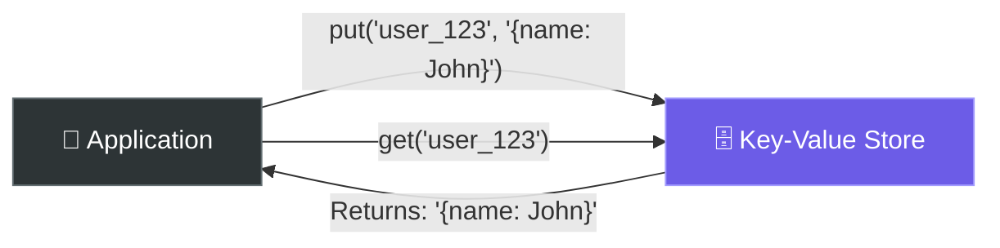

### Key-Value Store Basics:

| Concept | Description |
|---|---|
| **Key** | Unique identifier — must be unique. Can be plain text or hashed |
| **Value** | The data associated with the key. Can be **anything**: string, list, JSON, image blob |
| **Operations** | `put(key, value)` — insert/update · `get(key)` — retrieve · `delete(key)` — remove |
| **Key should be short** | Short keys = faster lookups, less memory |

### Real-World Key-Value Stores:

| Store | Company | Use Case |
|---|---|---|
| **Amazon DynamoDB** | Amazon | Shopping cart, session data, gaming leaderboards |
| **Memcached** | Facebook (Meta) | Caching layer for billions of requests |
| **Redis** | Open Source / Redis Labs | Caching, session store, rate limiting, queues |
| **etcd** | CNCF / Kubernetes | Distributed configuration, service discovery |
| **Apache Cassandra** | Meta, Netflix, Apple | Large-scale data (wide-column, but key-value at core) |

---

## 🎯 Step 1: Understand the Problem & Establish Design Scope

### Clarifying the Requirements:

There's no perfect design — it's always about **trade-offs**. Let's understand what we need:

```
You:  "What's the size of key-value pairs?"
Int:  "Small — less than 10 KB each."

You:  "Do we need to store big data?"
Int:  "No. Small to medium-sized data."

You:  "How should availability vs consistency be handled?"
Int:  "High availability — even if it means eventual consistency."

You:  "Do we need to support automatic scaling?"
Int:  "Yes. Add/remove servers automatically based on traffic."

You:  "How important is low latency?"
Int:  "Very. Reads and writes must be fast."
```

### 📋 Finalized Requirements:

| Requirement | Detail |
|---|---|
| **Key-value pair size** | Small (< 10 KB) |
| **Store big data?** | No — optimized for small-medium data |
| **High availability** | System responds even during failures/partitions |
| **High scalability** | Auto scale to support large datasets |
| **Automatic scaling** | Add/remove servers based on load |
| **Tunable consistency** | Adjustable consistency levels |
| **Low latency** | Sub-10ms reads and writes |

---

## 🏗️ Starting Simple — Single Server Key-Value Store

The easiest approach: store everything in a **hash table in memory** on a single machine.

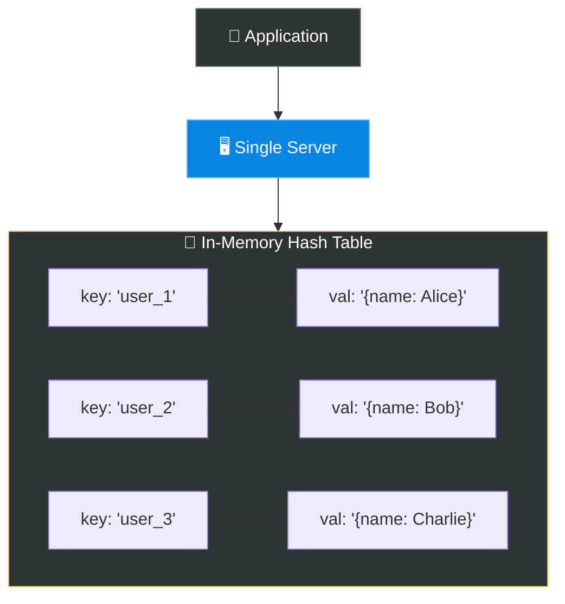

### Two Optimizations:
1. **Data compression** — reduce the size of data stored in memory
2. **Store frequently accessed data in memory, rest on disk** — use disk for rarely accessed keys

### ⚠️ The Problem:
A single server has **limited memory**. Eventually, you **can't fit everything** on one machine.
When you need to store **terabytes** of data and handle **millions of requests** —
you need a **distributed** key-value store.

> **💡 The rest of this chapter focuses on designing a distributed key-value store.**

---

## 🌐 The CAP Theorem — The Foundation of Distributed Systems

Before designing our distributed store, we **must** understand CAP. This is the most
important theorem in distributed systems and the **cornerstone** of this entire chapter.

### What is CAP?

**CAP Theorem** (proposed by Eric Brewer in 2000) states that a distributed system can
only guarantee **2 out of 3** properties simultaneously:

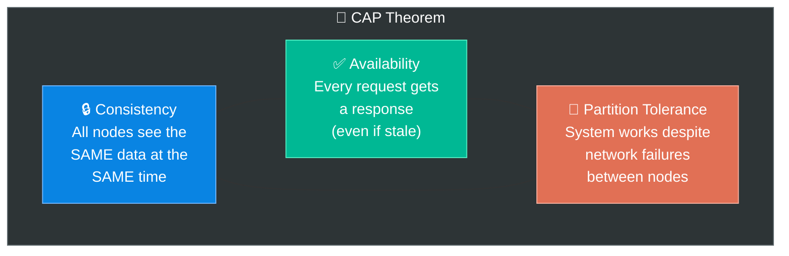

### 🍕 The Pizza Delivery Analogy:

Imagine you run a pizza delivery service with **3 branches** (nodes):

| Property | Pizza Analogy |
|---|---|
| **Consistency (C)** | ALL branches have the **exact same menu** at all times. If one branch adds a new pizza, the others MUST update before serving customers |
| **Availability (A)** | Every branch is **always open** and serves customers — even if they can't contact the other branches |
| **Partition Tolerance (P)** | The system still works even if the **phone lines between branches go down** (network partition) |

**The trade-off:**
- If the phone lines go down (partition), you must choose:
  - **Stay consistent (CP):** Close the branches that can't sync → lose **availability**
  - **Stay available (AP):** Keep all branches open, but menus might differ → lose **consistency**

### Why Must We Pick 2 Out of 3?

In the real world, **network failures WILL happen**. You can't avoid partitions.
So **P (Partition Tolerance) is non-negotiable** — it's always required.

That leaves you choosing between:

| Choice | What You Get | What You Sacrifice | Real Example |
|---|---|---|---|
| **CP** (Consistency + Partition Tolerance) | All nodes return the same data | Some requests may fail during partitions | Bank transfers, MongoDB (configurable) |
| **AP** (Availability + Partition Tolerance) | System always responds | Data may be temporarily stale/inconsistent | Social media feeds, Cassandra, DynamoDB |
| **CA** (Consistency + Availability) | Both consistent and available | ❌ Breaks during network failures — **impractical in distributed systems!** | Single-node databases (not truly distributed) |

### Visual: CP vs AP During a Network Partition

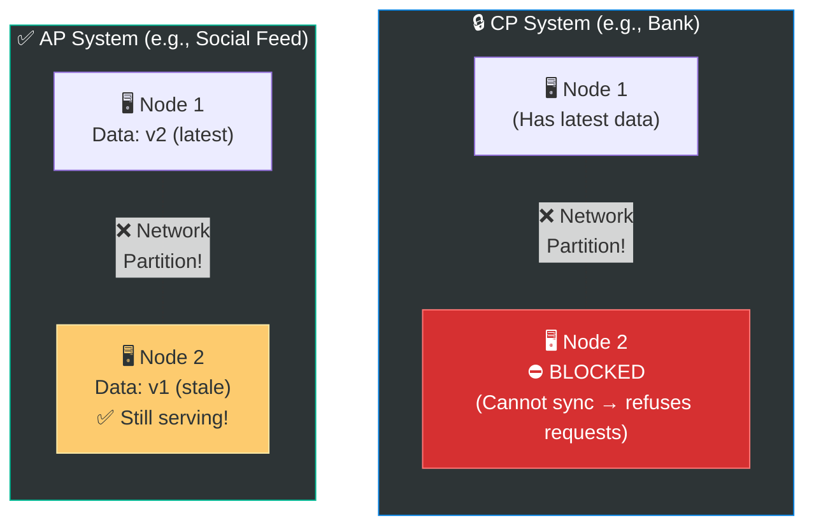

**CP System:** Node 2 blocks all reads/writes until it can sync with Node 1 → **consistent but unavailable**

**AP System:** Node 2 still serves requests with old (stale) data → **available but inconsistent**

> **💡 For our key-value store, the user asked for high availability → We choose AP!**
> We'll use **eventual consistency** to resolve stale data.

---

## 📦 Core Component 1: Data Partition — Consistent Hashing

When data is too large for a single server, we **split it across multiple servers**.
But how do we decide **which key goes to which server?**

### The Naive Approach (Modulo Hashing):

```
server_index = hash(key) % number_of_servers

Example with 4 servers:
  hash("user_1") % 4 = 2  → Server 2
  hash("user_2") % 4 = 0  → Server 0
  hash("user_3") % 4 = 1  → Server 1
```

**Problem:** When you **add or remove a server**, the modulo changes → **almost ALL keys
get reassigned** → massive data migration! 💥

```
Before: hash("user_1") % 4 = 2  → Server 2
After:  hash("user_1") % 5 = 3  → Server 3  ← KEY MOVED!

Almost every key changes server! Catastrophic data reshuffling!
```

### The Solution: Consistent Hashing 🎯

Consistent hashing minimizes key remapping when servers are added/removed.

#### 🍕 The Circular Table Analogy:
Imagine guests (keys) sitting at a **round dinner table**. Each server is like a **waiter**
responsible for the section **clockwise** from their position:

- When a new waiter joins → they only take over a **small section** from the next waiter
- When a waiter leaves → only **their section** is reassigned to the next waiter clockwise
- All other assignments remain **unchanged!**

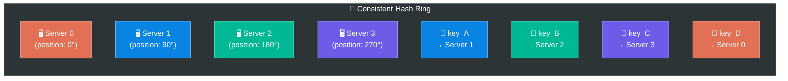

#### How It Works Step by Step:

```
1. Hash both SERVERS and KEYS onto a circular ring (0 to 2³² - 1)
2. To find which server stores a key:
   → Start at the key's position on the ring
   → Walk CLOCKWISE until you hit a server
   → That server stores the key!

3. When a server is ADDED:
   → Only keys between the new server and its predecessor move
   → All other keys stay put!

4. When a server is REMOVED:
   → Only its keys move to the next server clockwise
   → Everything else untouched!
```

#### Virtual Nodes (Solving Uneven Distribution):

With few servers, data can be **unevenly distributed** (one server might get way more keys).

**Solution:** Each real server gets **multiple virtual positions** on the ring:

```
Real Server 0 → Virtual: S0_v0, S0_v1, S0_v2, S0_v3
Real Server 1 → Virtual: S1_v0, S1_v1, S1_v2, S1_v3
Real Server 2 → Virtual: S2_v0, S2_v1, S2_v2, S2_v3

More virtual nodes = more even distribution of keys!
```

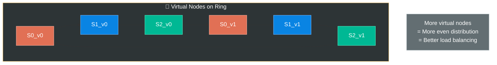

---

## 📦 Core Component 2: Data Replication

Storing data on only one server is risky — if that server dies, the data is **lost**.
To achieve **high availability and reliability**, data is replicated across **N servers**.

### How Replication Works (on the Hash Ring):

```
Replication Factor: N = 3  (store data on 3 servers)

For any key:
  1. Find its primary server (walk clockwise on ring)
  2. Also store on the NEXT N-1 servers clockwise

Example:
  Key "user_42" → Primary: Server 1
                 → Replica: Server 2
                 → Replica: Server 3

  Data exists on 3 servers! If one dies, 2 others have it.
```

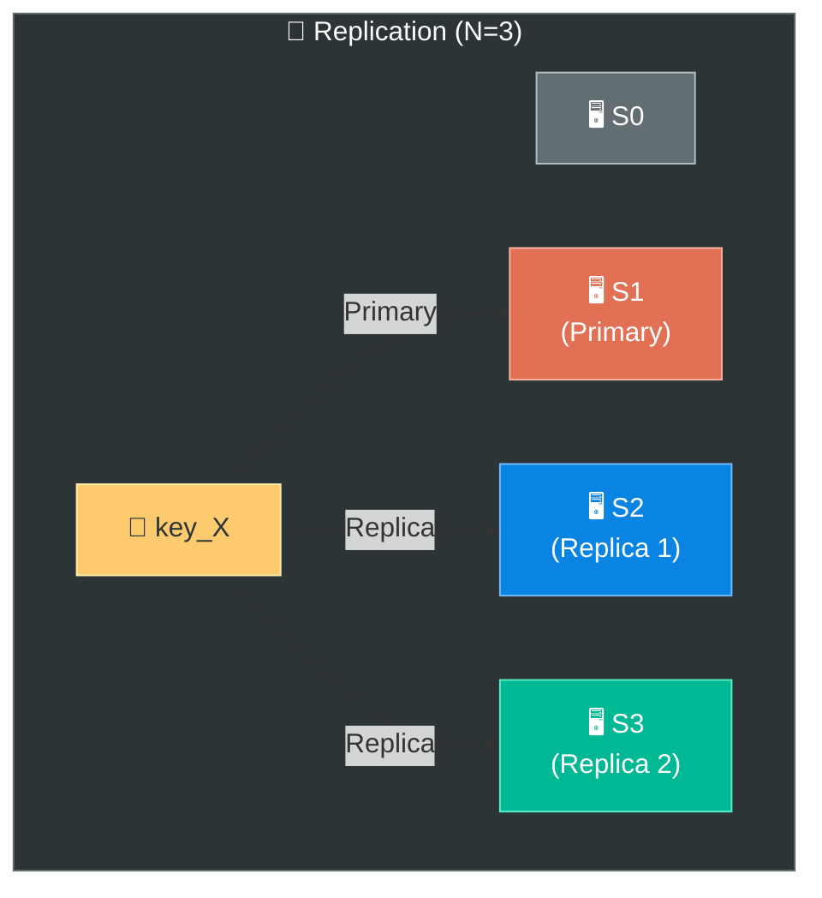

> **⚠️ Important:** With virtual nodes, the next N clockwise nodes might map to the **same
> physical server**! Make sure replicas are placed on **unique physical servers** only.

---

## 📦 Core Component 3: Consistency — How to Keep Replicas in Sync

With data replicated across N servers, how do we ensure **consistency**?

### The Quorum Consensus Model

This is the mechanism used by DynamoDB and Cassandra to tune consistency.

#### Three Key Parameters:

| Parameter | Meaning |
|---|---|
| **N** | Number of replicas (e.g., 3) |
| **W** | **Write quorum** — how many replicas must **acknowledge a write** before it's considered successful |
| **R** | **Read quorum** — how many replicas we **read from** to return a response |

#### 🍕 The Voting Analogy:
Imagine N = 3 people hold copies of a document:
- **W = 2 means:** When you update the document, at least **2 out of 3 people** must confirm they've updated their copy before the update is "official"
- **R = 2 means:** When you read the document, you ask **at least 2 people** and take the most recent version

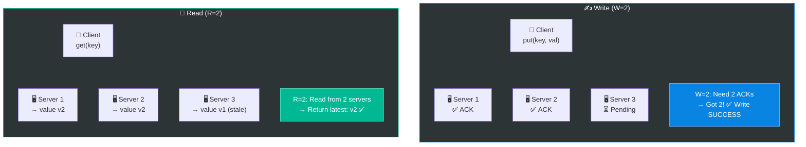

#### The Golden Rule: W + R > N → Strong Consistency!

```
If N = 3:

┌────────────────────────────────────────────────────────────┐
│ Configuration    │ W │ R │ W+R │ Consistency              │
│──────────────────┼───┼───┼─────┼──────────────────────────│
│ Strong           │ 2 │ 2 │  4  │ ✅ W+R > N (4 > 3)      │
│ Strong           │ 3 │ 1 │  4  │ ✅ W+R > N (4 > 3)      │
│ Strong           │ 1 │ 3 │  4  │ ✅ W+R > N (4 > 3)      │
│ Eventual         │ 1 │ 1 │  2  │ ❌ W+R ≤ N (2 ≤ 3)      │
└────────────────────────────────────────────────────────────┘
```

**Why does W + R > N guarantee consistency?**

```
N = 3 servers: [S1, S2, S3]
W = 2: Write reaches at least S1, S2 (confirmed)
R = 2: Read reaches at least 2 servers

Since W + R = 4 > 3 = N,
there's ALWAYS at least 1 server that was BOTH written to AND read from!
That server guarantees the read gets the latest data.

Overlap = W + R - N = 4 - 3 = 1  (at least 1 server has latest data)
```

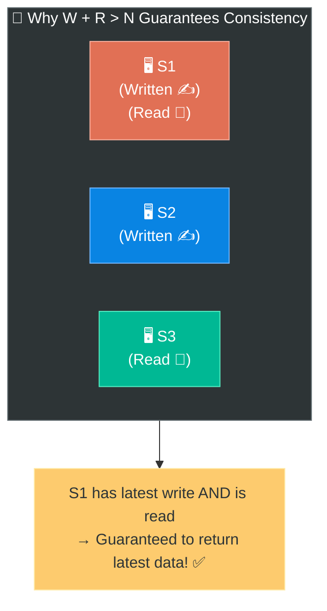

#### Typical Configurations:

| Use Case | W | R | N | Speed | Consistency |
|---|---|---|---|---|---|
| **Fast writes, eventual reads** | 1 | N | 3 | ⚡ Writes super fast | Reads always consistent |
| **Fast reads, eventual writes** | N | 1 | 3 | ⚡ Reads super fast | Writes always confirmed |
| **Balanced** | ⌈(N+1)/2⌉ | ⌈(N+1)/2⌉ | 3 | Moderate | Strong consistency |
| **Maximum availability** | 1 | 1 | 3 | ⚡⚡ Both fast | ⚠️ Eventual consistency |

> **💡 Key Insight:** If W = 1 or R = 1, operations return quickly because we only need 
> one server to respond. Lower W and R = faster but less consistent.

---

## 📦 Core Component 4: Handling Inconsistency — Versioning & Vector Clocks

When replicas are updated at different times, **conflicts** can arise. How do we know
which version of the data is the "correct" one?

### 🍕 The Shared Shopping List Analogy:

Imagine you and your roommate both have a copy of a shopping list:

```
ORIGINAL LIST: ["milk", "eggs", "bread"]

You (on your phone):     Delete "bread", add "butter"  → ["milk", "eggs", "butter"]
Roommate (on their phone): Delete "eggs", add "cheese"  → ["milk", "bread", "cheese"]

CONFLICT! Which version is correct?
  Your version:     ["milk", "eggs", "butter"]
  Roommate version: ["milk", "bread", "cheese"]

We can't just pick one — we'd lose either "butter" or "cheese"!
```

### Versioning with Vector Clocks ⏰

A **vector clock** is a `[server, version]` pair associated with each data item.
It tracks **which server updated the data and how many times**.

```
Vector Clock Format: D([S1, v1], [S2, v2], ..., [Sn, vn])
  - Si = Server i
  - vi = version counter (how many times Si updated this data)
```

#### Step-by-Step Example:

```
A client writes to key "shopping_list":

Step 1: Client writes to Server 1 (S1)
   D1([S1, 1])   →  value: ["milk", "eggs", "bread"]

Step 2: Client writes again to Server 1
   D2([S1, 2])   →  value: ["milk", "eggs"]
   D2 descends from D1  (S1:2 > S1:1)  → replaces D1 ✅

Step 3: Client writes to Server 2 (gets D2 as baseline)
   D3([S1, 2], [S2, 1])  →  value: ["milk", "eggs", "butter"]

Step 4: ANOTHER client writes to Server 3 (ALSO gets D2 as baseline!)
   D4([S1, 2], [S3, 1])  →  value: ["milk", "bread", "cheese"]
```

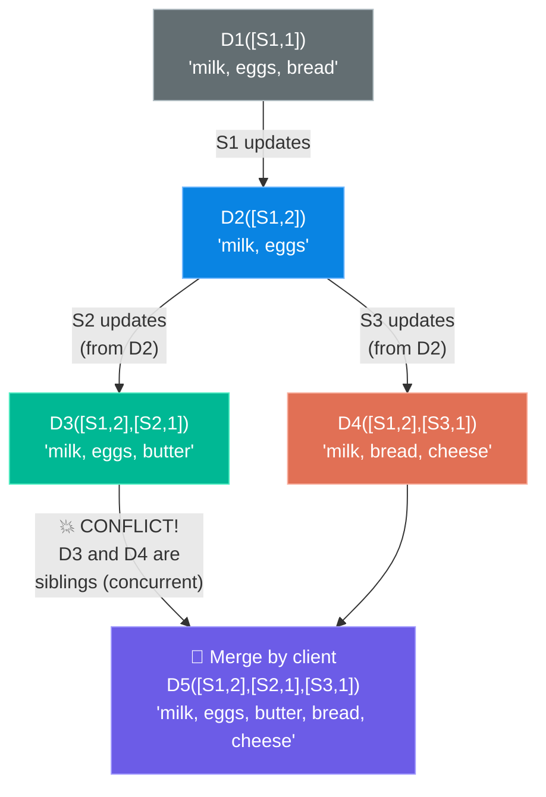

#### How to Detect Conflicts:

```
RULE: D1 is an ANCESTOR of D2 if ALL version counters in D1 ≤ D2's counters

D2([S1,2]) vs D3([S1,2],[S2,1]):
  S1: 2 ≤ 2 ✅  → D2 is ancestor of D3  → D3 replaces D2 (no conflict)

D3([S1,2],[S2,1]) vs D4([S1,2],[S3,1]):
  D3 has [S2,1] but D4 doesn't have S2  → ❌ Not ancestor
  D4 has [S3,1] but D3 doesn't have S3  → ❌ Not ancestor
  → CONFLICT! Both are siblings → need to MERGE
```

```
SIMPLE RULE TO REMEMBER:
┌────────────────────────────────────────────────┐
│ If ALL counters of X ≤ counters of Y → X < Y  │
│   → Y is newer, Y replaces X (no conflict)    │
│                                                 │
│ If NEITHER X ≤ Y nor Y ≤ X → CONFLICT!         │
│   → Both are concurrent siblings               │
│   → Client must resolve by merging              │
└────────────────────────────────────────────────┘
```

#### Pros & Cons of Vector Clocks:

| ✅ Pros | ❌ Cons |
|---|---|
| Detects conflicts accurately | Adds complexity to the client (must resolve conflicts) |
| Supports concurrent updates | Vector clock can grow very long with many servers |
| No data loss | Need to set a **threshold** — remove oldest pairs when too long |

> **⚠️ In practice**, Amazon DynamoDB sets a threshold and removes the oldest (server, version) 
> pairs when the vector exceeds the limit. This can lead to inefficiency in reconciliation,
> but it's rare in practice.

---

## 📦 Core Component 5: Handling Failures

In a distributed system, failures are **not an exception — they are the norm**.
We need to detect them and handle them gracefully.

### 5a. Failure Detection — Gossip Protocol 🗣️

#### The Problem:
How does the system know when a server is **down**?

**Naive approach:** Every server sends a heartbeat to every other server.
With N servers, that's N × (N-1) messages = **O(N²)** — too expensive!

#### The Solution: Gossip Protocol

The gossip protocol works like **rumor spreading** in a school:

```
🍕 The Rumor Analogy:
  - Alice tells 2 random friends: "Server 5 is down!"
  - Each friend tells 2 MORE random friends
  - Within a few rounds, EVERYONE knows!

No single announcer needed — information spreads organically!
```

#### How It Works:

```
SETUP:
  - Each node maintains a "membership list" with heartbeat counters
  - Periodically, each node:
    1. Increments its OWN heartbeat counter
    2. Sends its membership list to a few RANDOM nodes
    3. Receives lists from others and MERGES them

DETECTING FAILURE:
  - If a node's heartbeat hasn't increased for a THRESHOLD period
  - → That node is considered "offline"
```

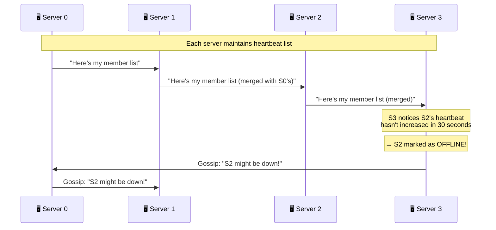

```
EXAMPLE MEMBERSHIP LIST (on Server 0):

┌─────────┬────────────────┬──────────────────┐
│ Server  │ Heartbeat Count│ Last Updated     │
├─────────┼────────────────┼──────────────────┤
│ S0      │ 1024           │ 11:00:00 (me!)   │
│ S1      │  998           │ 10:59:58         │
│ S2      │  756           │ 10:59:32 ← STALE │
│ S3      │  887           │ 10:59:55         │
└─────────┴────────────────┴──────────────────┘

S2's heartbeat hasn't updated in 28 seconds → possibly offline!
```

---

### 5b. Temporary Failures — Sloppy Quorum & Hinted Handoff

When a node is **temporarily** down (it'll come back), we don't want to block operations.

#### 🍕 The Post Office Analogy:
Imagine you need to deliver a package (write data) to 3 houses (servers).
House #2 isn't home (server down). Instead of:
- ❌ Waiting until they return (blocking!)
- ❌ Giving up on delivery (data loss!)

You:
- ✅ Leave the package with their **neighbor** (another healthy server)
- ✅ When House #2 comes back, the neighbor **hands over the package** → **Hinted Handoff!**

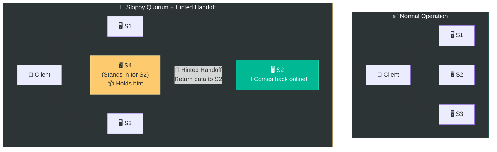

---

### 5c. Permanent Failures — Anti-Entropy with Merkle Trees 🌳

When a node is **permanently** down, replicas must be synchronized.
But comparing **all data** between replicas is expensive. Enter **Merkle Trees**.

#### 🍕 The Library Catalog Analogy:
Imagine two libraries need to verify they have the **same books**:
- Comparing books one by one = **millions of comparisons** (too slow!)
- Instead, each library creates a **catalog summary** (hash tree):
  - Compare top-level summary → different? Drill down.
  - Compare section summary → same? Skip! Different? Drill deeper.
  - Only check the **exact shelf** where differences exist!

#### How Merkle Trees Work:

```
A Merkle Tree is a HASH TREE:
  - Leaf nodes = hashes of individual data blocks
  - Parent nodes = hash of their children's hashes
  - Root = single hash representing ALL data

TWO REPLICAS COMPARE:
  1. Compare roots → Same? All data is in sync! Stop. ✅
  2. Root different? Compare children
  3. Left child same? → Left subtree is synced ✅
  4. Right child different? → Drill into right subtree
  5. Keep going until you find the exact differing data blocks
```

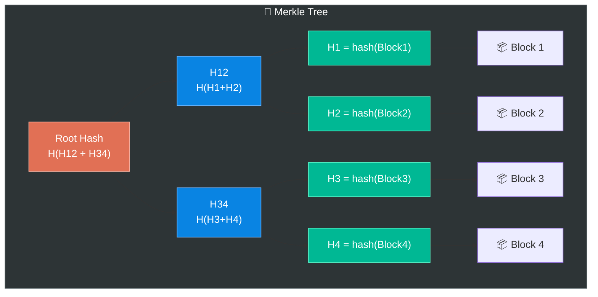

#### Detecting Differences Between Two Replicas:

```
Replica A Merkle Tree:              Replica B Merkle Tree:
     ROOT_A                              ROOT_B
    /      \                            /      \
  H12_A    H34_A                     H12_B    H34_B
  /   \    /   \                     /   \    /   \
H1   H2  H3   H4                  H1   H2  H3   H4*

Step 1: Compare ROOT_A vs ROOT_B → DIFFERENT! ❌
Step 2: Compare H12_A vs H12_B → SAME ✅ (skip entire left subtree!)
Step 3: Compare H34_A vs H34_B → DIFFERENT! ❌
Step 4: Compare H3 vs H3 → SAME ✅
Step 5: Compare H4 vs H4* → DIFFERENT! ❌
Step 6: Only sync Block 4! 🎯

Instead of comparing ALL blocks, we only checked 5 hashes
and synced 1 block!
```

> **💡 Why Merkle Trees are powerful:** The amount of data to transfer is proportional
> to the **differences**, not the total data size. Even with billions of keys,
> finding differences takes **O(log N)** comparisons!

---

## 📦 Core Component 6: Write Path — How Data Gets Written

When a client sends a `put(key, value)` request, here's what happens inside each server:

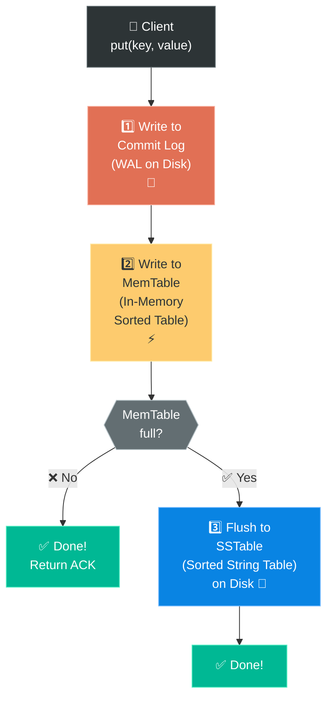

### Explanation:

| Step | Component | What Happens | Why |
|---|---|---|---|
| **1** | **Commit Log (WAL)** | Write is appended to a log file on disk | **Durability** — if server crashes, data can be recovered from the log |
| **2** | **MemTable** | Data is written to an in-memory sorted data structure (e.g., red-black tree, skip list) | **Speed** — in-memory writes are fast |
| **3** | **SSTable** | When MemTable exceeds a size threshold, it's flushed to disk as a **Sorted String Table** | **Persistence** — data survives crashes |

### 🍕 The Notebook Analogy:
- **Commit Log** = Writing in your **diary** first (permanent record, just in case)
- **MemTable** = Quick notes on a **sticky pad** (fast to write, limited space)
- **SSTable** = Filing the sticky notes into an organized **filing cabinet** when the pad is full

> This is exactly how **LSM-Trees (Log-Structured Merge Trees)** work —
> the storage engine behind Cassandra, LevelDB, and RocksDB!

---

## 📦 Core Component 7: Read Path — How Data Gets Read

When a client sends a `get(key)` request:

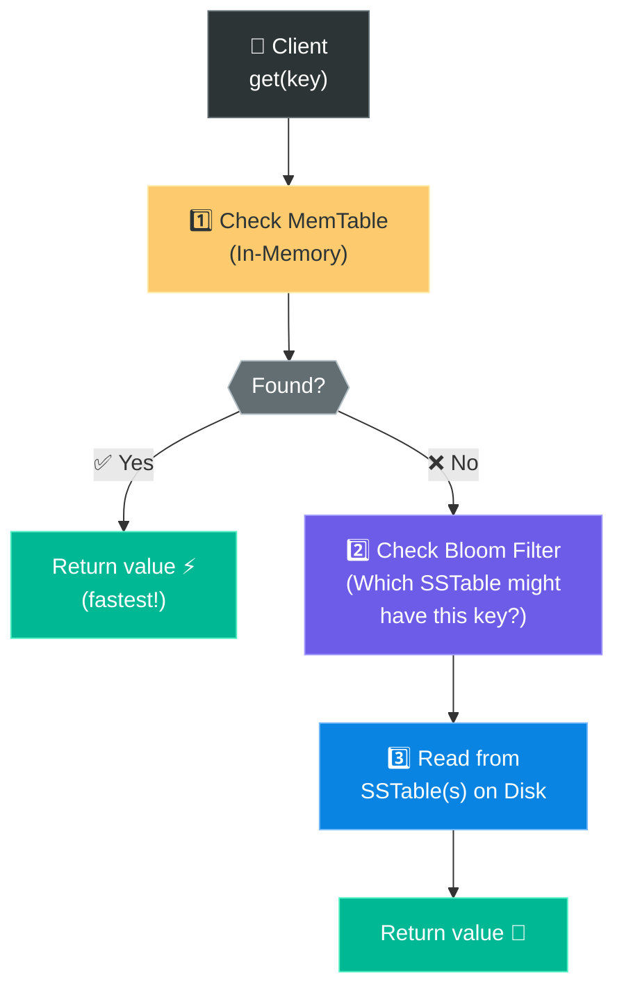

### What Is a Bloom Filter? 🌸

A **Bloom Filter** is a space-efficient probabilistic data structure that tells you:
- **"Definitely NOT here"** → skip this SSTable (100% accurate)
- **"Probably here"** → check this SSTable (small false-positive rate)

```
WITHOUT Bloom Filter:
  Key "user_42" → check SSTable 1, SSTable 2, SSTable 3, ... SSTable 100
  → 100 disk reads! 🐌

WITH Bloom Filter:
  Key "user_42" → Bloom says "only SSTable 7 might have it"
  → 1 disk read! ⚡
```

> **💡 Bloom Filters** are like a **fast bouncer** who can quickly say
> "this person is definitely NOT on the VIP list" (saving you from checking the full list).

---

## 🏗️ The Complete Architecture — Putting It All Together

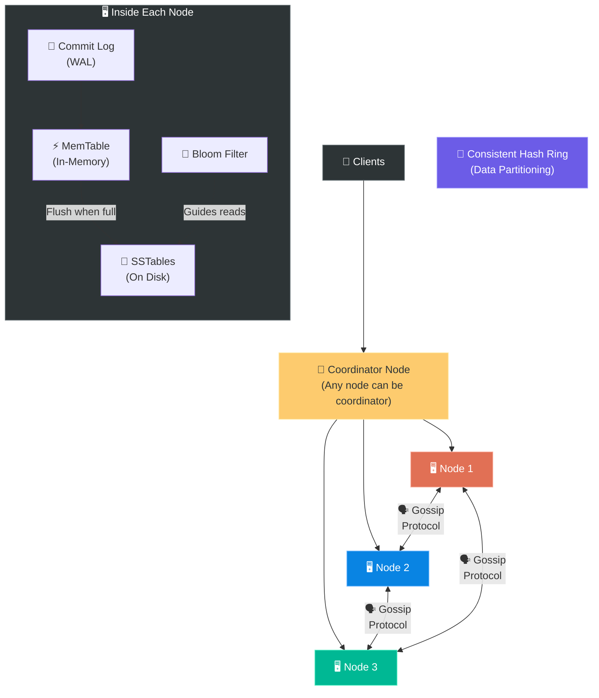

### How Everything Connects — Summary Table:

| Component | Purpose | Mechanism |
|---|---|---|
| **Consistent Hashing** | Split data across servers | Hash ring with virtual nodes |
| **Replication** | Redundancy & availability | Copy to N servers clockwise on ring |
| **Consistency (Quorum)** | Tune read/write guarantees | W + R > N for strong consistency |
| **Versioning** | Handle concurrent updates | Vector clocks to detect conflicts |
| **Gossip Protocol** | Failure detection | Decentralized heartbeat sharing |
| **Sloppy Quorum** | Handle temporary failures | Hinted handoff to neighbors |
| **Merkle Trees** | Sync permanent replicas | Hash tree comparison (O(log N)) |
| **Commit Log + MemTable + SSTable** | Storage engine | LSM-Tree (fast writes, efficient reads) |
| **Bloom Filter** | Speed up reads | Probabilistic "not here" filter |

---

## 📋 Summary — Quick Revision Table

| Topic | Key Takeaway |
|---|---|
| **What is a KV Store?** | Non-relational DB mapping unique keys to values |
| **CAP Theorem** | Pick 2 of 3: Consistency, Availability, Partition Tolerance. P is mandatory → choose CP or AP |
| **Our choice** | AP (Availability + Partition Tolerance) with eventual consistency |
| **Data Partition** | Consistent hashing with virtual nodes → even distribution, minimal remapping |
| **Replication** | Copy data to N nodes clockwise on hash ring |
| **Quorum (W, R, N)** | W + R > N → strong consistency. Lower W or R → faster but eventual consistency |
| **Vector Clocks** | Track `[server, version]` pairs to detect concurrent conflicts |
| **Gossip Protocol** | Decentralized failure detection via heartbeat gossip |
| **Sloppy Quorum** | Temporary failure handling — write to neighbor, handoff when recovered |
| **Merkle Trees** | Efficiently sync replicas by comparing hash trees (O(log N)) |
| **Write Path** | Commit Log → MemTable → SSTable (LSM-Tree) |
| **Read Path** | MemTable → Bloom Filter → SSTable |

---

## 🧠 Memory Tricks — How to Remember This Chapter

### The 7 Core Components — "**C**ats **R**un **C**razily, **V**ery **G**racefully **S**eeking **M**ice" 🐱🐭
> **C**onsistent hashing → **R**eplication → **C**onsistency (quorum) → **V**ector clocks →
> **G**ossip protocol → **S**loppy quorum → **M**erkle trees

### CAP Theorem — The Restaurant Rule:
> Your distributed restaurant can guarantee TWO of:
> - **C**onsistent menus (same food everywhere)
> - **A**lways open (never closed)
> - **P**hone lines working (network between branches)
> 
> Phone lines WILL fail → choose: Same menus (CP) or Always open (AP)?

### The Storage Engine — The Study Technique:
```
✍️ Commit Log  = Writing in diary FIRST (safety backup)
📋 MemTable    = Quick notes on sticky pad (fast, limited)
📁 SSTable     = Filing into cabinet when pad is full (permanent)
🌸 Bloom Filter = Quick "not here" check before searching cabinet
```

### Key Numbers to Remember:

```
╔═══════════════════════════════════════════════════════════╗
║  KEY-VALUE STORE — KEY NUMBERS                           ║
╠═══════════════════════════════════════════════════════════╣
║                                                          ║
║  CAP: Pick 2 of 3 (P is mandatory!)                     ║
║                                                          ║
║  Quorum: W + R > N → Strong Consistency                  ║
║    Common: N=3, W=2, R=2                                 ║
║                                                          ║
║  7 Core Components:                                      ║
║    Consistent Hashing, Replication, Quorum,              ║
║    Vector Clocks, Gossip Protocol,                       ║
║    Sloppy Quorum + Hinted Handoff, Merkle Trees          ║
║                                                          ║
║  Storage Engine (LSM-Tree):                              ║
║    Write: Commit Log → MemTable → SSTable                ║
║    Read:  MemTable → Bloom Filter → SSTable              ║
║                                                          ║
║  Real-World: DynamoDB (Amazon), Cassandra (Meta),        ║
║              Riak, Voldemort (LinkedIn)                   ║
║                                                          ║
╚═══════════════════════════════════════════════════════════╝
```

---

## ❓ Interview Quick-Fire Questions

**Q1: What is a key-value store? Give examples.**
> A non-relational database storing unique key-value pairs. Examples: Redis, DynamoDB,
> Memcached, etcd, Cassandra. Used for caching, session storage, configuration, etc.

**Q2: What is the CAP theorem? Why can't we have all three?**
> CAP says a distributed system can guarantee only 2 of: Consistency, Availability,
> Partition Tolerance. Since network partitions are unavoidable (P is mandatory),
> we must choose between CP (consistent but may be unavailable) or AP (available but
> may return stale data).

**Q3: Why use consistent hashing instead of modulo hashing?**
> Modulo hashing (`hash % N`) remaps **almost all keys** when servers are added/removed.
> Consistent hashing maps keys to a ring, so only keys between the affected server and
> its predecessor are remapped — O(K/N) instead of O(K).

**Q4: Explain the quorum consensus (W, R, N). When do you get strong consistency?**
> N = replicas, W = write acknowledgments needed, R = responses to read from.
> **Strong consistency when W + R > N** — guarantees at least one replica has the latest
> write in every read. Example: N=3, W=2, R=2 → 2+2=4 > 3 ✅.

**Q5: What are vector clocks and why are they needed?**
> Vector clocks track `[server, version]` pairs to detect concurrent updates across replicas.
> If two updates are concurrent (neither is ancestor of the other), they're "siblings" — a
> conflict that the client must resolve. Without vector clocks, we can't distinguish
> which version is newer when updates happen on different servers.

**Q6: How does the gossip protocol work for failure detection?**
> Each node maintains heartbeat counters for all nodes. Periodically, nodes share their
> lists with random peers. If a node's heartbeat hasn't increased beyond a threshold,
> it's considered offline. It's decentralized (no single point of failure) and
> scales well — O(N log N) messages to propagate info to all N nodes.

**Q7: What is hinted handoff?**
> When a target node is temporarily down, the write is sent to another healthy node
> instead, along with a "hint" of where it should eventually go. When the downed node
> recovers, the hint-holding node forwards the data. This prevents blocking writes
> during temporary failures.

**Q8: How do Merkle trees help with replica synchronization?**
> Instead of comparing all data between replicas (expensive!), Merkle trees let you
> compare hash summaries hierarchically. Start at the root — if same, all data matches.
> If different, drill down to find only the differing blocks. Requires O(log N)
> comparisons instead of O(N).

**Q9: Describe the write and read paths of an LSM-Tree based KV store.**
> **Write:** Append to commit log (durability) → insert into MemTable (in-memory sorted
> structure) → when MemTable is full, flush to SSTable (on disk).
> **Read:** Check MemTable first → if not found, use Bloom filter to identify which
> SSTable might have the key → read from that SSTable.

**Q10: What is a Bloom filter and why is it useful?**
> A probabilistic data structure that can tell you "definitely NOT in this set" (100%
> accurate for negatives) or "possibly in this set" (small false-positive rate). It saves
> huge amounts of disk I/O by avoiding unnecessary SSTable lookups during reads.

---

> **📖 Previous Chapter:** [← Chapter 4: Design a Rate Limiter](/HLD/chapter_4/design_a_rate_limiter.md)
>
> **📖 Next Chapter:** [Chapter 7: Design a Unique ID Generator →](/HLD/chapter_6/)
