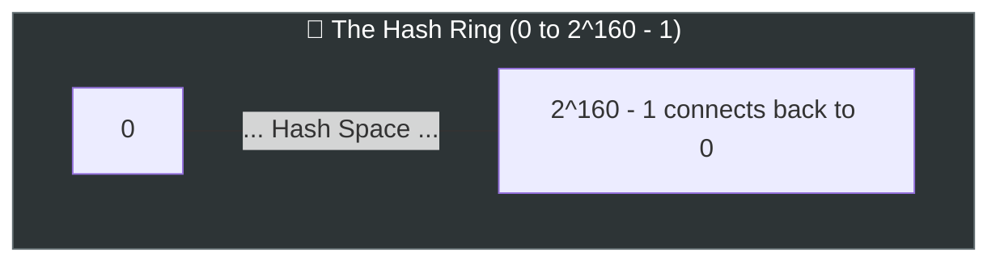
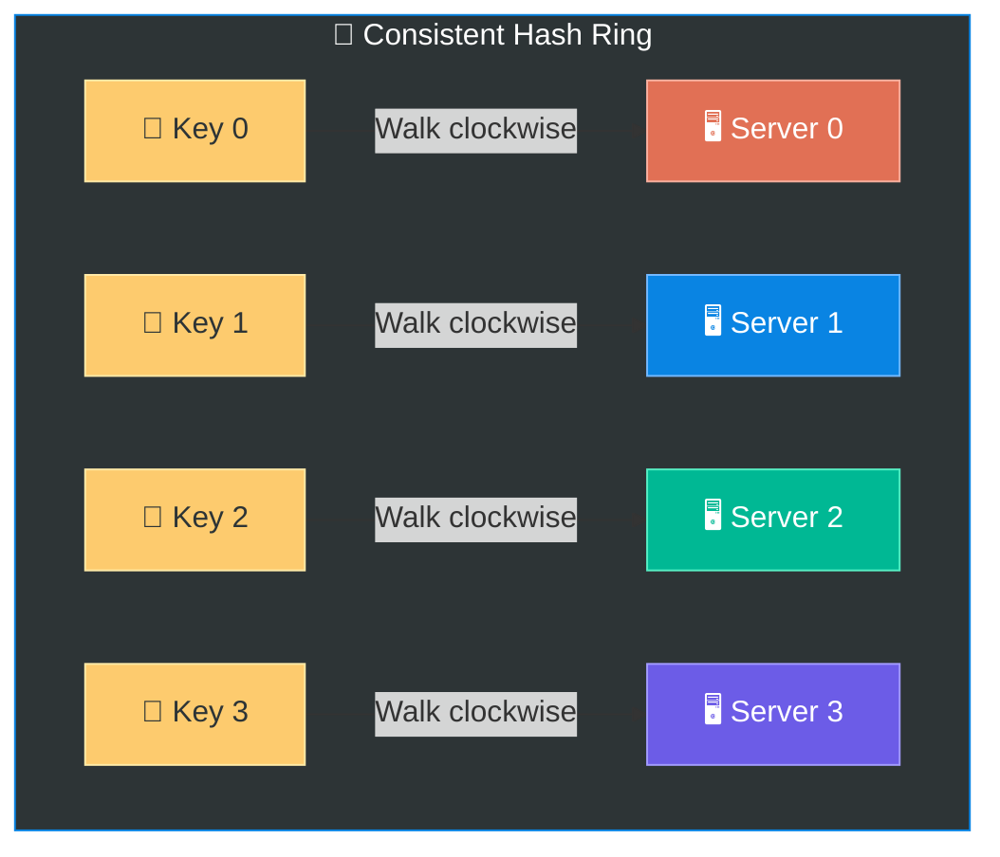
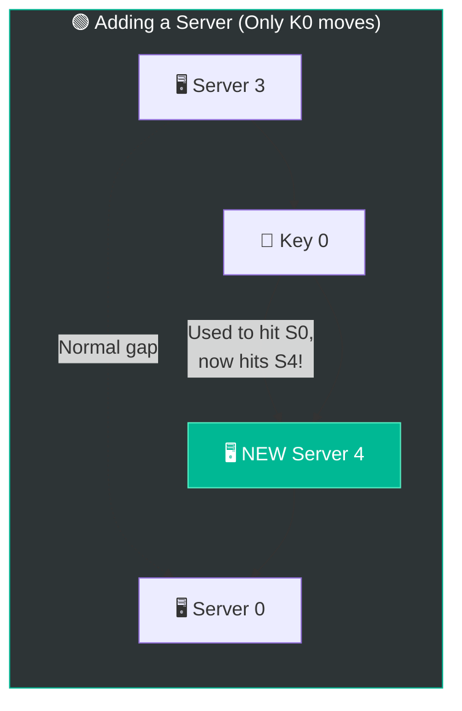
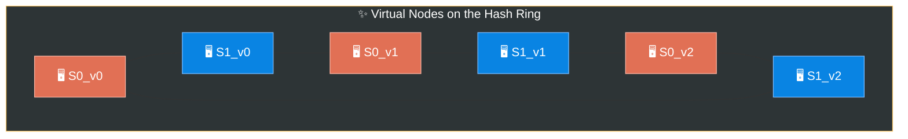

# Chapter 5: Design Consistent Hashing

> **Core Idea:** In horizontal scaling, we distribute data across multiple servers. But what happens 
> when you need to add or remove servers? If you use simple `hash(key) % N`, almost **every piece
> of data has to be moved** to a new server! **Consistent Hashing** elegantly solves this by mapping 
> data to a circular ring, ensuring that only a tiny fraction of data moves when servers change.

---

## 🧠 The Big Picture — The Rehashing Problem

### 🍕 The Delivery Driver Analogy:
Imagine you run a pizza shop with **4 delivery drivers**, and you divide the city evenly based on street numbers. 

```
Rule: Driver = (Street Number) % 4

Street 10 → Driver 2
Street 11 → Driver 3
Street 12 → Driver 0
Street 13 → Driver 1
```

**The Problem:** One driver calls in sick! Now you only have **3 drivers**. You have to recalculate everyone's route using `% 3`:
```
New Rule: Driver = (Street Number) % 3

Street 10 → Driver 1  (Was Driver 2) 💥 Route changed!
Street 11 → Driver 2  (Was Driver 3) 💥 Route changed!
Street 12 → Driver 0  (Stayed same)
Street 13 → Driver 1  (Stayed same)
```
Because the divisor changed from `4` to `3`, almost **everyone's route got reassigned**. 

In distributed systems, the "street numbers" are **data keys** (like profile pictures, cache items, or database rows) and the "drivers" are **servers**.

### Standard Modulo Hashing (N servers):
```javascript
serverIndex = hash(key) % N 
```
When `N` changes (a server crashes, or you add a new one to handle traffic spikes), the modulo result completely changes. **Massive data migration** occurs. Cache misses skyrocket, the database is hammered, and the system can crash under the load. 

> **💡 We need a way to distribute data evenly across servers while moving the absolute MINIMUM amount of data when servers are added or removed.**

---

## 🎯 What is Consistent Hashing?

Consistent Hashing bounds the number of keys that need to be remapped when a server is added or removed. According to Wikipedia:
> *Consistent hashing is a special kind of hashing such that when a hash table is resized, only `k/n` keys need to be remapped on average, where `k` is the number of keys, and `n` is the number of slots.*

### 1️⃣ The Hash Space and Hash Ring
Instead of using modulo arithmetic (`% N`), we treat the output range of our hash function (like SHA-1) as a **circular ring**.

- SHA-1 output range is `0` to `2^160 - 1`.
- Imagine wrapping this straight line of numbers into a circle. `x0` connects back to `xn`.
- We call this the **Hash Ring**.



### 2️⃣ Hash the Servers On the Ring
Using the same hash function (e.g., `SHA-1(server IP)` or `SHA-1(server name)`), we map each server to a specific position on the ring.

### 3️⃣ Hash the Keys On the Ring
We take the items we want to store (e.g., `SHA-1("user_1_profile.png")`) and map them onto the exact same ring.

### 4️⃣ Server Lookup (The Clockwise Walk)
To find out which server stores a specific key:
> **Rule:** Start at the key's position on the ring and walk **clockwise** until you hit a server. That server holds the key!



---

## 🏗️ Adding and Removing Servers

Let's see why consistent hashing is magical when scaling.

### 🟢 Adding a Server
Suppose we add **Server 4** between `Server 3` and `Server 0`.

Before: `Key 0` walked clockwise and belonged to `Server 0`.
After: `Key 0` walks clockwise and hits the newly added `Server 4` first! 

**What happens to the rest of the keys?**
Absolutely nothing! `Key 1`, `Key 2`, and `Key 3` still belong to their same servers. **Only a small fraction of keys (those between S3 and S4) move to the new server.**



### 🔴 Removing a Server
Suppose **Server 1 crashes**. 

Before: `Key 1` walked clockwise and hit `Server 1`.
After: Since `Server 1` is gone, `Key 1` keeps walking clockwise and now hits `Server 2`.

**What happens to the rest of the data?**
Nothing! `Key 0`, `Key 2`, and `Key 3` stay exactly where they are. Only the keys that belonged to the crashed server need to be redistributed.

---

## ⚠️ The Two Fatal Flaws of Basic Consistent Hashing

So far, the theory sounds perfect. But in the real world, placing servers randomly on a hash ring creates two massive problems.

### Problem 1: Uneven Partition Sizes
Because servers are hashed onto random positions on the ring, the "spaces" (partitions) between servers are almost never equal. 
- Server 0 might control **50%** of the ring hash space.
- Server 1 might control **10%** of the ring.
- Server 2 might control **40%** of the ring.

### Problem 2: Data Hotspots (Non-Uniform Distribution)
Even if partitions are relatively equal, real-world data is rarely uniform. You might end up with **Justin Bieber's user data, Taylor Swift's user data, and Cristiano Ronaldo's user data all landing closely together** on the hash ring, crushing one poor server while the other servers sit idle.

> *This is known as the **Celebrity Problem** or Hotspot Problem.*

---

## 🦸‍♂️ The Solution: Virtual Nodes (V-Nodes)

To fix the uneven distribution problems, we use **Virtual Nodes**. 

### 🍕 The Check-Out Counter Analogy
Imagine a grocery store with 3 cashiers.
- **Problem:** Cashier 1 gets a massive rush of people, while Cashier 2 and 3 are doing nothing.
- **Solution (Virtual Nodes):** You clone Cashier 1, 2, and 3, and put their clones at 5 different check-out lanes across the store! Now, no matter where a customer stands, there's a balanced chance they hit any of the cashiers.

### How Virtual Nodes Work
Instead of hashing a server `S0` once, we hash it **multiple times** using variations of its name to create clones (Virtual Nodes).

For example, 3 virtual nodes per server:
- Server 0 ➝ `s0_0`, `s0_1`, `s0_2`
- Server 1 ➝ `s1_0`, `s1_1`, `s1_2`

Now, instead of 2 servers on the ring, there are **6 virtual nodes** scattered everywhere!



### The Magic of Virtual Nodes:
By increasing the number of virtual nodes:
1. The partitions become **much smaller and more balanced**.
2. If one node crashes, its load is evenly distributed across the **remaining servers** rather than overwhelming just one neighbor.
3. You can put **more virtual nodes on your powerful servers**, and **fewer on your weaker servers** (Weighted Consistent Hashing!).

> **Real-World Note:** In production, systems usually use **100 to 200 virtual nodes per physical server**. A standard deviation of roughly 5% data variance is achieved with ~200 virtual nodes.

---

## 🔍 How to Find a Key in Code

How do we actually code "walking clockwise on a ring"?

1. Store the hashes of all **Virtual Nodes** in an array.
2. **Sort** the array in ascending order.
3. When a `key` needs to be placed, generate `hash(key)`.
4. Perform a **Binary Search** to find the first virtual node hash that is **greater than or equal to** the key's hash.
5. If the key hash is greater than all nodes (at the end of the array), wrap around to the `[0]` index element!

### Time Complexity:
- Finding a server for a key: **O(log(V))** (where V is the number of virtual nodes).
- Highly efficient!

---

## 🚀 Advanced Production Nuances (Staff/Senior Level)

If you really want to show deep expertise in an interview, mention these three advanced realities of consistent hashing that go beyond the standard theory.

### 1. Hash Algorithm Choice (Speed vs. Security)
We often use examples like `SHA-1` or `MD5` when explaining consistent hashing. But in a high-throughput production system, cryptographic hashes are actually **too slow** and over-engineered.
- **Production Choice:** Systems usually use **MurmurHash** or **CityHash**. 
- **Why?** They are non-cryptographic, meaning they execute exponentially faster than SHA-1, but still provide excellent uniform distribution of bits, which is all we care about for balancing the ring.

### 2. Data Replication on the Ring
In a real distributed system (e.g., Apache Cassandra or Dynamo), data is rarely stored on just *one* server. To ensure high availability, data has a **Replication Factor (N)** (e.g., `N=3`).
- **How it works:** When a key lands on the hash ring, you walk clockwise to find the first physical server (Replica 1).
- But you don't stop there. You continue walking clockwise to find the **second** and **third DISTINCT physical servers** to drop copies of the data. 
- *Crucial detail:* You must ensure you are picking distinct *physical* servers, ignoring any subsequent virtual nodes that point to a physical server you already replicated to!

### 3. Cascading Failures Defense
A classic interview trap is the "Cascading Failure" (or Thundering Herd) scenario. 
- **Without Virtual Nodes:** If `Server A` crashes, 100% of its traffic shifts directly next door to `Server B`. `Server B`'s load suddenly doubles, overloading it. `Server B` crashes. Now `Server C` gets 300% traffic, and the entire cluster collapses like dominos.
- **With Virtual Nodes:** If `Server A` dies, its ~200 virtual nodes disappear from the ring. The keys assigned to those 200 virtual nodes walk clockwise and land on hundreds of different virtual nodes belonging to `Server B`, `Server C`, `Server D`, etc.
- **The Result:** The load of the dead server is **sprayed uniformly and safely across the entire remaining cluster**, preventing the cascading failure!

---

## 📋 Summary — Quick Revision Table

| Topic | Key Takeaway |
|---|---|
| **Modulo Hashing (`% N`)** | Massive re-shuffling of data when servers change. |
| **Consistent Hashing** | Keys and Servers hashed to a ring. Walk clockwise to find server. |
| **Data Movement** | Only `k/n` keys move when adding/removing a server. Perfect for scaling. |
| **Flaw 1: Uneven Partitions** | Servers randomly placed create huge and tiny spaces. |
| **Flaw 2: Hotspots** | Some servers get crushed by clustered keys (Celebrity Problem). |
| **Virtual Nodes** | Hash each server multiple times (`s0_1`, `s0_2`). Fixes uneven partitions and hotspots. |
| **Search Implementation** | Sorted Array + Binary Search = O(log V) lookup time. |

---

## 🏛️ Real-World Use Cases
Consistent hashing is the backbone of modern distributed systems:
1. **Amazon DynamoDB:** Uses consistent hashing for its partitioning layer.
2. **Apache Cassandra:** Uses it for data partitioning across the cluster.
3. **Akamai (CDN):** Invented consistent hashing in 1997 to balance web traffic cache!
4. **Discord:** Uses consistent hashing for routing messages between millions of active connections.

---

## 🧠 Memory Tricks — How to Remember This Chapter

### The Core Concept — **"Clockwise Pizzeria"** 🍕
> If you close a pizza shop (Server crashes), the customers walk **CLOCKWISE** to the next open shop.
> If you open a new shop, you only take customers from the guy directly **counter-clockwise** to you!

### Flaws & Fixes — **"Clone the Waiters"** 👯‍♂️
> A few waiters standing in random spots in a giant restaurant is unfair (Uneven partitions). 
> **Clone the waiters** and place them everywhere! (Virtual Nodes).

---

## ❓ Interview Quick-Fire Questions

**Q1: Why is simple modulo hashing (`hash(key) % N`) bad for distributed caches?**
> When `N` (number of servers) changes, the modulo logic is mathematically altered. This means almost *all* existing keys will point to a different server index, resulting in massive cache invalidation and a thundering herd that crashes the databases.

**Q2: How does consistent hashing limit the impact of a crashed server?**
> When a server crashes, only the keys that were mapped directly to that server (the keys located between the crashed server and its preceding server on the ring) are remapped to the next clockwise server. All other keys remain exactly where they are. 

**Q3: What are virtual nodes and what two problems do they solve?**
> Virtual nodes are multiple logical representations of a single physical server hashed onto the ring. They solve **uneven partition sizes** (by creating lots of smaller, randomized partitions instead of a few massive ones) and **data hotspots** (by distributing a server's keys evenly across the whole ring). 

**Q4: How does weighted consistent hashing work?**
> By using virtual nodes, you can simply assign *more* virtual nodes to hardware with higher CPU/Memory capacity, and *fewer* virtual nodes to older, weaker hardware. This naturally routes more traffic to the stronger machines.

**Q5: How do you programmatically "walk clockwise" on a hash ring efficiently?**
> You store the sorted hash values of all virtual nodes in an array. When looking up a key, you `hash(key)` and use **Binary Search** (`O(log N)`) to find the first virtual node hash greater than the key's hash. If none is found, wrap around to index 0.

---

> **📖 Previous Chapter:** [← Chapter 4: Design a Rate Limiter](/HLD/chapter_4/design_a_rate_limiter.md)
>
> **📖 Next Chapter:** [Chapter 6: Design a Key-Value Store →](/HLD/chapter_6/design_a_key_value_store.md)
