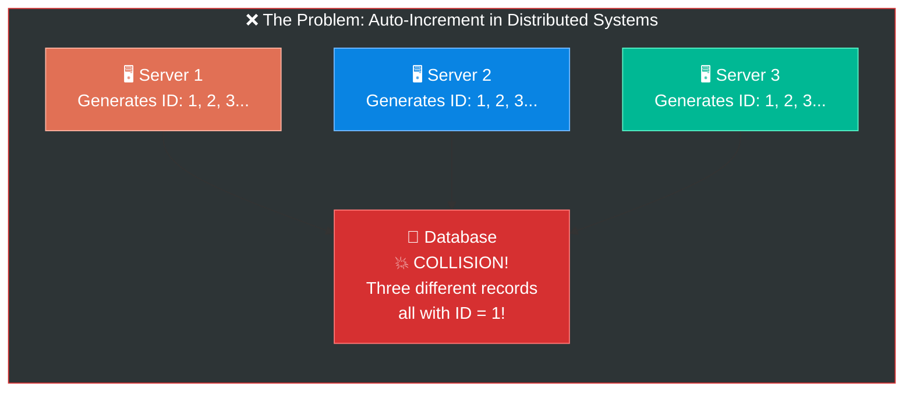
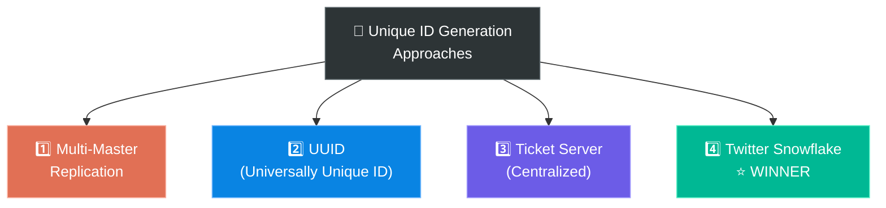
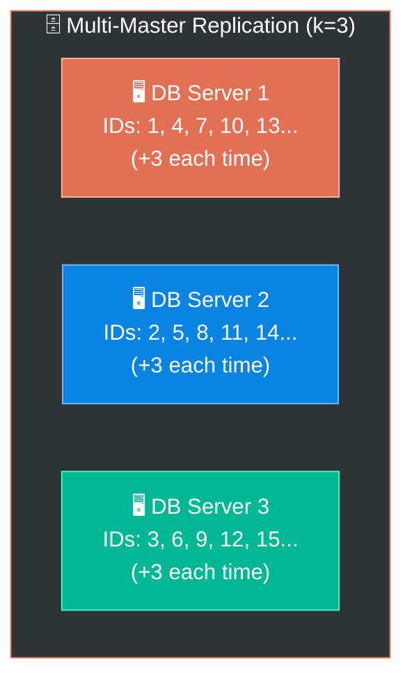
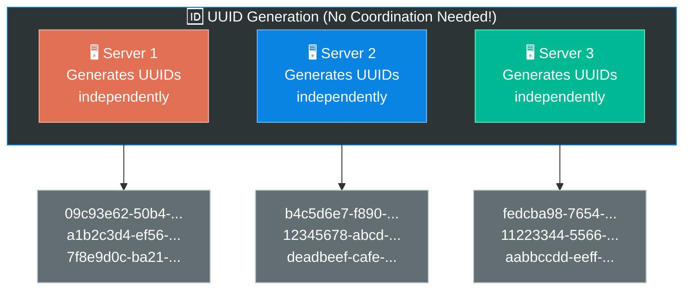
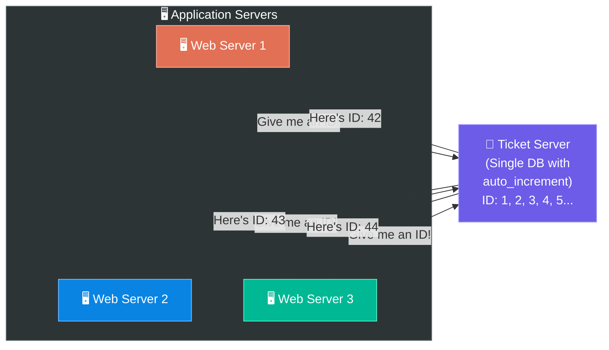
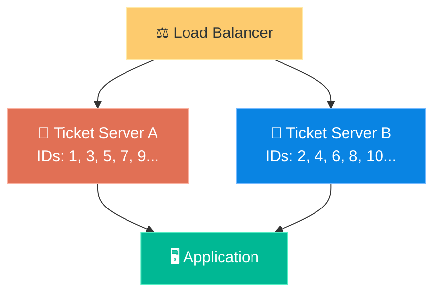
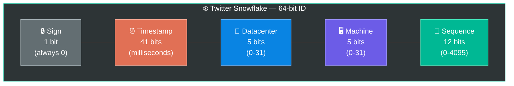
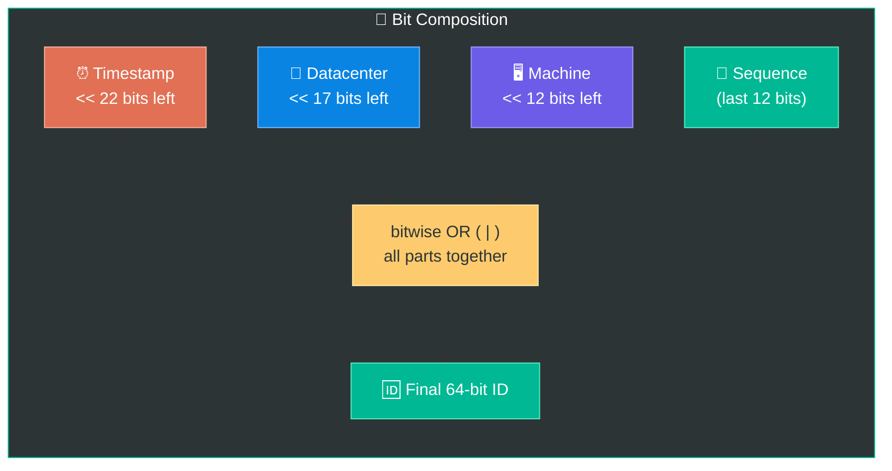
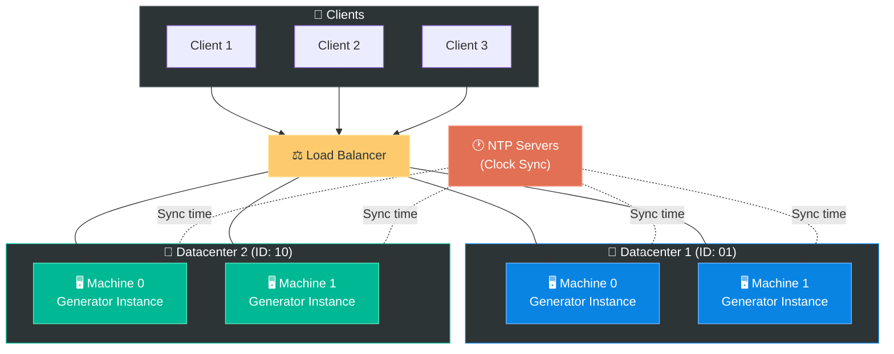

# Chapter 7: Design a Unique ID Generator in Distributed Systems

> **Core Idea:** In a distributed system with multiple servers generating data simultaneously,
> you need **globally unique IDs** for every record. You can't use a traditional auto-increment
> database ID because multiple servers would generate the **same number at the same time!**
> This chapter explores 4 approaches to generating unique IDs at scale — and why **Twitter's
> Snowflake** approach is often the best choice.

---

## 🧠 The Big Picture — Why Can't We Just Use Auto-Increment?

### 🍕 The Restaurant Receipt Analogy:

Imagine you own a restaurant chain with **3 branches**, and each branch gives receipts starting from `#1`:

```
Branch A: Receipt #1, #2, #3, #4, ...
Branch B: Receipt #1, #2, #3, #4, ...
Branch C: Receipt #1, #2, #3, #4, ...
```

**Problem:** When you combine all receipts at headquarters, you find **three Receipt #1s**,
**three Receipt #2s**, etc. You can't tell them apart! Which receipt #3 is from which branch?

In a **single database**, auto-increment works perfectly — one server, one counter, no conflicts.
But in a **distributed system** with multiple servers writing simultaneously, auto-increment
causes **collisions** and becomes a **bottleneck**.



### Why Not Just Use One Database with Auto-Increment?

| Concern | Why It Fails at Scale |
|---|---|
| **Single Point of Failure** | If that one DB goes down, the ENTIRE system can't generate IDs |
| **Latency** | Every server must call one central DB → network round-trip for every ID |
| **Throughput bottleneck** | One DB can handle ~1,000-10,000 IDs/sec. What if you need millions? |
| **Scaling** | Can't horizontally scale a single auto-increment counter across data centers |

> **💡 We need a way to generate unique IDs across multiple machines, in multiple data centers,
> at high speed, without any coordination!**

---

## 🎯 Step 1: Understand the Problem & Establish Design Scope

### Clarifying the Requirements:

```
You:  "What are the characteristics of unique IDs?"
Int:  "IDs must be unique and sortable."

You:  "For each new record, does ID increment by 1?"
Int:  "ID increments by time but not necessarily by 1. IDs created
       in the evening should be larger than those at morning."

You:  "Do IDs only contain numerical values?"
Int:  "Yes."

You:  "What's the ID length?"
Int:  "64-bit."

You:  "What's the scale of the system?"
Int:  "Should generate 10,000 unique IDs per second."
```

### 📋 Finalized Requirements:

| Requirement | Detail |
|---|---|
| **Unique** | No two IDs can be the same, across all servers |
| **Sortable** | IDs should be roughly sortable by time (newer = larger number) |
| **Numerical only** | IDs are 64-bit numbers (fits in a `long` in Java, `int64` in Go) |
| **64-bit** | Max value: 2⁶⁴ - 1 = ~18.4 quintillion (more than enough!) |
| **High throughput** | 10,000+ IDs per second |
| **Low latency** | ID generation should be fast (sub-millisecond) |
| **No coordination** | Servers should generate IDs independently |

---

## 🏗️ The 4 Approaches — Overview

Before we deep-dive, here are the 4 approaches we'll evaluate:



---

## 1️⃣ Approach 1: Multi-Master Replication

### 🍕 The Odd/Even Counting Analogy:

Imagine two kids are counting, but instead of both counting 1, 2, 3..., they **take turns**:
- **Kid A** counts: 1, 3, 5, 7, 9, 11... (odd numbers)
- **Kid B** counts: 2, 4, 6, 8, 10, 12... (even numbers)

They'll **never say the same number!** Each increments by 2 (the total number of kids)
instead of by 1.

### How It Works:

This approach uses the database's **auto_increment** feature, but instead of incrementing
by 1, it increments by **k** (where k = number of database servers).

```
With k = 3 servers:

Server 1: 1, 4, 7, 10, 13, 16, 19, ...  (start=1, step=3)
Server 2: 2, 5, 8, 11, 14, 17, 20, ...  (start=2, step=3)
Server 3: 3, 6, 9, 12, 15, 18, 21, ...  (start=3, step=3)

No duplicates! Each server generates unique IDs.
```



### Step-by-Step Example:

```
TIME  | Server 1 (step=3) | Server 2 (step=3) | Server 3 (step=3)
------+--------------------+--------------------+-------------------
  t1  |        1           |         2          |         3
  t2  |        4           |         5          |         6
  t3  |        7           |         8          |         9
  t4  |       10           |        11          |        12
  ...
```

All IDs are unique ✅ — because the starting points and step sizes guarantee no overlap.

### ⚠️ The Problems:

| Problem | Explanation |
|---|---|
| **IDs don't sort by time across servers** | Server 1 generates ID 10 at 3:00 PM, but Server 2 might generate ID 5 at 3:01 PM. ID 10 > 5, but it was created EARLIER! |
| **Hard to scale** | If you want to add a 4th server, you'd need to change `k` from 3 to 4 → ALL existing servers' step size changes! |
| **Not truly time-sortable** | IDs from different servers aren't comparable by creation time |

> **Verdict:** Solves uniqueness but **fails at sortability** and **scaling flexibility**. ❌

---

## 2️⃣ Approach 2: UUID (Universally Unique Identifier)

### 🍕 The License Plate Analogy:

Every car in the world gets a **unique license plate** — but no central authority assigns them
globally. Each country/state generates its own plates using a specific format. The plates
are so long and random that the chance of two cars having the same plate is practically
**zero**.

A **UUID** works the same way — it's a 128-bit number that's **so astronomically large** that
generating duplicates is virtually impossible, even without coordination.

### What Does a UUID Look Like?

```
UUID v4 Example: 09c93e62-50b4-468d-bf8a-c07e1040bfb2

Format: xxxxxxxx-xxxx-Mxxx-Nxxx-xxxxxxxxxxxx
        │              │    │
        └──────────────┴────┴── 32 hexadecimal characters (128 bits)

Total possible UUIDs: 2¹²⁸ = 340,282,366,920,938,463,463,374,607,431,768,211,456
                    = ~340 undecillion (340 trillion trillion trillion)
```

### How Unique Is "Unique"?

```
To get a 50% chance of ONE duplicate UUID, you'd need to generate:
  → 2.71 × 10¹⁸ UUIDs (2.71 quintillion!)

At 1 BILLION UUIDs per second:
  → It would take ~85 YEARS to have a 50% chance of one collision!

For practical purposes: UUID collision probability ≈ 0
```

### How It Works in a Distributed System:



### ✅ Pros & ❌ Cons:

| ✅ Pros | ❌ Cons |
|---|---|
| **Simple** — one line of code to generate | **128 bits** — our requirement is 64-bit! Too long |
| **No coordination** between servers needed | **NOT sortable by time** — UUIDs are random, not sequential |
| **Easy to scale** — just add more servers | **Non-numeric** — contains letters (hex), but we need numbers only |
| **Very low collision probability** | **No time component** — can't tell when an ID was created |

> **Verdict:** Great for uniqueness and simplicity, but **fails at sortability** and
> **doesn't fit 64-bit requirement**. ❌

---

## 3️⃣ Approach 3: Ticket Server (Centralized Auto-Increment)

### 🍕 The Deli Counter Analogy:

Imagine a busy deli with **one ticket machine** at the entrance. Every customer pulls a number:
- Customer A pulls **#37**
- Customer B pulls **#38**
- Customer C pulls **#39**

The ticket machine guarantees: sequential, unique, and simple. But what if the **machine breaks**?
Everyone is stuck — nobody can get a number! That's the single point of failure.

### How It Works:

Instead of each server generating its own IDs, we create a **dedicated centralized server**
(the "Ticket Server") that hands out IDs using a single auto-increment database.



### Implementation Detail:

Flickr (the photo-sharing site) actually used this approach! They used a MySQL database
with a `REPLACE INTO` trick to generate unique 64-bit IDs:

```sql
-- The Ticket Server's table (very simple!)
CREATE TABLE tickets64 (
    id BIGINT UNSIGNED NOT NULL AUTO_INCREMENT,
    stub CHAR(1) NOT NULL DEFAULT '',
    PRIMARY KEY (id),
    UNIQUE KEY stub (stub)
);

-- To generate a new ID:
REPLACE INTO tickets64 (stub) VALUES ('a');
SELECT LAST_INSERT_ID();
-- Returns: 1, then 2, then 3, ... each time you call it
```

> **REPLACE INTO** = if the row exists, delete it and re-insert → forces auto_increment
> to bump the ID every time. The `stub` column is just a dummy value.

### Making It Slightly More Reliable — Multiple Ticket Servers:

```
Ticket Server A: 1, 3, 5, 7, 9, 11, ...  (odd numbers)
Ticket Server B: 2, 4, 6, 8, 10, 12, ... (even numbers)

If Server A dies → Server B still works (you lose odd IDs, but service continues)
```



### ✅ Pros & ❌ Cons:

| ✅ Pros | ❌ Cons |
|---|---|
| Numeric IDs — easy to work with | **Single Point of Failure** — if ticket server goes down, ALL systems stop |
| Easy to implement | **Bottleneck** — every server must call the ticket server for every ID |
| Works great for small-medium systems | **Network latency** — adds a round-trip for every ID generation |
| IDs are sortable (sequential) | Doesn't scale well beyond a few thousand IDs/sec |

> **Verdict:** Simple and elegant for small systems (Flickr used it!), but the
> **single point of failure** and **scalability bottleneck** make it unsuitable
> for massive-scale systems. ❌

---

## 4️⃣ Approach 4: Twitter Snowflake ⭐ (The Winner!)

### 🍕 The Birth Certificate Analogy:

Think about how a **birth certificate number** is structured:
- First few digits = **year of birth** (time component)
- Next digits = **state/hospital code** (location)
- Last digits = **sequential number** that day (counter)

By reading the number, you can tell **when**, **where**, and **which** — all encoded
in a single number! Twitter's Snowflake ID works the same way.

### The Core Idea:

Instead of generating IDs independently (UUID) or from a central server (Ticket Server),
**divide the 64-bit ID into sections**, where each section encodes specific information.

> **💡 Key Insight:** We don't generate IDs from scratch.
> We **compose** them from meaningful parts — time, machine, and sequence!

### The 64-Bit Structure:

```
┌───────┬──────────────────────────────────────────┬──────────┬────────────────┬──────────────┐
│ Sign  │              Timestamp                   │Datacenter│   Machine ID   │  Sequence    │
│ 1 bit │              41 bits                     │  5 bits  │    5 bits      │  12 bits     │
└───────┴──────────────────────────────────────────┴──────────┴────────────────┴──────────────┘
  0       00000000000 00000000000 00000000000 000000  00000       00000         000000000000
```



### Deep Dive into Each Section:

#### Section 1: Sign Bit (1 bit)

```
Bit 63 (most significant): Always 0
  → 0 means the ID is always a POSITIVE number
  → Reserved for future use (if needed for signed/unsigned distinction)
```

#### Section 2: Timestamp (41 bits) ⏰ — The Most Important Part!

```
41 bits = 2⁴¹ - 1 = 2,199,023,255,551 milliseconds
        = ~69.7 YEARS of milliseconds!

HOW IT WORKS:
  - Pick a "custom epoch" (start date) — e.g., Twitter's: Nov 4, 2010
  - Timestamp = current_time_ms - custom_epoch_ms

EXAMPLE:
  Custom epoch:  Nov 4, 2010 00:00:00 UTC = 1288834974657 ms
  Current time:  Apr 8, 2026 08:00:00 UTC = 1775635200000 ms (approx)
  
  Timestamp value = 1775635200000 - 1288834974657 = 486,800,225,343

  In binary (41 bits): 00111000101010011000110011011111111111111

WHY A CUSTOM EPOCH?
  - Using Unix epoch (Jan 1, 1970) wastes ~40 years of bits
  - A custom epoch starting NOW gives you the full 69.7 years!
  - If you start your system in 2024, IDs work until ~2093
```

> **💡 Because the timestamp is in the MOST SIGNIFICANT bits, IDs are automatically
> sorted by time!** A later timestamp always produces a larger number.

#### Section 3: Datacenter ID (5 bits) 🏢

```
5 bits = 2⁵ = 32 possible datacenters (0 to 31)

EXAMPLE:
  Datacenter 0  = US-East (Virginia)
  Datacenter 1  = US-West (Oregon)
  Datacenter 2  = Europe (Ireland)
  Datacenter 3  = Asia (Singapore)
  ...up to 31 datacenters
```

#### Section 4: Machine ID (5 bits) 🖥️

```
5 bits = 2⁵ = 32 machines PER datacenter (0 to 31)

TOTAL MACHINES = 32 datacenters × 32 machines = 1,024 machines!

EXAMPLE:
  Datacenter 2, Machine 15 = the 15th server in the Europe datacenter
```

#### Section 5: Sequence Number (12 bits) 🔢

```
12 bits = 2¹² = 4,096 possible values (0 to 4,095)

This counter resets to 0 EVERY MILLISECOND.

MEANING: Each machine can generate up to 4,096 unique IDs
         per millisecond!

WHAT HAPPENS:
  - Same millisecond, same machine → sequence increments: 0, 1, 2, 3...
  - New millisecond → sequence RESETS to 0
  
EXAMPLE (Machine 5, Datacenter 1):
  At time 1000ms: seq=0, seq=1, seq=2 (3 IDs generated this ms)
  At time 1001ms: seq=0 (reset!), seq=1 (2 IDs this ms)
  At time 1002ms: seq=0 (1 ID this ms)
```

### 🔢 Let's Calculate the Total Throughput:

```
PER MACHINE:
  4,096 IDs per millisecond × 1,000 milliseconds per second
  = 4,096,000 IDs per second per machine! ⚡

TOTAL SYSTEM:
  4,096,000 IDs/sec × 1,024 machines
  = 4,194,304,000 IDs/sec (4.2 BILLION IDs per second!)

  Our requirement was 10,000 IDs/sec → Snowflake can handle
  419,430× more than needed! ✅
```

### Step-by-Step ID Generation Example:

```
Let's generate an ID at this exact moment:

INPUTS:
  Current time:    1775635200000 ms  (Apr 8, 2026, 08:00:00.000 UTC)
  Custom epoch:    1288834974657 ms  (Twitter's epoch)
  Datacenter ID:   5                 (Asia datacenter)
  Machine ID:      18                (Server #18)
  Sequence:        73                (73rd ID this millisecond)

STEP 1: Calculate timestamp
  timestamp = 1775635200000 - 1288834974657 = 486800225343

STEP 2: Convert each section to binary
  Sign:        0                        (1 bit)
  Timestamp:   0111000101010011000110011011111111111111  (41 bits)
  Datacenter:  00101                    (5 bits)  → 5
  Machine:     10010                    (5 bits)  → 18
  Sequence:    000001001001             (12 bits) → 73

STEP 3: Concatenate all bits
  0 | 0111000101010011000110011011111111111111 | 00101 | 10010 | 000001001001

STEP 4: Convert 64-bit binary to decimal
  = 2,040,467,968,853,285,961 (a unique 64-bit number!)
```

### Visual: How the Bit Shifting Works (Code Logic):

```
In code, the ID is composed using bitwise operations:

ID = (timestamp << 22)      ← shift timestamp left by 22 bits
   | (datacenterId << 17)   ← shift datacenter left by 17 bits
   | (machineId << 12)      ← shift machine left by 12 bits
   | sequence               ← sequence fills the last 12 bits

WHY 22? Because datacenter(5) + machine(5) + sequence(12) = 22 bits
WHY 17? Because machine(5) + sequence(12) = 17 bits
WHY 12? Because sequence is the last 12 bits
```



### Pseudocode Implementation:

```python
class SnowflakeIDGenerator:
    def __init__(self, datacenter_id, machine_id, custom_epoch):
        self.datacenter_id = datacenter_id   # 5 bits (0-31)
        self.machine_id = machine_id         # 5 bits (0-31)
        self.custom_epoch = custom_epoch     # Start timestamp (ms)
        self.sequence = 0                    # 12 bits (0-4095)
        self.last_timestamp = -1             # Track last ms

    def generate_id(self):
        current_time = get_current_time_ms()

        # SAME millisecond → increment sequence
        if current_time == self.last_timestamp:
            self.sequence = (self.sequence + 1) & 0xFFF  # 0xFFF = 4095
            if self.sequence == 0:
                # Sequence exhausted! Wait for next millisecond
                current_time = wait_for_next_ms(self.last_timestamp)
        else:
            # NEW millisecond → reset sequence to 0
            self.sequence = 0

        self.last_timestamp = current_time

        # COMPOSE the 64-bit ID using bit shifts
        timestamp = current_time - self.custom_epoch

        id = ((timestamp   << 22)           # 41-bit timestamp
            | (self.datacenter_id << 17)    # 5-bit datacenter
            | (self.machine_id << 12)       # 5-bit machine
            | self.sequence)                # 12-bit sequence

        return id
```

### Edge Case: Clock Synchronization ⏰

```
PROBLEM: What if the server's clock goes BACKWARD?
  (This can happen due to NTP clock adjustment)

SCENARIO:
  t=1000ms → generate ID with timestamp 1000
  Clock adjusts backward!
  t=998ms  → generate ID with timestamp 998 (SMALLER than before!)
  
  → IDs are no longer time-sorted! 💥
  → Could even generate DUPLICATE IDs if we revisit the same ms!

SOLUTION:
  - If current time < last_timestamp → REJECT the request or WAIT
  - Use NTP with "slew" mode (gradual adjustment, never jumps back)
  - Log a critical alert — clock going backward is serious!
```

### ✅ Pros & ❌ Cons:

| ✅ Pros | ❌ Cons |
|---|---|
| **64-bit** — fits our requirement perfectly | Clock synchronization across servers is critical |
| **Time-sortable** — timestamp in MSB means newer = larger | ID structure is fixed — can't easily change bit allocation |
| **No coordination** — each machine generates independently | Tied to timestamp — if clock drifts, IDs can be wrong |
| **Blazingly fast** — no network calls, pure math | Need to handle clock-going-backward edge case |
| **Scales massively** — 4M+ IDs/sec per machine | — |
| **Compact** — just a single 64-bit number | — |

> **Verdict:** Meets ALL requirements — unique, sortable, 64-bit, numeric,
> high throughput, no coordination. ⭐ **THIS IS THE ANSWER!**

---

## 📊 The Ultimate Comparison Table

| Feature | Multi-Master | UUID | Ticket Server | Snowflake ⭐ |
|---|---|---|---|---|
| **Uniqueness** | ✅ Yes | ✅ Yes (practically) | ✅ Yes | ✅ Yes |
| **Sortable by time** | ❌ No | ❌ No | ✅ Yes (sequential) | ✅ Yes (timestamp) |
| **Fits 64-bit** | ✅ Yes | ❌ No (128-bit) | ✅ Yes | ✅ Yes |
| **Numeric only** | ✅ Yes | ❌ No (hex) | ✅ Yes | ✅ Yes |
| **No coordination** | ✅ Yes | ✅ Yes | ❌ No (central server) | ✅ Yes |
| **Scalability** | ⚠️ Hard to add servers | ✅ Excellent | ❌ Bottleneck | ✅ Excellent |
| **Single point of failure** | ✅ None | ✅ None | ❌ Yes | ✅ None |
| **Throughput** | Medium | High | Low-Medium | ⚡ Very High |
| **Complexity** | Low | Very Low | Low | Medium |
| **Real-world users** | — | Many APIs, MongoDB | Flickr | Twitter, Discord, Instagram |

---

## 🔧 Tuning the Snowflake — Adjusting Bit Allocation

One of Snowflake's strengths is that you can **customize the bit allocation** based on
your specific needs:

```
SCENARIO 1: Low concurrency, VERY long lifespan
  ┌─────┬───────────────┬──────────┬──────────┬──────────┐
  │ 1   │  42 bits      │  5 bits  │  5 bits  │ 11 bits  │
  │Sign │  Timestamp    │  DC ID   │ Machine  │ Sequence │
  └─────┴───────────────┴──────────┴──────────┴──────────┘
  Timestamp: 42 bits = ~139 years!
  Sequence:  11 bits = 2,048 IDs/ms (half of default, but lasts twice as long)

SCENARIO 2: Massive concurrency, fewer data centers
  ┌─────┬───────────────┬──────────┬──────────┬──────────┐
  │ 1   │  39 bits      │  3 bits  │  5 bits  │ 16 bits  │
  │Sign │  Timestamp    │  DC ID   │ Machine  │ Sequence │
  └─────┴───────────────┴──────────┴──────────┴──────────┘
  Sequence:   16 bits = 65,536 IDs/ms (16× more!)
  Datacenter: 3 bits = 8 DCs only
  Timestamp:  39 bits = ~17 years

SCENARIO 3: Single datacenter, lots of machines
  ┌─────┬───────────────┬──────────┬──────────┬──────────┐
  │ 1   │  41 bits      │  0 bits  │ 10 bits  │ 12 bits  │
  │Sign │  Timestamp    │  (none)  │ Machine  │ Sequence │
  └─────┴───────────────┴──────────┴──────────┴──────────┘
  Machines: 10 bits = 1,024 machines!
  No datacenter bits needed if you only have 1 DC
```

> **💡 Key Insight:** The bit allocation is a design decision. Discuss trade-offs with
> your interviewer: more timestamp bits = longer lifespan, more sequence bits = higher
> concurrency, more machine bits = more servers.

---

## 🏗️ Complete Architecture — Putting It All Together



### How a Request Flows:

```
1. Client sends request that needs a unique ID
2. Load balancer routes to a server in a datacenter
3. That server's Snowflake generator:
   a. Gets current timestamp (milliseconds since custom epoch)
   b. Uses its pre-configured datacenter ID and machine ID
   c. Increments the sequence number (resets each millisecond)
   d. Composes the 64-bit ID using bit shifts
   e. Returns the ID — NO network call, NO database, pure local computation!
4. Total time: < 1 microsecond ⚡
```

---

## 📋 Summary — Quick Revision Table

| Topic | Key Takeaway |
|---|---|
| **Why not auto-increment?** | Single point of failure, bottleneck, doesn't scale across servers |
| **Multi-Master** | Each DB increments by k (# of servers). Unique but NOT time-sortable |
| **UUID** | 128-bit random ID. Simple, no coordination, but too long and not sortable |
| **Ticket Server** | Centralized auto-increment server. Simple but single point of failure |
| **Snowflake ⭐** | 64-bit ID = timestamp(41) + datacenter(5) + machine(5) + sequence(12) |
| **Why Snowflake wins** | Unique, sortable, 64-bit, no coordination, 4M+ IDs/sec/machine |
| **Custom epoch** | Start timestamp from YOUR system's launch date → maximize 69.7-year range |
| **Sequence overflow** | If 4,096 IDs generated in 1ms, WAIT for next millisecond |
| **Clock sync** | Use NTP. If clock goes backward → reject/wait + alert |
| **Tunable** | Adjust bit allocation for your needs (more timestamp vs more sequence) |

---

## 🧠 Memory Tricks — How to Remember This Chapter

### The 4 Approaches — "**M**y **U**ncle **T**exts **S**lowly" 📱
> **M**ulti-master → **U**UID → **T**icket Server → **S**nowflake

### Snowflake Bit Layout — "**S**ome **T**iny **D**ogs **M**ake **S**ounds" 🐕
> **S**ign (1) → **T**imestamp (41) → **D**atacenter (5) → **M**achine (5) → **S**equence (12)
> Remember: **1 + 41 + 5 + 5 + 12 = 64 bits!**

### Key Numbers to Remember:

```
╔══════════════════════════════════════════════════════════════╗
║  UNIQUE ID GENERATOR — KEY NUMBERS                          ║
╠══════════════════════════════════════════════════════════════╣
║                                                              ║
║  Snowflake: 1 + 41 + 5 + 5 + 12 = 64 bits                  ║
║                                                              ║
║  41-bit timestamp = ~69.7 years                              ║
║  5-bit datacenter = 32 datacenters                           ║
║  5-bit machine    = 32 machines/DC (1,024 total)             ║
║  12-bit sequence  = 4,096 IDs/millisecond/machine            ║
║                                                              ║
║  Total: 4,096 × 1,000 = 4,096,000 IDs/sec/machine           ║
║  System: 4,096,000 × 1,024 = 4.2 BILLION IDs/sec!           ║
║                                                              ║
║  UUID: 128 bits = 2¹²⁸ possibilities                        ║
║  Snowflake: 64 bits = time-sortable + compact                ║
║                                                              ║
║  Real-World: Twitter, Discord, Instagram, Spotify            ║
║                                                              ║
╚══════════════════════════════════════════════════════════════╝
```

### The Pros/Cons Quick Memory:

```
Multi-Master:  ✅ Simple     ❌ Not sortable, hard to scale
UUID:          ✅ No coord.  ❌ 128-bit, not sortable, not numeric
Ticket Server: ✅ Sequential ❌ SPOF, bottleneck
Snowflake:     ✅ EVERYTHING ❌ Clock sync needed
```

---

## ❓ Interview Quick-Fire Questions

**Q1: Why can't we use auto-increment in distributed systems?**
> A single auto-increment DB is a **single point of failure** and a **scalability bottleneck**.
> Multiple DBs with auto-increment generate **duplicate IDs**. It also requires a network
> round-trip for every ID, which adds latency.

**Q2: What is a UUID? Why might we NOT use it here?**
> A UUID is a **128-bit** globally unique identifier. We don't use it because our requirement
> is **64-bit**, UUIDs are **not numerically sortable by time**, and they contain
> **non-numeric characters** (hex). However, UUIDs are great when you don't need
> sort order or compact storage.

**Q3: Explain the Ticket Server approach. What's its main weakness?**
> A dedicated server with an auto-increment database hands out IDs sequentially.
> **Main weakness: Single Point of Failure.** If the ticket server goes down, no service
> can generate IDs. Even with multiple ticket servers (odd/even), it's still a
> centralized bottleneck with network latency for every ID request.

**Q4: Explain Twitter's Snowflake approach. Walk through the 64-bit structure.**
> Snowflake divides a 64-bit ID into: **1 bit** sign (always 0) + **41 bits** timestamp
> (milliseconds since custom epoch, ~69.7 years) + **5 bits** datacenter ID (32 DCs) +
> **5 bits** machine ID (32 machines/DC) + **12 bits** sequence (4,096/ms).
> IDs are time-sortable because the timestamp occupies the most significant bits.

**Q5: How do you handle the sequence number overflow in Snowflake?**
> If 4,096 IDs are generated in the same millisecond on the same machine (sequence
> wraps to 0), the generator **waits until the next millisecond** before generating
> the next ID. This is called "clock wait" and ensures uniqueness.

**Q6: What happens if the system clock goes backward?**
> This can happen due to NTP (Network Time Protocol) adjustments. If detected
> (current_time < last_timestamp), the generator should **refuse to generate IDs**
> and raise an alert. Alternatively, use NTP in "slew" mode which adjusts gradually
> and never jumps backward.

**Q7: Why use a custom epoch instead of Unix epoch?**
> Unix epoch starts from **Jan 1, 1970** — that wastes ~50+ years of timestamp bits.
> A custom epoch starting from your system's launch date (e.g., 2024) gives you the
> **full 69.7 years** of range until ~2093, maximizing the useful lifespan of your IDs.

**Q8: Can you customize the bit allocation in Snowflake?**
> Yes! The bit allocation is a design decision. If you need **more concurrency**,
> increase sequence bits (16 bits = 65,536/ms). If you need a **longer lifespan**,
> increase timestamp bits (42 bits = ~139 years). If you have **fewer datacenters**,
> reduce those bits and reallocate them elsewhere. Total must always equal 64.

**Q9: How does Snowflake guarantee uniqueness without coordination?**
> Each machine has a **unique (datacenter_id, machine_id) pair** — assigned at deployment.
> The timestamp changes every millisecond, and the sequence counter handles multiple
> IDs within the same millisecond. Since no two machines share the same ID pair,
> and the sequence resets per-millisecond, collisions are impossible (assuming
> synchronized clocks).

**Q10: Compare Snowflake with UUID — when would you choose each?**
> Choose **Snowflake** when you need: 64-bit compact IDs, time-sortability, high throughput,
> and numeric-only IDs (e.g., Twitter timelines, database primary keys).
> Choose **UUID** when you need: no infrastructure setup, cross-system uniqueness without
> coordination, and don't care about sort order or ID size (e.g., distributed logs,
> session tokens, idempotency keys).

---

> **📖 Previous Chapter:** [← Chapter 6: Design a Key-Value Store](/HLD/chapter_5/design_a_key_value_store.md)
>
> **📖 Next Chapter:** [Chapter 8: Design a URL Shortener →](/HLD/chapter_7/)
