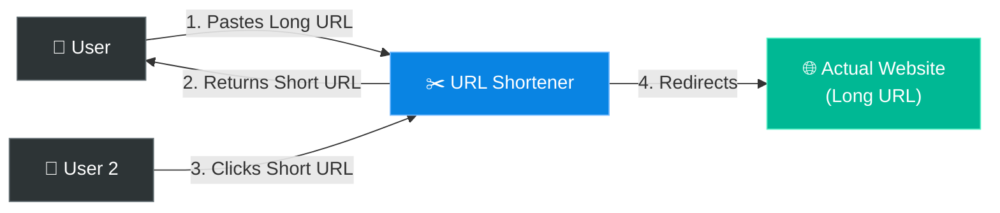
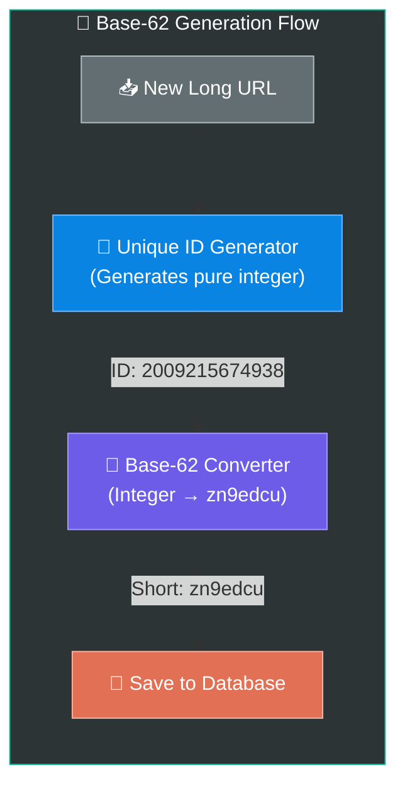
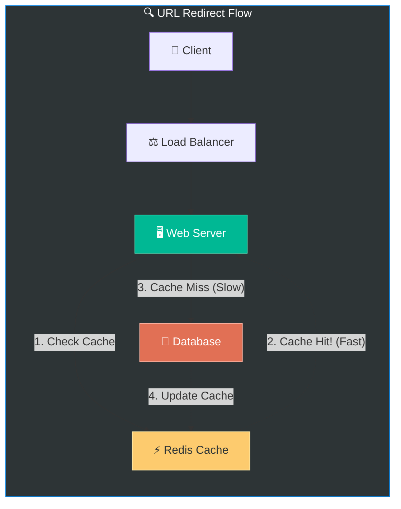

# Chapter 8: Design a URL Shortener

> **Core Idea:** A URL shortener (like `bit.ly` or `tinyurl.com`) takes a long, cumbersome URL and converts it into a short, easy-to-share alias. When users click the short alias, they are immediately redirected to the original long URL. Designing this tests your ability to handle **heavy read traffic**, **data partitioning**, and **hashing algorithms**.

---

## 🧠 The Big Picture — Why Do We Need URL Shorteners?

### 🍕 The Giant Map Analogy:
Imagine trying to tell a friend how to find a specific restaurant by giving them the exact GPS coordinates: `Latitude: 40.748817, Longitude: -73.985428`. It’s accurate, but terrible to communicate.

Instead, you say: `"Meet me at the Empire State Building."`

A URL shortener does exactly this. It takes an ugly internet address like:
`https://www.amazon.com/dp/B08F7PTF53/ref=sr_1_1?crid=3R7&keywords=system+design`

And turns it into:
`https://tinyurl.com/y8z9j2x`



---

## 🎯 Step 1: Understand the Problem & Establish Design Scope

### Clarifying the Requirements:

```
You:  "Can you give an example of how the short URL looks?"
Int:  "https://tinyurl.com/{hash_value}."

You:  "What is the traffic volume?"
Int:  "100 million new URLs generated per month."

You:  "How long should the shortened URL be?"
Int:  "As short as possible."

You:  "Can shortened URLs be deleted or updated?"
Int:  "Assume they are permanent and cannot be deleted or updated for simplicity."
```

### 🧮 Back-of-the-Envelope Estimation

Let's do some quick math to understand the scale we are dealing with (Assume 10 years of operation):

| Metric | Calculation | Result |
|---|---|---|
| **Write operations (New URLs)** | Given: 100 million/month | `~40 writes/sec` |
| **Read operations (Clicks)** | Assuming read:write ratio of 10:1 | `~400 reads/sec` |
| **Total URLs over 10 years** | 100M/month × 12 months × 10 years | `12 Billion URLs` |
| **Storage required** | 12 Billion × 100 bytes (average URL length) | `~1.2 Terabytes (TB)` |

> **Takeaway:** We need a system that supports massive read traffic and can store 1.2 TB of data efficiently. Since 1.2 TB easily fits in modern databases, storage isn't our biggest bottleneck — **performance and scaling read operations are.**

---

## 🏗️ Step 2: High-Level Design

### 1️⃣ The Two Core APIs

Our system needs exactly two API endpoints. We will design them using RESTful conventions.

**1. URL Shortening API (Write)**
```http
POST api/v1/data/shorten
body: { "longUrl": "https://www.example.com/very/long/url" }

Return: "https://tinyurl.com/aBc123X"
```

**2. URL Redirecting API (Read)**
```http
GET api/v1/shortUrl
Request URL: https://tinyurl.com/aBc123X

Return: HTTP 301 Redirect to "https://www.example.com/very/long/url"
```

### 2️⃣ Wait... HTTP 301 vs. HTTP 302 Redirects? 🛣️

When a user hits the short URL, the server responds with a redirect status code and the `Location` header containing the long URL. But which status code should we use? This is a **classic interview trap**!

| Status Code | Meaning | Who Caches It? | Benefit | Drawback |
|---|---|---|---|---|
| **301 Permanent Redirect** | "This URL has moved permanently." | **Browser caches it.** Future clicks go *straight* to the long URL without hitting our server! | Less load on our servers. | **Analytics are lost.** We can't track how many times the user clicked it after the first time. |
| **302 Found (Temporary)** | "This URL is temporarily moved." | **Browser does NOT cache it.** Every click hits our server first, then redirects. | **Better analytics.** We can track click rates, locations, etc. | Higher load on our servers. |

> **💡 Verdict:** If reducing server load is the priority, use **301**. If tracking analytics and click-rates is the priority, use **302**.

---

## 🔬 Step 3: Deep Dive — How to Create the Hash?

The core challenge of this system is translating the long URL into that tiny 7-character string (e.g., `aBc123X`). 

### What characters can we use?
We want our URLs to contain only safe, alphanumeric characters.
- Numbers (`0-9`) = 10 characters
- Lowercase (`a-z`) = 26 characters
- Uppercase (`A-Z`) = 26 characters
- Total: `10 + 26 + 26 = 62 allowable characters`

### How long should the hash be?
If we use 62 possible characters, how many characters do we need to store our 12 Billion URLs?
- 62^6 = ~56.8 Billion possibilities.
- 62^7 = ~3.5 Trillion possibilities.

> **💡 Verdict:** A length of **7 characters** using Base-62 encoding gives us 3.5 trillion possible URLs. That is way more than our 12 billion requirement.

---

### 🔀 The Two Approaches for URL Shortening

There are two main strategies to map a long URL to a short URL.

#### Approach A: Hash + Collision Resolution 💥
In this approach, we run the long URL through a standard hash function (like MD5 or SHA-1), take the first 7 characters, and hope it's unique.

1. `MD5(long_url)` -> `5d41402abc4b2a76b9719d911017c592`
2. Take the first 7 chars -> `5d41402`
3. Check the Database: "Does `5d41402` already exist?"
4. **Collision!** What if it exists? We append a random string to the long URL and hash it again. Repeat until unique.

**Why this approach is BAD:**
Every time there's a collision, you have to query the database *again*. As the database fills up, collisions become highly frequent, creating a massive write-bottleneck. (Also known as a **database probe penalty**).

#### Approach B: Base-62 Conversion 🚀 (THE WINNER)
Forget hashing the long URL! What if we just assign every incoming URL a **Unique ID**, and convert that ID number into Base-62?

Think back to **Chapter 7 (Unique ID Generator)**!
1. Use our Snowflake ID generator (or a Ticket Server) to get a guaranteed unique, sequential number.
2. Example: The generator gives us the integer ID `2009215674938`.
3. Convert that base-10 number into a base-62 string.
4. Conversion result = `zn9edcu`.
5. Save in Database: ID = `2009215674938`, ShortURL = `zn9edcu`, LongURL = `https://amazon.com/...`



### Hash + Collision vs. Base-62 Comparison

| Feature | Hash + Collision Resolution | Base-62 Conversion (Winner) |
|---|---|---|
| **Collision possible?** | Yes. Must query DB to resolve. | **No.** Using a Unique ID generator guarantees no collisions. |
| **URL Length** | Fixed length (e.g., exactly 7 chars) | Variable length (grows as the unique ID integer grows) |
| **Speed** | Slows down as DB fills up (more collisions) | Lightning fast (O(1) generation, no checking needed) |
| **Security** | Opaque (hard to guess next short URL) | Predictable! (If I know ID 100 is `bK`, ID 101 is `bL`). Requires extra security/randomization layer. |

> **⚠️ Interview Note:** Base-62 is the preferred method for modern system design interviews, but you **must** call out the security flaw: users can guess the next shortened URL. To fix this, you can shuffle the Base-62 alphabet, or append some randomized bits to the ID before converting.

---

## 🚀 Step 4: Scale the System

A URL shortener is extremely **read-heavy** (10 times more reads than writes). If we hit the database for every single click, our database will melt. 

### 1️⃣ Caching (The Savior of Read-Heavy Systems)
If millions of people are clicking the same viral tweet link, we shouldn't ask the database for the Long URL every time. We put a **Cache (Redis or Memcached)** in front of the database.

- Cache stores mapping: `<ShortURL> -> <LongURL>`
- Memory limit hit? Use **LRU (Least Recently Used)** eviction policy to boot out old links.



### 2️⃣ Database Sharding
Even with a cache, 1.2 TB of data over 10 years requires database scaling.
We can shard the database based on the first character of the Short URL.
- Shard 1: Short URLs starting with `a-m`
- Shard 2: Short URLs starting with `n-z`, `A-Z`, `0-9`
- Better yet, shard based on **Consistent Hashing** (Chapter 5!) to ensure an even distribution of data.

---

## 🗑️ Advanced Concept: Purging Expired URLs
The interviewer might say: *"The requirements changed. URLs now expire after 1 year. How do you delete them?"*

You **never** want an active background job constantly scanning 12 billion rows to find expired entries. It kills database performance.

Use **Lazy Cleanup**:
1. When a user clicks a short URL, we check the expiration date. If it's expired, we delete it immediately and return a 404 (Lazy deletion).
2. During off-peak hours (like 3:00 AM), run a very low-priority background worker to slowly sweep and delete expired rows without hammering the DB.

---

## 📋 Summary — Quick Revision Table

| Topic | Key Takeaway |
|---|---|
| **Core Problem** | Mapping a Long URL to a Short URL, optimizing for extreme read traffic. |
| **System Scale** | Small storage (1.2TB), high throughput (40 writes/s, 400 reads/s). |
| **301 vs 302 Redirect** | `301 (Permanent)` = Browser caches. Fast, but bad analytics. <br> `302 (Found)` = Server hit every time. Slower, but perfect analytics. |
| **Alphabet & Length** | Base-62 (`a-z, A-Z, 0-9`). Length of 7 gives 3.5 trillion combinations. |
| **Hash + Collision** | Hash URL via MD5, truncate to 7. Needs DB check for collisions (Slow!) |
| **Base-62 IDs ⭐** | Use Unique ID Generator (Chapter 7), convert ID number to Base-62. Fast, zero collisions. |
| **Scaling Reads** | Put a Redis Cache in front of database. Evict using LRU. |

---

## 🧠 Memory Tricks — How to Remember This Chapter

### The 4 Steps to Tiny URLs — **"B A B C"** 👶
- **B**ase-62 Converter (Core algorithm)
- **A**PI (POST shorten, GET redirect)
- **B**ack-of-the-envelope (1.2 TB storage, read-heavy)
- **C**ache (Redis + LRU eviction for read speeds)

### The Big Decision: 301 vs 302 — **"Permanent vs Ping"** 🏓
- **301 = Permanent.** The browser learns the real address and goes there directly.
- **302 = Ping.** The browser constantly "Pings" our server first, letting us count the clicks.

---

## ❓ Interview Quick-Fire Questions

**Q1: Why do we use Base-62 encoding instead of Base-64 for URL shortening?**
> Base-64 includes the characters `+` and `/`. These are unsafe special characters in URLs. Base-62 relies purely on URL-safe alphanumeric characters (`a-z`, `A-Z`, `0-9`).

**Q2: What is the difference between an HTTP 301 and HTTP 302 redirect in this context?**
> A 301 Permanent Redirect tells the browser to cache the redirect, drastically reducing load on our servers but blinding us to click analytics. A 302 Temporary Redirect forces the browser to hit our server every time, causing higher load but allowing us to track analytics.

**Q3: Why is generating a Unique ID and converting to Base-62 better than hashing the long URL with MD5?**
> If you hash via MD5 and truncate to 7 characters, you will inevitably get collisions. Every collision requires a database read, modification, and re-hash, destroying write performance at scale. Generating a sequential Unique ID guarantees zero collisions and doesn't require checking the database for uniqueness first.

**Q4: How do you solve the security flaw of sequential IDs making Base-62 predictable?**
> Since `ID 1 = a`, `ID 2 = b`, malicious users can scrape all our short URLs easily. We can solve this by shuffling the base-62 alphabet array, XORing the sequential ID with a secret key, or using a cipher like Format-Preserving Encryption before converting to base-62.

**Q5: The short URL service is read-heavy. How do you ensure low latency for redirects?**
> Since a small percentage of viral URLs receive the massive majority of traffic (the Pareto principle / 80-20 rule), we place a caching layer like Redis or Memcached between the web tier and database. We implement an LRU (Least Recently Used) eviction policy.

---

> **📖 Previous Chapter:** [← Chapter 7: Design a Unique ID Generator in Distributed Systems](/HLD/chapter_7/design_a_unique_id_generator_in_distributed_systems.md)
>
> **📖 Next Chapter:** [Chapter 9: Design a Web Crawler →](/HLD/chapter_9/)
