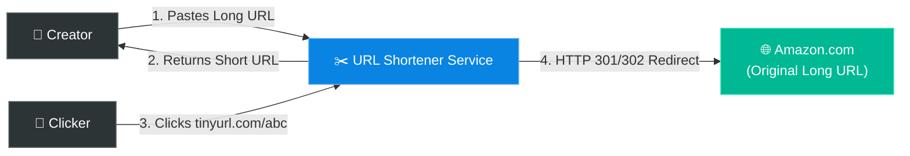
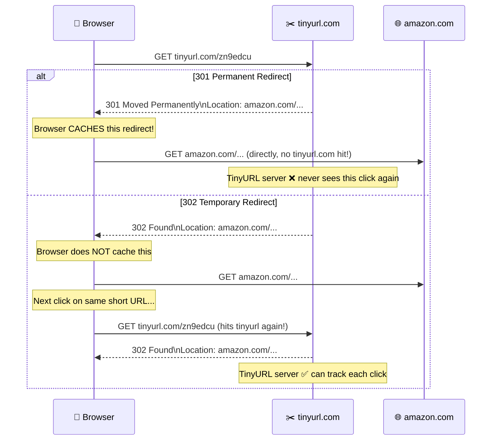
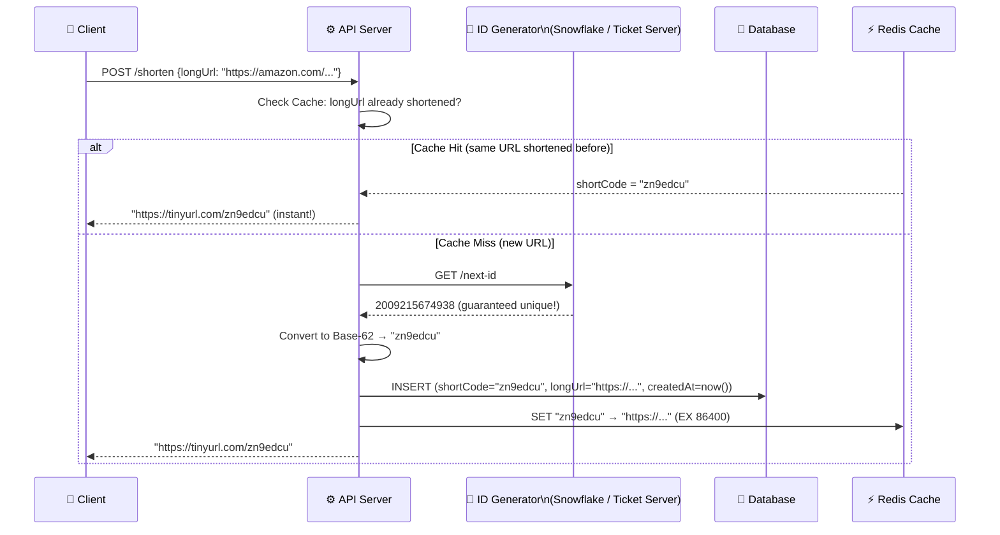
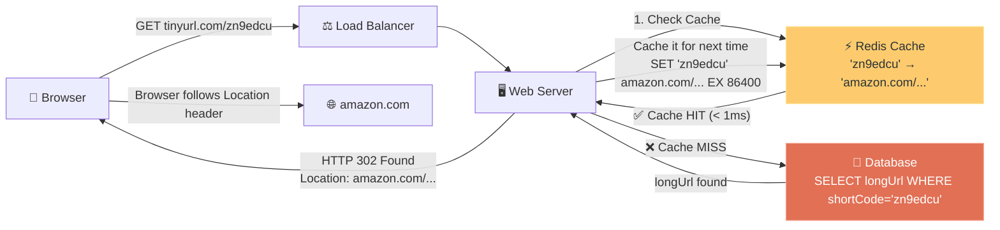

# Chapter 8: Design a URL Shortener

> **Core Idea:** A URL shortener (like `bit.ly` or `tinyurl.com`) takes a long, cumbersome URL and converts it into a short, easy-to-share alias. When users click the short alias, they are immediately redirected to the original long URL. Designing this tests your ability to handle **heavy read traffic**, **hashing algorithms**, **database design**, and **caching strategies**.

---

## 🧠 The Big Picture — Why Do We Need URL Shorteners?

### 🍕 The Giant Map Analogy:
Imagine trying to tell a friend how to find a specific restaurant by giving the GPS coordinates: `Latitude: 40.748817, Longitude: -73.985428`. It's accurate, but terrible to communicate.

Instead, you say: `"Meet me at the Empire State Building."`

A URL shortener does exactly this. It takes an ugly internet address like:
`https://www.amazon.com/dp/B08F7PTF53/ref=sr_1_1?crid=3R7&keywords=system+design+interview&qid=17234&s=books`

And turns it into:
`https://tinyurl.com/y8z9j2x`

**Why does this matter?**
1. **Twitter character limits:** Before Twitter allowed longer tweets, URLs consumed 100+ characters.
2. **SMS marketing:** SMS has 160-character limits; a 150-character URL leaves no room for content.
3. **QR codes:** Shorter URLs generate simpler, more scannable QR codes.
4. **Analytics:** URL shorteners track click-through rates, geographic data, and device types.
5. **Brand safety:** `brand.ly/summer-sale` looks more trustworthy than raw UTM-tracking URLs.



---

## 🎯 Step 1: Understand the Problem & Establish Design Scope

### Clarifying the Requirements:

```
You:  "Can you give an example of how the short URL looks?"
Int:  "https://tinyurl.com/{hash_value}. The hash can be alphanumeric."

You:  "What is the traffic volume?"
Int:  "100 million new URLs generated per month."

You:  "How long should the shortened URL be?"
Int:  "As short as possible."

You:  "Can shortened URLs be deleted or updated?"
Int:  "Assume they are permanent and cannot be deleted or updated."

You:  "Do we need analytics (click count, referrer, geography)?"
Int:  "Not required for now, but keep it in mind."

You:  "Does the same long URL always get the same short URL?"
Int:  "Good question! For simplicity, yes — same long URL → same short URL."
```

### 🧮 Back-of-the-Envelope Estimation

| Metric | Calculation | Result |
|---|---|---|
| **Write QPS (New URLs)** | 100M/month ÷ 30 days ÷ 86,400 sec | `~40 writes/sec` |
| **Read QPS (Redirects)** | 10:1 read-write ratio | `~400 reads/sec` |
| **Total URLs over 10 years** | 100M/month × 12 × 10 | `12 Billion URLs` |
| **Storage** | 12B URLs × 500 bytes (URL + metadata) | `~6 Terabytes (TB)` |
| **Cache memory (20% hot)** | 400 reads/sec × 86,400 sec × 20% × 500 bytes | `~3.5 GB/day in cache` |

> **Takeaway:** Storage is manageable (~6TB). The system is **read-heavy (10:1)**. The dominant engineering challenges are **fast redirects** and choosing a **collision-free short URL generation algorithm**.

---

## 🏗️ Step 2: The Two Core APIs

Our system needs exactly two API endpoints.

### API 1: URL Shortening (Write)

```http
POST /api/v1/data/shorten
Content-Type: application/json

Request Body:
{
    "longUrl": "https://www.amazon.com/dp/B08F7PTF53?ref=sr_1_1&keywords=system+design"
}

Response:
{
    "shortUrl": "https://tinyurl.com/zn9edcu",
    "longUrl":  "https://www.amazon.com/dp/B08F7PTF53?ref=...",
    "createdAt": "2026-04-12T10:15:00Z"
}
```

### API 2: URL Redirecting (Read)

```http
GET https://tinyurl.com/zn9edcu

Response:
HTTP/1.1 301 Moved Permanently
Location: https://www.amazon.com/dp/B08F7PTF53?ref=...
```

---

## 🛣️ Step 3: The 301 vs 302 Redirect Decision — Classic Interview Trap!

When a user hits the short URL, the server responds with a redirect code and the `Location` header. But **which** HTTP status code?



| Status Code | Permanent? | Browser Caches? | Server Load | Analytics |
|---|---|---|---|---|
| **301 Permanent** | Yes | ✅ Yes (first visit only) | 🟢 Lower (browser handles repeat visits) | ❌ Lost after first click |
| **302 Found** | No | ❌ Never | 🔴 Higher (every click hits server) | ✅ Complete data |

> **💡 Rule of thumb:**
> - Choose **301** if **reducing server load** is the priority (high-traffic campaigns where analytics are tracked server-side separately).
> - Choose **302** if **tracking analytics** is the priority (standard business use case).
> - Most commercial URL shorteners (bit.ly) default to **302** so they can sell analytics dashboards.

---

## 🔬 Step 4: The Core Algorithm — How to Generate the Short URL

This is the most technically interesting part of the chapter. How do we convert a long URL into a 7-character short code?

### First Principles: What Characters Can We Use?

We want URL-safe alphanumeric characters only:

```
Digits:    0-9  → 10 characters
Lowercase: a-z  → 26 characters
Uppercase: A-Z  → 26 characters
───────────────────────────────
Total Base-62:   62 characters
```

**Why not Base-64?** Base-64 includes `+` and `/` — both have special meaning in URLs. They would need to be percent-encoded (`%2B`, `%2F`), making the short URL ugly and error-prone.

### How Long Must the Short Code Be?

We need enough combinations to cover 12 Billion URLs over 10 years:

```
Length 6:  62^6 =  56,800,235,584  ≈ 56.8 Billion  → just barely enough, risky
Length 7:  62^7 = 3,521,614,606,208 ≈ 3.5 Trillion  → 292× more than needed ✅
Length 8:  62^8 = 218,340,105,584,896 → overkill

→ 7 characters gives us 3.5 Trillion possible short URLs
```

---

### ❌ Approach A: Hash + Collision Resolution

**Idea:** Run the long URL through MD5 or SHA-1, take the first 7 characters.

```python
import hashlib

def shorten_url(long_url):
    hash_value = hashlib.md5(long_url.encode()).hexdigest()
    # MD5 output: "5d41402abc4b2a76b9719d911017c592"
    short_code = hash_value[:7]  # → "5d41402"
    
    # Check if already exists in DB
    if db.exists(short_code):
        # COLLISION! Try with different input
        short_code = hashlib.md5((long_url + "1").encode()).hexdigest()[:7]
        # Might collide again! → exponentially worse as DB fills
    
    db.insert(short_code, long_url)
    return short_code
```

**Step-by-step collision example:**
```
URL A: "https://apple.com/iphone"
MD5   : "abc1234..."
Short : "abc1234"
→ DB Check: "abc1234" not present → SAVE ✅

URL B: "https://samsung.com/galaxy" 
MD5   : "abc1234..."  ← COLLISION! Same first 7 hex chars!
Short : "abc1234"
→ DB Check: "abc1234" already exists → Retry with modified URL
Modified: "https://samsung.com/galaxy1"  
MD5   : "def5678..."
Short : "def5678"
→ DB Check: "def5678" not present → SAVE ✅ (but we wasted a DB round-trip!)
```

**Problems with Hash + Collision at Scale:**

| DB Fill Level | Collision Probability | DB Checks Needed | Write Latency |
|---|---|---|---|
| 0% full | Very low | ~1 DB check | Fast |
| 50% full | Moderate | ~2 DB checks avg | Moderate |
| 80% full | High | ~5 DB checks avg | Slow |
| 95% full | Very high | ~20 DB checks avg | Very slow |

> As the database fills, the collision rate grows — and the write performance degrades **non-linearly**. This is a fundamental flaw: the system gets slower as it succeeds (stores more URLs).

---

### ✅ Approach B: Pre-Computed Hash Table (Offline)

**Idea:** Pre-generate all 3.5 trillion 7-character short codes, shuffle them, and store them in a queue. When a URL comes in, pop the next pre-generated code.

```
Pros: Zero collision checking. Lightning fast writes. No DB round-trips for uniqueness.
Cons: 3.5 Trillion entries × 7 bytes = 24.5 TB just to store the pre-generated codes!
      Not practical at this scale.
```

---

### ✅ Approach C: Base-62 Conversion of Unique IDs ⭐ (The Winner)

**Idea:** Don't hash the long URL at all. Generate a **guaranteed-unique integer ID** (using Chapter 7's Snowflake/Ticket Server), then convert that integer to Base-62.

```python
def int_to_base62(n):
    CHARSET = "0123456789abcdefghijklmnopqrstuvwxyzABCDEFGHIJKLMNOPQRSTUVWXYZ"
    if n == 0:
        return CHARSET[0]
    
    result = []
    while n > 0:
        result.append(CHARSET[n % 62])
        n //= 62
    
    return ''.join(reversed(result))

# Example:
unique_id = 2009215674938       # From Snowflake ID generator
short_code = int_to_base62(unique_id)
print(short_code)               # → "zn9edcu"
```

**The full conversion walkthrough:**
```
Input: 2009215674938

2009215674938 ÷ 62 = 32406704434 remainder 10  → CHARSET[10] = 'a'
32406704434   ÷ 62 = 522689587   remainder 40  → CHARSET[40] = 'e'
522689587     ÷ 62 = 8430476     remainder 15  → CHARSET[15] = 'f'
8430476       ÷ 62 = 135975      remainder 41  → CHARSET[41] = 'f' (wait, let me re-do properly)
...

Result (reversed): "zn9edcu"
```

**Full Flow with Architecture:**



**Why Base-62 Conversion is Definitively Better:**

| Feature | Hash + Collision | Base-62 Conversion ⭐ |
|---|---|---|
| **Collision possible?** | Yes. DB check required per insert. | **No.** ID generator guarantees uniqueness before conversion. |
| **Write performance** | Degrades as DB fills (more collisions) | **Constant O(1)** — no DB check for uniqueness |
| **URL Length** | Fixed (7 chars always) | Variable (grows as IDs grow from 7→8 chars after trillions of URLs) |
| **Predictability** | Hard to predict | Sequential IDs make short codes guessable (security concern!) |
| **Same URL twice** | Same hash → same short code | Different ID generated per request → different short codes |

> **⚠️ Security Flaw of Base-62:** Since IDs are sequential, short codes are also sequential: `zn9edcu` → `zn9edcv` → `zn9edcw`. A malicious user can enumerate all valid short URLs and scrape their destinations. 
>
> **Fix:** XOR the sequential ID with a secret 32-bit key before converting, or use a **Format-Preserving Encryption (FPE)** cipher like FF1 to make the output appear random while remaining bijective (no collisions).

---

## 🔗 Step 5: The URL Redirect Flow — Read Path

The redirect flow must be **extremely fast** — users expect sub-100ms response times when clicking a short link.



### Cache Design for URL Shortener

The URL shortener is an 80-20 system: **20% of short URLs receive 80% of the clicks**. This makes caching extremely effective.

```
Cache Strategy: Redis with LRU eviction (Least Recently Used)

Key:   shortCode → "zn9edcu"
Value: longUrl   → "https://amazon.com/dp/B08F7PTF53?ref=..."
TTL:   24 hours (most viral links go cold within 24h)

Memory sizing:
  Cache 20% of daily active short URLs
  400 reads/sec × 86,400 sec × 20% ≈ 7M entries cached
  7M × 500 bytes (avg URL) = 3.5 GB cache
  → Very affordable on a single cache server!

Expected cache hit rate: 80-90% (20% of URLs handle 80% of traffic)
→ Database receives only 10-20% of redirect requests
```

---

## 🗄️ Step 6: Database Design

### Schema Design

```sql
CREATE TABLE url_mappings (
    id          BIGINT PRIMARY KEY,          -- Snowflake ID (Chapter 7)
    short_code  VARCHAR(10) UNIQUE NOT NULL, -- e.g., "zn9edcu"
    long_url    TEXT NOT NULL,               -- Original URL (up to 2048 chars)
    created_at  DATETIME NOT NULL DEFAULT NOW(),
    expires_at  DATETIME,                    -- NULL = permanent
    creator_id  BIGINT,                      -- FK to users table (optional)
    click_count BIGINT DEFAULT 0,            -- Approximate counter (see note!)
    
    INDEX idx_short_code (short_code),       -- Primary lookup index
    INDEX idx_creator (creator_id),          -- For "show all my URLs" queries
    INDEX idx_expires (expires_at)           -- For cleanup job
);
```

> **⚠️ click_count warning:** Don't UPDATE `click_count + 1` in the DB on every redirect. At 400 redirects/sec, this row-level lock causes hot-row contention. Instead, accumulate counts in Redis and flush to DB periodically (every 10 minutes). Same pattern as Chapter 14 (YouTube) view counts.

### SQL vs NoSQL Choice

| Criterion | SQL (MySQL) | NoSQL (Cassandra/DynamoDB) |
|---|---|---|
| **Data structure** | URL mappings are naturally relational | Would work, but no relational joins needed here |
| **Scale** | 6TB over 10 years → manageable in sharded MySQL | Better for petabyte scale |
| **Lookups** | Primary key lookup on `short_code` = O(log N) B-tree index | O(1) hash lookup |
| **Analytics** | Easy GROUP BY queries | Complex aggregations |
| **Verdict** | ✅ MySQL is perfectly adequate | Overkill for this scale |

---

## 🔀 Step 7: Scaling the Database

### Horizontal Scaling via Sharding

At 12 billion URLs over 10 years, a single MySQL server will eventually saturate on storage and write throughput. We shard the database.

**Sharding Strategy:**

```
Approach 1: Shard by first character of short_code
  Shard 0: "a" - "f"
  Shard 1: "g" - "m"
  Shard 2: "n" - "t"
  Shard 3: "u" - "z", "A" - "Z", "0" - "9"
  
Problem: Uneven distribution! More k/l URLs than z/Z URLs.

Approach 2: Consistent Hashing on short_code (Chapter 5!)
  → Hash the short_code → map to a virtual ring position → assign to nearest server.
  → Even distribution regardless of character frequency.
  → Adding/removing shards requires minimal data migration.
```

### Read Replica Setup

Write QPS is 40/sec — very manageable on a single primary. Read QPS is 400/sec, which can easily overwhelm the primary under load.

```
Write path: Client → Primary DB (40 writes/sec)
Read path:  Client → Read Replica 1 (133 reads/sec)
            Client → Read Replica 2 (133 reads/sec)
            Client → Read Replica 3 (133 reads/sec)

Total handled: 400 reads/sec across 3 replicas, each handling ~133 reads/sec.
Cache absorbs 80-90% → Realistic DB read load: ~40-80 reads/sec per replica.
```

---

## 🗑️ Step 8: URL Expiration & Lazy Cleanup

The interviewer might introduce: *"URLs now expire after 1 year. How do you delete them?"*

**Naive Approach (Wrong):** A background job scans all 12 billion rows every night looking for expired entries.
- Full table scan of 12 billion rows = hours of CPU and I/O.
- Holds database locks → slows down production traffic.

**Correct Approach: Lazy Deletion + Low-Priority Sweeper**

```python
# On EVERY redirect request, check expiry first
def handle_redirect(short_code):
    url_data = cache_or_db.lookup(short_code)
    
    if url_data is None:
        return HTTP_404
    
    # LAZY CHECK: Is this expired?
    if url_data.expires_at and url_data.expires_at < datetime.now():
        db.delete_url(short_code)      # Lazy delete
        cache.delete(short_code)       # Evict from cache
        return HTTP_410_GONE           # "This URL has permanently expired"
    
    return HTTP_302_REDIRECT(url_data.long_url)

# OFFLINE SWEEPER: Runs at 3 AM, uses low-priority connection pool
def background_cleanup():
    batch_size = 1000
    while True:
        expired_urls = db.query(
            "SELECT id FROM url_mappings WHERE expires_at < NOW() LIMIT 1000"
        )
        if not expired_urls:
            break
        db.bulk_delete(expired_urls)
        time.sleep(0.1)  # Yield to production traffic between batches
```

---

## 📋 Summary — Complete Decision Table

| Topic | Decision | Why |
|---|---|---|
| **Character set** | Base-62 (a-z, A-Z, 0-9) | URL-safe; avoids `+` and `/` from Base-64 |
| **Short code length** | 7 characters | 62^7 = 3.5 Trillion → sufficient for 12 Billion URLs with huge headroom |
| **Short code generation** | **Base-62 conversion of Snowflake IDs** | Zero collisions; O(1) generation; no DB uniqueness check needed |
| **Redirect type** | 302 (or configurable) | Preserves analytics capability |
| **Read scaling** | Redis Cache (LRU) + Read Replicas | 80-90% cache hit rate; DB only hit on cold misses |
| **Write scaling** | Sharded MySQL via Consistent Hashing | Even distribution; easy scaling |
| **Click counts** | Redis INCR → periodic flush to DB | Avoids hot-row contention in SQL |
| **URL expiry** | Lazy deletion + low-priority background sweeper | Avoids full table scans; no production lock contention |

---

## 🧠 Memory Tricks

### The 4-Step System — **"B A B C"** 👶
1. **B**ase-62 Conversion (core algorithm — generate Snowflake ID, convert to Base-62)
2. **A**PIs (POST /shorten returns short URL; GET /shortCode returns 301/302)
3. **B**ack-of-envelope (6TB over 10 years; 400 reads/sec)
4. **C**ache (Redis LRU in front of DB; absorbs 80-90% of redirects)

### The Redirect Decision — **"301 Permanent = Performance, 302 Found = Analytics"**
- **301** = browser learns the destination → skips our server → lower load, lost analytics
- **302** = browser asks our server every time → higher load, full analytics

---

## ❓ Interview Quick-Fire Questions

**Q1: Why Base-62 instead of Base-64 for URL shortening?**
> Base-64 includes `+` and `/` characters, both of which have special semantic meaning in URLs (`+` = space, `/` = path separator). They require percent-encoding in URLs, making the short code ugly. Base-62 uses only URL-safe alphanumeric characters: digits, lowercase, and uppercase.

**Q2: What is the difference between an HTTP 301 and HTTP 302 redirect in this context?**
> A 301 Permanent Redirect tells the browser to cache the redirect mapping permanently. Subsequent clicks on the same short URL go directly to the destination without hitting our servers — lower load but analytics go dark. A 302 Temporary Redirect forces every click to route through our server, enabling full analytics but at higher server cost. Most commercial URL shorteners use 302.

**Q3: Why is generating a Unique Snowflake ID and converting to Base-62 better than hashing the long URL?**
> MD5 truncation creates collisions — two different URLs can hash to the same 7-character prefix. Each collision requires at least one additional DB round-trip to detect and resolve, and collision frequency increases non-linearly as the database fills. Snowflake IDs guarantee uniqueness at the source, eliminating collision checking entirely and keeping write latency constant regardless of how many URLs are already stored.

**Q4: How do you protect against users enumerating all short URLs?**
> Since Snowflake IDs are sequential, Base-62 codes are also sequential and guessable. We can apply Format-Preserving Encryption (e.g., the FF1 cipher) on the ID before converting to Base-62. FPE is a bijective cipher — it maps integers to integers within the same domain with no collisions — making the output appear random while remaining decodable without a DB lookup.

**Q5: The system receives 400 redirect requests per second. How do you ensure low latency?**
> We front the database with a Redis cache using LRU eviction. Since ~20% of URLs receive ~80% of traffic (Pareto principle), the Redis cache (sized at ~3.5 GB) absorbs 80-90% of redirects in under 1ms — only cache misses hit the database. Behind the cache, read replicas absorb the remaining DB load, keeping the primary free for writes.

---

> **📖 Previous Chapter:** [← Chapter 7: Design a Unique ID Generator in Distributed Systems](/HLD/chapter_7/design_a_unique_id_generator_in_distributed_systems.md)
>
> **📖 Next Chapter:** [Chapter 9: Design a Web Crawler →](/HLD/chapter_9/design_a_web_crawler.md)
