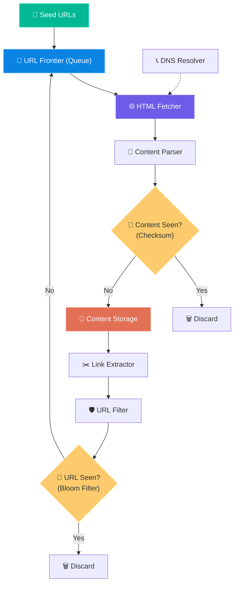
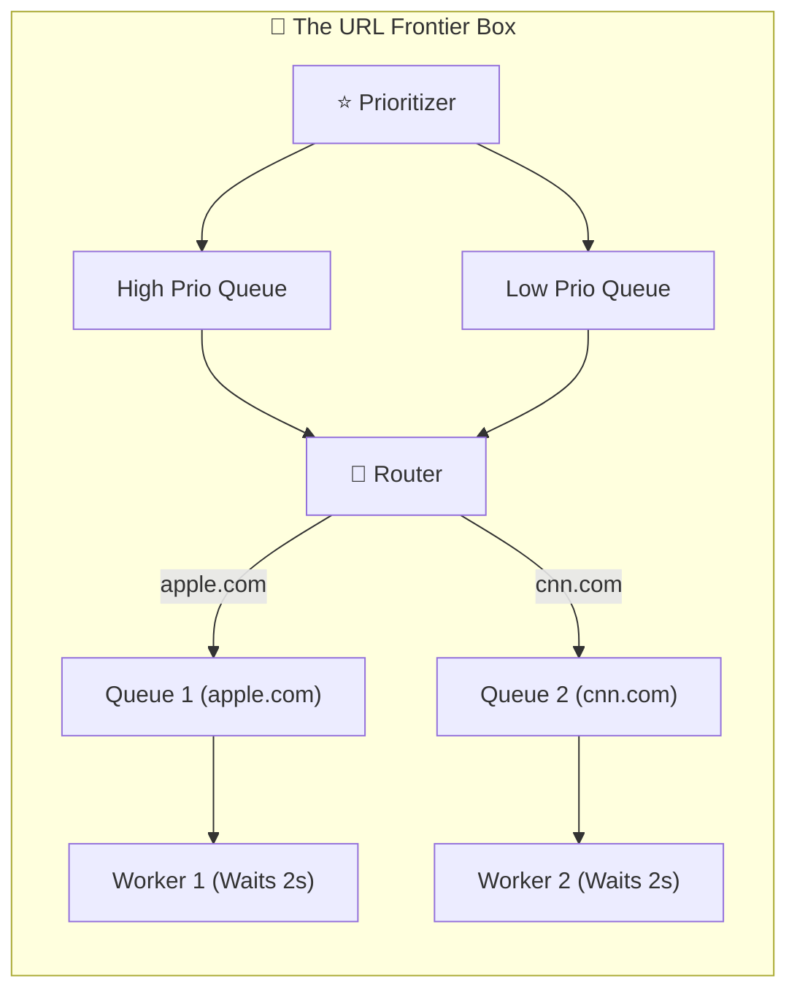

# Chapter 9: Design a Web Crawler

> **Core Idea:** A web crawler (like Googlebot) is a bot that systematically browses the internet to download web pages. It starts with a list of "Seed URLs", downloads the pages, extracts all the links on those pages, and adds those new links to the queue to be downloaded next. Designing one is a masterclass in **graph traversal (BFS)**, **queue management**, and **system politeness**.

---

## 🧠 The Big Picture — Why Build a Web Crawler?

A web crawler isn't just for search engines. It has four main use cases:
1. **Search Engine Indexing:** (Googlebot) Crawls the web to build a search index.
2. **Web Archiving:** (Internet Archive / Wayback Machine) Preserves web history.
3. **Web Mining:** Financial firms crawling shareholder reports or news to predict stock movement.
4. **Web Monitoring:** Finding copyright infringements or tracking competitor pricing.

### 🕸️ The Spider Analogy
Imagine you are exploring a giant library where every book has sticky notes telling you to go read 5 other books. 
You start with **3 initial books (Seed URLs)**. When you open a book, you:
1. Read the text and save it to your backpack (Content Storage).
2. Look at all the sticky notes (Extract Links).
3. Check your notebook to ensure you haven't read that book before (URL Seen?).
4. If it's new, add it to your reading list (URL Frontier).

---

## 🎯 Step 1: Understand the Problem & Scope

### Clarifying the Requirements:

```
You:  "What is the main purpose of this crawler?"
Int:  "Search engine indexing."

You:  "How many pages do we need to crawl per month?"
Int:  "1 Billion pages."

You:  "What content types do we care about?"
Int:  "Just HTML. Ignore images and video for now."

You:  "Do we need to store the HTML, and for how long?"
Int:  "Yes, store it for 5 years."
```

### 🧮 Back-of-the-Envelope Estimation

| Metric | Calculation | Result |
|---|---|---|
| **Crawl Rate (QPS)** | 1 Billion / 30 days / 24 hours / 3600 sec | `~400 pages/second` |
| **Peak QPS** | 2 × Average QPS | `800 pages/second` |
| **Storage per month** | 1 Billion pages × 500 KB (avg page size) | `500 Terabytes (TB) / month` |
| **Storage for 5 years** | 500 TB × 12 months × 5 years | `~30 Petabytes (PB)` |

> **Takeaway:** This system requires **massive storage (30 PB)** and highly concurrent processing.

---

## 🏗️ Step 2: High-Level Design Architecture

The architecture of a web crawler is a continuous loop. Here are the core components:

### The 9-Step Crawling Loop

1. **Seed URLs:** The starting points (e.g., `cnn.com`, `wikipedia.org`).
2. **URL Frontier:** The **queue** that stores URLs waiting to be downloaded.
3. **HTML Fetcher:** The worker that actually downloads the HTML from the internet using the URL.
4. **DNS Resolver:** Converts the URL (`www.apple.com`) into an IP Address (`17.253.144.10`) for the Fetcher.
5. **Content Parser:** Parses the downloaded HTML to ensure it's not malformed.
6. **Content Seen? (Dedup):** Checks if we've already downloaded this exact page before (using a Hash Checksum).
   - If YES: Discard.
   - If NO: Save to **Content Storage**.
7. **Link Extractor:** Plucks all the `<a href="...">` links out of the HTML.
8. **URL Filter:** Drops useless links (`.pdf`, `.png`, `mailto:`, or blacklisted spam sites).
9. **URL Seen? (Dedup):** Checks if the URL has already been queued or processed.
   - If YES: Discard.
   - If NO: Send back to the **URL Frontier**.



---

## 🔬 Step 3: Deep Dive into the Hard Parts

In an interview, anyone can draw boxes in a loop. To pass, you must explain **three specific challenges**: BFS, Politeness, and Deduplication.

### 1️⃣ Traversal Strategy: DFS vs. BFS
The web is a directed graph. Should we use Depth-First Search (DFS) or Breadth-First Search (BFS)?
- **DFS is terrible:** The web is infinitely deep. A crawler might hit a "crawler trap" (dynamically generated endless links) and get stuck forever.
- **BFS is standard:** We use a FIFO (First In, First Out) queue. 

**The Problem with Standard BFS:** 
If `wikipedia.org/page1` has 100 links to other Wikipedia pages, standard BFS queues all 100 Wikipedia pages back-to-back. If our crawler processes them immediately, we will send 100 requests to Wikipedia in one second. **This is a DDoS attack!** 

### 2️⃣ The URL Frontier (Solving Politeness & Priority)
The URL Frontier is the brain of the crawler. It ensures we are **polite** (we don't crash websites) and **prioritized** (we crawl important pages first).

#### A. Politeness (The Back-End Queues)
Rule: **Never send multiple requests to the same host at the same time.**
- We map each Hostname (`apple.com`) to a specific **Queue**.
- A worker thread is assigned to that queue and processes it one URL at a time, enforcing an explicit time delay (e.g., 2 seconds) between downloads.

#### B. Priority (The Front-End Queues)
Not all URLs are equal. `apple.com` is more important than `random-spam-blog.com`.
- We assign a priority score to a URL based on PageRank, traffic, and update frequency.
- The **Prioritizer** sorts URLs into different Front-end Queues (e.g., Queue 1 = High Priority, Queue 10 = Low Priority).



#### C. Freshness (The Recrawl Strategy)
Web pages are dynamic—news sites update every minute, while old blogs update yearly. The crawler must revisit pages to stay accurate.
- Recrawl dynamically based on the page's historical update frequency.
- Webmasters provide hints using the `<lastmod>` tag in their `sitemap.xml`.

#### D. Frontier Storage (Hybrid Approach)
The URL Frontier will easily contain **hundreds of millions** of URLs. 
- You cannot store this entirely in RAM (it's too expensive/large). 
- You cannot store it purely on Disk (it's too slow).
- **The Solution:** A Hybrid Approach. Maintain the vast majority of the URLs on disk, but load chunks (buffers) of URLs into memory (`RAM`) into the working queues when ready to be processed.

### 3️⃣ Deduplication (Have we seen this before?)

**A. URL Uniqueness (The URL Seen? module)**
With 1 billion URLs, querying a database for every link is painfully slow.
> **Solution:** Use a **Bloom Filter**. A probabilistic data structure that can tell you with 100% accuracy if a URL has *never* been seen, or if it *probably* has been seen, using minimal memory.

**B. Content Uniqueness (The Content Seen? module)**
Two different URLs (`/sale` and `/discount`) might lead to the exact same HTML page. You don't want to store duplicates.
> **Solution:** Don't compare raw HTML text. Compare hashes! Calculate an **MD5 or SHA-1 Checksum** of the HTML string. Compare the 16-byte checksum against your database.

---

## 🚀 Step 4: Edge Cases & Advanced Nuances (Staff Level)

If you're interviewing for a senior level, drop these nuances:

1. **Robots.txt (`robots.txt`):** Before downloading *anything* from a domain, we must download `domain.com/robots.txt` to see what we are legally allowed to crawl. **Cache this file!** Don't fetch it every time.
2. **Spider Traps:** A malicious site might generate an infinite loop of URLs: `site.com/foo/bar/foo/bar/foo...`. Set a maximum depth (`max_depth = 10`) for the URL path.
3. **Data Noise:** Filter out ads, tracking scripts, and spam to save massive amounts of storage space before hashing/saving.
4. **Fetcher Performance optimizations:** 
   - **Distributed Crawling:** Spread crawl workers geographically closer to the target hosts to reduce latency.
   - **Short Timeouts:** Enforce strict read/connect timeouts. If a site doesn't load in 3 seconds, drop it. Do not let threads hang on dead servers indefinitely.
5. **DNS Caching:** DNS resolution (`apple.com` -> `17.X.X.X`) takes 10ms - 200ms. Since the crawler makes thousands of requests per second, the DNS resolver is a massive bottleneck. **A highly tuned custom DNS cache is mandatory.**
6. **Extensibility:** The system must be extensible. You should be able to plug in new modules, like a "Copyright Infringement Checker" module or a "PNG Downloader" module, directly into the crawl loop without modifying the core system.

---

## 📋 Summary — Quick Revision Table

| Component / Concept | Solution |
|---|---|
| **Traversal Strategy** | **Breadth-First Search (BFS)** avoids deep rabbit holes. |
| **URL Frontier: Priority** | Prioritizer scores URLs (PageRank/traffic) and assigns to prioritized queues. |
| **URL Frontier: Politeness** | Route one Hostname to sequentially-processed Queues with artificial delays. No DDoS. |
| **HTML Deduplication** | Generate MD5/SHA-1 **checksums** of HTML. Compare checksums, not strings. |
| **URL Deduplication** | **Bloom Filters!** Lightning fast, memory efficient "in-set" checks. |
| **Rules of Engagement** | Always download, cache, and respect `robots.txt` first. |
| **Bottlenecks** | The **DNS Resolver**. Implement local DNS caching to avoid 100ms penalties per request. |

---

## 🧠 Memory Tricks — How to Remember This Chapter

### The Loop — **"S F H C U"** 🔁
> **S**eed -> **F**rontier -> **H**TML Fetcher -> **C**ontent Dedup -> **U**RL Dedup.

### The 3 P's of the Frontier 🅿️
To design a flawless URL Frontier, remember the 3 P's:
1. **P**riority (Crawl Apple before spam)
2. **P**oliteness (Don't DDoS the server)
3. **P**erformance (Multi-threading workers)

---

## ❓ Interview Quick-Fire Questions

**Q1: Why is DFS a bad idea for a Web Crawler?**
> The internet is essentially infinitely deep. DFS can easily fall into "spider traps" (dynamically generated infinite links) or get completely lost down hyper-specific rabbit holes, ignoring the broad, important top-level web. BFS ensures we crawl uniformly.

**Q2: How do you prevent your crawler from accidentally DDoSing a website?**
> By implementing "Politeness" in the URL Frontier. We ensure that URLs belonging to the same host (e.g., `wikipedia.org`) are routed to a single, dedicated back-end queue. A single worker processes that queue sequentially with a forced time delay (e.g., 2 seconds) between each request.

**Q3: How do you efficiently check if a URL has already been downloaded out of 1 Billion URLs?**
> We use a **Bloom Filter** combined with a disk-backed database or Redis. The Bloom Filter sits in memory and allows extraordinarily fast `O(1)` checks to see if the URL is *definitely new* or *possibly seen*, avoiding costly database hits for every extracted link.

**Q4: Two different URLs point to the exact same content. How do you avoid storing duplicates?**
> We pass the raw HTML text through a hash function like MD5 or SHA-1 to generate a short checksum. We then check our database to see if that checksum already exists. If it does, we discard the HTML. 

**Q5: What is the biggest hidden performance bottleneck in a web crawler?**
> The **DNS Resolver**. For every fetch, looking up the IP address of a host takes 10ms to 200ms. Synchronous DNS drops our thread performance entirely. We must decouple DNS resolution into async calls and heavily cache the IP results locally.

---

> **📖 Previous Chapter:** [← Chapter 8: Design a URL Shortener](/HLD/chapter_8/design_a_url_shortener.md)
>
> **📖 Next Chapter:** [Chapter 10: Design a Notification System →](/HLD/chapter_10/design_a_notification_system.md)
