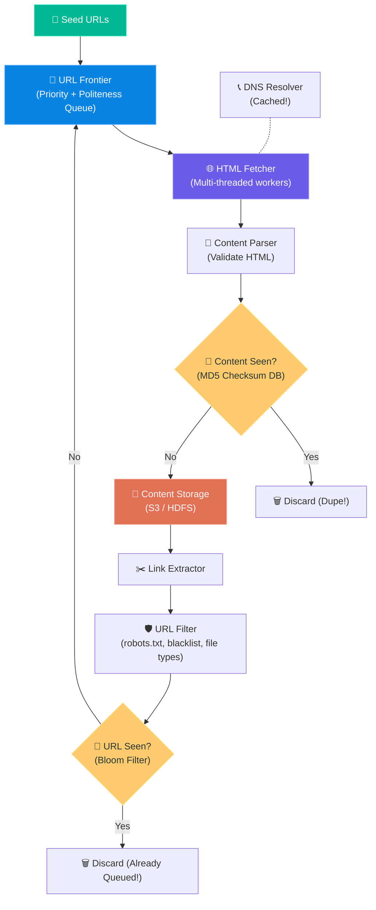
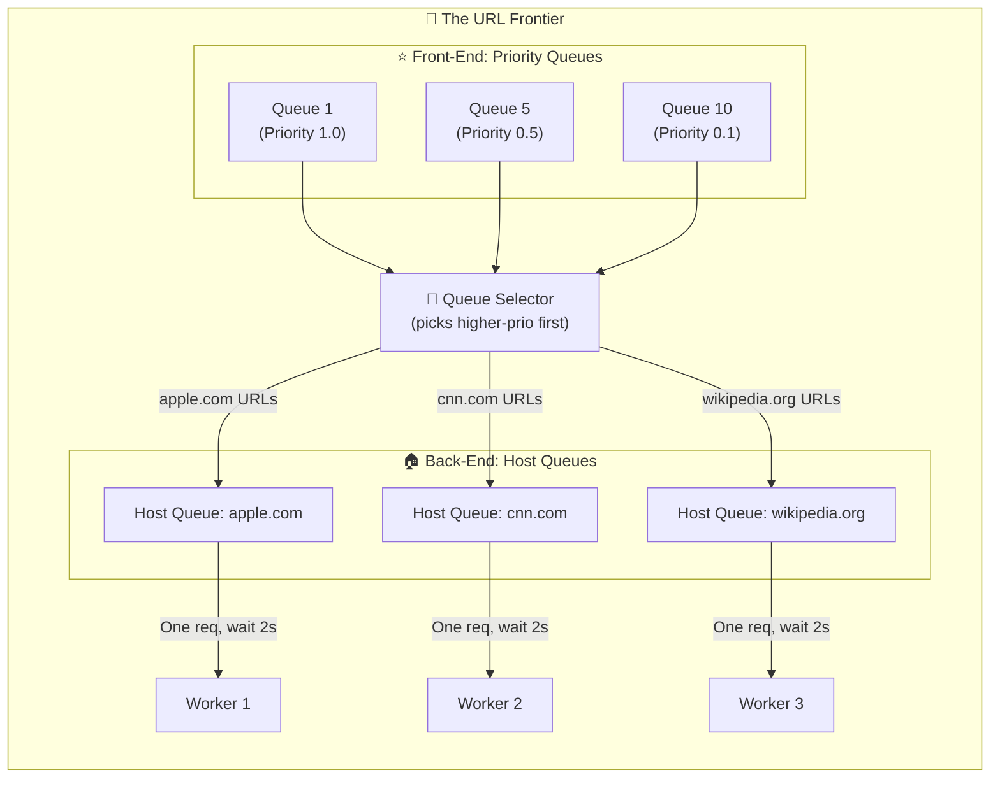

# Chapter 9: Design a Web Crawler

> **Core Idea:** A web crawler (like Googlebot) is a bot that systematically browses the internet to download web pages. It starts with a list of "Seed URLs", downloads the pages, extracts all the links on those pages, and adds those new links to the queue to be downloaded next. Designing one is a masterclass in **graph traversal (BFS)**, **queue management**, **system politeness**, and **deduplication at internet scale**.

---

## 🧠 The Big Picture — Why Build a Web Crawler?

A web crawler isn't just for search engines. It has four main use cases:
1. **Search Engine Indexing:** (Googlebot) Crawls the web to build a search index.
2. **Web Archiving:** (Internet Archive / Wayback Machine) Preserves web history.
3. **Web Mining:** Financial firms crawling shareholder reports or news to predict stock movement.
4. **Web Monitoring:** Finding copyright infringements or tracking competitor pricing.

### 🕸️ The Spider Analogy

Imagine you are exploring a **giant library** where every book has sticky notes telling you to go read 5 other books.
You start with **3 initial books (Seed URLs)**. When you open a book, you:
1. Read the text and save it to your backpack (Content Storage).
2. Look at all the sticky notes (Extract Links).
3. Check your notebook to ensure you haven't read that book before (URL Seen?).
4. If it's new, add it to your reading list (URL Frontier).

But now imagine this library has **1 trillion books**, sticky notes that might loop back to themselves, and some prankster bookshelves that generate infinite new books. **This is the internet.** The engineering challenge is managing this at scale without getting lost, losing data, or overwhelming other libraries.

---

## 🎯 Step 1: Understand the Problem & Scope

### Clarifying the Requirements:

```
You:  "What is the main purpose of this crawler?"
Int:  "Search engine indexing."

You:  "How many pages do we need to crawl per month?"
Int:  "1 Billion pages."

You:  "What content types do we care about?"
Int:  "Just HTML. Ignore images and video for now."

You:  "Do we need to store the HTML, and for how long?"
Int:  "Yes, store it for 5 years."

You:  "How do we handle duplicate content?"
Int:  "Pages with duplicate content should not be stored twice."

You:  "Do we need to recrawl pages?"
Int:  "Yes. The web changes, so we need to revisit pages periodically."
```

### 🧮 Back-of-the-Envelope Estimation

| Metric | Calculation | Result |
|---|---|---|
| **Crawl Rate (QPS)** | 1 Billion / 30 days / 24 hours / 3600 sec | `~400 pages/second` |
| **Peak QPS** | 2 × Average QPS | `800 pages/second` |
| **Storage per month** | 1 Billion pages × 500 KB (avg page size) | `500 Terabytes (TB) / month` |
| **Storage for 5 years** | 500 TB × 12 months × 5 years | `~30 Petabytes (PB)` |
| **Bandwidth** | 400 pages/sec × 500KB | `~200 MB/sec inbound bandwidth` |

> **Takeaway:** This system requires **massive storage (30 PB)** and **highly concurrent processing**. The DNS resolver is a hidden bottleneck at 400 pages/sec (400 DNS lookups/sec).

---

## 🏗️ Step 2: The Naïve Approach — A Single-Threaded Crawler

### First Idea: One Worker, One Loop

```python
# Naïve single-threaded crawler
seed_urls = ["https://cnn.com", "https://wikipedia.org"]
queue = seed_urls
visited = set()

while queue:
    url = queue.pop(0)
    if url in visited:
        continue
    
    html = fetch(url)          # Takes 200ms - network I/O blocks here!
    parsed_urls = extract_links(html)
    store(html)                # Takes 50ms - disk I/O blocks here!
    
    for link in parsed_urls:
        if link not in visited:
            queue.append(link)
    
    visited.add(url)
```

**Why this fails spectacularly:**
| Problem | Impact |
|---|---|
| **Blocked on network I/O** | `fetch(url)` waits 200ms per page. Processing 1 Billion pages at 200ms each = 6.3 years! |
| **Single-threaded** | Only one page fetched at a time. No parallelism whatsoever. |
| **`visited` set in memory** | 1 Billion URLs × avg 100 bytes each = 100GB RAM just for the visited set. Impossible. |
| **No politeness** | `queue.pop(0)` can send 500 requests to `wikipedia.org` in a second. This is a DDoS attack on Wikipedia. |
| **No priority** | `cnn.com`'s homepage has the same priority as a spam blog that linked to it. |

> **Conclusion:** We need a fundamentally different architecture. Every failed aspect of the naïve approach points us to a specific component of the real design.

---

## 🏗️ Step 3: High-Level Design — The Production Architecture

### The 9-Step Crawling Loop



Each component solves one of the naïve approach's failures:

| Naïve Failure | Production Solution |
|---|---|
| Blocked on I/O | Multi-threaded HTML Fetcher workers |
| In-memory visited set (100GB RAM) | Bloom Filter (see Step 4) |
| No politeness | URL Frontier with host-specific queues |
| No priority | URL Frontier with prioritization layer |
| No deduplication of content | MD5 Content Checksum on stored pages |

---

## 🔬 Step 4: Deep Dive — Traversal Strategy (DFS vs BFS)

The web is a directed graph. Every page is a node; every hyperlink is a directed edge.

```
CNN.com ──────────────────┐
  │                       │
  ├──► CNN.com/politics   ├──► externalsite.com
  │        │              │
  │        └──► CNN.com/politics/china ──► CNN.com/politics/china/trade
  │                                             │
  │                                             └──►  ... (infinite depth!)
  └──► CNN.com/sports ──► ....
```

### Should We Use DFS?
DFS follows one branch all the way to the end before exploring others:
```
CNN.com → CNN.com/politics → CNN.com/politics/china → CNN.com/politics/china/trade → ...
```
**The Spider Trap Problem:** Some websites are maliciously or accidentally configured to generate infinite URLs:
```
shop.com/products/category/seasonal/2026/04/12/item_a
shop.com/products/category/seasonal/2026/04/12/item_a/review_1
shop.com/products/category/seasonal/2026/04/12/item_a/review_1/related_1
... (infinitely deep!)
```
DFS will follow this rabbit hole forever. **DFS is banned from web crawlers.**

### BFS is Standard — But Has Its Own Problem

BFS uses a FIFO queue. It explores all pages at depth 1 before moving to depth 2:
```
Depth 0: [CNN.com, Wikipedia.org]
Depth 1: [CNN.com/politics, CNN.com/sports, Wikipedia.org/Main, ...]  
Depth 2: [CNN.com/politics/china, CNN.com/sports/nba, ...]
```

BFS is great! But notice: if `Wikipedia.org/Main_Page` has 500 links all pointing to other `wikipedia.org` sub-pages, standard BFS queues all 500 back-to-back. When workers process them simultaneously, they fire 500 concurrent requests to `wikipedia.org`. **This is a DDoS attack on Wikipedia!**

This is exactly why we need the **URL Frontier** to sit between BFS traversal and the fetchers.

---

## 🧠 Step 5: Deep Dive — The URL Frontier (The Brain of the Crawler)

The URL Frontier is not a simple queue. It's a sophisticated two-layer system that solves both **Priority** and **Politeness** simultaneously.

### Layer 1: Priority (Front-End Queues)

Not all URLs deserve equal crawling attention. We assign a **priority score** to each URL:
```
Priority Score = f(PageRank, Update Frequency, Traffic, Domain Authority)

apple.com:              Priority = 0.95  → Queue 1 (Highest)
cnn.com:                Priority = 0.90  → Queue 1
some-tech-blog.com:     Priority = 0.50  → Queue 5
random-spam-blog.com:   Priority = 0.05  → Queue 10 (Lowest)
```

The **Prioritizer** routes each URL to an appropriate priority queue. Workers preferentially pull from higher-priority queues.

### Layer 2: Politeness (Back-End Queues)

After a URL is selected from the priority queues, it must be routed to a **host-specific queue**.

**The Rule: Never send more than one concurrent request to the same host.**

Each unique hostname gets its own queue. A dedicated worker processes each host-queue with an enforced time delay between requests:



**What enforces politeness?**
Each worker thread maintains a `last_fetch_time` per host:
```python
def worker_for_host(host, queue):
    while True:
        url = queue.get()
        
        # Politeness: enforce minimum delay between requests to same host
        time_since_last = time.now() - last_fetch_time[host]
        if time_since_last < POLITENESS_DELAY_SECONDS:
            time.sleep(POLITENESS_DELAY_SECONDS - time_since_last)
        
        html = fetch(url)
        last_fetch_time[host] = time.now()
        process(html)
```

### Freshness: Recrawl Strategy

Web pages are dynamic. News sites update every minute; old blogs update yearly. We need a policy for when to revisit a page:

```
Recrawl strategies:
1. Fixed interval: Revisit every 7 days (simple, but ignores actual change rates).
2. Adaptive scheduling: Track how often a page has changed historically.
   - Page that changes hourly → recrawl every 2 hours.
   - Page that changes annually → recrawl every 90 days.
3. Sitemap hints: webmasters declare <lastmod> and <changefreq> in sitemap.xml.
   <url>
     <loc>https://example.com/news</loc>
     <lastmod>2026-04-12</lastmod>
     <changefreq>daily</changefreq>
   </url>
```

### Frontier Storage: Hybrid Approach

The URL Frontier can contain **hundreds of millions of URLs** at any moment. Neither pure RAM nor pure disk is acceptable:

```
Pure RAM:   Fast (O(1) queue ops) but 100M × 100 bytes = 10GB RAM consumed by queue alone.
            With 1B URLs, this becomes 100GB just for the queue. Unacceptable.

Pure Disk:  Cheap storage. But queue operations = random I/O = 1-10ms per op.
            At 400 pages/sec, 400 disk random reads/writes per second per queue = slow!

Hybrid (Production):
    - Most URLs kept on disk (cheap, durable)
    - Two in-memory buffers:
        * Input buffer: Receives new URLs (enqueue)
        * Output buffer: Pre-loads upcoming URLs (dequeue)
    - Flush output buffer → disk when empty. Reload from disk.
    - Workers only interact with fast in-memory buffers. Disk I/O batched.
```

---

## 🔍 Step 6: Deep Dive — Deduplication (Two Separate Problems)

### Problem A: URL Deduplication (URL Seen? Module)

**Challenge:** With 1 billion URLs in the system, checking "have we seen this URL before?" is repeated ~5 billion times per day (every extracted link triggers a check).

**Option 1: Hash Map in Memory**
```python
visited_urls = set()   # Python set = hash map
visited_urls.add(url)  # O(1) average
```
- Fast, O(1). But 1 billion URLs × 100 bytes average = **100 GB RAM**. Impossible.

**Option 2: Database Query**
```sql
SELECT 1 FROM crawled_urls WHERE url_hash = MD5('https://...')
```
- Disk-backed, no memory limit. But **5 billion queries/day to a DB under full write load = catastrophic**.

**Option 3: Bloom Filter ⭐ (The Real Solution)**

A Bloom Filter is a **probabilistic data structure** that gives:
- 100% accurate "NO" answers: *"This URL has definitely NEVER been seen."*
- Probabilistic "YES" answers: *"This URL has PROBABLY been seen (with configurable error rate)."*

**How a Bloom Filter Works:**

```
Setup: An array of M bits, all initialized to 0. K independent hash functions.

To ADD "https://apple.com":
1. Hash_1("apple.com") → position 42 → set bit[42] = 1
2. Hash_2("apple.com") → position 187 → set bit[187] = 1
3. Hash_3("apple.com") → position 951 → set bit[951] = 1

To CHECK "https://apple.com":
1. Hash_1("apple.com") → position 42 → bit[42] = 1 ✓
2. Hash_2("apple.com") → position 187 → bit[187] = 1 ✓
3. Hash_3("apple.com") → position 951 → bit[951] = 1 ✓
→ "PROBABLY seen" (all bits match)

To CHECK "https://unknown.com":
1. Hash_1("unknown.com") → position 77 → bit[77] = 0 ✗
→ STOP. "DEFINITELY NOT seen" (100% accurate!)
```

**Memory Efficiency:**
```
Storing 1 billion URLs:
  Hash map:     1B × 100 bytes = 100 GB RAM
  Bloom Filter: 1B URLs at 1% false positive rate = ~1.2 GB RAM
  
  That's a 83× memory reduction!
```

**The False Positive Trade-off:**
At 1% false positive rate, ~10 million URLs per day will be incorrectly identified as "probably seen" and skipped. This is acceptable — we crawl 1 billion pages/month. Missing 10 million (1%) of URLs is an acceptable trade-off for 83× memory savings.

---

### Problem B: Content Deduplication (Content Seen? Module)

**Challenge:** Many websites serve identical content at different URLs:
```
https://example.com/sale     → Same HTML page
https://example.com/discount → Same HTML page
https://example.com/promo    → Same HTML page
```

Storing all three wastes 3× the storage.

**Option 1: Compare Raw HTML Strings**
Direct string comparison of two 500KB HTML files = comparing 500,000 characters. At 400 pages/sec with potentially millions of existing pages — this is computationally infeasible.

**Option 2: MD5/SHA-1 Checksum ⭐**
```python
import hashlib

def content_seen(html_content):
    checksum = hashlib.md5(html_content.encode()).hexdigest()  # 16 bytes
    
    if checksum_db.exists(checksum):
        return True  # Duplicate! Discard.
    else:
        checksum_db.insert(checksum)
        return False

# Instead of comparing 500KB strings, we compare 16-byte checksums!
# 500,000 bytes → 16 bytes = 31,250× smaller comparison
```

---

## 🚀 Step 7: Edge Cases & Advanced Nuances

### 1. robots.txt — Legal and Ethical Compliance

Before crawling **any** URL from a domain, download and cache `domain.com/robots.txt` first.

```
# Example robots.txt for example.com
User-agent: *           # Applies to all crawlers
Disallow: /admin/       # Never crawl admin pages
Disallow: /user-data/   # Never crawl user data
Crawl-delay: 5          # Wait 5 seconds between requests (politeness!)

User-agent: Googlebot   # Special rules for Googlebot only
Allow: /                # Googlebot can crawl everything
```

**Caching robots.txt:**
Don't download `robots.txt` before every single URL. Cache it in Redis:
```python
def is_allowed(url):
    domain = extract_domain(url)
    robots = redis.get(f"robots:{domain}")
    
    if robots is None:
        robots = fetch(f"https://{domain}/robots.txt")
        redis.set(f"robots:{domain}", robots, ex=86400)  # Cache for 24 hours
    
    return robots_parser.is_allowed(robots, url)
```

### 2. Spider Traps — Infinite URL Detection

**Type A: Calendar Traps**
```
site.com/calendar/2026/04/12
site.com/calendar/2026/04/13
site.com/calendar/2026/04/14/
site.com/calendar/2026/04/14/next  ← infinite!
```

**Type B: Session ID Traps**
```
site.com/page?session=abc123
site.com/page?session=def456  ← different session, same page!
```

**Detection Strategies:**
```
1. Maximum URL depth: Reject URLs with path depth > 10
   site.com/a/b/c/d/e/f/g/h/i/j/k ← 11 levels deep → REJECT

2. URL normalization: Strip session IDs, UTM parameters
   URL: site.com/page?session=abc&utm_source=fb → Normalize to: site.com/page

3. Cycle detection: If the same hostname generates > 10,000 URLs, flag as potential trap

4. Path pattern detection: 
   If URL path contains repeated segments → likely a trap
   /foo/bar/foo/bar/foo  ← REJECT (repeated "foo/bar")
```

### 3. DNS Caching — The Hidden Extreme Bottleneck

**The Problem:**
```
Crawling 400 pages/second:
  Each page: DNS lookup (100ms) + TCP connect (50ms) + HTTP request (150ms) + response
  
Without DNS cache:
  DNS lookup alone = 400 lookups/sec × 100ms = 40,000ms of DNS wait per second
  Translation: DNS lookup time alone is 40 SECONDS of accumulated wait per second → Impossible!

With DNS cache:
  First lookup for apple.com: 100ms (cache miss)
  Next 10,000 lookups for apple.com/* : 0ms (cache hit!)
  Effective DNS overhead: ~1ms average across all requests → Manageable
```

**Implementation:**
```python
dns_cache = {}  # Simple in-memory LRU cache
DNS_TTL = 600   # 10 minutes

def resolve_dns(hostname):
    if hostname in dns_cache:
        ip, cached_at = dns_cache[hostname]
        if time.now() - cached_at < DNS_TTL:
            return ip  # Cache hit!
    
    # Cache miss — actual DNS lookup (slow, 100ms)
    ip = actual_dns_lookup(hostname)
    dns_cache[hostname] = (ip, time.now())
    return ip
```

### 4. Extensibility — The Plugin Architecture

A production crawler must be easily extensible. New use cases emerge:
- Adding a "PNG Image Downloader" module
- Adding a "Copyright Name Checker" module
- Adding a "Malware Scanner" module

**Plugin Architecture:**
```python
class CrawlPipeline:
    def __init__(self):
        self.processors = []         # Ordered list of processing modules
    
    def add_processor(self, processor):
        self.processors.append(processor)
    
    def process(self, html, url):
        result = {"html": html, "url": url}
        for processor in self.processors:
            result = processor.process(result)
            if result.get("discard"):
                break  # Short-circuit: discard this page
        return result

# Default pipeline:
pipeline = CrawlPipeline()
pipeline.add_processor(ContentDeduplicator())   # Check HTML checksum
pipeline.add_processor(LinkExtractor())          # Pull out links
pipeline.add_processor(URLFilter())              # Drop PDF, PNG, mailto links

# Adding new capability without touching existing code:
pipeline.add_processor(CopyrightChecker())       # Just add a new module!
pipeline.add_processor(MalwareScanner())
```

### 5. Distributed Crawling — Scaling Horizontally

One machine can fetch ~400 pages/second. For 1 billion pages/month, we need:
```
1,000,000,000 pages / 30 days / 86,400 seconds = ~386 pages/second
→ Achieved with ~1 machine! But for redundancy and peak handling, use a cluster.
```

**How to distribute work across multiple crawler machines:**
```
Machine 1: Crawl all domains starting with a-f
Machine 2: Crawl all domains starting with g-m
Machine 3: Crawl all domains starting with n-s
Machine 4: Crawl all domains starting with t-z

Problem with naive approach: Uneven distribution (more .com than .au).

Better approach: Consistent Hashing (Chapter 5!) on domain names.
→ Each machine gets a roughly equal share of domains.
→ Adding a new machine only reassigns a fraction of domains.
```

---

## 📋 Summary — Complete Decision Table

| Component | Problem Solved | Solution |
|---|---|---|
| **BFS + URL Frontier** | Traversal strategy | BFS avoids infinite-depth spider traps |
| **Front-End Priority Queues** | Crawl order optimization | Score URLs by PageRank/authority → crawl important pages first |
| **Back-End Host Queues** | Politeness (anti-DDoS) | One queue per hostname; one worker per queue; 2s delay between requests |
| **Bloom Filter** | URL deduplication at scale | O(1) memory-efficient probabilistic check; 1.2GB vs. 100GB for hash map |
| **MD5 Checksum** | Content deduplication | Compare 16-byte hashes, not 500KB HTML strings |
| **robots.txt + Cache** | Legal compliance | Download once, cache in Redis for 24 hours |
| **Spider Trap Detection** | Infinite loop prevention | Max depth limit, URL normalization, path pattern detection |
| **DNS Cache** | Performance bottleneck | Local TTL-based DNS resolution cache; reduces 100ms → ~1ms average |
| **Plugin Architecture** | Extensibility | Ordered pipeline of processor modules; add modules without core changes |
| **Frontier Hybrid Storage** | Memory vs. Speed | In-memory buffers for active I/O; disk for buffered queue of pending URLs |
| **Consistent Hashing** | Distributed crawling | Even distribution of domains across crawler machines |

---

## 🧠 Memory Tricks

### The Crawl Loop — **"S F H C U"** 🔁
> **S**eed → **F**rontier → **H**TML Fetcher → **C**ontent Dedup → **U**RL Dedup → Back to Frontier

### The URL Frontier 3 P's: 🅿️
1. **P**riority (High PageRank pages crawled first via front-end queues)
2. **P**oliteness (One worker per host, 2s delay via back-end host queues)
3. **P**erformance (Hybrid disk+memory, DNS caching, multi-threading)

### Deduplication Cheat Sheet:
- **URL dedup** → **Bloom Filter** (probabilistic, memory-efficient)
- **Content dedup** → **MD5 Checksum** (exact, 16 bytes vs 500KB comparison)

---

## ❓ Interview Quick-Fire Questions

**Q1: Why is DFS a bad idea for a Web Crawler?**
> The internet is infinitely deep. DFS can fall into "spider traps" — websites that dynamically generate endless URLs to fool crawlers. DFS follows one branch completely before exploring others, meaning a single poorly-configured website can consume the crawler indefinitely. BFS explores breadth-first and naturally limits depth, making it much more robust.

**Q2: How do you prevent your crawler from DDoSing a website?**
> By implementing politeness in the URL Frontier. We ensure all URLs from the same hostname are routed to a single, dedicated back-end queue. A single worker processes that queue sequentially, checking `last_fetch_time[host]` and enforcing a minimum delay (e.g., 5 seconds) between each request. Additionally, we parse and respect `robots.txt` Crawl-delay directives.

**Q3: How do you efficiently check if a URL has already been seen out of 1 Billion URLs?**
> We use a Bloom Filter — a bit array with multiple hash functions. Before queuing any URL, we check the Bloom Filter. If it returns "definitely not seen," we add the URL. If it returns "probably seen," we skip it. At 1 billion URLs and 1% false positive rate, a Bloom Filter requires only ~1.2 GB RAM vs. ~100 GB for a hash map.

**Q4: Two different URLs point to the exact same content. How do you avoid storing duplicates?**
> We pass the raw HTML through MD5 or SHA-1 producing a 16-byte checksum, which is stored in a fast lookup database (Redis). Before saving any new page, we check if its checksum exists. If yes, the page is a duplicate and discarded. This avoids comparing 500KB HTML strings directly — we compare 16-byte hashes instead.

**Q5: What is the biggest hidden performance bottleneck in a web crawler?**
> The DNS Resolver. At 400 pages/second, each requiring a DNS lookup of 100ms, the accumulated wait time is 40 seconds per second of crawling — completely blocking the system. We solve this with an aggressive local in-process DNS cache with a configurable TTL (typically 10 minutes), reducing average DNS resolution time from 100ms to ~1ms.

**Q6: How do you scale the crawler to support 10 billion pages/month?**
> We use distributed crawling: deploy multiple crawler machines and distribute domains across them using Consistent Hashing on domain names. Each machine runs its own URL Frontier and fetcher pool. A shared Bloom Filter (Redis-backed) and content checksum DB ensure global deduplication across all machines. Adding more machines linearly increases throughput.

---

> **📖 Previous Chapter:** [← Chapter 8: Design a URL Shortener](/HLD/chapter_8/design_a_url_shortener.md)
>
> **📖 Next Chapter:** [Chapter 10: Design a Notification System →](/HLD/chapter_10/design_a_notification_system.md)
