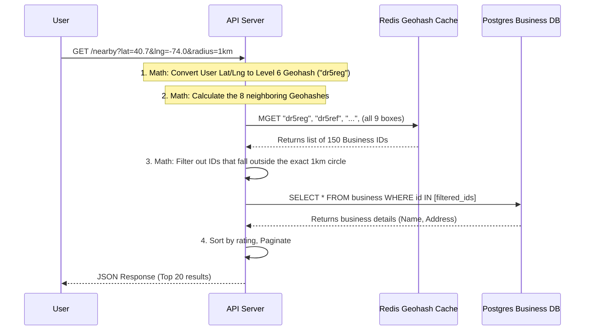

# Volume 2 - Chapter 1: Design a Proximity Service (e.g., Yelp, Places Nearby)

> **Core Idea:** A proximity service discovers nearby places (restaurants, hotels, theaters) within a given radius based on a user's current location (latitude and longitude). The challenge isn't storing data, but **querying 2-dimensional spatial data efficiently** across hundreds of millions of records. A standard SQL database index is 1-Dimensional and fails miserably at 2D range queries. 

---

## 🎯 Step 1: Understand the Problem & Scope

### Clarifying the Requirements

```
You:  "Can users specify a search radius, or is it fixed?"
Int:  "Users can choose options: 500m, 1km, 2km, 5km. Maximum 20km."

You:  "How many businesses are stored in the system?"
Int:  "200 million businesses worldwide."

You:  "How frequently do businesses change (add/update/delete)?"
Int:  "Relatively rarely. A restaurant doesn't move. It's heavily read-intensive."

You:  "What is the scale?"
Int:  "100 million Daily Active Users (DAU). 100,000 Search Queries Per Second (QPS) at peak."
```

### 📋 Finalized Scope
- System is extremely **Read-Intensive** (Peak Search QPS is 100,000)
- Barely **Write-Intensive** (Update QPS is ~5,000 max)
- Low latency search results (<50ms)
- Global distribution

---

## 🧮 Step 2: Back-of-the-Envelope Estimates

Let's do the math to see what part of the system will actually break under load.

| Metric | Calculation | Result |
|---|---|---|
| **Daily Searches** | 100M DAU × 5 searches/DAU | **500 Million searches/day** |
| **Search QPS** | 500M / 86400 | **~5,800 QPS (Average)** |
| **Peak Search QPS** | 5,800 × Peak multiplier (~17x) | **~100,000 QPS target** |
| **Business Storage** | 200M businesses × 1 KB per row | **~200 GB** |
| **Spatial Index Storage** | 200M instances × 24 bytes (ID + Geohash) | **~4.8 GB** |

> **Crucial Takeaway:** Storage is NOT the problem. The entire business database (200 GB) and its index (~5 GB) could fit entirely in the RAM of a single modern server (e.g., an AWS r5.4xlarge has 128GB RAM). 
> **The bottleneck is the CPU.** Processing 100,000 geometrical math queries per second will completely saturate a single server's CPU. We must design a highly distributable, low-CPU read architecture.

---

## ☠️ Step 3: The Naïve Approach & Why Traditional SQL Fails

Imagine we store businesses in PostgreSQL:
```sql
CREATE TABLE business (
    id INT PRIMARY KEY,
    name VARCHAR(255),
    latitude DECIMAL(9,6),
    longitude DECIMAL(9,6)
);

CREATE INDEX idx_lat ON business(latitude);
CREATE INDEX idx_lng ON business(longitude);
```

When a user in New York searches for a coffee shop within a 1km radius, you might run:
```sql
SELECT id, name FROM business 
WHERE latitude BETWEEN (user_lat - 1km) AND (user_lat + 1km)
  AND longitude BETWEEN (user_lng - 1km) AND (user_lng + 1km);
```

### The 2D Fallacy
A standard B-Tree index is **1-Dimensional**. 
- The DB hits `idx_lat` and successfully isolates a horizontal slice of the Earth that is 2km wide.
- However, this horizontal slice wraps around the **entire globe**. It pulls back millions of records (New York, Madrid, Beijing, etc., if they share the same latitude slice).
- It then has to manually loop through those millions of records to evaluate the `longitude` condition.
- Using a composite index `(latitude, longitude)` doesn't help either. B-trees cannot range-query two columns simultaneously efficiently.

> **To fix this, we must structurally map 2-Dimensional geographical space into a 1-Dimensional string that standard databases can query using simple prefix matching.**

---

## 🗺️ Step 4: Masterclass in Spatial Indexing (Beginner to Advanced)

The core of this interview chapter is Geospatial Indexing. You must be able to confidently explain **Geohash** and **Quadtree**.

### 1️⃣ Geohash (The Industry Standard)

Geohash recursively divides the world into a grid of squares, generating a short string representing a specific square.

#### **Beginner Example: How Geohash is generated**
1. Imagine the world map as a 2D plane. We cut it in half vertically (Prime Meridian):
   - Left half (West) = `0`
   - Right half (East) = `1`
2. Now we cut it horizontally (Equator):
   - Bottom half (South) = `0`
   - Top half (North) = `1`
3. We alternate these cuts. 
   - A place in the North-East quadrant gets binary `11`.
   - We recursively keep cutting that box into smaller boxes (4 smaller squares per cut).
4. After 30 cuts (15 for latitude, 15 for longitude), we get a 30-bit binary string: `01101 10111 00100 11010...`
5. We turn every 5 bits into a **base-32 character** to make it human-readable.

**The Result:** The entire globe is mapped to a string like `9q8yyk2`.
- `9` (Precision Level 1) → Huge region (e.g., half of North America)
- `9q8` (Precision Level 3) → Smaller region (e.g., California)
- `9q8yyk` (Precision Level 6) → Exact city block (approx 1.2km × 600m)

| Geohash Length | Grid Size (approx) | Use Case |
|---|---|---|
| 4 | 39km x 19km | Wide city search |
| 5 | 4.9km x 4.9km | Neighborhood search |
| 6 | 1.2km x 600m | Proximity walking distance |

#### **Advanced Concept: Prefix Matching & The Z-Curve**
Because Geohashes are built by recursive subdivision, they trace a "Z-order curve" across the map.
**The Magic Rule:** If two businesses share a long Geohash prefix, they are extremely close to each other geographically!

```sql
-- Finding restaurants near a user in Geohash "9q8yyk" is practically instant!
-- It's a simple 1D string lookup on a B-Tree index.
SELECT * FROM geohash_index WHERE geohash LIKE '9q8yy%';
```

#### **The Geohash Edge Case (The Boundary Problem)**
Two places can be physically 5 meters away from each other, but if they fall on opposite sides of a Geohash boundary line (especially the Prime Meridian or Equator), their Geohash strings will look completely different! One might be `8...` and the other `9...`.

> **The Advanced Solution:** Never just search the user's Geohash box! The algorithm must take the user's box and mathematically calculate the Geohashes of **the 8 surrounding neighbor boxes**. You query all 9 boxes and merge the results.

---

### 2️⃣ Quadtree (The Memory-Optimized Tree Alternative)

A Geohash grid statically divides the world into equal-sized boxes, even if that box is completely empty (like the middle of the Pacific Ocean). A **Quadtree** is a smart, dynamic, in-memory tree that only splits boxes if there is dense data inside them.

#### **Beginner Example: How Quadtree is built**
1. Put all 200 Million businesses in one massive root node (representing the whole Earth).
2. Set a rule: "No box can hold more than 100 businesses."
3. Break the root node into 4 kids (NW, NE, SW, SE). Distribute businesses into them.
4. Recursively repeat this for any child node that still has > 100 businesses.

#### **Quadtree Node Code Implementation:**
```python
class QuadTreeNode:
    def __init__(self, bounding_box):
        self.bounding_box = bounding_box # Defines lat/lng borders
        self.businesses = []             # List of business IDs inside
        self.children = []               # NW, NE, SW, SE child nodes
        self.is_leaf = True              # Only leaves hold data
        
    def insert(self, business):
        if not self.bounding_box.contains(business.location):
            return False
            
        if self.is_leaf:
            self.businesses.append(business)
            if len(self.businesses) > 100:
                self.subdivide()  # Splits into 4 children, pushes data down
        else:
            for child in self.children:
                if child.insert(business):
                    break
```

**The Result in your RAM:**
- Central Park in NYC will be an incredibly deep part of the tree with thousands of tiny boxes.
- The Sahara Desert will literally just be a single gigantic box at level 1 of the tree.

#### **Advanced Concept: The Scaling Nightmare of Quadtrees**
If Quadtrees are so efficient for memory, why don't we always use them? 
Because Quadtrees are **Stateful**.
- You must build and hold the tree in the RAM of the server (e.g., 5GB of memory). 
- If you have 100,000 QPS, you need dozens of API servers. This means every single API server must independently hold its own copy of the massive Quadtree in its RAM.
- If a new business opens, how do you update 50 different Quadtrees across 50 different servers simultaneously without race conditions? You need Zookeeper to lead replication.
- **Conclusion:** Quadtrees are powerful, but incredibly complex to scale linearly due to state sync issues.

---

### 3️⃣ Google S2 (The Staff Engineer Flex)
If interviewing for Senior/Staff, mention **Google S2 Geometry**. It maps a 3D sphere to a 1D index using a **Hilbert Curve** rather than a Z-Curve (which Geohash uses). Hilbert curves lack the sudden massive jumps associated with Z-curves, preserving spatial locality much better and virtually eliminating the "boundary problem" of Geohashes. S2 is natively used by Google Maps, Tinder, and Uber.

> **Final Decision for our Design:** We choose **Geohash**. Why? Because it maps exactly to strings, enabling us to use standard, boring, Highly-Available databases (like Redis/Cassandra) rather than building complex stateful in-memory custom trees.

---

## 🏛️ Step 5: Database and Caching Architecture

Now that we are using Geohash strings, our setup is remarkably simple. We split read-heavy spatial indexing from write-heavy descriptive data.

### The Schema

**1. Spatial Index Table (The Fast Lookup Engine)**
Stored in partitioned PostgreSQL or Redis.
```sql
geohash_level_6 (PK)    -- e.g., '9q8yyk'
business_id (PK)        
-- Composite Primary Key allows multiple businesses per geohash box.
```

**2. Business Detail Table (The Source of Truth)**
Stored in MySQL or Postgres with read replicas.
```sql
business_id (PK)
name
address
latitude
longitude
rating
```

### The Request Flow (Sequence Diagram)



### Why is this architecture resilient at 100k QPS?
1. The complex geographical bounds checking is reduced to a standard Redis string lookup (`O(1)`). MGET pulls multiple keys concurrently.
2. The Database is only queried for exact `ID` lookups (using the B-Tree Primary Key, which is an instantaneous `O(log N)` lookup).
3. The heavy lifting is distributed. API servers handle math, Redis handles spatial lookups, DB handles metadata.

---

## 🚀 Step 6: Advanced Scenarios & Edge Cases

### 1. Scaling the Reads (Hotspot Management)
A single geographical node (e.g., all of Manhattan) might become exceptionally hot during Friday dinner searches, creating a "Hotspot" on the specific database shard that holds the Manhattan geohashes.
- **Solution:** Master-Slave replication setup. The Master is used strictly for writes (adding new restaurants). We spin up 20+ Read-Replicas across the world. The Load balancer routes search queries geographically to the nearest Read-Replica.

### 2. Updating a Business Location
If a food truck moves, how do we update it?
- We update the `latitude` and `longitude` in the Business DB on the Master node.
- The Master fires off an asynchronous Kafka event: `"Business 123 moved to geohash dr5rtw"`.
- A background worker consumes this event, deletes the old geohash mapping in Redis/Spatial Index, and inserts the new one. Because this is eventually consistent, a user might see the old food truck location for a few seconds. This is a perfectly acceptable trade-off for 100,000 QPS read performance.

### 3. Pagination and Ranking Algorithms
Returning 500 restaurants in Times Square to a mobile phone wastes bandwidth. Furthermore, sorting by distance isn't always what users want.
- **Solution:** The API server fetches all business IDs in the 9 geohash boxes. It joins this with a **Ranking Layer**. We can calculate a composite score formula: `(Rating * 0.4) + (Reviews * 0.3) - (Distance * 0.3)`. We then apply cursor-based pagination to return 20 places at a time.

---

## 📋 Summary — Quick Revision Table

| Component | Choice | Why |
|---|---|---|
| **Spatial Indexing Algorithm** | **Geohash (Base-32 String)** | Maps 2D maps to 1D strings. Allows `LIKE` prefix matching on B-Trees or Redis. Completely stateless! |
| **Solving the Edge Problem** | **Query 8 neighboring boxes** | Geohash grids have arbitrary mathematical boundaries. Always query the immediate surroundings to prevent missing places. |
| **Why not Quadtree?** | **Too much state to sync** | Quadtrees require maintaining and synchronizing a giant memory tree across hundreds of app servers. |
| **Database Arch** | **Redis (Index) + SQL (Details)** | Redis provides near-instant lookup for `geohash -> [business_id]`. SQL provides durable storage for business info. Master-Slave handles read-heaviness. |

---

## 🧠 Memory Tricks for Interviews

### **The "Pizza Box" Analogy (Geohash vs Quadtree)**
> **Geohash** is like buying pre-cut, perfectly uniform cardboard boxes. Every box is exactly the same size. Some boxes might be empty. But they are incredibly easy to stack and organize because you know exactly how big box #45 is.
>
> **Quadtree** is like custom-folding a cardboard box tight around every individual slice of pizza. It saves a ton of cardboard (memory), but it takes way more effort to manage and fold (server CPU state).

### **"P.Z.S." — The Proximity Checklist**
When an interviewer asks to search for things nearby, instantly remember **P.Z.S.**:
1. **P**refix matching (Geohash turns complex numbers into simple strings).
2. **Z**-curve bounds (Explaining the boundary case and the 9-box lookup).
3. **S**tateless (Why Geohash is easier to scale across machines than a Quadtree).

---

> **📖 Up Next:** Chapter 2 - Design a Nearby Friends System (Dynamic moving targets!)
