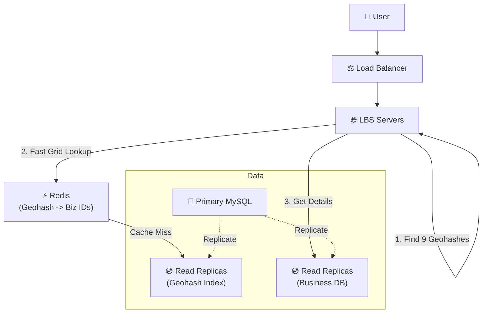

# Proximity Service — Quick Revision (Short Notes)

### 1. The Core Bottleneck
- **Storage is tiny** (200M businesses * 1KB = ~200GB easily fits in RAM).
- **CPU is the bottleneck**. Doing mathematical 2D geometrical boundaries (circles on a map) at 100,000 QPS will crash a server.

### 2. The Naive Approach
- Standard SQL indexing (`CREATE INDEX on latitude`) is **1-Dimensional**. 
- It pulls a horizontal slice of the entire globe, forcing the DB to manually scan millions of rows to check the longitude. Far too slow for an interview pass.

---

### 3. The 3 Algorithms for Geospatial Indexing

#### A. Geohash (The Winner for Stateless Scaling)
- Recursively divides the world into 4 quadrants.
- Converts a 2D map into a **1-Dimensional Base-32 String** (e.g., `9q8yyk`).
- The longer the string, the more precise the box.
- **Magic Rule:** Places that share a long prefix are close together. You can query Geohashes using simple string prefix matching in SQL or Redis.
- **Edge Case Solution:** Searching near boundaries is tricky (close places might have different root prefixes). **Always calculate and query the 8 neighboring boxes.**

#### B. Quadtree (The Memory-Optimized Winner)
- An in-memory tree that dynamically splits boxes into 4 ONLY if the box exceeds a capacity limit (e.g., 100 businesses).
- Times Square = Deep tree, millions of tiny boxes. The Pacific Ocean = 1 giant box.
- **Downside:** It is **stateful**. Every API server needs to build and hold this massive tree in RAM. Scaling to 100 servers requires syncing 100 memory trees perfectly.

#### C. Google S2 (The Advanced Option)
- Uses Hilbert Curves instead of Z-Curves. Eliminates the Geohash boundary edge-case problem natively. Used by Tinder and Google Maps.

---

### 4. High-Level Architecture (The Read Sequence)
1. **User request:** `GET /nearby?lat=x&lng=y&radius=1km`
2. **App Server:** Calculates user's Geohash string.
3. **App Server:** Mathematically calculates the 8 neighboring Geohash strings.
4. **Redis Cache:** Checks `MGET grid1 grid2 ... grid9`. Retrieves lists of Business IDs.
5. **App Server:** Filters any IDs that mathematically fall outside the absolute 1km Euclidean circle.
6. **SQL DB:** Runs `SELECT details FROM business WHERE id IN (...)` to get the actual names/ratings.
7. **Ranking Layer:** Sorts the 200 returned rows to only send the Top 50 to the user's phone via pagination.

### 5. Managing Scale
- **Write Path:** Master DB handles updates. An async background worker pulls Kafka events to update the Redis Geohash cache.
- **Read Path:** Distributed Read Replicas handles the 100k QPS geographical lookups.

---

### 🖼️ Architecture Diagram (Memorize This)

