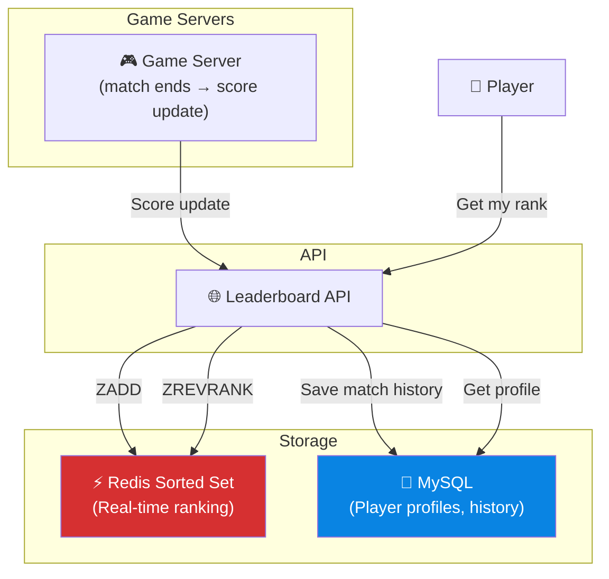
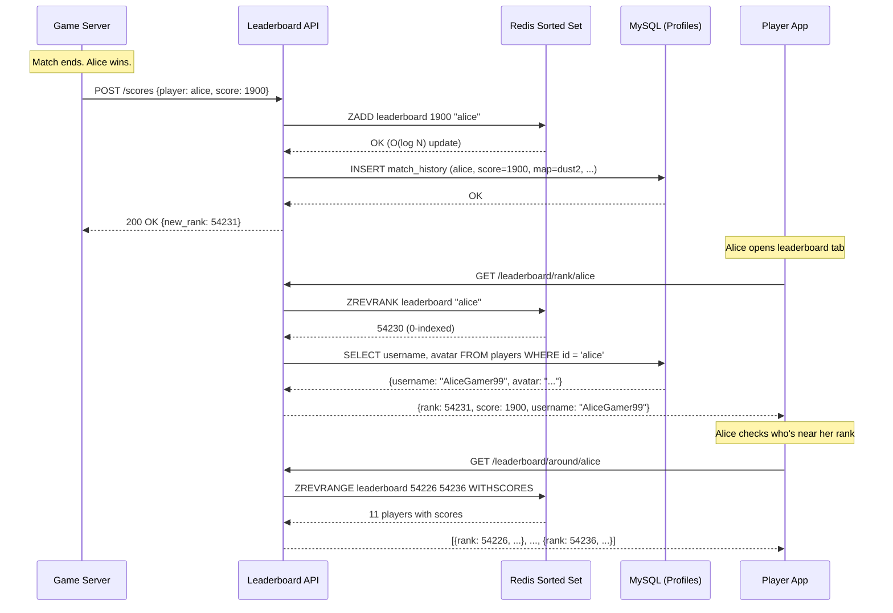

# Volume 2 - Chapter 10: Design a Real-Time Gaming Leaderboard

> **Core Idea:** A gaming leaderboard ranks millions of players by score in real-time. When a player wins a match, their score updates and they see their new global rank instantly. The challenge is that **ranking is inherently a global operation** — to know you're ranked #54,231 out of 25 million players, the system must compare your score against everyone else's. Naive SQL `ORDER BY score` on 25 million rows is far too slow for real-time. The solution is Redis Sorted Sets — a data structure purpose-built for ranked scoring.

---

## 🎯 Step 1: Understand the Problem & Scope

### Clarifying the Requirements

```
You:  "How many players?"
Int:  "25 million monthly active players. 5 million DAU."

You:  "How often do scores update?"
Int:  "A player's score updates after every match. Average 10 matches per day per active user."

You:  "What queries do we need to support?"
Int:  "1. Get global top 100 players.
       2. Get a specific player's rank.  
       3. Get players around a specific player (e.g., rank 1000-1010)."

You:  "How real-time does the leaderboard need to be?"
Int:  "Within seconds of a match ending, the player should see their updated rank."
```

### 📋 Back-of-the-Envelope

| Metric | Calculation | Result |
|---|---|---|
| **Score updates/day** | 5M DAU × 10 matches | **50 Million updates/day** |
| **Score update QPS** | 50M / 86400 | **~580 QPS** |
| **Peak update QPS** | 580 × 5 | **~2,900 QPS** |
| **Leaderboard read QPS** | 5M DAU × 20 views/day / 86400 | **~1,160 QPS** |
| **Data size** | 25M players × 100 bytes (id + score + metadata) | **~2.5 GB** |

> **Takeaway:** The data is tiny (2.5 GB fits entirely in RAM). QPS is moderate. The hard problem is the **rank query** — every time a player asks "What is my rank?", we need to count how many players have a higher score. On 25 million rows, this is expensive in SQL but trivial in Redis Sorted Sets.

---

## ☠️ Step 2: Why SQL Fails for Real-Time Ranking

### The Naive Approach
```sql
-- Get player's rank
SELECT COUNT(*) + 1 AS rank FROM players WHERE score > (
    SELECT score FROM players WHERE player_id = 'alice'
);
```

**Problem:** This scans up to 25 million rows to count how many players have a higher score. Even with an index on `score`, the COUNT requires walking the B-tree. At 1,160 QPS, the database CPU would be 100% busy just counting.

### The Batch Approach (Pre-compute ranks)
Run a nightly batch job: `UPDATE players SET rank = ROW_NUMBER() OVER (ORDER BY score DESC)`.
- **Problem:** Ranks are stale until the next batch run. A player who just won a match won't see their updated rank for hours. Not "real-time."

> **The Solution:** Use **Redis Sorted Sets** — a data structure that maintains elements in sorted order and provides `O(log N)` rank queries natively.

---

## ⚡ Step 3: Redis Sorted Sets — The Perfect Data Structure

### What is a Sorted Set?
A Redis Sorted Set is a collection of unique members, each associated with a floating-point **score**. Members are always maintained in sorted order by score.

```redis
-- Add players with scores
ZADD leaderboard 1500 "alice"
ZADD leaderboard 2300 "bob"
ZADD leaderboard 1800 "charlie"
ZADD leaderboard 2100 "dave"

-- Internal state (always sorted by score):
-- Index 0: alice   (1500)
-- Index 1: charlie (1800)
-- Index 2: dave    (2100)
-- Index 3: bob     (2300)  ← Highest score
```

### The Key Operations (All O(log N))

| Operation | Command | Time | Example |
|---|---|---|---|
| **Update score** | `ZADD leaderboard 1900 "alice"` | O(log N) | Alice won a match, new score 1900 |
| **Get rank** | `ZREVRANK leaderboard "alice"` | O(log N) | Returns 2 (0-indexed, descending) |
| **Top K** | `ZREVRANGE leaderboard 0 9 WITHSCORES` | O(log N + K) | Returns top 10 players |
| **Players around rank** | `ZREVRANGE leaderboard 999 1009` | O(log N + K) | Ranks 1000-1010 |
| **Get score** | `ZSCORE leaderboard "alice"` | O(1) | Returns 1900 |

### How Does Redis Achieve O(log N) Ranking?

Internally, Redis Sorted Sets use a **Skip List** — a probabilistic data structure that's like a linked list with express lanes.

#### Beginner Example: The Express Train Analogy
Imagine a train line with 100 stations:
```
Local train:   Stops at EVERY station → 100 stops to get to station 100
Express train: Stops every 10th station → 10 stops, then switch to local for last few
Super express: Stops every 50th station → 2 stops, then express, then local
```

A skip list has multiple "lanes":
```
Level 3:  1 ─────────────────────────────── 50 ────────────────────── 100
Level 2:  1 ──── 10 ──── 20 ──── 30 ──── 50 ──── 70 ──── 90 ──── 100
Level 1:  1 ── 5 ── 10 ── 15 ── 20 ── 25 ── 30 ── 35 ── 40 ──...── 100
Level 0:  1  2  3  4  5  6  7  8  9  10  11 ... (every element)
```

To find rank of element 73:
1. Start at Level 3: jump to 50 (count: 50 elements skipped)
2. Drop to Level 2: jump to 70 (count += 20)
3. Drop to Level 1: jump to 73 (count += 3)
4. **Rank = 73** (computed during traversal!)

Each level stores the **span** (number of elements between nodes), enabling rank calculation during traversal without scanning every element.

---

## 🏛️ Step 4: System Architecture



### The Flow
1. **Match ends:** Game server calls `POST /api/scores` with `{player_id, new_score}`.
2. **API Server:** Runs `ZADD leaderboard {new_score} {player_id}` on Redis. Redis updates the sorted set in O(log N). Also writes match result to MySQL for history.
3. **Player views leaderboard:** `GET /api/leaderboard/top100` → `ZREVRANGE leaderboard 0 99 WITHSCORES`.
4. **Player checks own rank:** `GET /api/leaderboard/rank/alice` → `ZREVRANK leaderboard "alice"`.

---

## 🧑‍💻 Step 5: Advanced Scenarios

### Handling 25M Players in Redis
A single Redis Sorted Set with 25M members uses ~2.5 GB RAM. This easily fits in a single Redis instance (modern instances have 64–256 GB RAM). No sharding needed for the sorted set itself!

However, if we need **multiple leaderboards** (daily, weekly, monthly, per-game-mode), each is a separate sorted set:
```redis
ZADD leaderboard:global    1900 "alice"
ZADD leaderboard:weekly    400  "alice"
ZADD leaderboard:ranked    1200 "alice"
```

### Time-Based Leaderboards (Weekly Reset)
- **Weekly leaderboard:** Create a new sorted set each week: `leaderboard:week:2026-W18`.
- At the start of each week, a background job rotates: the old set is archived, a fresh empty set begins.
- Players who haven't played this week simply don't exist in the current week's set.

### Tie-Breaking
If two players have the same score, who ranks higher? Redis sorts ties by lexicographic order of the member name (alphabetical). This is rarely the desired behavior.

> **Solution:** Encode a tiebreaker into the score itself using decimal precision:
> ```
> score = actual_score + (1 - timestamp / max_timestamp)
> 
> Alice scored 2000 at 10:00:00 → 2000.999990
> Bob   scored 2000 at 10:05:00 → 2000.999985
> 
> Alice ranks higher (she achieved the score first)
> ```

### Relative Leaderboard ("Friends Only")
Instead of global rank, show rank among friends. Maintain a separate sorted set per user or use `ZRANGEBYSCORE` to filter. For small friend lists (<1000), this is fast. For large social graphs, precompute friend-relative ranks asynchronously.

### Sharding for Extreme Scale (100M+ Players)
If a single Redis instance can't hold all players (unlikely for most games):
- Shard by score range: Shard 1 holds scores 0-999, Shard 2 holds 1000-1999, etc.
- To get global rank: query the player's shard for their local rank, then add the total count of all higher-score shards.
- This requires a metadata layer tracking the count per shard.

---

## 🏗️ Step 6: API Design

```
GET    /v1/leaderboard/top?limit=100          → Get top 100 players
GET    /v1/leaderboard/rank/{player_id}       → Get a player's global rank
GET    /v1/leaderboard/around/{player_id}     → Get ±5 players around this player
POST   /v1/scores                             → Update a player's score
GET    /v1/leaderboard/friends/{player_id}    → Get rank among friends
```

### Response Example
```json
GET /v1/leaderboard/rank/alice

{
  "player_id": "alice",
  "username": "AliceGamer99",
  "score": 1900,
  "rank": 54231,
  "total_players": 25000000,
  "percentile": "top 0.2%"
}
```

---

## 🔄 Step 7: Full Sequence Diagram (Score Update + Rank Query)



---

## 💻 Step 8: Python Implementation of the Leaderboard Service

### Core Service Logic
```python
import redis
import uuid

r = redis.Redis(host='localhost', port=6379)
LEADERBOARD_KEY = "leaderboard:global"

class LeaderboardService:
    
    def update_score(self, player_id: str, new_score: float):
        """Update a player's score. O(log N)."""
        # ZADD automatically creates or updates the member
        r.zadd(LEADERBOARD_KEY, {player_id: new_score})
    
    def get_rank(self, player_id: str) -> int:
        """Get 1-indexed rank (descending). O(log N)."""
        zero_indexed_rank = r.zrevrank(LEADERBOARD_KEY, player_id)
        if zero_indexed_rank is None:
            raise ValueError(f"Player {player_id} not found")
        return zero_indexed_rank + 1  # Convert to 1-indexed
    
    def get_top_k(self, k: int = 100) -> list:
        """Get top K players with scores. O(log N + K)."""
        # Returns [(member, score), ...]
        return r.zrevrange(LEADERBOARD_KEY, 0, k - 1, withscores=True)
    
    def get_around_player(self, player_id: str, window: int = 5) -> list:
        """Get players ±window around the given player."""
        rank = r.zrevrank(LEADERBOARD_KEY, player_id)
        if rank is None:
            return []
        start = max(0, rank - window)
        end = rank + window
        return r.zrevrange(LEADERBOARD_KEY, start, end, withscores=True)
    
    def get_score(self, player_id: str) -> float:
        """Get a player's score. O(1)."""
        return r.zscore(LEADERBOARD_KEY, player_id)
    
    def get_total_players(self) -> int:
        """Get total number of players. O(1)."""
        return r.zcard(LEADERBOARD_KEY)


# Usage example:
lb = LeaderboardService()
lb.update_score("alice", 1900)
lb.update_score("bob", 2300)
print(f"Alice's rank: {lb.get_rank('alice')}")       # → 2
print(f"Top 3: {lb.get_top_k(3)}")                   # → [('bob', 2300), ('alice', 1900), ...]
```

---

## 🛡️ Step 9: Redis Persistence & Fault Tolerance

### The Problem
Redis is in-memory. If the Redis instance crashes, we lose the entire leaderboard. Rebuilding from MySQL would require re-inserting 25M players — which could take minutes.

### Solution 1: Redis Persistence (RDB + AOF)
| Mode | How it works | Recovery time |
|---|---|---|
| **RDB (Snapshot)** | Periodically save a full snapshot to disk (e.g., every 5 min) | Lose up to 5 min of data |
| **AOF (Append-Only File)** | Log every write command to disk | Lose at most 1 second of data |
| **RDB + AOF (Hybrid)** | Use both: AOF for recent writes, RDB for full backup | Best of both worlds |

### Solution 2: Redis Replication
Run a Redis replica that mirrors the primary in real-time:
```
Primary Redis (writes) → Replica Redis (reads + failover backup)
```
If the primary dies, promote the replica. Failover in ~10 seconds.

### Solution 3: Rebuild from MySQL
As a last resort, run a batch job:
```sql
SELECT player_id, score FROM players;
-- Pipe results into Redis: ZADD leaderboard score player_id (× 25M times)
-- Takes ~2-5 minutes with pipelining
```

---

## 🎮 Step 10: Score Calculation Strategies

Different games use very different scoring approaches:

### Strategy 1: Cumulative Score (Default)
Each match adds to the total: `new_score = old_score + match_points`.
- Simple, but scores grow forever. Long-time players always dominate.

### Strategy 2: Elo Rating (Chess-style)
Score goes UP when you beat a higher-rated player, DOWN when you lose to a lower-rated one:
```
K = 32  # Sensitivity factor
expected = 1 / (1 + 10^((opponent_rating - your_rating) / 400))
new_rating = old_rating + K * (actual_result - expected)
```
- Self-balancing. New players can quickly rise to their true skill level.

### Strategy 3: Decay (Seasonal)
Scores lose 10% per week of inactivity. Forces players to keep playing:
```
score = base_score * (0.9 ^ weeks_inactive)
```
- Prevents "park and hold" where a player reaches #1 and stops playing.

### Strategy 4: Percentile-Based
Convert raw scores to percentile ranks: "You're in the top 5%!" rather than "You're rank 1,250,000."
```python
percentile = (1 - rank / total_players) * 100
tier = "Diamond" if percentile >= 95 else "Gold" if percentile >= 75 else "Silver"
```

---

## ❓ Interview Quick-Fire Questions

**Q1: Why not use a SQL database for a leaderboard?**
> SQL requires `SELECT COUNT(*) WHERE score > X` to compute rank — this scans the B-tree index linearly (O(N) in worst case). At 25M players and 1,160 QPS, this saturates the database CPU. Redis Sorted Sets use skip lists that compute rank in O(log N) during traversal by storing span metadata at each node.

**Q2: How does a Redis Skip List compute rank without scanning all elements?**
> Each node in the skip list's express lanes stores a "span" — the number of elements between itself and the next node at that level. To find rank, the algorithm traverses from the top lane downward, accumulating spans. Total traversal is O(log N) hops, and the accumulated span gives the exact rank.

**Q3: How do you handle ties in scoring?**
> Encode a tiebreaker in the fractional part of the score. For example, `score = actual_score + (1 - normalized_timestamp)`. The player who achieved the score earlier gets a slightly higher fractional component, thus ranking higher. Redis sorts by score first, then lexicographically by member name for true ties.

**Q4: How do you reset weekly leaderboards efficiently?**
> Create a new sorted set each week: `leaderboard:week:2026-W18`. At the start of the new week, the old key becomes read-only (for history/rewards), and a new empty key is used for the new week. Old keys can be archived or deleted after rewards are distributed.

**Q5: What happens if Redis crashes? Do we lose the leaderboard?**
> Three layers of protection: (1) Redis AOF persists every write command to disk (lose ≤1 second of data). (2) Redis replication maintains a real-time replica. (3) As a last resort, rebuild the entire leaderboard from MySQL player scores in ~2-5 minutes using Redis pipelining.

---

## 📋 Summary — Quick Revision Table

| Component | Choice | Why |
|---|---|---|
| **Core data structure** | **Redis Sorted Set (Skip List)** | O(log N) for insert, rank query, and range query. Perfect for real-time ranking. |
| **Profile storage** | **MySQL** | Player details, match history, achievements. Queried by player_id. |
| **Rank query** | **`ZREVRANK`** | Returns rank in O(log N) without scanning. |
| **Top-K query** | **`ZREVRANGE 0 K`** | Returns top K players in O(log N + K). |
| **Tie-breaking** | **Encode timestamp in decimal score** | Earlier achievement of same score ranks higher. |
| **Persistence** | **AOF + Replication + MySQL fallback** | Triple protection against data loss. |

---

## 🧠 Memory Tricks

### **"The Express Train" for Skip Lists**
> A skip list is a linked list with express lanes. Instead of walking past every station (O(N)), you jump on the express train (O(log N)). Each lane stores how many stations you skip, so you can calculate rank during traversal.

### **"S.R.T." — Leaderboard Checklist**
1. **S**orted Set — Redis ZADD/ZREVRANK for real-time ranking
2. **R**ank = O(log N) — Skip list, not SQL COUNT
3. **T**ie-break — Encode timestamp in the decimal portion of the score

---

> **📖 Previous Chapter:** [← Chapter 9: Design S3 Object Storage](/HLD_Vol2/chapter_9/design_s3_object_storage.md)  
> **📖 Up Next:** [Chapter 11: Design a Payment System →](/HLD_Vol2/chapter_11/design_a_payment_system.md)
