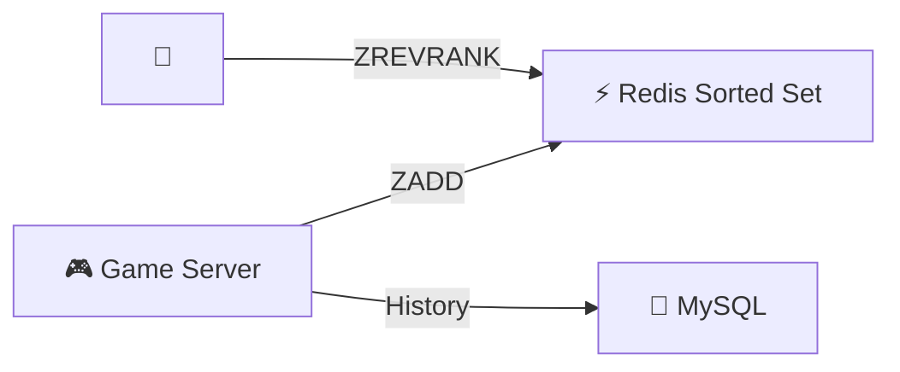

# Gaming Leaderboard — Quick Revision (Short Notes)

### Core Problem
25M players. "What is my rank?" requires comparing against everyone. SQL COUNT = O(N) = too slow.

---

### 1. Redis Sorted Set
- Members stored in score-sorted order using a **Skip List**.
- All key operations are **O(log N)**:
  - `ZADD leaderboard 1900 "alice"` → update score
  - `ZREVRANK leaderboard "alice"` → get rank (descending)
  - `ZREVRANGE leaderboard 0 99` → top 100

### 2. Skip List Internals
- Linked list with "express lanes." Each lane stores the span (elements skipped).
- To find rank: traverse top lanes first, accumulate spans. O(log N) hops.

### 3. Tie-Breaking
- Same score? Encode timestamp in decimal: `score = 2000 + (1 - timestamp/max)`
- Earlier achievement ranks higher.

### 4. Time-Based Leaderboards
- Weekly: `leaderboard:week:2026-W18`. Rotate at week start.
- Monthly: same pattern. Old sets archived.

### 5. Scale
- 25M members × 100 bytes = ~2.5 GB → fits in single Redis instance.
- Multiple leaderboards = separate sorted sets.

---

### Architecture

### Memory Trick: "S.R.T."
1. **S**orted Set (Redis ZADD)
2. **R**ank = O(log N) via skip list
3. **T**ie-break via timestamp in decimal score
