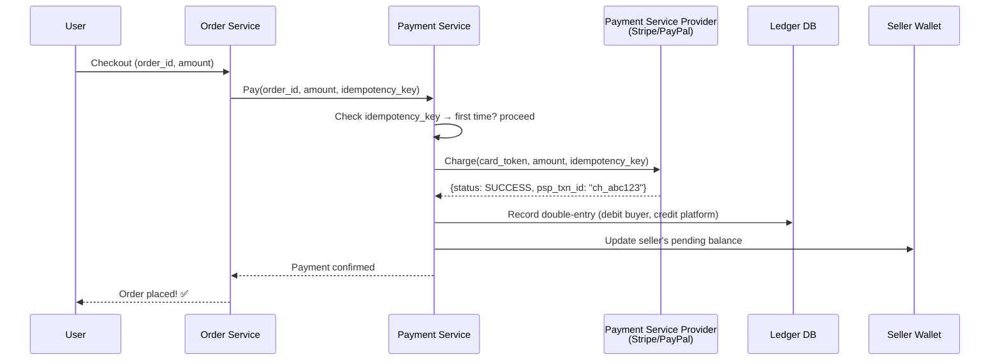
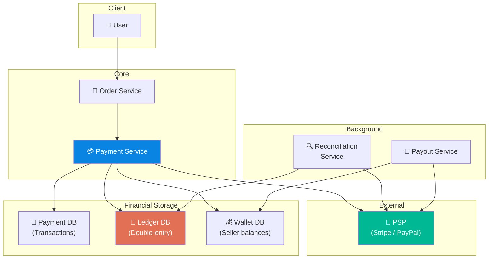

# Volume 2 - Chapter 11: Design a Payment System (e.g., Stripe)

> **Core Idea:** A payment system processes money transfers between buyers and sellers. Unlike most distributed systems where occasional errors are tolerable, payment systems have **zero tolerance for errors** — charging a customer twice, losing a payment, or paying a merchant the wrong amount can result in legal liability. The entire chapter revolves around one principle: **idempotency, idempotency, idempotency.** Every operation must be safely retryable without causing duplicate financial effects.

---

## 🎯 Step 1: Understand the Problem & Scope

### Clarifying the Requirements

```
You:  "What type of payments? P2P (Venmo) or merchant (Stripe)?"
Int:  "Merchant payments. Users buy products from sellers."

You:  "What payment methods?"
Int:  "Credit card, debit card, bank transfer."

You:  "Scale?"
Int:  "1 million transactions per day."

You:  "Do we handle payouts to sellers?"
Int:  "Yes. After purchase, money goes to our account, then we pay out to the seller."
```

### 📋 Back-of-the-Envelope

| Metric | Calculation | Result |
|---|---|---|
| **Transactions/day** | Given | **1 Million** |
| **TPS** | 1M / 86400 | **~12 TPS (avg)** |
| **Peak TPS** | 12 × 10 (flash sales) | **~120 TPS** |
| **Transaction record size** | ~500 bytes | **500 bytes** |
| **Storage/year** | 1M × 500 bytes × 365 | **~183 GB** |

> **Takeaway:** The scale is small. 120 TPS is trivial for any database. **The challenge is 100% about correctness, not performance.** Double-charging a customer or losing a payment is unacceptable.

---

## 💸 Step 2: The Payment Flow (Sequence Diagram)



---

## 🔑 Step 3: Idempotency — The #1 Design Principle

### The Problem
Networks are unreliable. What if:
1. Our server charges the card via Stripe successfully.
2. Stripe returns "200 OK."
3. Our server crashes BEFORE saving the result to our DB.
4. The client retries the request.
5. Without protection, we charge the card **again**.

### The Solution: Idempotency Key
Every payment request includes a client-generated UUID (`idempotency_key`). The server ensures that the same key NEVER produces a second financial effect.

```python
def process_payment(request):
    key = request.idempotency_key
    
    # Step 1: Check if we've already processed this
    existing = db.query("SELECT * FROM payments WHERE idempotency_key = ?", key)
    if existing:
        return existing.result  # Return cached response — no duplicate charge!
    
    # Step 2: First time → process the payment
    result = stripe.charge(request.card_token, request.amount, idempotency_key=key)
    
    # Step 3: Save the result (even if it's a failure)
    db.insert("INSERT INTO payments (idempotency_key, status, psp_txn_id, ...) VALUES (...)")
    
    return result
```

### The Database Guarantee
A unique index on `idempotency_key` ensures that even if two identical requests arrive at the exact same millisecond, the database will reject the second INSERT with a duplicate key error.

---

## 📒 Step 4: The Ledger — Double-Entry Bookkeeping

### Why a Ledger?
Every financial system since 15th-century Italy uses **double-entry bookkeeping**: every transaction creates TWO entries — a **debit** from one account and a **credit** to another. The sum of all debits must always equal the sum of all credits. If they don't, money has been created or destroyed, which means there's a bug.

### The Ledger Table
```sql
CREATE TABLE ledger_entries (
    entry_id        UUID PRIMARY KEY,
    transaction_id  UUID,          -- Groups the two sides together
    account_id      VARCHAR(50),   -- "buyer:alice" or "platform:escrow"
    amount          DECIMAL(19,4), -- Positive = credit, Negative = debit
    currency        VARCHAR(3),
    created_at      TIMESTAMP
);

-- Example: Alice pays $100 for an order
-- Entry 1: Debit Alice          → -$100.00
-- Entry 2: Credit Platform      → +$100.00
-- SUM = $0 ✅ (money is conserved)
```

### The Invariant
```sql
SELECT SUM(amount) FROM ledger_entries;
-- MUST always equal 0.00
-- If it doesn't, sound the alarm. Something is deeply wrong.
```

This invariant is checked by a **reconciliation job** that runs hourly/daily.

---

## 🏛️ Step 5: System Architecture



---

## 🔄 Step 6: Handling Failures at Every Step

### Failure Matrix
| Failure Point | What Happens | How We Handle It |
|---|---|---|
| **Before PSP call** | Server crashes mid-processing | Idempotency key → safe to retry the entire request |
| **PSP call timeout** | We don't know if the charge succeeded | Query PSP status API: `GET /charges/{idempotency_key}` |
| **After PSP success, before DB write** | Payment charged but not recorded | Idempotency key + PSP reconciliation catches unrecorded charges |
| **After DB write, before response** | Payment fully processed but client thinks it failed | Client retries → idempotency key returns cached success |

### Reconciliation (The Safety Net)
Every day, we download the complete transaction list from the PSP (Stripe) and compare it against our ledger:
```
Our Ledger says:     1,000 transactions today, total $50,000
Stripe says:         1,001 transactions today, total $50,100

MISMATCH! → 1 transaction ($100) was charged by Stripe but missing from our ledger.
→ Alert on-call engineer. Investigate and fix.
```

---

## 💸 Step 7: Payouts to Sellers

### The Flow
1. Customer pays $100. Money goes to **Platform Escrow Account**.
2. After order delivery confirmation, the **Payout Service** transfers money from escrow to the seller's bank account.
3. Platform keeps a commission (e.g., 10% = $10).

### Ledger entries for payout:
```
Debit  platform:escrow     -$90.00    (release to seller)
Credit seller:merchant_42  +$90.00
Debit  platform:escrow     -$10.00    (platform commission)
Credit platform:revenue    +$10.00
```

### Payout Batching
Processing individual $5 payouts is expensive (each bank transfer has a fixed cost). Instead, batch payouts:
- Accumulate seller earnings over 7 days.
- On payout day, send one lump sum per seller.
- Reduces bank transfer fees dramatically.

---

## 🧑‍💻 Step 8: Advanced Deep Dive

### Exactly-Once with PSP
We send `idempotency_key` to Stripe. Stripe guarantees: if they receive the same key twice, they charge the card only once and return the same response. This is the external guarantee. Our internal guarantee is the unique DB index on the key.

### Currency Handling
- Store all monetary amounts as `DECIMAL(19,4)` — NEVER use floating point (0.1 + 0.2 ≠ 0.3 in IEEE 754).
- Store currency code alongside every amount (e.g., `amount: 100.00, currency: "INR"`).
- Never mix currencies in arithmetic without explicit conversion.

### PCI DSS Compliance
Our servers must NEVER store raw credit card numbers. Instead:
1. The client sends the card number directly to the PSP (Stripe.js).
2. PSP returns a `card_token` (e.g., `tok_abc123`).
3. Our server only stores and uses the token. We never touch the actual card number.

---

## 📋 Summary — Quick Revision Table

| Component | Choice | Why |
|---|---|---|
| **Idempotency** | **Client UUID + unique DB index + PSP idempotency key** | Triple protection against duplicate charges. |
| **Ledger** | **Double-entry bookkeeping** | Every debit has a matching credit. SUM must always = 0. |
| **Reconciliation** | **Daily PSP ↔ Ledger comparison** | Catches any discrepancies between what PSP charged and what we recorded. |
| **Payouts** | **Batched weekly transfers** | Reduces bank transfer fees. |
| **Card security** | **PCI DSS tokenization** | Server never sees raw card numbers. PSP handles sensitive data. |

---

## 🧠 Memory Tricks

### **"I.L.R." — The Payment Trinity**
1. **I**dempotency — Every operation is safely retryable (UUID key).
2. **L**edger — Double-entry bookkeeping (debit + credit = 0).
3. **R**econciliation — Daily comparison with PSP to catch mismatches.

### **"Never Trust the Network" Mantra**
> Assume every network call can: (a) succeed silently, (b) fail silently, or (c) succeed but lose the response. Design every step to be recoverable from all three scenarios using idempotency keys.

---

> **📖 Previous Chapter:** [← Chapter 10: Design a Real-Time Gaming Leaderboard](/HLD_Vol2/chapter_10/design_a_real_time_gaming_leaderboard.md)  
> **📖 Up Next:** Chapter 12 - Design a Digital Wallet
