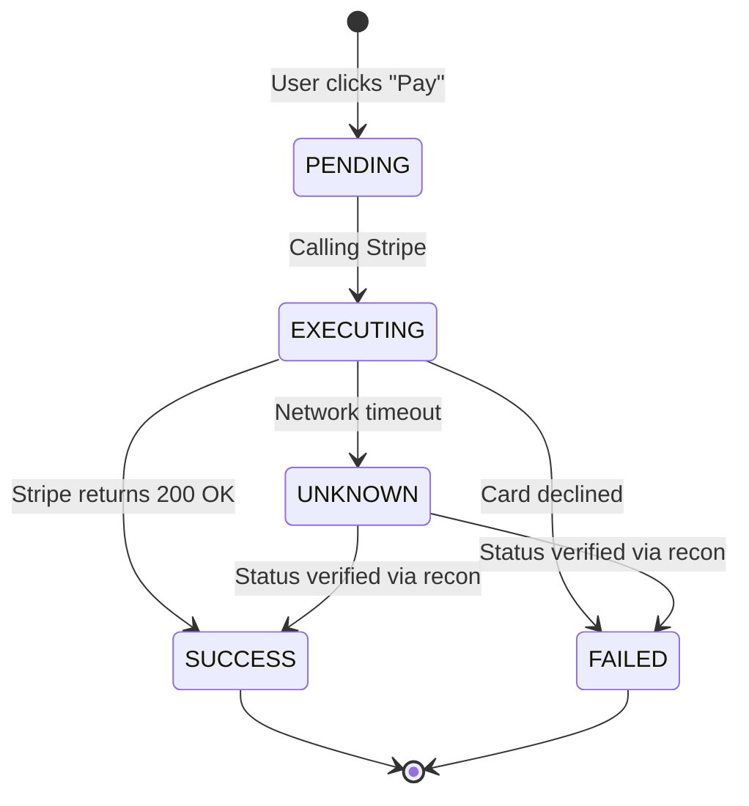
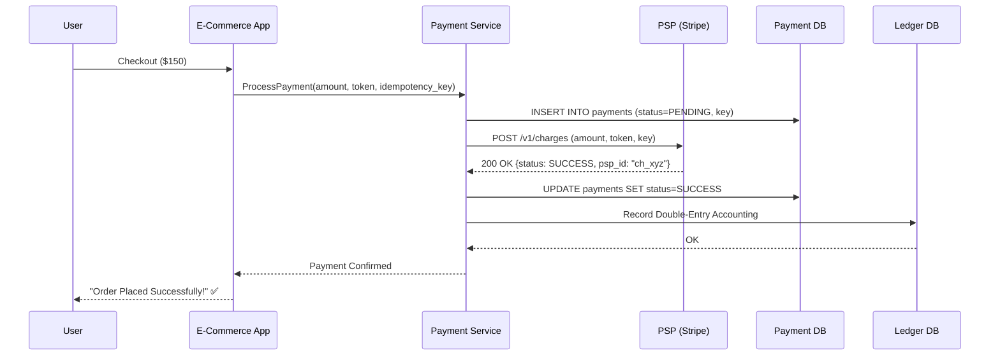

# Volume 2 - Chapter 11: Design a Payment System (e.g., Stripe)

> **Core Idea:** A payment system processes money transfers between buyers and sellers. Unlike most distributed systems (like social media or video streaming) where occasional errors or dropped messages are tolerable, payment systems have **zero tolerance for errors**. Charging a customer twice, losing a payment, or paying a merchant the wrong amount can result in massive legal liability and loss of trust. The entire chapter revolves around one core principle: **Idempotency.** Every single operation in the system must be safely retryable without causing duplicate financial effects.

---

## 🎯 Step 1: Understand the Problem & Scope

### Clarifying the Requirements

```
You:  "What type of payments are we processing? P2P (Venmo) or merchant checkout (Stripe/Shopify)?"
Int:  "Merchant payments. Users buy products from sellers on an e-commerce platform."

You:  "What payment methods do we support?"
Int:  "Credit cards and debit cards only for now."

You:  "What is the scale?"
Int:  "1 million transactions per day."

You:  "Do we handle payouts to sellers?"
Int:  "Yes. After a successful purchase, money goes to our central escrow account. Later, we pay out to the seller minus our commission fee."

You:  "Do we need multi-currency support?"
Int:  "Yes, the system operates globally and must handle currency conversion."
```

### 📋 Back-of-the-Envelope

| Metric | Calculation | Result |
|---|---|---|
| **Transactions/day** | Given | **1 Million** |
| **TPS** | 1M / 86400 | **~12 TPS (avg)** |
| **Peak TPS** | 12 × 10 (Black Friday / flash sales) | **~120 TPS** |
| **Transaction record size** | ~500 bytes per transaction | **500 bytes** |
| **Storage/year** | 1M × 500 bytes × 365 | **~183 GB / year** |

> **Crucial Takeaway:** The scale is incredibly small. 120 TPS and 183 GB/year is trivial for almost any modern database. **The challenge of this interview is 100% about CORRECTNESS, not performance.** A standard relational database is actually required here; NoSQL is the wrong choice because we need strict ACID transactions.

---

## 🏗️ Step 2: API & State Machine Design

### The Payment State Machine
A payment isn't just "Done" or "Failed". It goes through a strict lifecycle.



### The API Endpoints
```
POST /v1/payments                 → Initiate a charge
GET  /v1/payments/{payment_id}    → Check status of a charge
POST /v1/payouts                  → Bulk transfer money to sellers
```

**Payload for `/v1/payments`:**
```json
{
  "buyer_id": "usr_9988",
  "seller_id": "merch_123",
  "amount": 150.00,
  "currency": "USD",
  "card_token": "tok_visa_abc123",
  "idempotency_key": "uuid-abcd-8899"
}
```

---

## 💸 Step 3: The Payment Flow (Sequence Diagram)

Let's walk through the "Happy Path" of a customer buying a $150 item.



*Note: PSP stands for "Payment Service Provider" (Stripe, PayPal, Braintree).*

---

## 🔑 Step 4: Idempotency — The #1 Design Principle

### The Distributed Systems Nightmare
Networks are unreliable. Imagine this scenario:
1. Our server calls Stripe to charge the card $150.
2. Stripe processes the charge successfully.
3. The network drops Stripe's "200 OK" response. Our server times out.
4. Our server thinks the payment failed and retries the request.
5. Without protection, Stripe charges the user's card **a second time**. The user is billed $300 instead of $150. Lawsuit incoming!

### The Solution: Idempotency Keys
An operation is "idempotent" if performing it multiple times yields the exact same result as performing it once. 
Every payment request includes a client-generated UUID (`idempotency_key`).

**The Triple Guarantee:**
1. **The DB Guarantee:** We place a `UNIQUE INDEX` on `idempotency_key` in our database. If two identical requests hit our system at exactly the same microsecond, the DB rejects the second one.
2. **The Code Guarantee:**
   ```python
   def process_payment(request):
       # Fast check: Have we seen this key?
       existing_payment = db.get_by_idempotency_key(request.key)
       if existing_payment:
           # If it's already successful, just return the cached success!
           return existing_payment.response
       
       # ... process payment ...
   ```
3. **The PSP Guarantee:** We pass the `idempotency_key` to Stripe via an HTTP Header. Stripe stores these keys for 24 hours. If Stripe receives a duplicate key, they don't charge the card again; they simply echo back the exact same JSON response from the original successful charge.

---

## 📒 Step 5: The Ledger — Double-Entry Bookkeeping

We successfully charged the card. Now we must record who owns the money.
Every financial system since 15th-century Italy uses **double-entry bookkeeping**: every transaction creates at least TWO entries — a **debit** from one account and a **credit** to another. 

### The Invariant Rule
> **The sum of all debits and credits for a single transaction MUST ALWAYS equal zero.**
> If they don't, money has magically been created or destroyed, which means there's a bug.

### The Ledger Table Schema
```sql
CREATE TABLE ledger_entries (
    entry_id        UUID PRIMARY KEY,
    transaction_id  UUID,          -- Groups all entries for one event together
    account_id      VARCHAR(50),   -- E.g., 'buyer:alice', 'platform:escrow'
    amount          DECIMAL(19,4), -- Positive = credit, Negative = debit
    currency        VARCHAR(3),
    created_at      TIMESTAMP
);
```

### Example: Alice buys a $100 shirt from Bob
When the charge succeeds, we record two rows in the ledger:
```
Transaction_ID: txn_999
Entry 1: Debit  buyer:alice         -$100.00
Entry 2: Credit platform:escrow     +$100.00
[SUM = $0.00] ✅
```
Note: The money sits in the `platform:escrow` account. We don't credit Bob yet because the shirt hasn't shipped.

---

## 🏢 Step 6: Payouts & Complex Accounting

Three days later, the shirt is delivered. We must now pay Bob.
However, our platform charges a **10% commission fee**.

### Ledger Entries for Payout
When the Payout Service runs, it moves the money out of escrow:

```
Transaction_ID: txn_1000
Entry 1: Debit  platform:escrow       -$100.00   (Pull the money out of holding)
Entry 2: Credit seller:bob            +$90.00    (Bob gets 90%)
Entry 3: Credit platform:revenue      +$10.00    (We keep 10% profit)
[SUM = $0.00] ✅
```

### Payout Batching
Processing individual $90 bank transfers to Bob is expensive (banks charge a fixed fee per wire/ACH transfer). Instead, we batch them:
- Accumulate Bob's sales over the month in the `seller:bob` ledger account.
- On the 1st of the next month, we do a single $50,000 ACH transfer to Bob's real-world bank account.

---

## 🔄 Step 7: Handling Failures & Reconciliation

What if the Payment Service crashes immediately after Stripe charges the card, but *before* we write to our Database or Ledger? 

Our database thinks the payment is `PENDING` (or we have no record of it), but Stripe actually took the user's money. This is an orphaned charge.

### The Solution: Daily Reconciliation
Reconciliation is an automated accounting process that verifies two independent sets of records.
1. Every night at 2:00 AM, our Reconciliation Service connects to Stripe via SFTP and downloads the official "Daily Settlement Report" (a massive CSV file of every charge Stripe processed yesterday).
2. It queries our `Payment DB` for yesterday's records.
3. It compares them row by row.

```
Our DB says:         10,000 transactions, total $500,000
Stripe CSV says:     10,001 transactions, total $500,100

MISMATCH DETECTED!
Stripe charged $100 for txn_abc123, but our DB says it's PENDING.
```

When a mismatch is found:
- The system automatically transitions `txn_abc123` to `SUCCESS` in our DB.
- It retroactively writes the missing Ledger entries.
- It triggers an alert to the finance engineering team if the mismatch cannot be auto-resolved.

---

## 🧑‍💻 Step 8: Advanced Scenarios (Staff Level)

### 1. The Floating Point Trap
**NEVER use `FLOAT` or `DOUBLE` for financial data.**
In IEEE 754 floating-point architecture, `0.1 + 0.2 = 0.30000000000000004`. If you use floats, you will slowly leak fractions of pennies until your ledger fails the `SUM = 0` invariant.
- **Solution A:** Use `DECIMAL(19,4)` in SQL.
- **Solution B:** Store all currency as **Integers** representing the smallest unit (e.g., store $150.00 as `15000` cents). Stripe uses this architecture. 

### 2. PCI DSS Compliance
If you store raw credit card numbers (PANs) in your database, the government mandates extremely strict, expensive security audits (PCI DSS). 
**Solution: Tokenization.**
- The user types their credit card into an iframe hosted entirely by Stripe.
- Stripe returns a temporary `tok_abc123` string to the browser.
- The browser sends the token to our server. Our server NEVER sees the 16-digit card number. We are completely out of PCI scope.

### 3. Distributed Transactions (Saga Pattern)
Because we use microservices, updating the the E-Commerce DB, the Payment DB, and the Ledger DB cannot happen in a single SQL transaction.
If the Payment DB updates, but the Ledger DB is down:
- Do not use Two-Phase Commit (2PC) — it's too slow and locks rows across networks.
- Use the **Saga Pattern**. If the Ledger DB fails, we publish a "Compensation Event" to Kafka that tells the Payment DB to refund the Stripe charge and revert to `FAILED`. Eventually consistent, but logically correct.

### 4. Multi-Currency & FX (Foreign Exchange)
If Alice (USA) buys a shirt from Bob (Europe) for €100:
- Stripe charges Alice $110 USD (applying their daily exchange rate).
- We must store BOTH currencies in the database.
```json
{
  "charge_currency": "USD",
  "charge_amount": 11000,
  "settlement_currency": "EUR",
  "settlement_amount": 10000,
  "fx_rate": 1.10
}
```
Never mix currencies in the Ledger. The Ledger invariant (`SUM=0`) only works if grouped by currency.

---

## ❓ Interview Quick-Fire Questions

**Q1: Why rely on Stripe's idempotency instead of just our own database?**
> Because network timeouts happen *after* the request leaves our server. If we call Stripe and the connection drops while waiting for the response, our database doesn't know if the charge succeeded or failed. If we retry blindly, Stripe might charge twice. Passing an idempotency key to Stripe ensures Stripe itself intercepts the retry and prevents the duplicate charge.

**Q2: What is the difference between Authorization and Capture?**
> "Auth" locks the funds on the user's credit card but does not move the money. "Capture" actually moves the money. In physical goods e-commerce, it is best practice to Auth the card at checkout, but only Capture the money when the box physically ships from the warehouse. If the item is out of stock, you simply void the Auth (which is free) rather than issuing a Refund (which costs processing fees).

**Q3: How do you prevent a single user from clicking "Pay" 10 times quickly?**
> The frontend disables the button after one click. But frontend rules can be bypassed. On the backend, we assign a unique idempotency key per *shopping cart checkout session*. If they spam the API, requests 2 through 10 hit the database, match the unique index on the idempotency key, and are safely rejected or return the cached response of the first click.

**Q4: Why process Payouts as a batch?**
> Moving money via ACH or Wire Transfer incurs fixed banking fees (e.g., $0.20 per ACH). If a merchant makes 1,000 sales of $1, wiring them money 1,000 times would cost $200 in bank fees — bankrupting the platform. By batching sales over a week and sending one $1,000 payout, we pay the $0.20 fee only once.

---

## 📋 Summary — Quick Revision Table

| Component | Choice | Why |
|---|---|---|
| **Idempotency** | **UUID + Unique DB Index + PSP Header** | Triple protection against duplicate charges. Defeats network timeouts. |
| **Ledger** | **Double-entry bookkeeping** | Every debit has a matching credit. SUM must always = 0. Ensures financial integrity. |
| **Reconciliation** | **Daily automated batch jobs** | Downloads PSP CSVs, compares against internal DB to catch orphaned charges. |
| **Security** | **PCI Tokenization** | Our backend never touches raw CC numbers. |
| **Math** | **Integers (Cents) or DECIMAL** | Floating point math creates fraction-of-a-penny leaks. |
| **Payouts** | **Batched asynchronous transfers** | Minimizes fixed bank transfer fees. |

---

## 🧠 Memory Tricks

### **"I.L.R." — The Payment Trinity**
1. **I**dempotency — Every operation is safely retryable (UUID key).
2. **L**edger — Double-entry bookkeeping (debit + credit = 0).
3. **R**econciliation — Daily comparison with external PSP to catch mismatches.

### **"Never Trust the Network" Mantra**
> Assume every network call to Stripe can: (a) succeed silently, (b) fail silently, or (c) succeed but lose the response. Design every step to be recoverable from all three scenarios using idempotency keys and state machines.

---

> **📖 Previous Chapter:** [← Chapter 10: Design a Real-Time Gaming Leaderboard](/HLD_Vol2/chapter_10/design_a_real_time_gaming_leaderboard.md)  
> **📖 Up Next:** [Chapter 12: Design a Digital Wallet →](/HLD_Vol2/chapter_12/design_a_digital_wallet.md)
