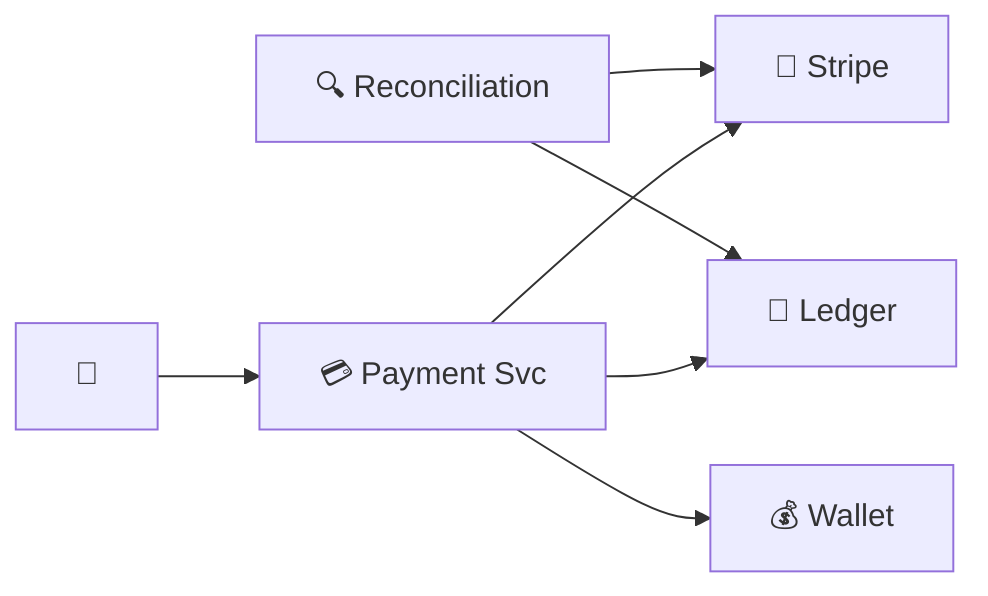

# Payment System — Quick Revision (Short Notes)

### Core Principle
**Idempotency above all.** Every operation must be safely retryable. Charging twice = lawsuit.

---

### 1. Idempotency Key (Triple Protection)
- Client generates UUID per request
- Server: unique DB index on `idempotency_key` → reject duplicate INSERTs
- PSP (Stripe): accepts same key → charges card only once

### 2. Double-Entry Ledger
```
Alice pays $100:
  Debit  buyer:alice     -$100
  Credit platform:escrow +$100
  SUM = $0 ✅
```
If SUM ≠ 0 → money was created/destroyed → BUG!

### 3. Reconciliation (Daily Safety Net)
Download all transactions from Stripe → compare against our ledger → flag mismatches.

### 4. Payment Flow
`User → Order Svc → Payment Svc → PSP (Stripe) → Ledger → Wallet`

### 5. Failure Handling
| Failure | Solution |
|---|---|
| Before PSP call | Retry with same idempotency key |
| PSP timeout | Query PSP status API |
| After PSP, before DB | Reconciliation catches it |
| After DB, before response | Client retry returns cached result |

### 6. PCI DSS
Server NEVER stores card numbers. Client sends card to Stripe directly → gets `card_token`.

---

### Architecture


### Memory Trick: "I.L.R."
1. **I**dempotency — UUID key
2. **L**edger — Double-entry (SUM=0)
3. **R**econciliation — Daily PSP comparison
