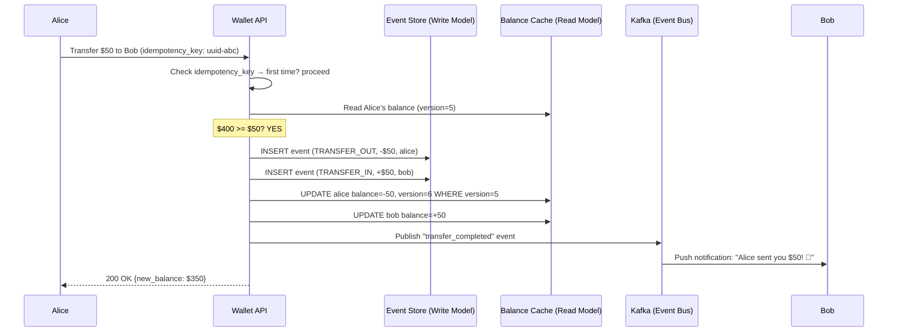
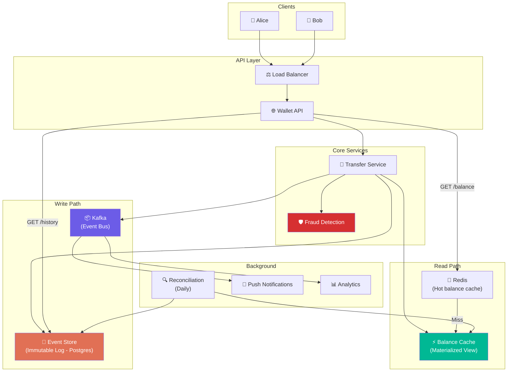
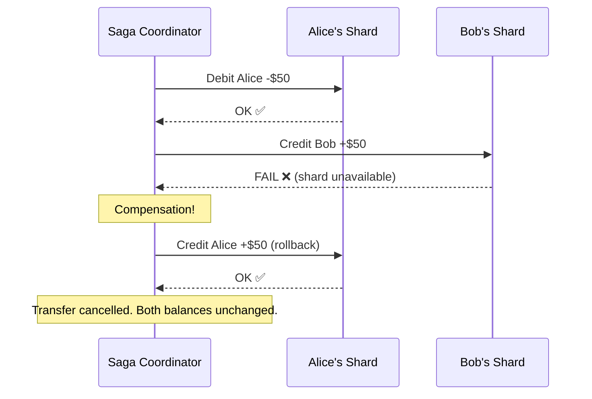

# Volume 2 - Chapter 12: Design a Digital Wallet (e.g., Venmo, PayPal)

> **Core Idea:** A digital wallet lets users store money and transfer it instantly to other users (P2P). Unlike Chapter 11 (Payment System) which processes one-off card charges, a wallet system maintains **persistent balances** that change with every transaction. The central challenge is ensuring **balance consistency under concurrent transfers** — if Alice has $100 and simultaneously sends $80 to Bob and $50 to Charlie, the system must reject one (insufficient funds). The advanced solution uses **Event Sourcing**: instead of storing a mutable "balance" field, store an immutable log of all events and derive the balance by replaying them.

---

## 🎯 Step 1: Understand the Problem & Scope

### Clarifying the Requirements

```
You:  "What operations?"
Int:  "Deposit (add money from bank), withdraw (cash out to bank), P2P transfer, 
       view balance, and transaction history."

You:  "Scale?"
Int:  "200 million users. 1 million transactions/day. 1,000 TPS peak."

You:  "Consistency model?"
Int:  "Strong consistency. A user must NEVER see a stale balance."

You:  "Do we handle currency conversion?"
Int:  "Single currency for now. Mention multi-currency as an extension."

You:  "Do we need fraud detection?"
Int:  "Yes, mention it as a component."
```

### 📋 Back-of-the-Envelope

| Metric | Calculation | Result |
|---|---|---|
| **Transactions/day** | Given | **1 Million** |
| **TPS** | 1M / 86400 | **~12 TPS (avg)** |
| **Peak TPS** | 12 × 100 (holidays, promotions) | **~1,200 TPS** |
| **Event log rows/year** | 1M/day × 365 × 2 (each transfer = 2 events) | **~730 Million rows** |
| **Event storage/year** | 730M × 200 bytes | **~146 GB** |
| **Balance table** | 200M users × 100 bytes | **~20 GB** |

> **Crucial Takeaway:** The data is moderate in size. The real challenge is **correctness under concurrency** — preventing overdrafts, ensuring exactly-once event creation, and maintaining an auditable financial trail that regulators can verify.

---

## 🏗️ Step 2: API Design

```
POST   /v1/wallet/deposit       → Add money from bank account
POST   /v1/wallet/withdraw      → Cash out to bank account
POST   /v1/wallet/transfer      → Send money to another user (P2P)
GET    /v1/wallet/balance        → Get current balance
GET    /v1/wallet/transactions   → Get transaction history (paginated)
```

### Transfer Request Example
```json
POST /v1/wallet/transfer
Headers: Idempotency-Key: "uuid-abc-123"
{
  "from_user_id": "alice",
  "to_user_id": "bob",
  "amount": 50.00,
  "currency": "USD",
  "note": "Dinner split 🍕"
}
```

---

## 💾 Step 3: The Naive Approach — Mutable Balance

The first thing every junior developer thinks:

```sql
CREATE TABLE wallets (
    user_id UUID PRIMARY KEY,
    balance DECIMAL(19,4)
);

-- Alice sends $50 to Bob
BEGIN;
  UPDATE wallets SET balance = balance - 50 WHERE user_id = 'alice' AND balance >= 50;
  UPDATE wallets SET balance = balance + 50 WHERE user_id = 'bob';
COMMIT;
```

### Why This is Dangerous

**Problem 1: Lost Audit Trail**
If Alice's balance is $200 right now, how did she get there? Did she deposit $200? Or deposit $500 and spend $300? Without an event log, we have no idea. Financial regulators require complete transaction history.

**Problem 2: Debugging Nightmares**
Imagine a bug quietly sets Alice's balance to $0. How do we reconstruct what the correct balance should be? Without a log of events, it's impossible. The corrupted data IS the only record.

**Problem 3: Reconciliation is Impossible**
With mutable balances, there's no independent way to verify correctness. If the balance says $200, we must trust it blindly. In payment systems, "trust but verify" is the law.

**Problem 4: No Time Travel**
"What was Alice's balance at 3:45 PM yesterday?" is unanswerable with a mutable balance. You only know the current state, not history.

> **The financial industry solved this problem 600 years ago with double-entry bookkeeping. The software equivalent is Event Sourcing.**

---

## 📜 Step 4: Event Sourcing — The Correct Architecture

### The Core Idea
Instead of mutating a `balance` field, we store every financial event as an **immutable row** in an **event log**. The balance is DERIVED by summing all events for a user. We never UPDATE or DELETE events.

### Beginner Example: The Bank Statement Analogy
Think of your bank statement. The bank doesn't keep a single number that says "$1,234." Instead, it keeps a list of every deposit, withdrawal, and transfer:

```
Jan 1:  Opening balance         $0.00
Jan 5:  Deposit (salary)      +$5,000.00
Jan 10: Transfer to Bob       -$200.00
Jan 15: Grocery store         -$85.50
Jan 20: Deposit (freelance)   +$500.00
Jan 25: Rent payment         -$1,500.00
─────────────────────────────────────────
Current balance = SUM =       $3,714.50
```

If anyone questions the balance, you simply replay the statement.

### The Schema

```sql
CREATE TABLE wallet_events (
    event_id       UUID PRIMARY KEY,
    user_id        UUID,
    event_type     ENUM('DEPOSIT', 'WITHDRAWAL', 'TRANSFER_IN', 'TRANSFER_OUT'),
    amount         DECIMAL(19,4),    -- Positive for credits, negative for debits
    counterparty   UUID,             -- The other user in a transfer
    reference_id   UUID,             -- Links the two sides of a transfer
    idempotency_key UUID UNIQUE,     -- Prevents duplicate events
    created_at     TIMESTAMP,
    metadata       JSONB             -- { "note": "Dinner split 🍕", "source": "mobile" }
);

CREATE INDEX idx_user_time ON wallet_events(user_id, created_at DESC);
```

**Example Event Log for Alice:**
```
event_id | user_id | event_type    | amount   | counterparty | reference_id | created_at
---------|---------|---------------|----------|--------------|--------------|----------
uuid-1   | alice   | DEPOSIT       | +500.00  | NULL         | ref-1        | Jan 5
uuid-2   | alice   | TRANSFER_OUT  | -80.00   | bob          | ref-2        | Jan 10
uuid-3   | alice   | TRANSFER_IN   | +30.00   | charlie      | ref-3        | Jan 15
uuid-4   | alice   | WITHDRAWAL    | -50.00   | NULL         | ref-4        | Jan 20

Current balance = SUM(amount) = $400.00
```

### Why Event Sourcing is Superior

| Benefit | Explanation |
|---|---|
| **Full audit trail** | Every single cent movement is recorded forever. Regulators love this. |
| **Debuggable** | "Why is Alice's balance $400?" → Replay the event log. Every step is traceable. |
| **Replayable** | If a bug corrupts the balance cache, recompute it from events. |
| **Reconcilable** | `SUM(all events) for user X` MUST equal the cached balance. If not → alert! |
| **Time-travel** | "What was Alice's balance at 3:45 PM yesterday?" → `SUM(events WHERE created_at < 3:45PM)` |
| **Event-driven** | Other services (fraud detection, notifications, analytics) can subscribe to the event stream. |

---

## ⚡ Step 5: CQRS — Separating Reads from Writes

### The Problem
Summing events on every balance check is slow for users with 10,000+ transactions. We can't run `SELECT SUM(amount) FROM wallet_events WHERE user_id = 'alice'` on every API call.

### The Solution: Command Query Responsibility Segregation (CQRS)
Maintain **two separate models**:
- **Write model (Command):** The immutable event log. This is the source of truth.
- **Read model (Query):** A materialized `wallet_balances` table that's updated on each new event.

```sql
-- The Read Model (Materialized View)
CREATE TABLE wallet_balances (
    user_id UUID PRIMARY KEY,
    balance DECIMAL(19,4),
    version INT,                  -- For optimistic locking
    last_updated TIMESTAMP
);
```

### The Update Flow (Sequence Diagram)



### Rebuilding the Cache
If the balance cache is ever suspected to be wrong:
```sql
-- Rebuild from source of truth
UPDATE wallet_balances wb
SET balance = (
    SELECT SUM(amount) FROM wallet_events WHERE user_id = wb.user_id
);
```

This is the power of event sourcing — the cache is disposable. The event log IS the truth.

---

## 🔐 Step 6: Preventing Overdrafts Under Concurrency

### The Race Condition
Alice has $100. She simultaneously sends $80 to Bob and $50 to Charlie from two devices:

```
Thread 1: Read balance → $100. $100 >= $80? YES → Deduct $80 → Balance = $20
Thread 2: Read balance → $100. $100 >= $50? YES → Deduct $50 → Balance = $50
Final balance: −$30 (OVERDRAFT! Alice literally created money from nothing!)
```

Both threads read the same stale balance, both pass the check, both deduct. This is a classic TOCTOU (Time-Of-Check-to-Time-Of-Use) bug.

### Solution: Optimistic Locking on Balance

```sql
-- Thread 1:
UPDATE wallet_balances 
SET balance = balance - 80, version = version + 1
WHERE user_id = 'alice' AND balance >= 80 AND version = 5;
-- Succeeds → version becomes 6, balance = $20

-- Thread 2 (arrives slightly later):
UPDATE wallet_balances 
SET balance = balance - 50, version = version + 1
WHERE user_id = 'alice' AND balance >= 50 AND version = 5;
-- FAILS! Version is now 6, not 5. affected_rows = 0.
-- Thread 2 retries → reads new balance ($20). $20 >= $50? NO → Insufficient funds. ❌
```

**Why this works:** The `WHERE version = 5` clause acts as a guard. Only ONE thread can successfully increment the version. The loser thread gets `affected_rows = 0` and must retry with fresh data.

### Alternative: Pessimistic Locking (SELECT FOR UPDATE)
```sql
BEGIN;
SELECT balance FROM wallet_balances WHERE user_id = 'alice' FOR UPDATE;
-- Row is now LOCKED. All other threads block here.
-- Check balance, debit if sufficient.
COMMIT;
```
Works correctly but reduces throughput under contention. Optimistic locking is preferred for wallet systems because most transfers don't collide.

---

## 🏛️ Step 7: Full System Architecture



---

## 🛡️ Step 8: Fraud Detection

### Common Fraud Patterns
| Pattern | Description | Detection |
|---|---|---|
| **Velocity abuse** | 50 transfers in 1 minute from one account | Rate limiting per user |
| **New account drain** | Account created 5 min ago, immediately drains $10,000 | New account spending limits |
| **Circular transfers** | Alice → Bob → Charlie → Alice (money laundering) | Graph cycle detection |
| **Device anomaly** | Suddenly logging in from a new country | Device fingerprinting + geolocation |
| **Split structuring** | Breaking $10,000 into many $9,999 transfers to avoid reporting | Aggregate threshold detection |

### Architecture
The Fraud Detection service sits inline in the transfer flow:
```
Transfer request → Fraud Score (ML model) → Score > 0.8? → BLOCK + Alert
                                           → Score < 0.8? → PROCEED
```

Low-risk transactions (small amounts between established friends) are approved instantly. High-risk ones are held for manual review.

---

## 💰 Step 9: Deposit and Withdrawal (Bank Integration)

### Deposit Flow (Bank → Wallet)
1. User links bank account via Plaid (bank aggregator API).
2. User initiates deposit of $500.
3. Our system calls bank's ACH API to pull $500.
4. ACH transfers take 1-3 business days to settle.
5. We **optimistically credit** the wallet immediately (with a `PENDING_DEPOSIT` event).
6. When ACH confirms settlement (3 days later), we convert the event to `CONFIRMED_DEPOSIT`.
7. If ACH is rejected (insufficient bank funds), we reverse: create a `DEPOSIT_REVERSAL` event that debits the wallet.

### Withdrawal Flow (Wallet → Bank)
1. User requests withdrawal of $200.
2. We debit the wallet immediately (`WITHDRAWAL` event, balance -= $200).
3. We initiate an ACH push to the user's bank.
4. If ACH fails (bad routing number), we reverse: create a `WITHDRAWAL_REVERSAL` event that credits back $200.

### The Ledger for Deposits
```
Event 1: PENDING_DEPOSIT    +$500 (user sees $500 immediately)
Event 2: DEPOSIT_CONFIRMED  $0   (marks Event 1 as settled — no balance change)

OR if bank rejects:
Event 2: DEPOSIT_REVERSAL   -$500 (oops, bank said no funds!)
```

---

## 🧑‍💻 Step 10: Advanced Deep Dive (Staff Level)

### Multi-Currency Wallets
Users can hold USD, EUR, INR in the same wallet. Each currency is a separate balance:
```sql
CREATE TABLE wallet_balances (
    user_id  UUID,
    currency VARCHAR(3),  -- "USD", "EUR", "INR"
    balance  DECIMAL(19,4),
    version  INT,
    PRIMARY KEY (user_id, currency)
);
```

Cross-currency transfers involve an FX rate lookup: Alice sends $100 USD → Bob receives €92.50 EUR. The events record both sides with their respective currencies.

### Distributed Transactions (Saga Pattern)
If Alice and Bob are on different database shards, we can't use a single database transaction. Instead, use the **Saga pattern**:
1. **Step 1:** Debit Alice's shard. If successful, proceed.
2. **Step 2:** Credit Bob's shard. If successful, done!
3. **Compensation:** If Step 2 fails, execute a **compensating transaction** on Alice's shard: credit back the $50.

This ensures **eventual consistency** — at some point, either both sides complete or both are rolled back.



### Snapshot Optimization
For users with millions of events (e.g., a merchant account), replaying all events to rebuild balance is slow. Solution: periodically store a **snapshot**:
```
Snapshot at event_id = 500,000: balance = $12,345.67
New balance = $12,345.67 + SUM(events after event 500,000)
```
This reduces replay time from millions of events to only the events since the last snapshot.

### Regulatory Compliance
- **KYC (Know Your Customer):** Verify identity before allowing large transfers.
- **AML (Anti-Money Laundering):** Flag suspicious patterns (e.g., >$10,000 aggregate transfers).
- **Transaction reporting:** All transactions above thresholds must be reported to financial regulators.

---

## 📋 Summary — Quick Revision Table

| Component | Choice | Why |
|---|---|---|
| **Storage model** | **Event Sourcing** | Immutable event log. Full audit trail. Replayable. Regulators require it. |
| **Balance query** | **CQRS (Materialized view + Redis)** | Cached balance updated on each event. Rebuildable from event log. |
| **Overdraft prevention** | **Optimistic locking (version column)** | Concurrent debits can't both succeed on stale balance. |
| **Idempotency** | **UUID idempotency_key per event** | Prevents duplicate financial events on retries. |
| **Cross-shard transfers** | **Saga pattern with compensation** | No distributed transactions. Eventually consistent with rollback capability. |
| **Fraud** | **Inline ML scoring + rule engine** | Blocks suspicious transfers before they execute. |

---

## ❓ Interview Quick-Fire Questions

**Q1: Why use Event Sourcing instead of just a balance column?**
> A balance column is mutable — if corrupted, the data is lost forever. Event Sourcing stores an immutable log of all financial movements. The balance is derived by summing events. If the cached balance is wrong, replay the log to rebuild it. This provides a complete audit trail, debugging capability, and regulatory compliance.

**Q2: How do you prevent overdrafts when two transfers happen simultaneously?**
> Optimistic locking with a version column: `UPDATE balance SET balance = balance - X, version = version + 1 WHERE user_id = ? AND balance >= X AND version = ?`. Only one thread wins. The loser retries with fresh data and gets "insufficient funds."

**Q3: What is CQRS and why is it needed here?**
> CQRS separates the write model (event log — append-only, immutable) from the read model (materialized balance — fast single-row lookup). Summing millions of events per balance check is too slow. The materialized balance provides O(1) reads while the event log remains the authoritative source of truth.

**Q4: How do you handle transfers across database shards?**
> Use the Saga pattern: debit Shard A, then credit Shard B. If Shard B fails, execute a compensating transaction on Shard A (credit back). This achieves eventual consistency without requiring distributed transactions.

**Q5: How does reconciliation work?**
> A daily batch job computes `SUM(all events)` for every user and compares it against the cached balance. Any mismatch triggers an alert. Additionally, we reconcile against bank settlement reports to ensure our records match the actual money moved.

---

## 🧠 Memory Tricks

### **"E.C.R." — The Digital Wallet Trinity**
1. **E**vent Sourcing — Store events, not balances. Balance = SUM(events).
2. **C**QRS — Separate the read model (cached balance) from the write model (event log).
3. **R**econciliation — Daily check: does cached balance match SUM(events)?

### **"The Bank Statement" Analogy**
> Your bank doesn't store a single number "$1,234." It stores every deposit, withdrawal, and transfer. The balance is just the sum of that list. If anyone questions it, show the statement. That's Event Sourcing.

### **"Never Mutate Money"**
> In a digital wallet, you APPEND new events (credit, debit). You NEVER update or delete existing events. The event log is like a blockchain — append-only, immutable, and auditable.

---

> **📖 Previous Chapter:** [← Chapter 11: Design a Payment System](/HLD_Vol2/chapter_11/design_a_payment_system.md)  
> **📖 Up Next:** [Chapter 13: Design a Stock Exchange →](/HLD_Vol2/chapter_13/design_a_stock_exchange.md)
