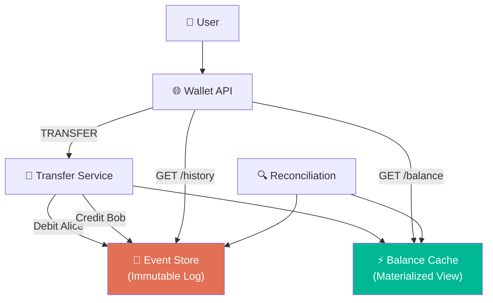

# Volume 2 - Chapter 12: Design a Digital Wallet (e.g., Venmo, PayPal)

> **Core Idea:** A digital wallet lets users store money and transfer it instantly to other users (P2P). Unlike Chapter 11 (Payment System) which processes one-off card charges, a wallet system maintains **persistent balances** that change with every transaction. The central challenge is ensuring **balance consistency under concurrent transfers** — if Alice has $100 and simultaneously sends $80 to Bob and $50 to Charlie, the system must reject one (insufficient funds). The advanced solution uses **Event Sourcing**: instead of storing a mutable "balance" field, store an immutable log of all events and derive the balance by replaying them.

---

## 🎯 Step 1: Understand the Problem & Scope

### Clarifying the Requirements

```
You:  "What operations?"
Int:  "Deposit (add money), withdraw, P2P transfer, view balance, transaction history."

You:  "Scale?"
Int:  "200 million users. 1 million transactions/day. 1,000 TPS peak."

You:  "Consistency model?"
Int:  "Strong consistency. A user must never see a stale balance."
```

---

## 💾 Step 2: The Naive Approach — Mutable Balance

```sql
CREATE TABLE wallets (
    user_id UUID PRIMARY KEY,
    balance DECIMAL(19,4)
);

-- Alice sends $50 to Bob
BEGIN;
  UPDATE wallets SET balance = balance - 50 WHERE user_id = 'alice' AND balance >= 50;
  UPDATE wallets SET balance = balance + 50 WHERE user_id = 'bob';
COMMIT;
```

### Problems
1. **Lost audit trail:** If Alice's balance is $200 right now, how did she get there? We have no history.
2. **Debugging nightmares:** A bug quietly sets balance to $0. How do we reconstruct what the correct balance should be? Impossible without an event log.
3. **Reconciliation:** With mutable balances, there's no way to verify if the current balance matches the sum of all historical transactions.

---

## 📜 Step 3: Event Sourcing — The Correct Architecture

### The Core Idea
Instead of mutating a `balance` field, we store every financial event as an immutable row in an **event log**. The balance is DERIVED by summing all events for a user.

```sql
CREATE TABLE wallet_events (
    event_id       UUID PRIMARY KEY,
    user_id        UUID,
    event_type     ENUM('DEPOSIT', 'WITHDRAWAL', 'TRANSFER_IN', 'TRANSFER_OUT'),
    amount         DECIMAL(19,4),
    reference_id   UUID,         -- Links the two sides of a transfer
    idempotency_key UUID UNIQUE, -- Prevents duplicate events
    created_at     TIMESTAMP
);

-- Alice's event log:
-- DEPOSIT        +$500.00    (initial deposit)
-- TRANSFER_OUT   -$80.00     (sent to Bob)
-- TRANSFER_IN    +$30.00     (received from Charlie)
-- WITHDRAWAL     -$50.00     (cash out)
-- 
-- Current balance = SUM(amounts) = $400.00
```

### Why Event Sourcing?
| Benefit | Explanation |
|---|---|
| **Full audit trail** | Every single cent movement is recorded forever. |
| **Debuggable** | "Why is Alice's balance $400?" → Replay the event log. |
| **Replayable** | If a bug corrupts the balance cache, recompute it from events. |
| **Reconcilable** | `SUM(all events) for user X` MUST equal the cached balance. If not → alert! |

### Cached Balance (CQRS Pattern)
Summing events on every balance check is slow for users with 10,000+ transactions. We maintain a **materialized balance** (cache) that's updated on each new event:

```python
def process_event(event):
    # 1. Append to immutable event log
    db.insert(event)
    
    # 2. Update cached balance
    db.execute("""
        UPDATE wallet_balances 
        SET balance = balance + ? 
        WHERE user_id = ?
    """, event.amount, event.user_id)
```

If the cache ever goes wrong, we can rebuild it: `SELECT SUM(amount) FROM wallet_events WHERE user_id = 'alice'`.

---

## 🔐 Step 4: Preventing Overdrafts Under Concurrency

### The Race Condition
Alice has $100. She simultaneously sends $80 to Bob and $50 to Charlie.

```
Thread 1: Read balance → $100. $100 >= $80? YES → Deduct $80 → Balance = $20
Thread 2: Read balance → $100. $100 >= $50? YES → Deduct $50 → Balance = $50
Final balance: −$30 (OVERDRAFT!)
```

### Solution: Optimistic Locking on Balance

```sql
-- Thread 1:
UPDATE wallet_balances 
SET balance = balance - 80, version = version + 1
WHERE user_id = 'alice' AND balance >= 80 AND version = 5;
-- Succeeds → version becomes 6

-- Thread 2 (arrives slightly later):
UPDATE wallet_balances 
SET balance = balance - 50, version = version + 1
WHERE user_id = 'alice' AND balance >= 50 AND version = 5;
-- FAILS! Version is now 6, not 5.
-- Thread 2 retries → reads new balance ($20). $20 >= $50? NO → Insufficient funds.
```

---

## 🏛️ Step 5: System Architecture



---

## 📋 Summary

| Component | Choice | Why |
|---|---|---|
| **Storage model** | **Event Sourcing** | Immutable event log. Full audit trail. Replayable. |
| **Balance query** | **CQRS (Materialized view)** | Cached balance updated on each event. Rebuildable from event log. |
| **Overdraft prevention** | **Optimistic locking (version column)** | Concurrent debits can't both succeed on stale balance. |
| **Idempotency** | **UUID idempotency_key per event** | Prevents duplicate financial events. |

---

## 🧠 Memory Tricks

### **"E.C.R." — The Digital Wallet Trinity**
1. **E**vent Sourcing — Store events, not balances. Balance = SUM(events).
2. **C**QRS — Separate the read model (cached balance) from the write model (event log).
3. **R**econciliation — Daily check: does cached balance match SUM(events)?

---

> **📖 Up Next:** Chapter 13 - Design a Stock Exchange
