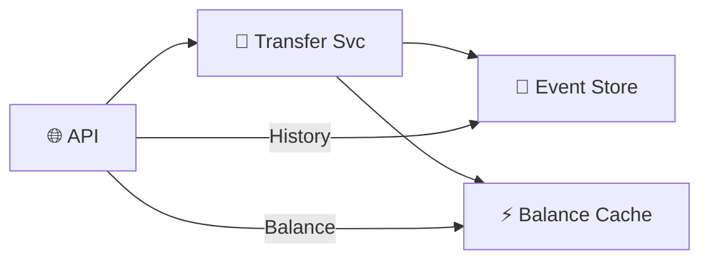

# Digital Wallet — Quick Revision (Short Notes)

### Core Principle
Don't store mutable balances. Store **immutable events**. Balance = SUM(events).

---

### 1. Event Sourcing
```
DEPOSIT +$500 → TRANSFER_OUT -$80 → TRANSFER_IN +$30 → WITHDRAWAL -$50
Balance = SUM = $400
```
- Full audit trail. Replayable. Debuggable.
- If cached balance is wrong → recompute from events.

### 2. CQRS (Command Query Responsibility Segregation)
- **Write model:** Append events to immutable log.
- **Read model:** Materialized `wallet_balances` table updated on each event.
- Balance query hits the cache (O(1)), not the event log.

### 3. Overdraft Prevention
- Optimistic locking: `UPDATE ... SET balance = balance - 80 WHERE version = 5 AND balance >= 80`
- Only 1 concurrent debit wins. Loser retries with fresh balance.

### 4. Reconciliation
Daily: `SUM(events for user X)` must equal `cached balance for user X`. Mismatch = alert.

---

### Architecture


### Memory Trick: "E.C.R."
1. **E**vent Sourcing — Immutable log
2. **C**QRS — Separate read/write models
3. **R**econciliation — Verify cache vs events
