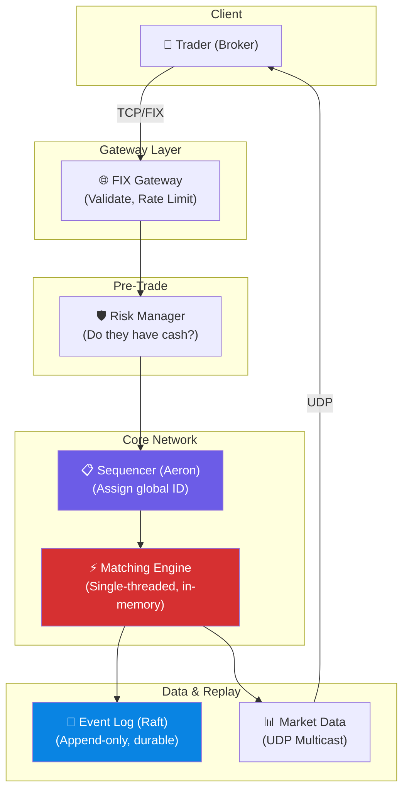

# Volume 2 - Chapter 13: Design a Stock Exchange (e.g., NASDAQ)

> **Core Idea:** A stock exchange is the ultimate low-latency system. It matches buy orders with sell orders in **microseconds** (not milliseconds — microseconds). The core component is the **Matching Engine**, which maintains an in-memory **Order Book** for each stock and executes trades when a buyer's price meets a seller's price. Every design choice optimizes for one thing: **minimize latency**. This means no network hops, no databases, no garbage collection pauses — just raw memory operations on a single thread.

---

## 🎯 Step 1: Understand the Problem & Scope

### Clarifying the Requirements

```
You:  "What types of orders?"
Int:  "Limit orders (buy/sell at a specific price) and market orders (buy/sell at current best price)."

You:  "What is the latency requirement?"
Int:  "End-to-end order matching in under 10 microseconds (p99)."

You:  "How many orders per second?"
Int:  "1 million orders/sec across all stocks."

You:  "How many stocks?"
Int:  "10,000 listed stocks."

You:  "What about reliability?"
Int:  "Zero data loss. Market integrity is paramount."
```

### 📋 Back-of-the-Envelope

| Metric | Result |
|---|---|
| Orders/sec | 1,000,000 |
| Stocks | 10,000 |
| Orders per stock/sec | ~100 (avg), ~50,000 (peak for hot stocks like AAPL) |
| Latency target | <10 microseconds per match |
| Order size | ~100 bytes |
| Throughput | ~100 MB/sec |

> **Takeaway:** 10 microseconds is 1000x faster than typical web services. A single TCP round trip over local network is ~500μs. A single database query is ~1ms (1000μs). We cannot use ANY traditional infrastructure (databases, REST APIs, message queues) in the critical matching path.

---

## 📊 Step 2: The Order Book — The Core Data Structure

### What is an Order Book?
Every stock has its own **Order Book** — two sorted lists:
- **Bid side (Buy orders):** Sorted by price DESCENDING (highest bid at top).
- **Ask side (Sell orders):** Sorted by price ASCENDING (lowest ask at top).

```
Order Book for AAPL:

BID (Buy)                    ASK (Sell)
──────────                   ──────────
$150.10 × 500 shares         $150.15 × 300 shares  ← Best Ask
$150.05 × 1200 shares        $150.20 × 800 shares
$150.00 × 3000 shares        $150.25 × 200 shares
$149.95 × 700 shares         $150.30 × 1500 shares
  ↑ Best Bid

Spread = Best Ask - Best Bid = $150.15 - $150.10 = $0.05
```

### When Does a Trade Happen?
A trade executes when the **Best Bid ≥ Best Ask**:
- Someone submits a buy order at $150.15 (matching the best ask).
- The matching engine pairs this buy with the sell order at $150.15.
- 300 shares trade at $150.15. Both orders are (partially) filled.

### Data Structure Selection (Red-Black Tree vs Arrays)
How do we store this data structure to achieve sub-microsecond performance?

**1. Hash Table?** No. We need to maintain sorted order to instantly find the Best Bid/Ask.
**2. Array/List?** No. Inserting a new price level in the middle requires shifting elements `O(N)` which is too slow.

**The Solution: Red-Black Tree + Linked List (FIFO Queue)**
- The price levels are organized in a **Red-Black Tree** (Self-balancing binary search tree). `O(log P)` to insert a new price, `O(1)` to find min/max price.
- Each Tree Node represents a Price Level (e.g., $150.15).
- Each Node contains a **Linked List** of all orders at that price.
- Why Linked List? **Price-Time Priority**. The first person to place an order at $150.15 gets matched first. `O(1)` insertion at end, `O(1)` popping from front.

---

## ⚡ Step 3: The Matching Engine — Why Single-Threaded?

### The Key Insight: Single-Threaded by Design
The matching engine processes orders **one at a time on a single CPU core**. This sounds counterintuitive — why not parallelize?

Because the order book is a **shared mutable state**. Every incoming order modifies the tree. With multi-threading:
- Thread A adds a buy order at $150.10.
- Thread B adds a sell order at $150.10.
- Both try to modify the Linked List simultaneously → **LOCKS**.
- Lock overhead (Mutex/Semaphores) requires calling the OS kernel. This adds 1-5μs per lock. That's our entire latency budget gone!

**Single-threaded eliminates ALL lock overhead.** On a modern CPU core running at 4 GHz, processing a single order (compare prices, update the tree/list) takes ~1-2 microseconds.

### Concurrency at the Stock Level
The engine is single-threaded *per stock*. 
AAPL is processed entirely on CPU Core 1.
TSLA is processed entirely on CPU Core 2.
Since AAPL orders never interact with TSLA orders, we can scale horizontally across stocks without any shared-state locking.

---

## 🏛️ Step 4: Full System Architecture



### Component Responsibilities

**1. FIX Gateway:** The financial industry uses the **FIX protocol** (Financial Information eXchange), not HTTP/JSON. The Gateway terminates TCP connections, decrypts TLS, and parses the FIX messages into fast binary C++ structs.

**2. Risk Manager:** Before an order hits the Matching Engine, we must ensure:
- Does the trader have $100,000 cash to cover this buy?
- Does the trader actually own the 100 shares they are trying to sell?
- This prevents a software bug at a broker from bankrupting the clearinghouse.

**3. The Sequencer (Aeron/Reliable Multicast):** Assigns a monotonically increasing sequence ID sequence number to every order across the network. This creates a **deterministic, replayable ordering**. If the engine receives thousands of UDP packets, the sequencer ensures they are processed in exact global order.

**4. Event Log (Source of Truth):** If the server catches fire, the RAM order book is gone. The Event Log records every incoming order to a fast append-only disk buffer BEFORE acknowledging. Replaying this log perfectly rebuilds the Matching Engine RAM state.

**5. Market Data Publisher:** Broadcasts current Best Bid/Ask (Level 1 data) and the full order book depth (Level 2 data) to all connecting brokers.

---

## 📡 Step 5: Network Protocols (TCP vs UDP Multicast)

To achieve microsecond latency, you can't use standard HTTP/TCP everywhere.

### Ingress (Sending Orders): TCP
Traders send orders to the Gateway via TCP. We need reliable, guaranteed delivery. If an order is dropped, it must be retransmitted.

### Egress (Market Data Feed): UDP Multicast
After a trade occurs, 10,000 brokers need the updated price.
- If we use TCP, the server must serialize and send 10,000 separate TCP packets. By the time it sends packet #10,000, that broker receives stale data.
- **Solution:** UDP Multicast. The server sends exactly ONE packet to the network switch. The switch itself duplicates the packet at the hardware level and sends it to all 10,000 ports simultaneously. Everyone gets the price update at the exact same microsecond.

---

## 🔄 Step 6: Fault Tolerance (Active-Standby)

### The Problem
The matching engine runs entirely in RAM on a single thread. If it crashes, trading halts.

### The Solution: Deterministic State Machine Logging
We use **Primary-Backup Replication** over reliable multicast (like Raft).

```
Primary Engine (Active) → matches orders, publishes trades
  ↓ (receives sequenced orders simultaneously)
Secondary Engine (Warm) → matches orders in RAM exactly the same way, but drops outputs
```

Because the Sequencer assigns a strict order to all incoming messages (e.g., Message 1, 2, 3), both engines are fully deterministic. If you feed the exact same sequence of orders to two engines, their internal Red-Black trees will be absolutely identical.
If the Primary fails, the Secondary is already 100% up-to-date in RAM. It simply un-mutes its output port and takes over immediately (Failover time: <1 millisecond).

---

## 🧑‍💻 Step 7: Architecture Deep Dive — Ultra-Low Latency Tricks

When your budget is 10 microseconds, a single cache miss or OS context switch ruins the transaction. Modern exchanges use techniques ordinary developers never touch:

| Technique | What it does | Latency Saved |
|---|---|---|
| **Kernel Bypass (DPDK/Solarflare)** | Standard networking goes NIC → OS Kernel Interrupt → TCP Stack → App space (takes ~50μs). Kernel bypass allows the App to poll the NIC hardware directly in user space. | **~40 μs** |
| **No Garbage Collection** | Java/C# pause all threads to clean memory. An exchange is written in C++ or Rust. Memory is pre-allocated at startup (Object Pools). No `new` or `malloc` during trading hours. | **~1000 μs** |
| **CPU Pinning** | The OS scheduler loves to move threads between CPU cores. This flushes the L1/L2 cache. We pin the Matching Engine thread to Core 1 and forbid the OS from putting any other task on that core. | **~5 μs** |
| **Co-location** | Speed of light in fiber is ~5us per kilometer. If you are 50 miles away, you lose. High Frequency Traders physically rent rack space inside the Exchange's datacenter. | **Massive** |

---

## ❓ Interview Quick-Fire Questions

**Q1: Why is the Matching Engine single-threaded? Won't it bottleneck?**
> A multi-threaded engine requires locking the order book data structure. Locks require kernel interventions and cause cache-line bouncing, adding significant latency. A single-threaded engine performing pure memory operations has zero lock contention and can process an order in <2μs. Horizontal scaling is achieved by instantiating one single-threaded engine per stock symbol (AAPL, TSLA).

**Q2: How do you achieve high availability if the state is fully in RAM?**
> The system acts as a Deterministic State Machine. All orders are assigned a strict, monotonically increasing sequence ID before entering the engine. We run a Hot-Standby engine in parallel that consumes the exact same sequence of orders. Its RAM is identical to the Primary. If Primary fails, Standby takes over instantly.

**Q3: What happens if two people place a buy order at the exact same price?**
> **Price-Time Priority.** The matching engine maintains a FIFO Queue (Linked List) at each price level in the Red-Black tree. Whichever order arrived at the engine sequentially first is placed at the front of the queue and matches first.

**Q4: Why use UDP Multicast for Market Data instead of TCP?**
> TCP requires maintaining states, sliding windows, and sending individual packets to every subscriber. Sending 10,000 TCP packets creates a severe "head of line" fairness problem (the 10,000th broker gets the price later than the 1st). UDP Multicast sends ONE packet from the server, and the hardware network switch duplicates it physically to all connected ports simultaneously.

**Q5: What is the "Event Log" actually doing?**
> It's an append-only persistence layer acting as the ultimate source of truth. If both Primary and Standby engines crash (e.g., total datacenter power loss), we lose the RAM state. When power is restored, the matching engine starts up empty and reads the Event Log from the beginning of the day, replaying every action to perfectly rebuild the order book before accepting new trades.

---

## 📋 Summary — Quick Revision Table

| Component | Choice | Why |
|---|---|---|
| **Matching Engine** | **Single-threaded C++ / Rust** | Eliminates lock overhead. Deterministic execution. |
| **Order Book structure** | **Red-Black tree + FIFO linked list** | O(log N) price lookup, O(1) matching based on Price-Time priority. |
| **Data Feed** | **UDP Multicast** | Hardware-level packet duplication. Ensures all traders receive price updates at the exact same microsecond. |
| **Fault Tolerance** | **Deterministic sequencing + Hot Standby** | Standby processes identical input stream to mirror state in RAM. |
| **Persistence** | **Append-only Event Log** | Replay the log to rebuild RAM state from scratch. |

---

## 🧠 Memory Tricks

### **"S.E.R." — Stock Exchange Architecture**
1. **S**equencer — Deterministic global ordering of all orders (makes HA possible).
2. **E**ngine — Single-threaded memory operations (no locks, no GC, no DB).
3. **R**eplay — Event log enables crash recovery and audit.

### **"Why Single-Threaded?" (The Auction Analogy)**
> A stock exchange is like an auction house with ONE auctioneer (matching engine). Orders are shouted (sequenced). The auctioneer matches the highest bidder with the lowest seller. Only ONE auctioneer can work at a time — two auctioneers speaking at once would create conflicting sales and utter chaos.

---

> **📖 Previous Chapter:** [← Chapter 12: Design a Digital Wallet](/HLD_Vol2/chapter_12/design_a_digital_wallet.md)  
> **🎉 You have completed Volume 2!**
