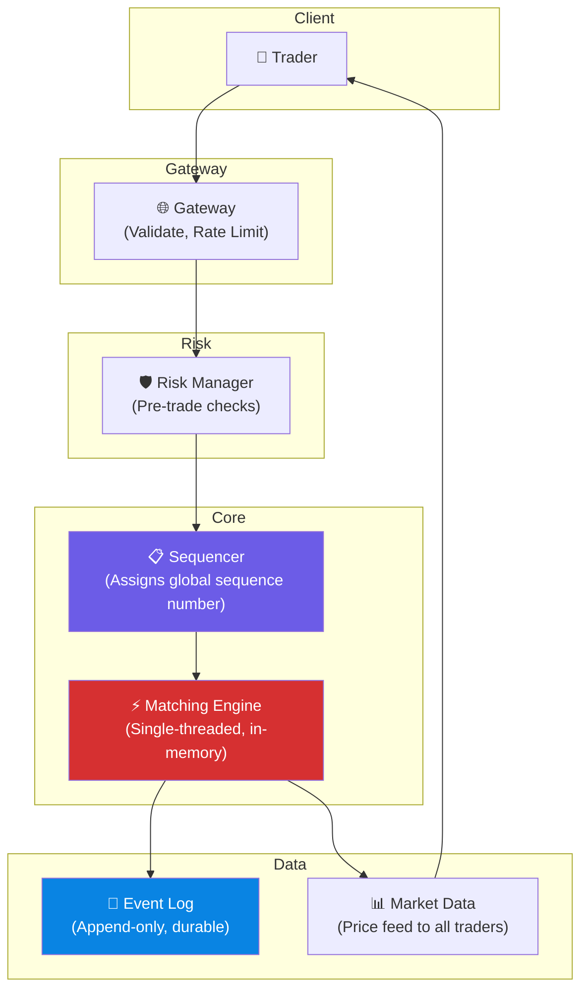

# Volume 2 - Chapter 13: Design a Stock Exchange (e.g., NASDAQ)

> **Core Idea:** A stock exchange is the ultimate low-latency system. It matches buy orders with sell orders in **microseconds** (not milliseconds — microseconds). The core component is the **Matching Engine**, which maintains an in-memory **Order Book** for each stock and executes trades when a buyer's price meets a seller's price. Every design choice optimizes for one thing: **minimize latency**. This means no network hops, no databases, no garbage collection pauses — just raw memory operations on a single thread.

---

## 🎯 Step 1: Understand the Problem & Scope

### Clarifying the Requirements

```
You:  "What types of orders?"
Int:  "Limit orders (buy/sell at a specific price) and market orders (buy/sell at current best price)."

You:  "What is the latency requirement?"
Int:  "End-to-end order matching in under 10 microseconds."

You:  "How many orders per second?"
Int:  "1 million orders/sec across all stocks."

You:  "How many stocks?"
Int:  "10,000 listed stocks."

You:  "What about reliability?"
Int:  "Zero data loss. Market integrity is paramount."
```

### 📋 Back-of-the-Envelope

| Metric | Result |
|---|---|
| Orders/sec | 1,000,000 |
| Stocks | 10,000 |
| Orders per stock/sec | ~100 (avg), ~50,000 (peak for hot stocks like AAPL) |
| Latency target | <10 microseconds per match |
| Order size | ~100 bytes |
| Throughput | ~100 MB/sec |

> **Takeaway:** 10 microseconds is 1000x faster than typical web services. A single network round trip is ~500μs. A single database query is ~1ms. We cannot use ANY traditional infrastructure (databases, message queues, network calls) in the critical matching path.

---

## 📊 Step 2: The Order Book — The Core Data Structure

### What is an Order Book?
Every stock has its own **Order Book** — two sorted lists:
- **Bid side (Buy orders):** Sorted by price DESCENDING (highest bid at top).
- **Ask side (Sell orders):** Sorted by price ASCENDING (lowest ask at top).

```
Order Book for AAPL:

BID (Buy)                    ASK (Sell)
──────────                   ──────────
$150.10 × 500 shares         $150.15 × 300 shares  ← Best Ask
$150.05 × 1200 shares        $150.20 × 800 shares
$150.00 × 3000 shares        $150.25 × 200 shares
$149.95 × 700 shares         $150.30 × 1500 shares
  ↑ Best Bid

Spread = Best Ask - Best Bid = $150.15 - $150.10 = $0.05
```

### When Does a Trade Happen?
A trade executes when the **Best Bid ≥ Best Ask**:
- Someone submits a buy order at $150.15 (matching the best ask).
- The matching engine pairs this buy with the sell order at $150.15.
- 300 shares trade at $150.15. Both orders are (partially) filled.

### Order Types
| Type | Behavior | Example |
|---|---|---|
| **Limit Order** | "Buy 100 shares at $150.10 or cheaper" | Sits in the order book until matched |
| **Market Order** | "Buy 100 shares at whatever the current best price is" | Matches immediately against best ask |
| **Cancel** | Remove a previously placed order | Removes from the order book |

---

## ⚡ Step 3: The Matching Engine — Why Single-Threaded

### The Key Insight: Single-Threaded by Design
The matching engine processes orders **one at a time on a single CPU core**. This sounds counterintuitive — why not parallelize?

Because the order book is a **shared mutable state**. Every incoming order potentially modifies the bid or ask side. With multi-threading:
- Thread A adds a buy order at $150.10.
- Thread B adds a sell order at $150.10.
- Both try to modify the order book simultaneously → locks, contention, cache line bouncing.
- Lock overhead alone would add 1-5μs — that's half our latency budget!

**Single-threaded eliminates ALL lock overhead.** On a modern CPU core running at 4 GHz, processing a single order (compare prices, update the sorted list) takes ~1-2 microseconds.

### The Matching Algorithm (Price-Time Priority)
```
1. New order arrives: BUY 200 shares of AAPL at $150.20 (limit)

2. Check the Ask side:
   - Best Ask: $150.15 × 300 shares → $150.15 ≤ $150.20? YES → MATCH!
   - Execute trade: 200 shares at $150.15 (buyer gets the better price)
   - Ask order partially filled: 300 - 200 = 100 shares remaining at $150.15

3. Buy order fully filled → done.
```

**Price-Time Priority (FIFO within same price level):**
If two sell orders are both at $150.15, the one that arrived FIRST gets matched first. This incentivizes early order placement.

### Data Structure for the Order Book
Each price level is a node in a **sorted tree** (Red-Black tree or similar). Each node contains a FIFO queue of orders at that price.

```
Ask Side (sorted ascending):
  $150.15 → [Order A (300 shares, 10:00:01), Order B (200 shares, 10:00:03)]
  $150.20 → [Order C (800 shares, 10:00:02)]
  $150.25 → [Order D (200 shares, 10:00:05)]

Operations:
  - Find best ask: O(1) — pointer to min node
  - Insert at price level: O(log P) where P = number of distinct price levels (~100s)
  - Add to FIFO queue at a price: O(1)
```

---

## 🏛️ Step 4: System Architecture



### Component Responsibilities

**1. Gateway:** Accepts connections from traders. Validates message format, authenticates, rate limits. Network boundary.

**2. Risk Manager (Pre-Trade):** Before an order reaches the matching engine, verify:
- Does the trader have enough cash to cover this buy?
- Does the trader have enough shares to cover this sell?
- Does this order violate any position limits?
This prevents catastrophic errors (e.g., a bug placing a $1 billion order).

**3. Sequencer:** Assigns a monotonically increasing sequence number to every order. This creates a **deterministic, replayable ordering** — critical for auditing and disaster recovery. If we replay the same sequence of orders, we get the exact same trades.

**4. Matching Engine:** The heart. Single-threaded. In-memory order book. Matches orders and emits trade events.

**5. Event Log:** Every order and every trade is durably written to an append-only log. This log IS the source of truth. If the matching engine crashes, it can fully rebuild its state by replaying the event log from the beginning.

**6. Market Data Publisher:** Broadcasts the current best bid/ask price and recent trades to all connected traders in real-time via multicast.

---

## 🔄 Step 5: Fault Tolerance — Hot-Warm Standby

### The Problem
The matching engine runs on a single server. If it crashes, trading halts. This is unacceptable for a stock exchange.

### The Solution: Hot-Warm Replication
```
Primary Matching Engine (Active) → processes all orders
  ↓ (replicates event log in real-time)
Standby Matching Engine (Warm) → consumes event log, maintains identical order book state
```

If the primary fails:
1. The standby detects the failure (heartbeat timeout).
2. The standby takes over as the new primary.
3. Failover time: ~100ms (the standby already has the order book built from the event log).
4. A new standby is started to maintain redundancy.

### Why Not Active-Active?
Two matching engines processing orders simultaneously would create split-brain — each engine might match the same order differently, creating conflicting trades. A single-primary model with deterministic sequencing avoids this entirely.

---

## 🧑‍💻 Step 6: Advanced Deep Dive

### Ultra-Low Latency Techniques
Stock exchanges use extreme optimizations that most software engineers never encounter:

| Technique | What it does |
|---|---|
| **Kernel bypass (DPDK/RDMA)** | Skips the OS network stack. Data goes NIC → application directly. Saves ~10μs. |
| **Lock-free data structures** | Avoids mutex locks. Uses CAS (Compare-And-Swap) atomic operations. |
| **No garbage collection** | Use C/C++ (not Java). GC pauses (even <1ms) are unacceptable. |
| **CPU pinning** | Pin the matching engine thread to a specific CPU core. Prevents context switches. |
| **Huge pages** | Use 2MB memory pages (instead of 4KB). Reduces TLB misses. |
| **Pre-allocated memory pools** | No dynamic allocation during trading. All memory allocated at startup. |
| **Co-location** | Traders place their servers in the SAME datacenter as the exchange to minimize network latency (1-5μs vs 500μs). |

### Market Data Feed
After every trade, all traders need to see the updated price. The exchange broadcasts a **market data feed** via UDP multicast:
```
{
  "symbol": "AAPL",
  "best_bid": 150.10,
  "best_ask": 150.15,
  "last_trade_price": 150.15,
  "last_trade_qty": 200,
  "timestamp": 1714350000000000  // microsecond precision
}
```

UDP multicast sends ONE packet that all subscribers receive — far more efficient than sending individual updates to 10,000 traders.

### Circuit Breakers
If a stock price moves more than 10% in 5 minutes, the exchange halts trading for that stock for a cooldown period. This prevents flash crashes caused by algorithmic trading bugs.

---

## 📋 Summary — Quick Revision Table

| Component | Choice | Why |
|---|---|---|
| **Matching Engine** | **Single-threaded, in-memory** | Eliminates lock overhead. 1-2μs per match. |
| **Order Book** | **Red-Black tree + FIFO queues** | O(1) best price, O(log P) insert, price-time priority. |
| **Ordering** | **Sequencer (monotonic IDs)** | Deterministic replay. Same sequence → same trades. |
| **Durability** | **Append-only event log** | Replay log to rebuild state after crash. |
| **Fault tolerance** | **Hot-warm standby** | Standby replays event log in real-time. Failover in ~100ms. |
| **Network** | **Kernel bypass (DPDK)** | Skips OS stack. NIC → application directly. |

---

## 🧠 Memory Tricks

### **"S.E.R." — Stock Exchange Architecture**
1. **S**equencer — Deterministic global ordering of all orders
2. **E**ngine — Single-threaded matching (no locks, no GC, no DB)
3. **R**eplay — Event log enables crash recovery and audit

### **"Why Single-Threaded?"**
> Multi-threaded = locks = 1-5μs wasted per lock. When your total budget is 10μs, you can't afford ANY lock. One fast thread beats ten slow threads fighting over shared state.

### **"The Auction House" Analogy**
> A stock exchange is like an auction house with ONE auctioneer (matching engine). Orders are shouted (sequenced). The auctioneer matches the highest bidder with the lowest seller. Only ONE auctioneer works at a time — two auctioneers would create conflicting sales.

---

> **📖 Previous Chapter:** [← Chapter 12: Design a Digital Wallet](/HLD_Vol2/chapter_12/design_a_digital_wallet.md)  
> **📖 This is the final chapter of Volume 2!**
