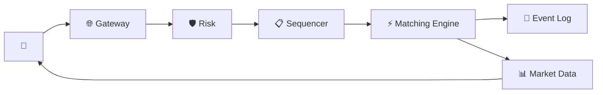

# Stock Exchange — Quick Revision (Short Notes)

### Core Constraint
**10 microseconds** end-to-end latency. No databases, no network hops, no GC in the critical path.

---

### 1. Order Book (Per Stock)
```
BID (descending)           ASK (ascending)
$150.10 × 500 shares       $150.15 × 300 shares
$150.05 × 1200 shares      $150.20 × 800 shares
```
- Trade happens when Best Bid ≥ Best Ask.
- **Price-Time Priority (FIFO):** Same price → first order matched first.

### 2. Matching Engine
- **Single-threaded.** No locks = no contention = no wasted microseconds.
- In-memory Red-Black tree + FIFO queues per price level.
- O(1) best price lookup. O(log P) insert.

### 3. Architecture Flow
`Trader → Gateway → Risk Check → Sequencer → Matching Engine → Event Log + Market Data`

### 4. Key Components
| Component | Role |
|---|---|
| Sequencer | Assigns monotonic IDs → deterministic replay |
| Matching Engine | Single-threaded order matching |
| Event Log | Append-only. Source of truth. Crash recovery via replay. |
| Market Data | UDP multicast of best bid/ask to all traders |

### 5. Fault Tolerance
- **Hot-warm standby:** Standby replays event log in real-time.
- Primary fails → standby takes over in ~100ms.
- NOT active-active (would cause conflicting trades).

### 6. Ultra-Low Latency Tricks
Kernel bypass (DPDK), CPU pinning, no GC (C/C++), huge pages, pre-allocated memory, co-location.

---

### Architecture


### Memory Trick: "S.E.R."
1. **S**equencer — deterministic ordering
2. **E**ngine — single-threaded matching
3. **R**eplay — event log for recovery + audit
