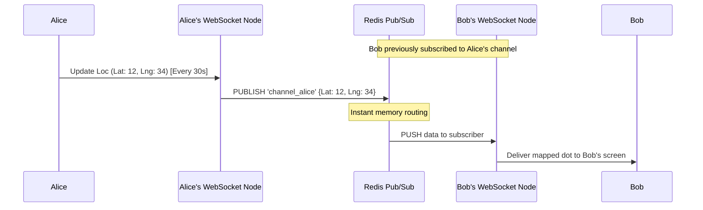
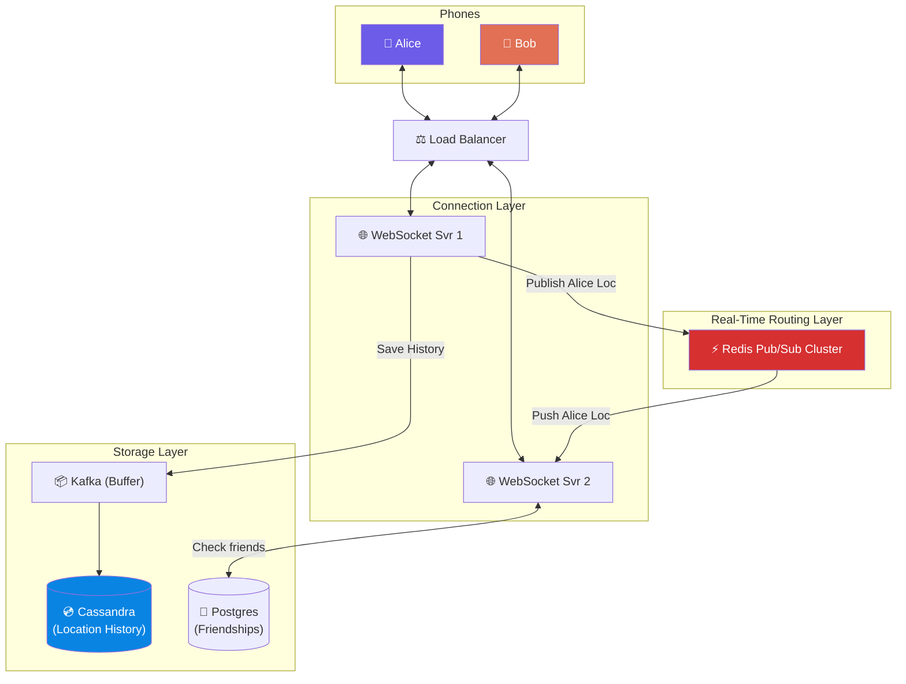

# Volume 2 - Chapter 2: Design Nearby Friends

> **Core Idea:** In Chapter 1 (Proximity Service), we searched for static businesses like restaurants. "Nearby Friends" is entirely different. Both the user searching AND the targets being searched are **constantly moving**. This creates an astronomical volume of write requests (location updates). Traditional databases will melt. We must shift from a "Pull Database" model to a "Push WebSocket + Pub/Sub" model.

---

## 🎯 Step 1: Understand the Problem & Scope

### Clarifying the Requirements

```
You:  "How 'real-time' does this need to be? Do we track every footstep?"
Int:  "Updating the location every 30 seconds is fast enough."

You:  "What is the scale of the system?"
Int:  "1 Billion users total. 100 million Daily Active Users (DAU). Maybe 10 million concurrent active users."

You:  "How many friends does a user have on average?"
Int:  "About 400."

You:  "Are we storing location history, or just the current location?"
Int:  "We need to store the historical path for machine learning and analytics later."
```

### 📋 Finalized Scope
- System is extremely **Write-Intensive** (constantly updating locations).
- Bi-directional instant data pushing.
- High concurrent connections.

---

## 🧮 Step 2: Back-of-the-Envelope Estimates (The Write Nightmare)

We must mathematically prove why Chapter 1's architecture (Postgres + Redis) fails here.

| Metric | Calculation | Result |
|---|---|---|
| **Concurrent Active Users** | Given by interviewer | **10 Million** |
| **Location Updates QPS** | 10M users sending an update every 30 seconds | `10,000,000 / 30 = ` **~333,000 QPS (Writes!)** |
| **Pub/Sub Fanout QPS** | 333k updates/sec × (400 friends × 10% active) | **13.3 Million messages/sec** 💥 |

> **Crucial Takeaway:** We have **333,000 Sustained Write QPS**. Relational DBs cannot handle 333k row updates per second. Furthermore, we can't afford to run expensive Geohash math (like in Chapter 1) 333,000 times a second.

---

## ☠️ Step 3: Why Chapter 1's Architecture Fails Here

In Chapter 1, when you moved, you sent your location to the server. The server recalculated your Geohash and saved it to MySQL. When you clicked "Find", the server mathematically found the 9 Geohashes around you and queried the DB.

If we do this for Nearby Friends:
1. Writing to a spatial database 333,000 times a second will destroy the database disk I/O.
2. A single user has 400 friends. Having the server calculate Geohashes and pull 400 friends from a SQL database every 30 seconds... multiplied by 10 million active users... is mathematically impossible to scale cost-effectively.

> **The Solution:** We stop querying databases entirely for real-time tracking. We use **WebSockets** and **Redis Pub/Sub** to stream data directly between phones in memory.

---

## 📡 Step 4: The Real-time Masterclass (WebSockets & Pub/Sub)

### The Concept: Publish / Subscribe (Pub/Sub)
Instead of Bob repeatedly asking the server, "Where is Alice? Where is Alice?", Alice gets a dedicated "radio channel" (a Redis Pub/Sub channel natively). 
- **Channel Name:** `channel_alice`
- **Subscribers:** Bob, Charlie, Dave
- Whenever Alice moves, her phone shouts her coordinates into `channel_alice`. Redis instantly mirrors and pushes that coordinate data to the open WebSockets of Bob, Charlie, and Dave.

### Exploring the WebSocket Lifecycle
WebSockets are persistent, bi-directional TCP connections. They are not fire-and-forget like HTTP.
1. **Connect:** Mobile app initiates a WebSocket upgrade handshake.
2. **Ping/Pong:** To ensure the connection hasn't silently dropped (like entering a subway tunnel), the server sends a "PING" frame every 10 seconds. The client must reply with a "PONG". If no PONG arrives within 30s, the server kills the socket and marks them offline.
3. **Payload Streaming:** Data moves with extremely low overhead (2-byte header framework vs 800-byte HTTP headers).

### Deep Dive: The End-to-End Location Flow

Let's map out exactly what happens every 30 seconds.

**1. Connecting to the Socket**
Bob opens the app. The Load Balancer connects Bob to a **WebSocket Server** (keeps a persistent TCP connection open). The server asks the Social Graph DB: "Who are Bob's friends?" (Alice, Charlie). Bob's WebSocket server subscribes to `channel_alice` and `channel_charlie` inside the Redis Pub/Sub cluster.

**2. Alice Moves (The Update)**
Alice's phone sends a JSON update over her WebSocket: 
```json
{
  "user_id": "987-alice",
  "lat": 40.7128,
  "lng": -74.0060,
  "timestamp": 1714349200
}
```

**3. The Split Pipeline**
Alice's WebSocket Server routes this JSON payload to TWO places simultaneously:
1. **Redis Pub/Sub:** It drops the JSON into `channel_alice`.
2. **Location History DB:** It asynchronously pushes the JSON into a Kafka Queue to be saved permanently in a Wide-Column Database (like Cassandra) for later analytics. 

**4. The Fanout Delivery**
Redis Pub/Sub sees data in `channel_alice`. It instantly pushes it to Bob's WebSocket Server. Bob's WebSocket Server pushes it down the pipe to Bob's screen. Bob sees Alice's icon move on his map.



---

## 🗺️ Step 5: High-Level Architecture



---

## 🧑‍💻 Step 6: Deep Dive into the Hard Parts (Staff Level)

To ace this interview, you must identify scaling bottlenecks that most candidates miss. 

### Bottleneck 1: Redis Pub/Sub Memory Saturation
Redis Pub/Sub is incredibly fast, but we have 10 Million active users. Creating 10 Million Active Channels in a single Redis server will crash it. 
> **Solution:** We must **Shard the Redis Cluster** using Consistent Hashing (Chapter 5!). 
> When Alice connects, the WebSocket server hashes `Alice_ID` to find out which specific Redis node hosts `channel_alice`. When Bob wants to subscribe to Alice, he uses the exact same hash (`hash(Alice_ID) % N`) to find the right Redis node.

### Why Redis Pub/Sub instead of Kafka?
Kafka guarantees message retention and delivery. Why not use it here?
- **Speed & Simplicity:** Kafka persists to disk (even if fast disk). Redis Pub/Sub is purely in-memory fire-and-forget.
- **Transience:** Location data is deeply ephemeral. If Alice's location message gets dropped somewhere, who cares? She'll send a fresh one in 30 seconds anyway.

### Bottleneck 2: Adding Distances / Radius Filtering
Wait, if Alice drives 200 miles away, why is Bob still seeing her coordinate updates? It's a massive waste of server bandwidth to push data for friends that are too far away to care.
> **Solution:** We re-introduce **Geohashes** (from Chapter 1), but strictly as a filter! 
> Every 5 minutes, Bob's device checks his Geohash. He queries a Redis cluster that acts strictly as a "Location Cache" to see which of his active friends share his Geohash (or the 8 surrounding ones). He ONLY subscribes to the Pub/Sub channels of the friends who are geographically close. If Alice drives out of the neighboring Geohash, Bob's WebSocket server automatically **unsubscribes** from `channel_alice`.

### Bottleneck 3: The 333,000 QPS Database Write
We cannot write 333k rows per second directly into a database like Postgres. 
> **Solution:** We use **Cassandra (or HBase)**. 
> Cassandra uses an LSM-Tree (Log-Structured Merge Tree). It writes data exclusively to a fast Sequential Append-Only log in memory (MemTable), which periodically flushes to disk. Cassandra can easily absorb 300k+ writes/sec. We place **Kafka** as a buffer before Cassandra during extreme traffic spikes (New Year's Eve) so we don't overwhelm the DB.

### Data Model for Location History (Cassandra)
```sql
CREATE TABLE location_history (
    user_id UUID,
    timestamp TIMESTAMP,
    latitude DECIMAL,
    longitude DECIMAL,
    PRIMARY KEY (user_id, timestamp DESC) 
);
```
*Why this Primary Key?* Because `user_id` acts as the **Partition Key** (all of Alice's history lives sequentially on the same physical server disk), and `timestamp` acts as the **Clustering Key** (ordered perfectly so we can instantly query "Where was Alice over the last 10 minutes?" without doing table scans).

---

## 📋 Summary — Quick Revision Table

| Component | Choice | Why |
|---|---|---|
| **Real-time Comms** | **WebSockets** | Required for low-overhead, bi-directional server pushing. |
| **Routing Architecture** | **Redis Pub/Sub** | In-memory message routing. Prevents querying databases on every single step a user takes. Ephemeral fire-and-forget. |
| **Historical Storage** | **Cassandra / LSM Trees** | 333k Write QPS destroys standard B-Tree SQL databases. Cassandra absorbs heavy sequential writes perfectly. |
| **Radius Optimization** | **Geohash Subscription Filter** | Stop subscribing to moving friends if they are 100 miles away. Recompute active subscriptions globally every few minutes. |

---

## 🧠 Memory Tricks for Interviews

### **"The Radio Station Analogy"**
If you try to explain the whole system at once, you will get lost. Explain it like a Radio Station:
1. **The Broadcaster (Alice):** Alice talks into her mic (WebSocket).
2. **The Radio Tower (Redis Pub/Sub):** The tower takes her voice on `104.5 FM` (`channel_alice`) and instantly blasts it out to anyone tuned in.
3. **The Listener (Bob):** Bob tunes his radio (WebSocket Server) to `104.5`. 
4. **The Cassette Tape (Cassandra):** We also plug a tape recorder (Kafka → Cassandra) into the mic to save the history for later.

### **"Pub/Sub vs Pull"**
Remember Chapter 1 was **PULL** (Ask DB for people). Chapter 2 is **PUSH** (People broadcast to channels). Moving targets require push based streams.

---

> **📖 Up Next:** Chapter 3 - Design Google Maps (Taking everything we've learned and adding insane vector rendering and ETA math!)
