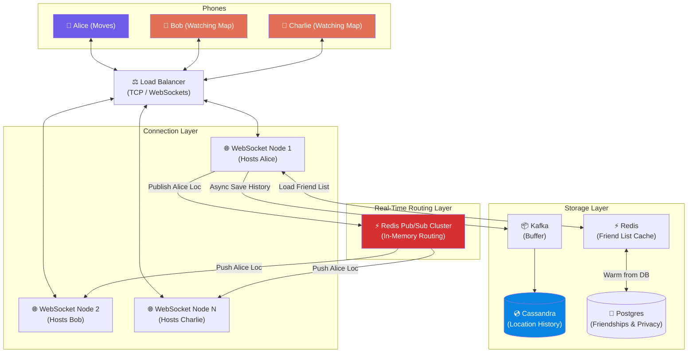

# Volume 2 - Chapter 2: Design Nearby Friends

> **Core Idea:** In Chapter 1 (Proximity Service), we searched for static businesses like restaurants. "Nearby Friends" is entirely different. Both the user searching AND the targets being searched are **constantly moving**. This creates an astronomical volume of write requests (location updates). Traditional databases will melt. We must shift from a "Pull Database" model to a "Push WebSocket + Pub/Sub" model.

---

## 🎯 Step 1: Understand the Problem & Scope

### Clarifying the Requirements

```
You:  "How 'real-time' does this need to be? Do we track every footstep?"
Int:  "Updating the location every 30 seconds is fast enough."

You:  "What is the scale of the system?"
Int:  "1 Billion users total. 100 million Daily Active Users (DAU). Maybe 10 million concurrent active users."

You:  "How many friends does a user have on average?"
Int:  "About 400."

You:  "Are we storing location history, or just the current location?"
Int:  "We need to store the historical path for machine learning and analytics later."

You:  "Do we need to handle privacy? For example, turning off location sharing?"
Int:  "Yes, privacy settings are crucial. Users can turn off location sharing for specific friends or altogether."

You:  "What happens if a user loses cell reception (e.g., drives through a tunnel)?"
Int:  "They appear offline. When they reconnect, they push their latest batch of historical points, and resume real-time."
```

### 📋 Finalized Scope
- System is extremely **Write-Intensive** (constantly updating locations).
- Bi-directional instant data pushing.
- High concurrent connections.
- Requires privacy handling.
- Must survive massive fan-out messaging.

---

## 🧮 Step 2: Back-of-the-Envelope Estimates (The Write Nightmare)

We must mathematically prove why Chapter 1's architecture (Postgres + Redis) fails here.

| Metric | Calculation | Result |
|---|---|---|
| **Concurrent Active Users** | Given by interviewer | **10 Million** |
| **Location Updates QPS** | 10M users sending an update every 30 seconds | `10,000,000 / 30 = ` **~333,000 QPS (Writes!)** |
| **Active Friends** | Assume 10% of a user's 400 friends are concurrently online | **40 online friends** |
| **Pub/Sub Fanout QPS** | 333k updates/sec × 40 online friends | **13.3 Million messages/sec** 💥 |
| **Location Size** | UserID(8), Lat(8), Lng(8), Time(8) = ~32 bytes | **~32 Bytes per update** |
| **Ingress Bandwidth** | 333,000 QPS × 32 Bytes | **~10 MB per second (Ingress)** |
| **Egress Bandwidth** | 13.3 Million messages/sec × 32 Bytes | **~425 MB per second (Egress)** |
| **Storage / Day** | 333,000 QPS × 86,400 seconds × 32 Bytes | **~920 GB / day (Cassandra)** |

> **Crucial Takeaway:** We have **333,000 Sustained Write QPS**. Relational DBs cannot handle 333k row updates per second. Furthermore, we can't afford to run expensive Geohash math (like in Chapter 1) 333,000 times a second. We also have an astronomical **13.3 Million fan-out messages per second**.

---

## ☠️ Step 3: Why Chapter 1's Architecture Fails Here

In Chapter 1, when you moved, you sent your location to the server. The server recalculated your Geohash and saved it to MySQL. When you clicked "Find", the server mathematically found the 9 Geohashes around you and queried the DB.

If we do this for Nearby Friends:
1. **Database Meltdown:** Writing to a spatial database 333,000 times a second will destroy the database disk I/O. Relational DBs are built for ACID guarantees, not high-velocity time-series appends.
2. **Pulling is Inefficient:** A single user has 40 active online friends. To have Bob's phone ask the server "where are my friends?" every 30 seconds means Bob does 1 API call. But the server has to query 40 friends' locations from the DB. Multiplied by 10 million active users... the DB gets hammered by millions of SELECTs per second just to answer "did they move?".
3. **Latency:** Even if the DB survives, the latency of polling HTTP endpoints is too high to feel "real-time".

> **The Solution:** We stop querying databases entirely for real-time tracking. We use **WebSockets** and **Redis Pub/Sub** to stream data directly between phones in memory. Let the users push data to each other.

---

## 📡 Step 4: The Real-time Masterclass (WebSockets & Pub/Sub)

### The Concept: Publish / Subscribe (Pub/Sub)
Instead of Bob repeatedly asking the server, "Where is Alice? Where is Alice?", Alice gets a dedicated "radio channel" (a Redis Pub/Sub channel natively). 

- **Channel Name:** `channel_alice`
- **Subscribers:** Bob, Charlie, Dave (Alice's friends who are currently online)
- Whenever Alice moves, her phone shouts her coordinates into `channel_alice`. Redis instantly mirrors and pushes that coordinate data to the open WebSockets of Bob, Charlie, and Dave.

### Exploring the WebSocket Lifecycle
WebSockets are persistent, bi-directional TCP connections. They are not fire-and-forget like HTTP. 

Why WebSockets over HTTP Long Polling or Server-Sent Events (SSE)?
- **SSE** is uni-directional (server to client). We need bidirectional because Alice is both reading her friends' locations AND sending her own.
- **HTTP Long-Polling** requires opening and closing TCP connections constantly. Creating a new TCP connection requires a 3-way handshake (and TLS negotiation), which wastes CPU and battery. WebSockets keep the pipe open.

**The Lifecycle:**
1. **Connect (Handshake):** The mobile app sends an HTTP GET request with an `Upgrade: websocket` header. The server replies `101 Switching Protocols`. The TCP connection stays open.
2. **Initialize:** The server queries MySQL to get Bob's friend list. It then asks Redis to subscribe Bob's socket to Alice and Charlie's channels.
3. **Ping/Pong (Heartbeat):** To ensure the connection hasn't silently dropped (like entering a subway tunnel), the server sends a "PING" frame every 10 seconds. The client must reply with a "PONG". If no PONG arrives within 30s, the server kills the socket and marks them offline.
4. **Payload Streaming:** Location data moves with extremely low overhead (2-byte header framework vs 800-byte HTTP headers).

---

## 🗺️ Step 5: High-Level Architecture

Let's look at the flow of a single location update.



### The Deep Dive Sequence (What Happens Every 30 Seconds)

1. **Alice Moves:** Her phone sends a tiny JSON payload over her open WebSocket to her designated WebSocket Server (Node 1).
   ```json
   {
     "lat": 40.7128,
     "lng": -74.0060,
     "ts": 1714349200
   }
   ```
   *(Notice we don't even send the User ID in the JSON. The WebSocket Server already knows it's Alice because the TCP socket is tied to her session ID! This saves bandwidth).*

2. **The WebSocket Node Splits the Traffic:**
   - **Path A (Real-Time):** Node 1 wraps the JSON with Alice's ID and drops it into the Redis Pub/Sub channel named `loc_alice`.
   - **Path B (Storage):** Node 1 pushes the payload into a Kafka topic named `location_updates`.

3. **Redis Pub/Sub Fanout:**
   - Months ago, Bob and Charlie logged in to Node 2 and Node 3. At that time, Node 2 subscribed to `loc_alice` on Bob's behalf.
   - Redis sees the new data in `loc_alice` and pushes it over the network to Node 2 and Node 3.
   - Node 2 pushes it down the WebSocket to Bob's phone. Bob sees Alice's icon move on his map.

4. **Kafka to Cassandra:**
   - A fleet of background consumer workers drain the Kafka `location_updates` queue, batch hundreds of updates together, and write them sequentially to Cassandra.

---

## 🧑‍💻 Step 6: Overcoming Architectural Bottlenecks (Staff Level)

To ace this interview, you must identify scaling bottlenecks that most candidates miss. The architecture above works for 100,000 users, but fails at 10 Million.

### 🛑 Bottleneck 1: Redis Pub/Sub Memory & CPU Saturation
Redis Pub/Sub is incredibly fast, but we have 10 Million active users. Creating 10 Million Active Channels in a single Redis server will max out its CPU boundaries (since Redis is single-threaded).

> **The Solution: Sharding Redis Pub/Sub**
> We must distribute the channels across a cluster of Redis nodes.
> We use a **Consistent Hashing** ring (from Vol 1 Chapter 5).
> 
> When Alice connects, the WebSocket server calculates `Hash(Alice_ID) % Node_Count`. Let's say this points to Redis Node 4. Alice's location will ALWAYS be published to Redis Node 4.
> 
> When Bob signs in, his WebSocket server asks for Bob's friends. It gets Alice. It calculates `Hash(Alice_ID) % Node_Count`, gets Node 4, and subscribes to Node 4 over the internal network. Redis nodes don't need to talk to each other; the WebSocket servers do the routing.

### 🛑 Bottleneck 2: The WebSocket Server Memory Limit
A single WebSocket server can hold about 100,000 to 500,000 concurrent sockets open simultaneously (limited by OS file descriptors and memory). To hold 10 Million users, we need:
`10,000,000 / 100,000 = 100 WebSocket Servers`.

Furthermore, maintaining subscriptions takes memory. If Server 1 hosts Bob, Charlie, and Dave, and they each have 400 friends... Server 1 is maintaining 1,200 subscriptions in Redis. 

> **Optimization: Local Subscription Batching**
> If 50 users on Server 1 are all friends with Alice, Server 1 does NOT create 50 subscriptions to Redis `channel_alice`. Server 1 creates exactly **ONE** subscription to Redis. When Alice moves, Redis pushes 1 message to Server 1. Server 1 then loops through its internal memory Map and pushes the message down the 50 corresponding WebSockets. This cuts internal network traffic by orders of magnitude.

### 🛑 Bottleneck 3: The Astronomical Fan-Out (Radius Filter)
Wait, if Alice drives from New York to California, she is 3,000 miles away from Bob. Why is Bob still getting 30-second updates pushed to his phone? It's a massive waste of egress bandwidth to push data for friends that are too far away to care.

> **The Solution: Geohash Filtering**
> We must break the fan-out chain entirely for distant friends.
> 1. We maintain a small Redis Cache that simply holds the CURRENT Geohash for every active user: `KEY: alice, VALUE: dr5reg`
> 2. Every 5 minutes, Bob's phone calculates his own Geohash and asks the server: "Which of my friends are in my Geohash or the 8 neighbors?"
> 3. The server checks the Redis Cache. Ah, Alice is in `9q5`, Charlie is in `dr5`. Charlie is close, Alice is far.
> 4. Bob's WebSocket server **subscribes to Charlie**, but **unsubscribes from Alice**.
> 
> This single optimization cuts Pub/Sub traffic by 90%, because most of a user's friends do not live in the same zip code.

### 🛑 Bottleneck 4: 333,000 QPS Database Writes
Writing 333k single rows per second into PostgreSQL will destroy its B-Tree indexes and transaction logs. 

> **The Solution: Apache Kafka + Cassandra (LSM Trees)**
> We place **Kafka** as a shock absorber. Kafka writes to sequential append-only disk logs, natively handling millions of messages per second.
> 
> We use **Cassandra (or HBase)** for storage. Cassandra uses an LSM-Tree (Log-Structured Merge Tree). It writes data exclusively to a fast Sequential Append-Only log in memory (MemTable), which periodically flushes to disk as an SSTable. Cassandra absorbs heavy writes perfectly without the B-Tree page-splitting overhead of SQL databases.

#### Cassandra Schema for Location History
```sql
CREATE TABLE location_history (
    user_id UUID,
    timestamp TIMESTAMP,
    latitude DECIMAL(10, 7),
    longitude DECIMAL(10, 7),
    PRIMARY KEY (user_id, timestamp DESC) 
);
```

**Why this Primary Key?**
- `user_id` is the **Partition Key**. This means all historical coordinates for Alice reside on the exact same physical server hard drive. We don't have to query multiple servers to get Alice's history.
- `timestamp DESC` is the **Clustering Key**. Data is physically sorted on the disk by time.
- To answer the ML team's query: "Get Alice's path for the last 2 hours" → Cassandra does exactly ONE disk seek, and scans sequentially. Time complexity is `O(1)`.

---

## 🔒 Step 7: Privacy & Offline Handling

### Privacy Toggles
Users can go "Ghost Mode".
When Alice toggles Ghost Mode:
1. An HTTP call updates her profile in PostgreSQL.
2. A message is sent globally via Pub/Sub to all WebSocket Servers indicating `Alice: Offline`.
3. All servers hosting Alice's friends push a "hide Alice" packet to their mobile clients.
4. Alice's WebSocket stops forwarding her location updates to the Redis Pub/Sub cluster, though it may still send it to Kafka for her personal history.

### Offline and Reconnection Handling
If Alice drives into a tunnel:
1. Her phone loses TCP connection.
2. The WebSocket server notices missing PONG heartbeats. It terminates her socket.
3. The server publishes an `Alice: Offline` message to the Pub/Sub cluster to alert her friends.
4. Meanwhile, Alice's phone continues to log her GPS coordinates into a local SQLite database on her mobile device.
5. She exits the tunnel. Her phone reconnects to the WebSocket.
6. The phone immediately uploads a batch JSON array of her tunnel coordinates. The server dumps these directly to Kafka for history (bypassing Pub/Sub, as friends don't need real-time playback of old data).
7. She resumes pushing current coordinates to Pub/Sub.

---

## ❓ Interview Quick-Fire Questions

**Q1: Why use Redis Pub/Sub instead of Kafka for the real-time routing?**
> Kafka is designed for durability and guarantees at-least-once delivery by writing to persistent commit logs on disk. For real-time location tracking, the data is highly ephemeral. If a coordinate is dropped, we don't care, because a new one will arrive in 30 seconds. Redis Pub/Sub is purely in-memory, fire-and-forget, and provides much lower latency for millions of fan-out messages. We use Kafka strictly for the *history* path, not the real-time path.

**Q2: What happens when a WebSocket server crashes?**
> All 100,000 TCP connections dropped. The mobile apps instantly detect the failure (TCP segment reset). The apps implement an exponential backoff retry mechanism to prevent a thundering herd. They request a new IP from the Load Balancer, connect to a healthy WebSocket server, and re-establish their Pub/Sub channels.

**Q3: How do you handle extreme cases, like a celebrity with 5 million followers?**
> If Taylor Swift has 5 million friends, her single location update requires Redis to fan-out to 5 million WebSockets. This destroys the node hosting her channel. We fix this using the **Pull Model fallback**. For accounts with >10,000 followers, we don't use Pub/Sub. We store her location in an in-memory Redis cache (`GET taylor_swift_loc`). The mobile clients of her followers are instructed via metadata to pool (pull) her location every 3 minutes instead of subscribing.

**Q4: Can we just use MongoDB instead of Cassandra?**
> Not efficiently. MongoDB uses B-Tree indexing by default (WiredTiger). While it supports time-series collections, Cassandra's LSM-Tree architecture is fundamentally designed from the ground up to achieve maximum disk write-throughput by avoiding random disk I/O entirely. When you have 333,000 writes/second, Cassandra is the industry standard.

---

## 📋 Summary — Quick Revision Table

| Component | Choice | Why |
|---|---|---|
| **Real-time Comms** | **WebSockets** | Low-overhead, bi-directional persistent connections. No TLS handshake per update. |
| **Routing Architecture** | **Redis Pub/Sub** | In-memory message routing. Ephemeral fire-and-forget. Much lower latency than Kafka. |
| **Pub/Sub Sharding** | **Consistent Hashing** | Distribute channels across multiple Redis nodes to prevent CPU bottlenecks. |
| **Hardware Efficiency** | **Server-side PubSub Batching** | 1 WebSocket server = 1 Redis connection per channel, regardless of how many locals are listening. |
| **Historical Storage** | **Cassandra / LSM Trees** | 333k Write QPS destroys standard B-Tree SQL databases. Cassandra absorbs heavy sequential writes perfectly. |
| **Radius Optimization** | **Geohash Subscription Filter** | Only subscribe to friends in same or neighboring Geohashes. Cuts egress traffic by 90%. |

---

## 🧠 Memory Tricks for Interviews

### **"The Radio Station Analogy"**
If you try to explain the whole system at once, you will get lost. Explain it like a Radio Station:
1. **The Broadcaster (Alice):** Alice talks into her mic (WebSocket).
2. **The Radio Tower (Redis Pub/Sub):** The tower takes her voice on `104.5 FM` (`channel_alice`) and instantly blasts it out to anyone tuned in.
3. **The Listener (Bob):** Bob tunes his radio (WebSocket Server) to `104.5`. 
4. **The Cassette Tape (Kafka+Cassandra):** We also plug a tape recorder into the mic to save the history for later.

### **"Pub/Sub vs Pull"**
Remember Chapter 1 was **PULL** (Ask DB for static restaurants). Chapter 2 is **PUSH** (Moving people broadcast to channels). Moving targets require push-based message streams.

---

> **📖 Previous Chapter:** [← Chapter 1: Design a Proximity Service](/HLD_Vol2/chapter_1/design_a_proximity_service.md)  
> **📖 Up Next:** [Chapter 3: Design Google Maps →](/HLD_Vol2/chapter_3/design_google_maps.md)
