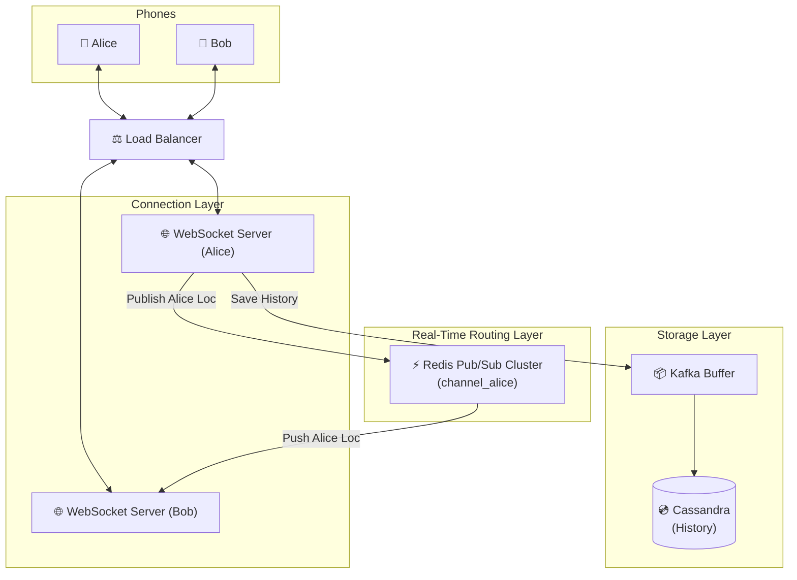

# Nearby Friends — Quick Revision (Short Notes)

### 1. The Core Bottleneck
- **High Write QPS:** 10 Million Active Users moving every 30 seconds = **333,000 Writes per second**.
- You cannot use Geohash math + SQL for 333k requests per second without massive costs. The system must change from "Query on demand" to **"Real-time Publish/Subscribe"**.

### 2. The Solution: WebSockets + Redis Pub/Sub
- Stop using HTTP. Use persistent **WebSockets**.
- When Alice moves, she doesn't write to SQL. Her phone **Publishes** her coordinates to her personal Redis Pub/Sub channel (`channel_alice`).
- Bob's phone previously connected and **Subscribed** to `channel_alice`.
- Redis pushes Alice's coordinates instantly into Bob's device memory.

---

### 3. Solving the Hard Bottlenecks

#### A. Redis Memory Overload
- 10 Million open Redis channels will crash a single node.
- Use **Consistent Hashing** (Chapter 5) to shard the Redis Pub/Sub cluster based on `User_ID`.

#### B. The Wasted Bandwidth Problem
- Subscribing to 400 friends is a massive waste of bandwidth if 395 of them are 2,000 miles away.
- **Optimization:** Use a background Geohash check every 5 minutes. Find which friends are inside your Geohash (or the 8 neighboring ones). **Only subscribe to the friends that are close to you.** Automatically unsubscribe if they leave the boundary.

#### C. Storing Location History (Cassandra)
- We still need to save locations for machine learning/analytics.
- 333k Writes/sec will kill standard B-Tree SQL databases.
- Use **Cassandra (LSM Trees)** to append data sequentially without disk seek delays. Put **Kafka** in front of it as an emergency buffer for spike days (like New Year's Eve).

---

### 🖼️ Architecture Diagram (Memorize This)

