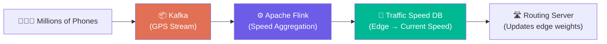
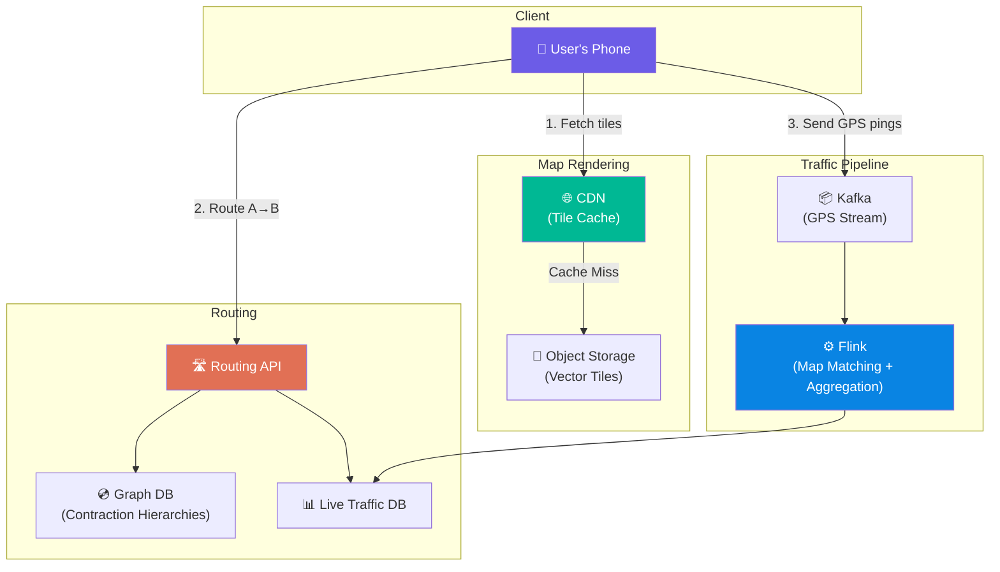

# Volume 2 - Chapter 3: Design Google Maps

> **Core Idea:** Google Maps is NOT just "show a map on screen." It is an enormous system that solves three fundamentally different problems: **(1) Map Rendering** — turning raw geographic data into visual tiles users can pan/zoom, **(2) Routing** — finding the shortest or fastest path between two points using graph algorithms, and **(3) ETA Estimation** — predicting how long a trip will take using real-time traffic data. Each of these is its own distributed system. This chapter connects all three.

---

## 🎯 Step 1: Understand the Problem & Scope

### Clarifying the Requirements

```
You:  "What features are we designing? Just the map view, or navigation too?"
Int:  "Full navigation: map rendering, route calculation, turn-by-turn directions, and ETA."

You:  "Do we need to support real-time traffic conditions?"
Int:  "Yes. ETA should reflect current traffic, accidents, road closures."

You:  "What is the user scale?"
Int:  "1 billion total users. 100 million DAU."

You:  "Do we need to support walking, cycling, and public transit, or just driving?"
Int:  "Focus on driving for now. Mention others briefly."
```

### 📋 Finalized Scope
| Feature | Priority |
|---|---|
| Map rendering (pan, zoom) | ✅ Must have |
| Route calculation (A → B) | ✅ Must have |
| ETA with live traffic | ✅ Must have |
| Turn-by-turn navigation | ✅ Must have |
| Walking / Cycling / Transit | 🔜 Mention briefly |

---

## 🧮 Step 2: Back-of-the-Envelope Estimates

| Metric | Calculation | Result |
|---|---|---|
| **Map tile storage** | ~200 countries × multiple zoom levels × vector tiles | **~50 TB (pre-rendered tiles)** |
| **Navigation requests/day** | 100M DAU × 2 route requests avg | **200M route calculations/day** |
| **Route QPS** | 200M / 86400 | **~2,300 QPS** |
| **Map tile requests** | Each map view loads ~20 tiles. 100M DAU × 10 views × 20 tiles | **20 Billion tile requests/day** |
| **Tile QPS** | 20B / 86400 | **~230,000 tile QPS** 💥 |
| **Live traffic updates** | GPS pings from millions of drivers every few seconds | **~5 Million GPS updates/sec** |

> **Crucial Takeaway:** There are THREE separate bottlenecks:
> 1. **Tile Serving** (230k QPS of static image/vector delivery → CDN problem)
> 2. **Routing** (2,300 QPS of heavy graph computation → CPU problem)  
> 3. **Traffic Ingestion** (5M GPS pings/sec → streaming pipeline problem)

---

## 🗺️ Step 3: Map Rendering — The Tile System

### The Problem
You cannot send the entire world map to a user's phone. The raw OpenStreetMap dataset is over **1.5 TB** of XML data. Sending even 1% of that on every app open would take minutes.

### The Solution: Map Tiles (The "Jigsaw Puzzle" Approach)

The world map is pre-cut into thousands of small square images (tiles). When you open Google Maps, you're not downloading "the map." You're downloading **~20 specific puzzle pieces** for the exact area you're looking at, at the exact zoom level.

#### **Beginner Example: How Tiling Works**
1. **Zoom Level 0:** The entire world fits in a single 256×256 pixel tile.
2. **Zoom Level 1:** That single tile splits into 4 tiles (2×2 grid).
3. **Zoom Level 2:** Each of those 4 tiles splits into 4 more (4×4 = 16 tiles total).
4. **Zoom Level N:** There are `4^N` tiles total. At zoom level 21, there are 4 trillion tiles.

```
Zoom 0:  [Entire World]      → 1 tile
Zoom 1:  [NW][NE]            → 4 tiles
          [SW][SE]
Zoom 2:  4×4 grid            → 16 tiles
          ...
Zoom 21: 4,398,046,511,104   → 4 trillion tiles (street-view level!)
```

#### **Tile Addressing (URL Scheme)**
Each tile has a unique address based on its Zoom level (z), column (x), and row (y):
```
https://maps.example.com/tiles/{z}/{x}/{y}.png

Example:
https://maps.example.com/tiles/14/4823/6160.png
```

When you pan left, your phone calculates the new `x` coordinate and fetches the next neighboring tile. This is why map scrolling feels instant — tiles are tiny, cacheable, and independently loadable.

#### **Raster Tiles vs Vector Tiles**
| Type | What it is | Pros | Cons |
|---|---|---|---|
| **Raster** | Pre-rendered PNG/JPEG images | Simple, works everywhere | Large file size, can't rotate/style dynamically |
| **Vector** | Raw geometric data (roads, buildings as coordinates) | Tiny file size, rotatable, dark mode for free | Requires client-side rendering (GPU) |

Google Maps uses **Vector Tiles**. The server sends lightweight geometric instructions ("draw a line from A to B, label it 'Main Street'"), and the phone's GPU renders them. This makes dark mode, 3D buildings, and rotation possible without re-downloading anything.

### Serving Tiles at 230,000 QPS

Tiles are static files. They rarely change (roads don't move daily). This is a perfect CDN use case.


- **CDN Cache Hit Rate:** >99%. Once a tile for "downtown Mumbai at zoom 15" is cached at the nearest PoP (Point of Presence), every subsequent user in Mumbai gets it in <10ms.
- **Origin Storage:** ~50 TB of pre-rendered vector tiles stored in Object Storage (S3). The CDN pulls from S3 only on the rare cold miss.

---

## 🛣️ Step 4: Routing — Finding the Shortest Path (Graph Theory Deep Dive)

### The Data Structure: Road Network as a Weighted Graph
Every road network is naturally a **graph**:
- **Nodes (Vertices):** Intersections, highway on-ramps, dead ends.
- **Edges:** Road segments connecting two intersections.
- **Edge Weights:** Travel time (NOT distance!). A 1km highway segment might have weight "30 seconds," while a 1km congested city street might have weight "10 minutes."

#### **Beginner Example: Simple Graph**
```
Imagine 4 intersections (nodes): A, B, C, D

    A ----(5 min)---- B
    |                  |
  (3 min)           (2 min)
    |                  |
    C ----(1 min)---- D

Shortest path A → D:  
  Path 1: A → B → D = 5 + 2 = 7 min
  Path 2: A → C → D = 3 + 1 = 4 min  ← Winner!
```

### The Problem at Scale
The global road network has approximately **1 billion nodes** and **2 billion edges**. Running Dijkstra's algorithm (the classic shortest path algorithm) on 1 billion nodes for every single route request would take minutes. At 2,300 QPS, this is impossible.

### The Solution: Hierarchical Graph Partitioning

This is the key insight that separates a junior answer from a senior answer.

#### **Concept: Think Like a Human**
When you drive from Mumbai to Delhi (1,400 km), do you plan every single lane change through every village? No! You think:
1. "Get on the **Mumbai-Pune Expressway**" (local roads → highway)
2. "Take **NH-48** north" (highway → national highway)
3. "Exit at **Delhi Ring Road**" (national highway → local roads)

You subconsciously use a hierarchy: **Local → Regional → National → Regional → Local**.

Google Maps does the exact same thing using an algorithm called **Contraction Hierarchies**.

#### **How Contraction Hierarchies Work**
1. **Pre-processing (Offline):** We rank every node by importance.
   - A tiny residential intersection = Low importance
   - A highway interchange = High importance  
   - A national highway junction = Highest importance
2. We "contract" (remove) low-importance nodes and replace their edges with shortcut edges. This creates a graph hierarchy:
   - **Level 0:** Full graph (1 billion nodes — all residential streets)
   - **Level 1:** Regional graph (10 million nodes — main roads only)
   - **Level 2:** National graph (100,000 nodes — highways only)
3. **At query time:** The routing algorithm searches UPWARD (from the source through higher-importance nodes) and DOWNWARD (from the destination through higher-importance nodes). The two searches meet at the highest-level highway node. This reduces billions of node evaluations to a few thousand.

```
                    [Highway Junction H1] ← Searches meet here
                   /                       \
             [Regional R1]            [Regional R2]
            /              \         /              \
      [Local A]        [Local B] [Local C]       [Local D]
       (Start)                                    (End)
```

**Performance:**
- Dijkstra on full graph: **Minutes** per query
- Contraction Hierarchies: **<10 milliseconds** per query
- Pre-processing time: ~2 hours for the entire planet (done once, offline)

---

## ⏱️ Step 5: ETA Estimation — The Live Traffic Layer

### The Data Source: Crowdsourced GPS
Every phone running Google Maps (or Waze) silently sends its GPS coordinates and speed to Google's servers. When 50 cars on NH-48 are all reporting speeds of 15 km/h instead of the expected 100 km/h, Google knows there's a traffic jam.

### Ingestion Pipeline
With 5 million GPS pings per second, this is a classic streaming pipeline problem.



**Pipeline Steps:**
1. **Ingest (Kafka):** Raw GPS events arrive: `{user_id, lat, lng, speed, timestamp}`.
2. **Map-Match (Flink):** Each GPS point is "snapped" to the nearest road segment (edge) using the road graph. This is called **Map Matching** — the GPS might say you're 5 meters off the road (GPS error), but the system knows you're actually on NH-48.
3. **Aggregate (Flink):** For each road segment (edge), compute the average speed of all cars on it over the last 5 minutes. `AVG(speed) for edge_id = "NH48_segment_42"`.
4. **Update Edge Weights:** Push the new average speed into the Traffic Speed DB. The Routing Server reads from this DB to get real-time edge weights.

### How ETA is Calculated
Once we have a route (a sequence of edges from A to B), the ETA is:
```
ETA = Σ (edge_length / current_speed_on_edge) for all edges in route

Example:
  Edge 1 (NH48 Segment 1): 2 km at 80 km/h = 1.5 min
  Edge 2 (NH48 Segment 2): 3 km at 15 km/h = 12 min  ← Traffic jam!
  Edge 3 (City road):      1 km at 30 km/h = 2 min
  Total ETA: 15.5 minutes
```

### ML-Enhanced ETA (Advanced)
Raw speed averages are naive. Google uses **machine learning models** trained on:
- Historical patterns: "This road is always slow at 6 PM on Fridays"
- Events: "There's a cricket match at Wankhede Stadium today"
- Weather: "It's raining — add 20% to all ETAs"
- Traffic light timing: "This intersection has a 90 second red light cycle"

The ML model predicts future congestion, not just current congestion. This is why Google's ETA is eerily accurate even before you hit the traffic.

---

## 🏛️ Step 6: Full System Architecture



---

## 🧑‍💻 Step 7: Advanced Deep Dive (Staff Level)

### Turn-by-Turn Navigation (The Re-routing Problem)
When a user is navigating and misses a turn, the system must instantly recalculate the route. This is called **re-routing**. At any given moment, millions of users are actively navigating.
> **Solution:** The phone runs a lightweight, local routing algorithm for minor deviations (e.g., missed the last turn but the next street works too). Only for major deviations (e.g., took the wrong highway exit) does the phone call the server for a full re-route. This hybrid local+server approach reduces re-routing QPS by ~90%.

### Offline Maps
Users download pre-rendered tiles and a compressed version of the road graph for a specific region. The phone then runs the routing algorithm entirely locally. No network needed. The trade-off: no live traffic data.

### Multi-Modal Routing (Walking + Transit + Driving)
For "Take a taxi to the train station, then take the Metro to the airport":
- The system treats each transport mode as a separate graph layer.
- Walking graph: All sidewalks, crosswalks.
- Transit graph: All metro lines, bus routes (with schedule data — edges have time-dependent weights).
- Driving graph: All roads.
- The routing algorithm runs across all three layers simultaneously, finding the optimal combination that minimizes total travel time.

### Geocoding (Address → Lat/Lng)
When a user types "Taj Mahal", how does the system know the coordinates?
- A **Geocoding Service** uses an inverted index (like Elasticsearch) mapping text → `(lat, lng)`.
- It handles fuzzy matching, abbreviations ("St" = "Street"), and disambiguation ("Paris" → Paris, France or Paris, Texas?).
- The reverse operation (**Reverse Geocoding**: lat/lng → human-readable address) is used when you long-press on the map.

### Map Data Freshness
Roads change. New highways open, old roads close. How does Google keep the map accurate?
1. **Government data feeds:** Transportation departments publish road changes.
2. **Satellite imagery + ML:** Computer vision models detect new roads from satellite photos.
3. **User reports:** "Report a road closure" button in the app.
4. **Street View cars:** Physically drive roads and photograph them.
5. **Crowdsourced GPS traces:** If 1,000 cars consistently follow a path where no road exists on the map, a new road probably opened.

---

## 📋 Summary — Quick Revision Table

| Component | Choice | Why |
|---|---|---|
| **Map Rendering** | **Vector Tiles + CDN** | Tiny file size, supports rotation/dark mode. CDN absorbs 230k QPS with >99% cache hit. |
| **Tile Addressing** | **`/z/x/y` URL scheme** | Simple, cacheable, independently loadable square tiles. |
| **Routing Algorithm** | **Contraction Hierarchies** | Pre-processes the graph offline to enable <10ms queries on 1 billion nodes. |
| **Live Traffic** | **Kafka → Flink → Traffic DB** | Streaming pipeline ingests 5M GPS pings/sec, aggregates per-road-segment speeds. |
| **ETA** | **Sum of (edge_length / live_speed) + ML correction** | Combines real-time crowdsourced speeds with historical ML predictions. |
| **Re-routing** | **Hybrid Local + Server** | Phone handles minor deviations locally; server handles major re-routes. Reduces QPS by ~90%. |

---

## 🧠 Memory Tricks for Interviews

### **"T.R.E." — The Three Problems**
Google Maps is actually THREE separate systems stitched together:
1. **T**iles — Static image serving (CDN problem)
2. **R**outing — Graph shortest path (CPU problem)
3. **E**TA — Live traffic aggregation (Streaming problem)

If you explain this decomposition clearly at the start of the interview, the interviewer will be immediately impressed.

### **"The Highway Analogy" for Contraction Hierarchies**
> When driving Mumbai → Delhi, you don't plan each lane change through every village.
> You think: "Local road → Highway → National Highway → Highway → Local road."
> The algorithm does the same thing. It contracts unimportant nodes and searches only through the highway-level graph.

### **"GPS = Free Traffic Sensors"**
> Every phone running Google Maps is a free traffic sensor. Millions of phones report their speed every few seconds. Aggregate all speeds per road segment → instant live traffic map. No physical sensors needed.

---

> **📖 Previous Chapter:** [← Chapter 2: Design Nearby Friends](/HLD_Vol2/chapter_2/design_nearby_friends.md)  
> **📖 Up Next:** Chapter 4 - Design a Distributed Message Queue (Kafka Deep Dive)
