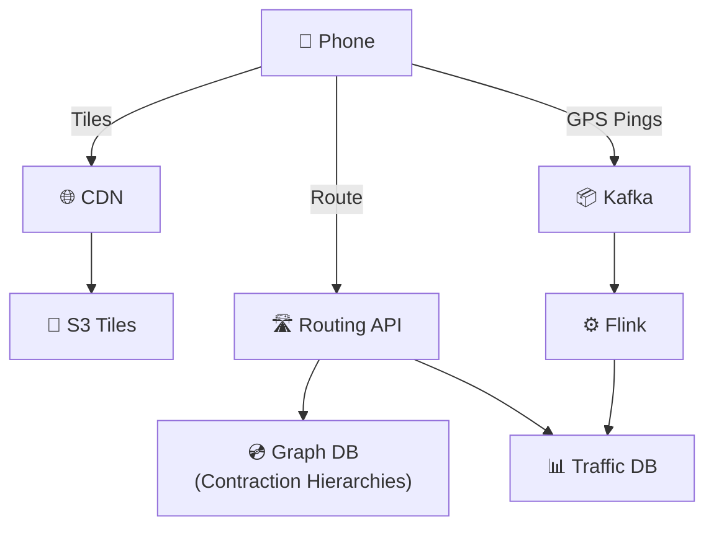

# Google Maps — Quick Revision (Short Notes)

### The "T.R.E." Decomposition
Google Maps = THREE independent systems:
1. **T**iles (Map Rendering) — CDN problem
2. **R**outing (Shortest Path) — Graph/CPU problem
3. **E**TA (Live Traffic) — Streaming pipeline problem

---

### 1. Map Rendering (Tiles)
- The world map is pre-cut into small square **tiles** at different zoom levels.
- **Zoom 0** = 1 tile (whole world). **Zoom N** = `4^N` tiles.
- Each tile has a URL: `/tiles/{z}/{x}/{y}.png`
- **Vector tiles** (not raster): Server sends geometric instructions, phone GPU renders. Enables dark mode, rotation, 3D buildings.
- **Serving:** CDN with **>99% cache hit rate**. Origin = S3/GCS (~50 TB of tiles).

### 2. Routing (Shortest Path)
- Road network = **weighted graph** (nodes = intersections, edges = road segments, weights = travel TIME not distance).
- **Dijkstra's** algorithm on 1 billion nodes is too slow (minutes per query).
- **Solution: Contraction Hierarchies**
  - Offline: Rank nodes by importance. Contract (remove) unimportant nodes, add shortcut edges.
  - Creates hierarchy: Local streets → Regional roads → Highways.
  - Query: Search UPWARD from source + DOWNWARD from destination. Meet at highway level.
  - Result: **<10ms per query** instead of minutes.

### 3. ETA (Live Traffic)
- **Data source:** Every phone running Maps sends GPS pings (speed + location).
- **Pipeline:** `Phones → Kafka → Flink (Map Match + Aggregate) → Traffic DB`
- **Map Matching:** Snaps noisy GPS to the nearest road segment.
- **Aggregation:** Average speed per road segment over last 5 minutes.
- **ETA formula:** `Σ (edge_length / current_speed)` for all edges in route.
- **ML Enhancement:** Predicts future congestion using historical patterns, weather, events.

---

### Architecture Summary

### Key Numbers to Remember
| Metric | Value |
|---|---|
| Tile QPS | ~230,000 (CDN absorbs) |
| Route QPS | ~2,300 |
| GPS pings/sec | ~5 Million |
| Contraction Hierarchy query | <10ms |
| CDN cache hit rate | >99% |
