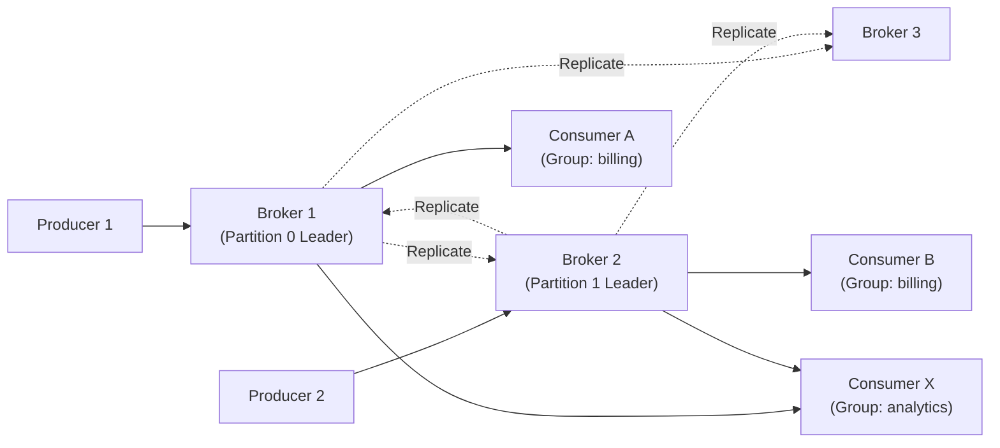

# Distributed Message Queue (Kafka) — Quick Revision (Short Notes)

### The Core Concept
Kafka is NOT a traditional message queue. It's a **distributed append-only commit log**. Messages are NOT deleted after consumption — they are retained for a configurable duration. Consumers independently track their position (offset).

---

### 1. The Commit Log
- Append-only file. New messages go to the end. Never overwrite, never insert.
- Sequential disk writes are **600x faster** than random I/O on HDD.
- Each message gets a monotonically increasing **offset** (integer).
- Consumers maintain a **bookmark (offset)** and can replay from any point.

### 2. Topics & Partitions
- **Topic:** Named category (e.g., `user-signups`, `order-placed`).
- **Partition:** Each topic is split into N independent logs across different brokers.
- **Partition Key:** `hash(key) % N` ensures same key → same partition → **guaranteed order per key**.
- **Parallelism rule:** More partitions = more throughput + more consumers.

### 3. Replication (ISR)
- Each partition: **1 Leader** (handles ALL reads/writes) + **N Followers**.
- **ISR (In-Sync Replicas):** Followers that are "caught up." Only ISR members can become the new leader.
- `acks=all` + `min.insync.replicas=2` = no data loss even if leader crashes.

### 4. Consumer Groups
- A group of consumers that **divide partitions** among themselves.
- Each partition → exactly 1 consumer in a group (no duplicates).
- Different groups read the SAME data independently (pub/sub model).
- Offsets stored in `__consumer_offsets` topic for crash recovery.

### 5. Storage
- Partitions stored as **segment files** (~1 GB each) + `.index` files.
- **Time-based retention:** Delete after 7 days.
- **Log compaction:** Keep only latest value per key (great for changelogs).

---

### Key Performance Tricks
| Trick | How it works |
|---|---|
| **Sequential I/O** | Only append to end of file. No random seeks. |
| **Zero-copy** | `sendfile()` syscall: data flows Disk → NIC, skipping user space. |
| **Page cache** | OS caches segments in RAM. Hot data served from memory, not disk. |
| **Batching** | Producer batches messages before sending. Reduces network round trips. |

### Delivery Guarantees
| Mode | Mechanism |
|---|---|
| **At-most-once** | `acks=0`, no retries |
| **At-least-once** | `acks=all` + consumer offset commits |
| **Exactly-once** | Idempotent Producer (PID + SeqNum dedup) + Transactions |

---

### Architecture Diagram

### Memory Trick: "P.R.C."
1. **P**artitions — Scale writes
2. **R**eplication — Survive failures
3. **C**onsumer Groups — Scale reads
