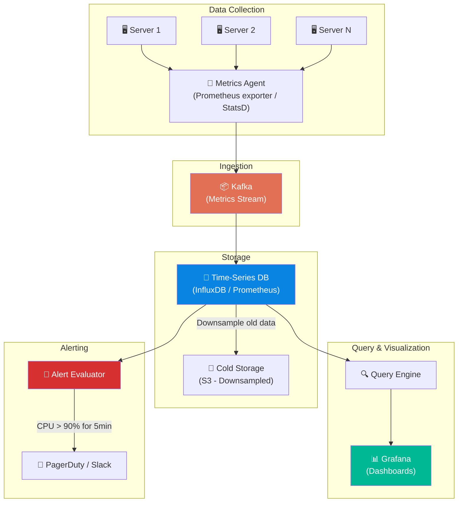

# Volume 2 - Chapter 5: Design a Metrics Monitoring System (e.g., Datadog, Prometheus)

> **Core Idea:** A metrics monitoring system collects numerical measurements (CPU usage, request latency, error count) from thousands of servers, stores them as **time-series data**, and enables real-time dashboards and alerting. The unique challenge is that time-series data has a very specific write pattern — it's always appended in timestamp order, rarely updated, and most queries are "give me the last 5 minutes" or "show me the trend over the last 24 hours." This pattern requires a purpose-built storage engine radically different from MySQL or Cassandra.

---

## 🎯 Step 1: Understand the Problem & Scope

### Clarifying the Requirements

```
You:  "What kind of metrics are we collecting?"
Int:  "Infrastructure metrics (CPU, memory, disk), application metrics (request count, 
       latency P99, error rate), and business metrics (orders per minute)."

You:  "What is the scale?"
Int:  "100,000 servers, each emitting 100 metrics every 10 seconds."

You:  "How long do we retain data?"
Int:  "Full resolution for 7 days. Downsampled (1-minute averages) for 1 year."

You:  "Do we need alerting?"
Int:  "Yes. If CPU > 90% for 5 minutes, fire an alert to PagerDuty/Slack."

You:  "Do we need dashboards?"
Int:  "Yes. Engineers should be able to build custom dashboards with graphs."
```

### 📋 Finalized Scope
- Collect, store, query, visualize, and alert on time-series metrics
- 100K servers, 100 metrics each, every 10 seconds
- Retention: 7 days raw + 1 year downsampled
- Real-time alerting with configurable rules

---

## 🧮 Step 2: Back-of-the-Envelope Estimates

| Metric | Calculation | Result |
|---|---|---|
| **Total metrics** | 100K servers × 100 metrics | **10 Million unique time series** |
| **Data points per second** | 10M metrics / 10 sec interval | **1 Million data points/sec** |
| **Data point size** | metric_name + tags + timestamp + value ≈ 30 bytes | **~30 bytes** |
| **Write bandwidth** | 1M × 30 bytes | **~30 MB/sec** |
| **Raw storage (7 days)** | 30 MB/sec × 86400 × 7 | **~18 TB** |
| **Downsampled storage (1 year)** | 18 TB / 6 (1-min agg reduces 6x) × 52 weeks | **~156 TB** |

> **Crucial Takeaway:** 1 million writes/sec is significant but each write is tiny (30 bytes). This is a "lots of tiny sequential writes" problem — exactly what Time-Series Databases (TSDBs) are built for. The read pattern is also specialized: almost all queries are range scans over time windows ("show CPU for server X from 2pm-3pm").

---

## ☠️ Step 3: Why General-Purpose Databases Fail

### Why not MySQL?
- Each data point is a row: `(metric_name, server_id, timestamp, value)`.
- At 1M inserts/sec with B-tree indexes, MySQL would spend most CPU time rebalancing index pages.
- Range queries like "CPU for server X over 24 hours" touch 8,640 rows scattered across random disk pages.
- Within weeks, the table has billions of rows. DELETE operations for expired data cause massive write amplification.

### Why not Cassandra?
- Cassandra handles high write throughput well (LSM trees).
- BUT it doesn't natively support time-series aggregation functions (AVG, P99, SUM over time windows).
- Every query requires reading raw data and computing aggregations application-side. At 10M time series, this is extremely CPU-heavy for dashboards.

> **The Solution:** Use a purpose-built **Time-Series Database (TSDB)** like InfluxDB, Prometheus, or TimescaleDB that understands the write-once-read-by-time-range pattern natively.

---

## 📊 Step 4: The Data Model — Understanding Time Series

### What is a Time Series?
A time series is a sequence of `(timestamp, value)` pairs identified by a unique combination of a **metric name** and a set of **tags/labels**.

```
Metric Name: cpu.usage
Tags: {host: "web-server-42", region: "us-east-1", env: "production"}

Data Points:
  (10:00:00, 78.2%)
  (10:00:10, 81.5%)
  (10:00:20, 79.1%)
  (10:00:30, 92.3%)   ← CPU spike!
```

### Beginner Example: The Thermometer Analogy
Imagine a digital thermometer that records the temperature every 10 seconds. After 1 hour, you have 360 readings. After 1 day, 8,640 readings. After 1 year, 3.15 million readings.

Now imagine you have 10 million thermometers (servers), each recording 100 different measurements (CPU, RAM, disk...). That's the scale of production monitoring.

### The Label/Tag System
Tags are critical because they allow flexible GROUP BY queries:
```
Query: "Average CPU across ALL web servers in us-east-1"
  → Filter: metric="cpu.usage" AND region="us-east-1" AND host LIKE "web-*"
  → Aggregate: AVG(value) GROUP BY time_bucket(5 min)
```

Without tags, you'd need a separate table for every server × metric × region combination.

---

## 🏗️ Step 5: Storage Engine Deep Dive (How TSDBs Work)

### The Write Path
TSDBs use a storage approach inspired by LSM-Trees but optimized for time-series:

**1. In-Memory Buffer (Write-Ahead Log)**
Incoming data points first land in an in-memory buffer. A WAL (Write-Ahead Log) on disk ensures durability if the process crashes before flushing.

**2. Chunk Compression**
After accumulating ~2 hours of data for a time series, the buffer compresses it into a compact **chunk**. Time-series data compresses extremely well because:
- Timestamps are monotonically increasing → store deltas (delta-of-delta encoding): `10:00:00, +10, +10, +10...` instead of full timestamps.
- Values change slowly → XOR encoding: if CPU goes from 78.2 to 78.5, store only the XOR of the float bits (mostly zeros = tiny).
- **Result:** 2 hours of data for one series compresses from ~7 KB to ~300 bytes (23x compression!).

**3. Block Storage**
Compressed chunks are grouped into time-partitioned **blocks** (e.g., 2-hour blocks). Old blocks are immutable and can be efficiently garbage-collected when they expire.

```
Block Structure (2-hour window):
┌──────────────────────────────────────────────────┐
│ Block: 10:00 - 12:00                             │
│  ├── Series: cpu.usage{host=web-1}  [chunk data] │
│  ├── Series: cpu.usage{host=web-2}  [chunk data] │
│  ├── Series: mem.usage{host=web-1}  [chunk data] │
│  └── Index: label → series ID mapping            │
└──────────────────────────────────────────────────┘
```

### The Read Path
When a dashboard queries "CPU for web-42 from 2pm to 4pm":
1. **Index lookup:** Find the series ID for `cpu.usage{host=web-42}` using the inverted index on labels.
2. **Block selection:** Identify which time blocks overlap with 2pm-4pm (e.g., blocks 14:00-16:00).
3. **Chunk decompression:** Decompress only the relevant chunks for that series.
4. **Aggregation:** Apply the requested function (AVG, MAX, P99) over the decompressed data points.

### The Inverted Index for Labels
TSDBs maintain an inverted index mapping each label value to a list of series IDs:
```
region="us-east-1"  → [series_1, series_2, series_45, series_99, ...]
host="web-42"       → [series_45, series_46, series_47]
env="production"    → [series_1, series_2, series_45, ...]

Query: region="us-east-1" AND host="web-42"
  → Intersect: {series_45}  ← Only one series matches!
```

This is identical to how search engines (Elasticsearch) find documents matching multiple keywords. The intersection is blazing fast using sorted posting lists.

---

## 🏛️ Step 6: Full System Architecture



---

## 📡 Step 7: Data Collection (Push vs Pull)

### Pull Model (Prometheus)
The monitoring server actively **scrapes** (HTTP GET) each target every 10 seconds:
```
GET http://web-server-42:9090/metrics

Response:
  cpu_usage{core="0"} 78.2
  cpu_usage{core="1"} 65.4
  memory_used_bytes 4294967296
  http_requests_total{status="200"} 1523847
```

**Pros:** Monitoring server controls the rate. Easy to detect down servers (scrape fails = server is dead).
**Cons:** Doesn't scale well beyond ~100K targets from a single Prometheus instance. Requires service discovery.

### Push Model (Datadog / StatsD)
Each server runs a local agent that **pushes** metrics to a central collector:
```
Agent on web-server-42 → UDP/TCP → Central Collector → Kafka → TSDB
```

**Pros:** Scales to millions of servers. Works behind firewalls/NAT. Less coordination overhead.
**Cons:** Can overwhelm the collector during traffic spikes. Harder to know if absence of data means "server is fine but idle" or "server is dead."

### Hybrid Approach (Production Reality)
Most real systems use both:
- **Pull** for infrastructure metrics (Prometheus scraping Kubernetes pods)
- **Push** for application metrics (StatsD/agents sending custom business metrics)
- **Kafka** sits in between as a buffer for durability and fan-out

---

## 🚨 Step 8: Alerting Engine

### How Alerting Works
The Alert Evaluator is a separate service that periodically queries the TSDB and evaluates rules:

```yaml
# Alert Rule Example
alert: HighCPU
expr: avg(cpu_usage{env="production"}) by (host) > 90
for: 5m                     # Must be true for 5 consecutive minutes
labels:
  severity: critical
annotations:
  summary: "CPU > 90% on {{ $labels.host }} for 5 minutes"
```

### The State Machine
Each alert goes through states:
```
Inactive → Pending (condition true, timer starts) → Firing (timer expired → ALERT!)
                    ↓ (condition becomes false)
                  Resolved
```

### Alert Deduplication
Without deduplication, a single CPU spike could fire hundreds of alerts (one per evaluation cycle). 
> **Solution:** Each unique alert (identified by its rule + labels) has a state. If it's already `Firing`, don't re-fire. Only send a new notification when transitioning from `Pending → Firing` or `Firing → Resolved`.

### Alert Routing
```
Critical alerts → PagerDuty (wake up the on-call engineer)
Warning alerts → Slack channel
Info alerts → Email digest
```

---

## 📉 Step 9: Downsampling (Managing Long-Term Storage)

### The Problem
Raw data at 10-second intervals for 1 year = 156 TB. Most queries on old data don't need 10-second precision. "Show me CPU trend for the last 6 months" works perfectly fine with 1-hour averages.

### The Solution: Downsampling
A background job periodically aggregates old data:
```
Raw (10-sec intervals, keep 7 days):
  10:00:00 → 78.2
  10:00:10 → 81.5
  10:00:20 → 79.1
  10:00:30 → 92.3
  10:00:40 → 85.0
  10:00:50 → 83.7

Downsampled (1-min aggregate, keep 1 year):
  10:00:00 → {avg: 83.3, min: 78.2, max: 92.3, count: 6}
```

We save `avg`, `min`, `max`, and `count` because different queries need different aggregations. You can't compute MAX from stored AVGs.

### Storage Tiers
| Tier | Resolution | Retention | Storage |
|---|---|---|---|
| **Hot** (SSD) | 10 seconds | 7 days | ~18 TB |
| **Warm** (HDD) | 1 minute | 30 days | ~3 TB |
| **Cold** (S3) | 1 hour | 1 year | ~50 GB |

---

## 🧑‍💻 Step 10: Advanced Deep Dive (Staff Level)

### High Cardinality Problem
What if engineers tag metrics with `user_id`? With 100M users, every metric explodes into 100M unique time series. This is called **high cardinality** and it will crash any TSDB.
> **Solution:** Set cardinality limits. Block labels with more than 10,000 unique values. Use a separate analytics system (ClickHouse, Druid) for user-level granularity.

### Prometheus Federation (Scaling Pull)
A single Prometheus can handle ~100K series. For 10M series:
```
Leaf Prometheus (per datacenter) → scrapes local servers
  ↓ (federated scrape)
Global Prometheus → queries across all datacenters
  ↓
Thanos / Cortex → long-term storage in S3 with global query
```

### Histogram Quantiles (P99 Latency)
Computing P99 latency requires knowing the distribution of values, not just the average.
- **Approach 1: Client-side histograms.** The agent pre-buckets latency values (e.g., 0-10ms, 10-50ms, 50-100ms, 100-500ms, 500ms+). Ship bucket counts to the TSDB. Approximate P99 by interpolating bucket boundaries.
- **Approach 2: T-Digest / DDSketch.** Advanced data structures that can be merged across servers while preserving accurate quantile estimates. Used by Datadog.

---

## 📋 Summary — Quick Revision Table

| Component | Choice | Why |
|---|---|---|
| **Data model** | **Time series: metric + labels + (timestamp, value)** | Flexible querying with GROUP BY on labels. |
| **Storage engine** | **TSDB with compressed chunks + inverted index** | Delta-of-delta + XOR encoding gives 23x compression. Inverted index enables fast label filtering. |
| **Collection** | **Pull (Prometheus) + Push (agents) + Kafka buffer** | Hybrid approach covers all use cases. Kafka handles spikes. |
| **Alerting** | **Rule evaluator with state machine** | Prevents duplicate alerts. Supports pending/firing/resolved states. |
| **Long-term storage** | **Downsampling: 10s → 1min → 1hr** | Reduces 156 TB/year to ~50 GB/year without losing trend visibility. |

---

## 🧠 Memory Tricks for Interviews

### **"C.S.Q.A." — The 4 Pillars of Monitoring**
1. **C**ollect — Agents push/pull metrics from servers
2. **S**tore — TSDB with compressed time-partitioned blocks
3. **Q**uery — Inverted index on labels + range scans on time blocks
4. **A**lert — Rule evaluator with state machine (Inactive → Pending → Firing)

### **"The Thermometer Factory" Analogy**
> Imagine a factory with 100,000 thermometers, each taking a reading every 10 seconds. You need to store ALL readings, display live dashboards, and ring an alarm if any thermometer exceeds a threshold for 5 minutes straight. That's metrics monitoring.

### **"Why TSDBs beat SQL"**
> SQL stores each data point as a separate row with full column overhead. A TSDB stores 2 hours of readings as a single compressed blob (~300 bytes vs ~7 KB). The compression works because timestamps always increase and values rarely change dramatically.

---

> **📖 Previous Chapter:** [← Chapter 4: Design a Distributed Message Queue](/HLD_Vol2/chapter_4/design_a_distributed_message_queue.md)  
> **📖 Up Next:** Chapter 6 - Design an Ad Click Event Aggregation System
