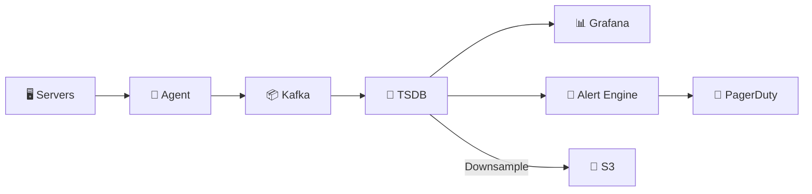

# Metrics Monitoring System — Quick Revision (Short Notes)

### Core Problem
100K servers × 100 metrics × every 10 sec = **1 Million data points/sec** of tiny writes.
Standard SQL cannot handle this. Need a **Time-Series Database (TSDB)**.

---

### 1. Data Model
```
metric_name{label1="val1", label2="val2"}  → [(timestamp, value), ...]
```
Labels enable flexible filtering: `cpu.usage{host="web-42", region="us-east"}`.

### 2. Storage Engine (TSDB Internals)
- **Write path:** In-memory buffer → WAL → Compress into chunks → Flush to disk blocks.
- **Compression:** Delta-of-delta for timestamps, XOR for values → **23x compression**.
- **Read path:** Inverted index (label → series IDs) → Select time blocks → Decompress chunks → Aggregate.
- **Blocks:** Immutable 2-hour time windows. Easy deletion when expired.

### 3. Collection: Push vs Pull
| Model | Example | Pros | Cons |
|---|---|---|---|
| **Pull** | Prometheus scrapes `/metrics` | Detects down servers easily | Hard to scale past 100K |
| **Push** | StatsD agent sends to collector | Scales to millions, works behind NAT | Hard to detect dead servers |
| **Hybrid** | Pull for infra + Push for app metrics + Kafka buffer | Best of both worlds | More complex |

### 4. Alerting
- **Rule:** `avg(cpu) > 90% for 5 min → fire alert`
- **State machine:** `Inactive → Pending → Firing → Resolved`
- **Dedup:** Same alert doesn't re-fire. Only notifies on state transitions.
- **Routing:** Critical → PagerDuty, Warning → Slack, Info → Email.

### 5. Downsampling
| Tier | Resolution | Retention |
|---|---|---|
| Hot (SSD) | 10 sec | 7 days |
| Warm (HDD) | 1 min | 30 days |
| Cold (S3) | 1 hour | 1 year |

---

### Architecture



### Memory Trick: "C.S.Q.A."
1. **C**ollect — Push/Pull agents
2. **S**tore — TSDB with compressed chunks
3. **Q**uery — Inverted index + time range scan
4. **A**lert — Rule engine with state machine
