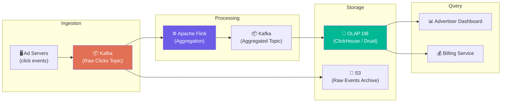

# Volume 2 - Chapter 6: Design an Ad Click Event Aggregation System

> **Core Idea:** Every time a user clicks an ad on Google, Facebook, or Amazon, an event is generated. Advertisers pay per click, so we must count clicks **accurately, in real-time, and at massive scale**. The system must aggregate billions of raw click events into queryable counts (e.g., "Ad X got 1,523 clicks in the last hour from users in India"). This is a classic **real-time stream processing** problem that combines Kafka, Apache Flink, and OLAP databases. The hardest part isn't counting — it's counting **exactly once** when servers crash, duplicates arrive, and late events show up minutes after the window closes.

---

## 🎯 Step 1: Understand the Problem & Scope

### Clarifying the Requirements

```
You:  "What data do we receive per click?"
Int:  "Ad ID, user ID, timestamp, IP address, country, device type."

You:  "What aggregations do advertisers need?"
Int:  "Click count per ad per minute, broken down by country and device type.
       Also: total spend per ad, click-through rate (clicks / impressions)."

You:  "What is the scale?"
Int:  "1 billion ad clicks per day."

You:  "How fresh must the data be?"
Int:  "Aggregated results should be available within 1-2 minutes of the click."

You:  "How critical is accuracy? Can we lose clicks?"
Int:  "Extremely critical. Advertisers are paying real money per click. 
       Over-counting = we overcharge. Under-counting = we lose revenue."
```

### 📋 Finalized Scope
- Real-time aggregation of 1 billion clicks/day
- Results available within 1-2 minutes
- No data loss (exactly-once counting)
- Multi-dimensional breakdowns (by ad, country, device, time)

---

## 🧮 Step 2: Back-of-the-Envelope Estimates

| Metric | Calculation | Result |
|---|---|---|
| **Clicks per second** | 1B / 86400 | **~11,600 clicks/sec** |
| **Peak clicks/sec** | 11,600 × 5 (peak hours) | **~58,000 clicks/sec** |
| **Raw event size** | ~500 bytes (JSON with all fields) | **500 bytes** |
| **Raw ingestion bandwidth** | 58K × 500 bytes | **~29 MB/sec** |
| **Raw storage (30 days)** | 1B × 500 bytes × 30 | **~15 TB** |
| **Aggregated storage** | Much smaller (counts per ad per minute) | **~500 GB** |

> **Crucial Takeaway:** The raw data volume is moderate (29 MB/sec). The real challenge is:
> 1. **Correctness:** Counting exactly once despite duplicates, retries, and late arrivals.
> 2. **Low latency:** Aggregations must be queryable within 1-2 minutes.
> 3. **Multi-dimensional:** Every click must be sliced by ad_id × country × device × time_window simultaneously.

---

## ☠️ Step 3: Why a Simple Database Counter Fails

### The Naive Approach
```sql
-- On every click, increment a counter:
UPDATE ad_clicks SET count = count + 1 
WHERE ad_id = 'ad_123' AND minute = '2026-04-29T10:05';
```

**Problems:**
1. **Contention:** If Ad X gets 10,000 clicks/sec, 10,000 threads fight for the same row lock simultaneously. The database row becomes a serialization bottleneck.
2. **No multi-dimensional aggregation:** If we also need breakdowns by country and device, we'd need separate counters for every `(ad_id, country, device, minute)` combination — millions of rows being simultaneously locked.
3. **No exactly-once:** If the UPDATE succeeds but the server crashes before sending the ACK to the client, the client retries, and we double-count.

> **The Solution:** Don't count in the database at all. Use a **streaming pipeline** (Kafka + Flink) to aggregate events in-memory and flush pre-computed counts to an OLAP database.

---

## 🏗️ Step 4: System Architecture — The Streaming Pipeline

### High-Level Data Flow



### Why This Architecture?
| Layer | Purpose | Technology |
|---|---|---|
| **Kafka (Raw)** | Durable buffer. Decouples ad servers from processing. Handles traffic spikes. | Kafka |
| **Flink** | Real-time aggregation in-memory. Window-based counting. Exactly-once semantics. | Apache Flink |
| **Kafka (Aggregated)** | Buffer between Flink and DB. Allows multiple consumers (OLAP + Billing). | Kafka |
| **OLAP DB** | Fast multi-dimensional queries for dashboards and reports. | ClickHouse or Apache Druid |
| **S3 (Raw Archive)** | Store every raw click forever for auditing, dispute resolution, and data reconciliation. | S3 |

---

## ⚙️ Step 5: The Aggregation Engine (Apache Flink Deep Dive)

### What Flink Does
Flink reads raw click events from Kafka and computes aggregated counts in real-time using **windowed computations**.

### Beginner Example: The Turnstile Counter Analogy
Imagine you're counting people entering a subway station. Instead of writing each person's name to a database, you stand at the turnstile with a hand counter:
- Every person who enters, you click the counter (+1).
- Every 1 minute, you write the count on a whiteboard and reset the counter to zero.
- The whiteboard shows: "10:00 = 342 people, 10:01 = 289 people, 10:02 = 401 people..."

Flink does exactly this, but for millions of counters simultaneously (one per ad_id × country × device combination).

### Window Types

**1. Tumbling Window (Fixed, Non-Overlapping)**
```
|---Window 1---|---Window 2---|---Window 3---|
  10:00-10:01    10:01-10:02    10:02-10:03
```
Each click falls into exactly ONE window. When the window closes (e.g., 10:01), Flink emits the final count and opens a new window. Simple and efficient.

**2. Sliding Window (Overlapping)**
```
|---Window 1 (10:00-10:05)---|
       |---Window 2 (10:01-10:06)---|
              |---Window 3 (10:02-10:07)---|
```
A 5-minute window that slides every 1 minute. Each click can belong to multiple windows. Useful when advertisers want "clicks in the last 5 minutes" updated every minute.

**3. Session Window (Activity-Based)**
The window stays open as long as events keep arriving. If no click arrives for 30 seconds, the window closes. Useful for user session analysis but NOT typical for ad click counting.

### Flink Aggregation Code (Conceptual)
```java
// Read raw click events from Kafka
DataStream<ClickEvent> clicks = env
    .addSource(new KafkaSource("raw-clicks-topic"))
    .map(json -> parseClickEvent(json));

// Aggregate: count clicks per (ad_id, country, device) per 1-minute tumbling window
DataStream<AggregatedClick> aggregated = clicks
    .keyBy(click -> click.adId + ":" + click.country + ":" + click.device)
    .window(TumblingEventTimeWindows.of(Time.minutes(1)))
    .aggregate(new CountAggregator());

// Write aggregated results to Kafka
aggregated.addSink(new KafkaSink("aggregated-clicks-topic"));
```

### The Output
For every 1-minute window, Flink emits records like:
```json
{
  "ad_id": "ad_123",
  "country": "IN",
  "device": "mobile",
  "window_start": "2026-04-29T10:05:00",
  "window_end": "2026-04-29T10:06:00",
  "click_count": 1523,
  "unique_users": 1401
}
```

---

## ⏰ Step 6: Handling Late Events (The Watermark Problem)

### The Problem
Events don't always arrive in order. A user in rural India clicks an ad at 10:05:00, but due to network delays, the event reaches Kafka at 10:07:30. By then, Flink has already closed the 10:05 window and emitted its count. This late event would be **lost**.

### Beginner Example: The Exam Submission Analogy
A professor collects exams at 5:00 PM sharp. A student stuck in traffic arrives at 5:02 PM. Should the professor:
- (a) Reject it? (Data loss)
- (b) Accept it and update the grade sheet? (Late event handling)
- (c) Accept up to 5:10 PM but reject after that? ← This is what Flink does.

### The Solution: Watermarks + Allowed Lateness
**Watermarks** are special markers in the event stream that say: "All events with timestamp ≤ T have arrived."

```
Events:  [10:04:58] [10:05:01] [10:05:03] [WATERMARK: 10:05:00] [10:04:59] ← LATE!
```

Flink configuration:
```java
.window(TumblingEventTimeWindows.of(Time.minutes(1)))
.allowedLateness(Time.minutes(5))  // Accept late events up to 5 min after window close
.sideOutputLateData(lateOutputTag)  // Events >5 min late go to a separate stream for manual review
```

**What happens:**
1. Window 10:05 closes at 10:06 and emits count = 1523.
2. A late event arrives at 10:07 with timestamp 10:05:30. Flink reopens the window, increments to 1524, and emits an **updated** count.
3. An extremely late event arrives at 10:15 (10 minutes late). It exceeds the 5-minute allowed lateness. Flink routes it to the `lateOutputTag` side output for manual reconciliation.

---

## 🔢 Step 7: Exactly-Once Counting (The Hardest Problem)

### Why Duplicates Happen
1. **Producer retries:** The ad server sends a click to Kafka. Kafka writes it but the ACK is lost. The ad server retries → duplicate message in Kafka.
2. **Consumer retries:** Flink processes a message and updates its internal state, but crashes before committing the Kafka offset. On restart, it re-reads the message → duplicate processing.

### Solution 1: Kafka Idempotent Producer
Each producer message gets a `(ProducerID, SequenceNumber)`. If Kafka sees the same pair twice, it silently drops the duplicate.

### Solution 2: Flink Checkpointing
Flink periodically takes **snapshots** of its internal state (all window counters) and the current Kafka consumer offset. These snapshots are stored in a durable backend (S3/HDFS).

```
Normal operation:
  Kafka offset: 5000    Flink state: {ad_123: 1500 clicks}
  
Checkpoint saved:
  [Kafka offset: 5000, State: {ad_123: 1500}]  → Saved to S3

Crash happens at offset 5050!

Recovery:
  Flink restores from checkpoint → Kafka offset: 5000, State: {ad_123: 1500}
  Flink re-reads offsets 5000-5050 from Kafka
  Flink re-processes them → arrives at the same state deterministically
  No duplicates, no data loss!
```

This is called **exactly-once processing via checkpointing + idempotent writes**.

---

## 💾 Step 8: OLAP Database (ClickHouse / Druid)

### Why OLAP, not MySQL?
The aggregated data must support queries like:
```sql
SELECT ad_id, country, SUM(click_count) 
FROM ad_clicks 
WHERE window_start >= '2026-04-29' AND window_start < '2026-04-30'
GROUP BY ad_id, country
ORDER BY SUM(click_count) DESC
LIMIT 100;
```

This scans millions of rows across multiple dimensions. OLAP databases are built for this:

| Feature | MySQL (OLTP) | ClickHouse (OLAP) |
|---|---|---|
| **Storage** | Row-oriented | **Column-oriented** |
| **Scan speed** | Reads entire rows (wastes I/O on unused columns) | Reads only needed columns |
| **Compression** | Moderate | **Extreme** (same-type data in columns compresses 10-20x) |
| **Insert pattern** | Single-row inserts | **Bulk batch inserts** |
| **Analytical queries** | Slow (not designed for full scans) | **Blazing fast** |

### Column-Oriented Storage (The Bookshelf Analogy)
**Row-oriented (MySQL):** Imagine a bookshelf where each shelf holds one complete book (all chapters). To find all "Chapter 3s" across 1000 books, you must pull out every single book and flip to Chapter 3. Extremely slow.

**Column-oriented (ClickHouse):** Imagine a bookshelf where Shelf 1 has ALL Chapter 1s from every book, Shelf 2 has ALL Chapter 2s, etc. To find all Chapter 3s, just grab everything from Shelf 3. One sequential read. Done.

---

## 🛡️ Step 9: Click Fraud Detection

### The Problem
Competitors or bots can repeatedly click on ads to drain an advertiser's budget. This is called **click fraud** and costs advertisers billions annually.

### Detection Signals
| Signal | Description | Example |
|---|---|---|
| **IP clustering** | Many clicks from the same IP | 500 clicks from 1 IP in 1 minute |
| **Click velocity** | Impossible click speed | 10 clicks per second from same user |
| **Geographic mismatch** | User location doesn't match ad targeting | Ad targets US, click from a bot farm in Southeast Asia |
| **Cookie/device fingerprint** | Same device clicking multiple ads | Rotating user agents but same canvas fingerprint |

### Architecture: Real-Time Fraud Filtering
```
Raw Click → Fraud Detection Service → {VALID: Forward to Kafka, FRAUD: Log & Drop}
```
The fraud service runs lightweight ML models (e.g., isolation forest, rule-based scoring) inline before the click enters the aggregation pipeline. This ensures fraudulent clicks are NEVER counted or billed.

---

## 📋 Summary — Quick Revision Table

| Component | Choice | Why |
|---|---|---|
| **Ingestion** | **Kafka (raw clicks topic)** | Durable buffer, handles spikes, enables replay. |
| **Aggregation** | **Apache Flink (tumbling windows)** | Real-time windowed counting with exactly-once via checkpointing. |
| **Late events** | **Watermarks + 5-min allowed lateness** | Balances freshness vs completeness. Ultra-late events go to side output. |
| **Exactly-once** | **Idempotent producer + Flink checkpoints** | Kafka deduplicates at ingestion. Flink snapshots state + offset atomically. |
| **Query storage** | **OLAP DB (ClickHouse)** | Column-oriented storage for fast multi-dimensional GROUP BY queries. |
| **Fraud** | **Inline ML fraud filter before Kafka** | Prevents fraudulent clicks from entering the billing pipeline. |

---

## 🧠 Memory Tricks for Interviews

### **"K.F.O." — The Ad Click Pipeline**
1. **K**afka — Buffer raw events
2. **F**link — Aggregate in windows (exactly-once via checkpoints)
3. **O**LAP — Store and query aggregated results

### **"The Turnstile Counter" Analogy**
> Don't write every person's name to a database. Stand at the gate with a hand counter. Click +1 for each entry. Every minute, write the total to a whiteboard and reset. That's windowed aggregation.

### **"Late Events = Late Homework"**
> A 5-minute grace period after the window closes. Within 5 minutes → accepted and count updated. After 5 minutes → goes to a "late pile" for manual review. Beyond that → rejected.

---

> **📖 Previous Chapter:** [← Chapter 5: Design a Metrics Monitoring System](/HLD_Vol2/chapter_5/design_a_metrics_monitoring_system.md)  
> **📖 Up Next:** Chapter 7 - Design a Hotel Reservation System
