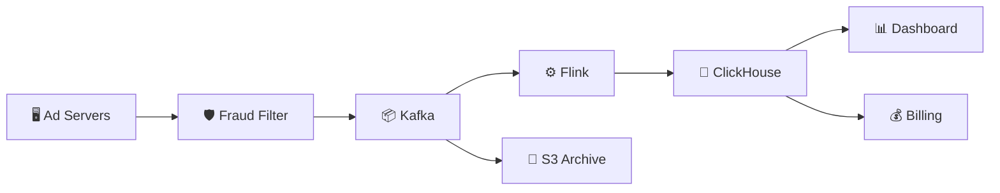

# Ad Click Event Aggregation — Quick Revision (Short Notes)

### Core Problem
1 billion ad clicks/day → Count clicks per ad per minute, by country and device.
Advertisers pay per click → **accuracy is critical** (no over/under-counting).

---

### 1. Why Not a DB Counter?
- 10,000 clicks/sec on Ad X → 10,000 threads fighting for the same row lock.
- No exactly-once: server crash after UPDATE but before ACK → duplicate count.
- Solution: **Stream processing pipeline** (Kafka + Flink + OLAP).

### 2. The Pipeline: K.F.O.
1. **K**afka — Raw click events buffered durably
2. **F**link — Windowed aggregation in-memory (counts per ad × country × device per minute)
3. **O**LAP — ClickHouse stores aggregated results for fast multi-dimensional queries

### 3. Flink Windowing
- **Tumbling Window:** Fixed 1-min non-overlapping windows. Each click → exactly 1 window.
- **Output per window:** `{ad_id, country, device, window_start, click_count}`
- **Late events:** Watermarks + 5-min allowed lateness. Ultra-late → side output for manual review.

### 4. Exactly-Once Counting
| Problem | Solution |
|---|---|
| Kafka duplicate messages | **Idempotent Producer** (ProducerID + SeqNum dedup) |
| Flink crash mid-processing | **Checkpointing** (snapshot state + Kafka offset to S3, replay on recovery) |

### 5. OLAP Database (ClickHouse)
- **Column-oriented:** Only reads needed columns → fast GROUP BY scans.
- **Extreme compression:** Same-type column data compresses 10-20x.
- Supports queries like: `SELECT ad_id, SUM(clicks) GROUP BY country WHERE date = today`

### 6. Click Fraud Detection
- Inline ML filter BEFORE Kafka ingestion.
- Signals: IP clustering, click velocity, geographic mismatch, device fingerprinting.

---

### Architecture

### Memory Trick: "The Turnstile Counter"
Don't write each person to a database. Stand at the gate with a hand counter. Every minute, write the total to a whiteboard and reset. That's windowed aggregation.
