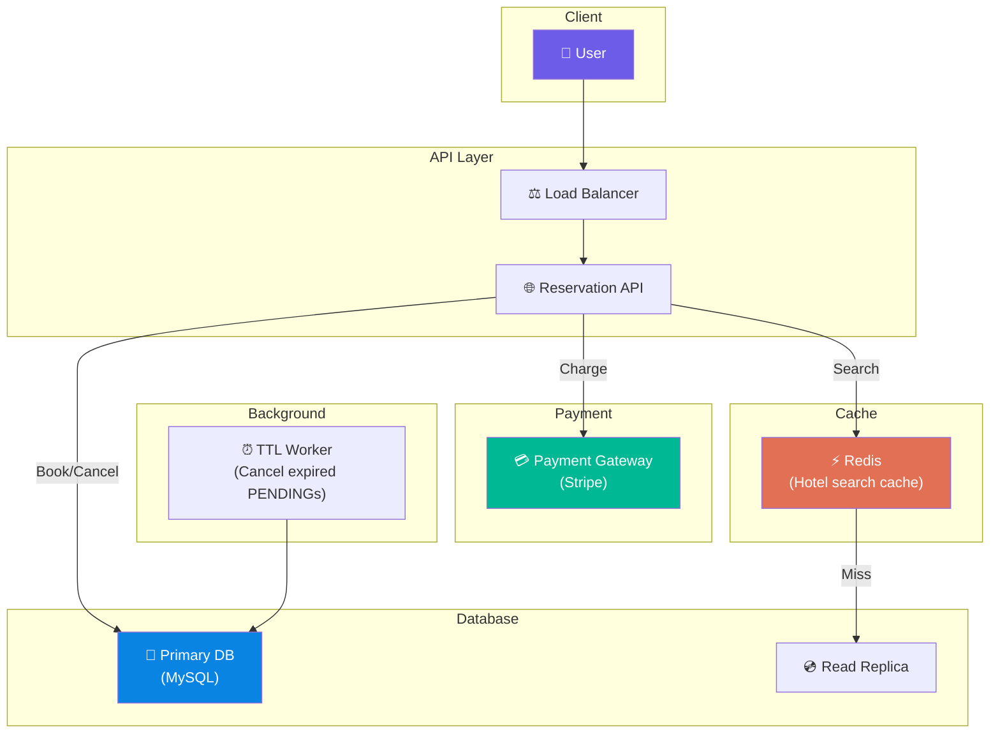

# Volume 2 - Chapter 7: Design a Hotel Reservation System (e.g., Booking.com)

> **Core Idea:** A hotel reservation system seems simple on the surface — "pick a hotel, pick dates, book it." But underneath lies one of the hardest distributed systems problems: **preventing double-bookings** when thousands of users simultaneously try to reserve the last room. This chapter is fundamentally about **concurrency control, distributed transactions, and idempotency** — concepts that apply to any inventory-based system (flights, concerts, ride-sharing).

---

## 🎯 Step 1: Understand the Problem & Scope

### Clarifying the Requirements

```
You:  "Is this the hotel-facing system (managing rooms) or user-facing (searching + booking)?"
Int:  "User-facing. Users search hotels, select dates, and book rooms."

You:  "How many hotels and rooms?"
Int:  "5,000 hotels. Average 120 rooms per hotel. Total: 600,000 rooms."

You:  "What is the booking scale?"
Int:  "10 million DAU searching. Peak: 1,000 bookings per second."

You:  "Can the same room be booked by two people at the same time?"
Int:  "Absolutely not. This is the core challenge."

You:  "Do we need to handle cancellations and refunds?"
Int:  "Yes. Cancelled rooms must become immediately available again."
```

### 📋 Finalized Scope
- Search for available hotels by location + date range
- Book a room (prevent double-booking)
- Cancel a booking (release inventory)
- Handle concurrent booking attempts gracefully
- Support payment processing

---

## 🧮 Step 2: Back-of-the-Envelope Estimates

| Metric | Calculation | Result |
|---|---|---|
| **Total rooms** | 5,000 hotels × 120 rooms | **600,000 rooms** |
| **Search QPS** | 10M DAU × 5 searches / 86400 | **~580 QPS (search)** |
| **Booking QPS** | Given | **~1,000 bookings/sec (peak)** |
| **Reservation rows** | 600K rooms × 365 days | **~219 Million rows** |
| **Storage for reservations** | 219M × 100 bytes | **~22 GB** |

> **Crucial Takeaway:** The data is small (22 GB). The QPS is moderate (1,000 bookings/sec). This is NOT a storage or throughput problem. It is a **correctness problem**. The system must guarantee that room 42 at Hotel X on Dec 25 is NEVER sold to two guests, even when 500 people click "Book" at the exact same millisecond.

---

## 🏗️ Step 3: API Design

### Core APIs
```
POST   /v1/reservations           → Create a reservation
GET    /v1/reservations/{id}      → Get reservation details  
DELETE /v1/reservations/{id}      → Cancel a reservation
GET    /v1/hotels/search?location=Mumbai&checkin=2026-12-25&checkout=2026-12-27
                                  → Search available hotels
GET    /v1/hotels/{id}/rooms?checkin=...&checkout=...
                                  → Get available rooms for a hotel
```

### The Booking Flow (User Perspective)
```
1. User searches: "Hotels in Mumbai, Dec 25-27"
2. System returns list of available hotels with prices
3. User picks Hotel Taj, Room Type: Deluxe
4. User enters guest details → clicks "Book Now"
5. System checks availability → reserves the room → redirects to payment
6. Payment succeeds → booking confirmed
7. Payment fails → reservation released (room becomes available again)
```

---

## 💾 Step 4: Database Schema Design

### The Core Tables

```sql
-- Hotels
CREATE TABLE hotels (
    hotel_id INT PRIMARY KEY,
    name VARCHAR(255),
    city VARCHAR(100),
    address TEXT,
    rating DECIMAL(2,1)
);

-- Room Types (e.g., "Deluxe King" at Hotel Taj)
CREATE TABLE room_types (
    room_type_id INT PRIMARY KEY,
    hotel_id INT REFERENCES hotels(hotel_id),
    name VARCHAR(100),        -- "Deluxe King"
    total_inventory INT,      -- 50 rooms of this type
    price_per_night DECIMAL(10,2)
);

-- Reservations
CREATE TABLE reservations (
    reservation_id UUID PRIMARY KEY,
    hotel_id INT,
    room_type_id INT,
    guest_id INT,
    checkin_date DATE,
    checkout_date DATE,
    status ENUM('PENDING', 'CONFIRMED', 'CANCELLED'),
    created_at TIMESTAMP
);
```

### Tracking Availability: Two Approaches

#### Approach 1: Count Available Rooms (Simple)
```sql
-- "How many Deluxe King rooms are available at Hotel Taj on Dec 25?"

SELECT rt.total_inventory - COUNT(r.reservation_id) AS available_rooms
FROM room_types rt
LEFT JOIN reservations r 
  ON r.room_type_id = rt.room_type_id
  AND r.status != 'CANCELLED'
  AND r.checkin_date <= '2026-12-25' 
  AND r.checkout_date > '2026-12-25'
WHERE rt.room_type_id = 42;
```

**Problem:** This JOIN is slow under high concurrency. Every search + booking query scans the reservations table.

#### Approach 2: Pre-computed Availability Table (Better)
```sql
-- Pre-computed: one row per room_type per date
CREATE TABLE room_availability (
    room_type_id INT,
    date DATE,
    total_rooms INT,          -- Total inventory (e.g., 50)
    reserved_rooms INT,       -- Currently booked (e.g., 48)
    PRIMARY KEY (room_type_id, date)
);

-- "Are Deluxe King rooms available on Dec 25?"
SELECT (total_rooms - reserved_rooms) AS available 
FROM room_availability 
WHERE room_type_id = 42 AND date = '2026-12-25';
-- Result: 50 - 48 = 2 rooms available
```

**Why this is better:** The availability check is a single-row primary key lookup (`O(1)`), not a JOIN across millions of reservation rows.

---

## ☠️ Step 5: The Double-Booking Problem (The Core Challenge)

### The Race Condition
Two users simultaneously try to book the LAST Deluxe King room on Dec 25:

```
Time    User A                          User B
─────   ──────────────────────          ──────────────────────
T1      SELECT available → 1 room       SELECT available → 1 room
T2      available > 0? YES!             available > 0? YES!
T3      INSERT reservation (Alice)      INSERT reservation (Bob)
T4      UPDATE reserved_rooms += 1      UPDATE reserved_rooms += 1
T5      reserved_rooms = 49             reserved_rooms = 50... wait, 51!
                                        
RESULT: Both users booked! But only 50 rooms exist → DOUBLE BOOKING! 💥
```

Both threads read `available = 1` simultaneously, both see it's available, both insert. Classic race condition.

### Solution 1: Pessimistic Locking (SELECT FOR UPDATE)

```sql
BEGIN TRANSACTION;

-- Lock the row. No other transaction can read/write this row until we commit.
SELECT reserved_rooms, total_rooms 
FROM room_availability 
WHERE room_type_id = 42 AND date = '2026-12-25'
FOR UPDATE;                              -- ← Acquires exclusive row lock!

-- Check availability (under lock)
IF reserved_rooms < total_rooms THEN
    INSERT INTO reservations(...) VALUES (...);
    UPDATE room_availability SET reserved_rooms = reserved_rooms + 1
    WHERE room_type_id = 42 AND date = '2026-12-25';
END IF;

COMMIT;   -- ← Lock released here
```

**How it prevents double-booking:**
```
Time    User A                              User B
─────   ──────────────────────              ──────────────────────
T1      SELECT ... FOR UPDATE → gets lock   SELECT ... FOR UPDATE → BLOCKED! ⏳
T2      reserved_rooms = 48, total = 50
T3      INSERT reservation (Alice)          (still waiting for lock...)
T4      UPDATE reserved_rooms = 49
T5      COMMIT → lock released             → NOW gets lock, reads reserved = 49
T6                                          49 < 50? YES → Books successfully
```

**Pros:** Simple, guaranteed correctness.
**Cons:** Under high contention (100 users booking same room type simultaneously), all threads serialize behind the lock. Throughput drops dramatically because everyone waits in line.

### Solution 2: Optimistic Locking (Version Column) ← **Recommended**

```sql
-- Step 1: Read current state (no lock!)
SELECT reserved_rooms, total_rooms, version 
FROM room_availability 
WHERE room_type_id = 42 AND date = '2026-12-25';
-- Result: reserved=48, total=50, version=17

-- Step 2: Attempt update with version check
UPDATE room_availability 
SET reserved_rooms = reserved_rooms + 1, 
    version = version + 1
WHERE room_type_id = 42 
  AND date = '2026-12-25' 
  AND version = 17;         -- ← Only succeeds if nobody else changed it!

-- Step 3: Check affected rows
IF affected_rows == 1 THEN
    -- Success! Insert reservation.
    INSERT INTO reservations(...) VALUES (...);
ELSE
    -- Someone else booked between our read and write. RETRY!
    GOTO Step 1;
END IF;
```

**How it prevents double-booking:**
```
Time    User A                              User B
─────   ──────────────────────              ──────────────────────
T1      READ version=17                     READ version=17
T2      UPDATE WHERE version=17 → SUCCESS   UPDATE WHERE version=17 → FAIL!
        (version becomes 18)                 (version is now 18, not 17)
T3      INSERT reservation (Alice) ✅       RETRY → READ version=18
T4                                          UPDATE WHERE version=18 → SUCCESS
                                            INSERT reservation (Bob) ✅
```

**Pros:** No locks held. High throughput. Most requests don't collide (low contention in practice).
**Cons:** Under extreme contention, some requests need to retry multiple times. But for hotels (moderate QPS), this works extremely well.

---

## 💰 Step 6: Payment Integration — The Booking State Machine

### The Problem
What if a user books a room but payment fails? We need to hold the room temporarily while payment processes, then either confirm or release it.

### The State Machine
```
          ┌──────────┐
          │  PENDING  │ ← Room reserved, payment processing
          └────┬──────┘
               │
       ┌───────┴───────┐
       │               │
  Payment OK      Payment Failed
       │               │
       ▼               ▼
  ┌──────────┐   ┌──────────┐
  │CONFIRMED │   │ CANCELLED│ ← Room released back to inventory
  └──────────┘   └────┬─────┘
                      │
                 User Cancels
                      │
                      ▼
                ┌──────────┐
                │ REFUNDED │
                └──────────┘
```

### Temporary Hold (TTL-based)
When a user clicks "Book Now":
1. Insert reservation with `status = PENDING`.
2. Decrement `reserved_rooms` in `room_availability`.
3. Start a **10-minute TTL timer**.
4. If payment succeeds within 10 min → update to `CONFIRMED`.
5. If payment fails OR timer expires → update to `CANCELLED`, increment `reserved_rooms` back.

```sql
-- A background job runs every minute:
UPDATE reservations SET status = 'CANCELLED' 
WHERE status = 'PENDING' AND created_at < NOW() - INTERVAL 10 MINUTE;

-- And release those rooms:
UPDATE room_availability ra
JOIN reservations r ON r.room_type_id = ra.room_type_id
SET ra.reserved_rooms = ra.reserved_rooms - 1
WHERE r.status = 'CANCELLED' AND r.previously_pending = TRUE;
```

---

## 🔑 Step 7: Idempotency (Preventing Duplicate Bookings)

### The Problem
User clicks "Book Now." The request reaches the server, the reservation is created, but the HTTP response is dropped (network glitch). The user's browser retries. Without protection, a SECOND reservation is created → the user is charged twice.

### The Solution: Idempotency Key
The client generates a unique `idempotency_key` (UUID) before sending the request. The server uses it to deduplicate.

```
POST /v1/reservations
Headers: Idempotency-Key: "a1b2c3d4-e5f6-..."
Body: { hotel_id: 1, room_type_id: 42, dates: "Dec 25-27" }
```

Server logic:
```python
def create_reservation(request):
    key = request.headers["Idempotency-Key"]
    
    # Check if we've already processed this exact request
    existing = db.query("SELECT * FROM reservations WHERE idempotency_key = ?", key)
    if existing:
        return existing  # Return the same response (no duplicate creation!)
    
    # First time seeing this key → process normally
    reservation = create_new_reservation(request.body)
    reservation.idempotency_key = key
    db.save(reservation)
    return reservation
```

**A unique index on `idempotency_key` in the database guarantees that even if two identical requests arrive at the exact same millisecond, the database will reject the second INSERT.**

---

## 🏛️ Step 8: Full System Architecture



---

## 🧑‍💻 Step 9: Advanced Deep Dive (Staff Level)

### Overbooking (The Airline Strategy)
Hotels often intentionally overbook by 5-10% because some guests always cancel or no-show. The system allows `reserved_rooms` to exceed `total_rooms` by a configurable percentage. If all guests show up, the hotel "walks" the extra guest to a partner hotel.
```sql
-- Allow 10% overbooking
IF reserved_rooms < total_rooms * 1.10 THEN
    allow_booking();
END IF;
```

### Distributed Database Considerations
If we shard the database by `hotel_id`, all bookings for Hotel Taj hit the same shard. Under flash sales (e.g., holiday deals), this shard becomes a hotspot.
> **Solution 1:** Vertical partitioning — separate the `room_availability` table (high contention) from the `reservations` table (high volume). Put them on different database instances.
> **Solution 2:** Queue bookings for extremely hot hotels through a Redis-backed rate limiter that serializes requests, preventing database lock contention.

### Caching Strategy for Search
Hotel search results change slowly (availability updates every few minutes). Cache aggressively:
- **Cache key:** `search:{city}:{checkin}:{checkout}:{room_type}`
- **TTL:** 30 seconds to 2 minutes
- **Invalidation:** When a booking is confirmed or cancelled, invalidate affected cache keys asynchronously via Kafka event.

### Consistency Model
- **Booking path:** Strong consistency (use the Primary DB with transactions). We CANNOT afford stale reads when checking availability for booking.
- **Search path:** Eventual consistency (use Read Replicas + Cache). Showing a hotel as "available" when it's actually full for a few seconds is tolerable — the booking step will catch it.

---

## 📋 Summary — Quick Revision Table

| Component | Choice | Why |
|---|---|---|
| **Concurrency control** | **Optimistic Locking (version column)** | High throughput, no held locks. Retries are rare for hotel-scale QPS. |
| **Double-booking prevention** | **`UPDATE ... WHERE version = X`** | Atomic check-and-set. Only one thread wins per version. |
| **Payment flow** | **PENDING → CONFIRMED/CANCELLED state machine + 10-min TTL** | Holds room temporarily during payment. Background worker releases expired holds. |
| **Idempotency** | **Client-generated UUID as idempotency key** | Prevents duplicate bookings from network retries. Unique index in DB. |
| **Search** | **Redis cache + Read Replicas** | Eventual consistency is fine for search. Strong consistency only for booking. |

---

## 🧠 Memory Tricks for Interviews

### **"O.I.S." — The Three Weapons Against Double-Booking**
1. **O**ptimistic Locking — `WHERE version = X` prevents two writes from succeeding on stale data.
2. **I**dempotency Key — Client UUID prevents duplicate requests from creating duplicate bookings.
3. **S**tate Machine — PENDING → CONFIRMED/CANCELLED prevents payment-related inventory leaks.

### **"The Concert Ticket" Analogy**
> Imagine 500 people trying to buy the last concert ticket at the exact same second. You can't let 500 people buy it. Optimistic locking is like a numbered deli counter: everyone grabs a ticket number (version), but only the person whose number matches the counter gets served. Everyone else must grab a new number and try again.

---

> **📖 Previous Chapter:** [← Chapter 6: Design Ad Click Event Aggregation](/HLD_Vol2/chapter_6/design_ad_click_event_aggregation.md)  
> **📖 Up Next:** Chapter 8 - Design a Distributed Email Service
