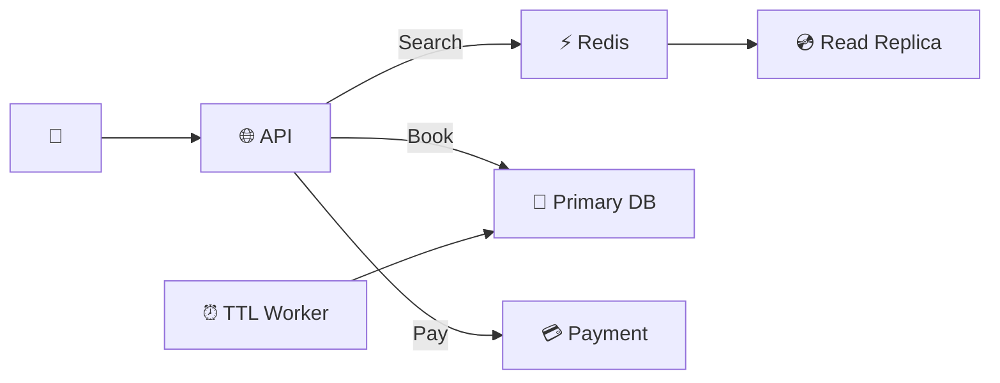

# Hotel Reservation System — Quick Revision (Short Notes)

### Core Problem
Prevent double-booking when 500 users click "Book" on the last room simultaneously.
**This is a correctness problem, not a scale problem** (data is tiny: ~22 GB).

---

### 1. The Race Condition
Two users read `available = 1` at the same time → both insert → double booking!

### 2. Solution: Optimistic Locking (Version Column)
```sql
UPDATE room_availability 
SET reserved_rooms = reserved_rooms + 1, version = version + 1
WHERE room_type_id = 42 AND date = '2026-12-25' AND version = 17;
-- Only 1 thread wins. Losers retry with new version.
```
- No locks held → high throughput
- Retries are rare at hotel-scale QPS

### 3. Booking State Machine
```
PENDING (room held, payment processing)
  → CONFIRMED (payment OK)
  → CANCELLED (payment failed OR 10-min TTL expired)
```
Background worker cancels expired PENDINGs and releases rooms.

### 4. Idempotency Key
- Client sends UUID with every request
- Server checks: already processed? → return cached response
- Unique DB index prevents duplicate inserts even under concurrent retries

### 5. Consistency Split
| Path | Consistency | Why |
|---|---|---|
| **Booking** | Strong (Primary DB) | Cannot afford stale availability data |
| **Search** | Eventual (Replicas + Cache) | Showing stale results for seconds is OK |

---

### Architecture



### Memory Trick: "O.I.S."
1. **O**ptimistic Locking — `WHERE version = X`
2. **I**dempotency Key — Client UUID dedup
3. **S**tate Machine — PENDING → CONFIRMED/CANCELLED
