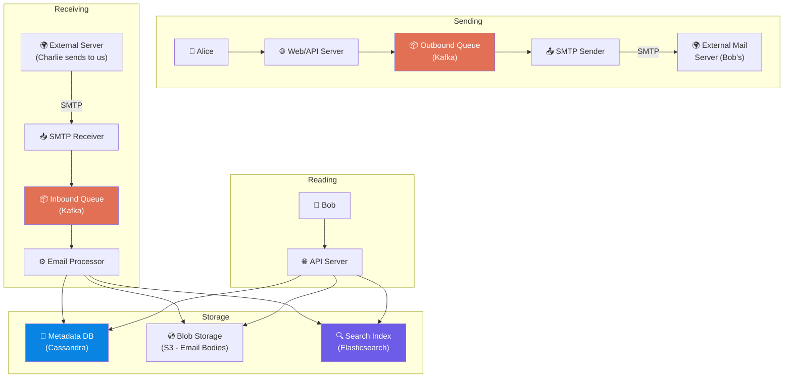
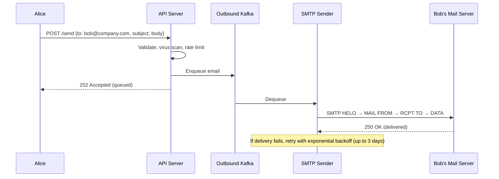

# Volume 2 - Chapter 8: Design a Distributed Email Service (e.g., Gmail)

> **Core Idea:** Email is one of the oldest internet protocols (1970s!) yet designing a modern email service at Gmail scale involves solving fascinating distributed systems problems: storing petabytes of emails, handling complex search across billions of messages, supporting real-time push notifications, and interoperating with every other email provider on Earth via the SMTP protocol. The hardest part is building a **search index** that lets users find any email from 10 years ago in milliseconds.

---

## 🎯 Step 1: Understand the Problem & Scope

### Clarifying the Requirements

```
You:  "Are we designing just the backend, or the full client?"
Int:  "Backend system design. Assume a web/mobile client exists."

You:  "What features?"
Int:  "Send emails, receive emails, search emails, folders/labels, attachments."

You:  "Scale?"
Int:  "1 billion total users. 500 million DAU. Average user sends 5 and receives 40 emails/day."

You:  "Average email size?"
Int:  "50 KB without attachments. 500 KB with."
```

### 📋 Back-of-the-Envelope

| Metric | Calculation | Result |
|---|---|---|
| **Emails received/day** | 500M DAU × 40 emails | **20 Billion emails/day** |
| **Emails sent/day** | 500M × 5 | **2.5 Billion emails/day** |
| **Receive QPS** | 20B / 86400 | **~230,000 QPS** |
| **Storage/day** | 20B × 50 KB avg | **~1 PB/day** |
| **Storage/year** | 1 PB × 365 | **~365 PB/year** |

> **Takeaway:** Storage is the dominant challenge. 365 PB/year requires object storage (S3-like) for email bodies and a separate metadata DB for fast inbox queries.

---

## 📬 Step 2: Email Protocols (The Foundation)

### How Email Actually Works (Beginner)
Email isn't peer-to-peer. It goes through a relay chain, like physical mail:

```
Alice (Gmail) → Gmail SMTP Server → Bob's Company SMTP Server → Bob's Mailbox
```

### The 3 Protocols
| Protocol | Purpose | Analogy |
|---|---|---|
| **SMTP** (Simple Mail Transfer Protocol) | Sending email between servers | The postal truck carrying letters between post offices |
| **IMAP** (Internet Message Access Protocol) | Reading email (keeps mail on server) | Going to the post office and reading your letters there |
| **POP3** (Post Office Protocol) | Reading email (downloads and deletes from server) | Taking letters home and shredding the originals |

Modern systems (Gmail) use **SMTP for sending** and a **proprietary API (not IMAP) for reading** internally, but expose IMAP for third-party client compatibility.

---

## 🏗️ Step 3: High-Level Architecture



---

## 💾 Step 4: Storage Architecture (The Hard Part)

### Separation of Concerns
We split email storage into three layers:

**1. Metadata DB (Cassandra)**
Stores lightweight, query-able information about each email:
```sql
-- Partition by user_id for fast inbox loading
user_id      UUID        -- Partition Key
email_id     UUID        -- Clustering Key  
folder       TEXT        -- "inbox", "sent", "trash"
subject      TEXT
sender       TEXT
recipients   LIST<TEXT>
timestamp    TIMESTAMP
is_read      BOOLEAN
has_attachment BOOLEAN
body_blob_key TEXT       -- Pointer to S3
```

**Why Cassandra?** Inbox loading is always `WHERE user_id = X ORDER BY timestamp DESC LIMIT 50`. Cassandra's partition key + clustering key design handles this in a single sequential disk read.

**2. Blob Storage (S3)**
The actual email body (HTML, plaintext) and attachments are stored as blobs in object storage.
- **Key:** `emails/{user_id}/{email_id}/body.html`
- **Attachments:** `emails/{user_id}/{email_id}/attachments/photo.jpg`

**Why not store body in Cassandra?** Email bodies can be 500 KB+. Storing them in the metadata DB would bloat the partition sizes and slow down inbox loading queries. Separating blob data from metadata is a classic pattern.

**3. Search Index (Elasticsearch)**
When a user searches "invoice from Amazon 2024", we need full-text search across billions of emails:
```json
{
  "user_id": "alice_123",
  "email_id": "email_456",
  "subject": "Your Amazon Invoice",
  "body_text": "Thank you for your order...",
  "sender": "orders@amazon.com",
  "date": "2024-03-15"
}
```
Elasticsearch builds inverted indexes on all text fields. Query: `{user_id: alice_123, query: "invoice amazon"}` returns matches in milliseconds.

---

## 📤 Step 5: Sending an Email (The Outbound Path)

### Sequence Diagram


### Why Queue Before Sending?
SMTP delivery to external servers can take seconds (DNS lookup, TLS handshake, slow remote server). Queuing ensures the user gets an instant response while delivery happens asynchronously. If the remote server is down, we retry for up to 72 hours (standard SMTP retry behavior).

### Spam & Abuse Prevention (Outbound)
- **Rate limiting:** Max 500 emails/day per user (prevent compromised accounts from spamming).
- **SPF/DKIM/DMARC:** Cryptographic signatures proving the email genuinely came from our servers. Without these, receiving servers will reject or spam-folder our emails.
- **Virus scanning:** Scan attachments before sending.

---

## 📥 Step 6: Receiving an Email (The Inbound Path)

When an external server sends email to one of our users:

1. **SMTP Receiver** accepts the incoming SMTP connection.
2. **Spam Filter (ML):** Classifies incoming email as spam/not-spam using sender reputation, content analysis, and link scanning. ~80% of all incoming email is spam.
3. **Virus Scanner:** Scans attachments for malware.
4. **Email Processor:**
   - Stores email body in S3 (blob storage).
   - Writes metadata row to Cassandra (inbox entry).
   - Indexes the email in Elasticsearch (for search).
   - Fires a push notification to the user's phone via WebSocket/FCM.

---

## 🔍 Step 7: Email Search (The Staff-Level Topic)

### The Challenge
A user types "flight confirmation paris" in the search bar. We must search across potentially 100,000+ emails in their mailbox and return results in <200ms.

### Why Cassandra Can't Do This
Cassandra is designed for key-value lookups (`WHERE user_id = X`). It does NOT support full-text search. Running `WHERE body LIKE '%flight%'` would require scanning every email — impossibly slow.

### Elasticsearch Inverted Index
```
Word "flight" → [email_42, email_1023, email_5021]
Word "paris"  → [email_42, email_789, email_5021]
Word "confirmation" → [email_42, email_330]

Query: "flight confirmation paris"
Intersect: email_42 appears in ALL three → Top result!
```

### Keeping Search Index in Sync
When a new email arrives:
1. Email Processor writes to Cassandra.
2. Email Processor asynchronously writes to Elasticsearch via Kafka.
3. There's a small delay (1-5 seconds) before the email appears in search results. This is acceptable — users don't search for emails they received 2 seconds ago.

---

## 📋 Summary — Quick Revision Table

| Component | Choice | Why |
|---|---|---|
| **Metadata** | **Cassandra** | Partition by user_id. Fast inbox loading with clustering key on timestamp. |
| **Email bodies** | **S3 / Blob storage** | Separates large blobs from metadata. Cheap, durable, infinitely scalable. |
| **Search** | **Elasticsearch** | Inverted index for full-text search across billions of emails. |
| **Sending** | **Kafka queue → SMTP sender** | Async delivery with retry. User gets instant 202 Accepted. |
| **Receiving** | **SMTP receiver → Spam filter → Processor** | ML spam filter rejects 80% of incoming email. |
| **Push notifications** | **WebSocket / FCM** | Real-time "new email" alerts to mobile/web. |

---

## 🧠 Memory Tricks

### **"M.B.S." — The Three Storage Layers**
1. **M**etadata (Cassandra) — Who sent what, when, which folder
2. **B**lob (S3) — The actual email body and attachments
3. **S**earch (Elasticsearch) — Full-text inverted index

### **"The Post Office" Analogy**
> SMTP = postal trucks between post offices. IMAP = visiting the post office to read your mail. POP3 = taking your mail home and burning the originals.

---

> **📖 Previous Chapter:** [← Chapter 7: Design a Hotel Reservation System](/HLD_Vol2/chapter_7/design_a_hotel_reservation_system.md)  
> **📖 Up Next:** Chapter 9 - Design an S3-like Object Storage System
