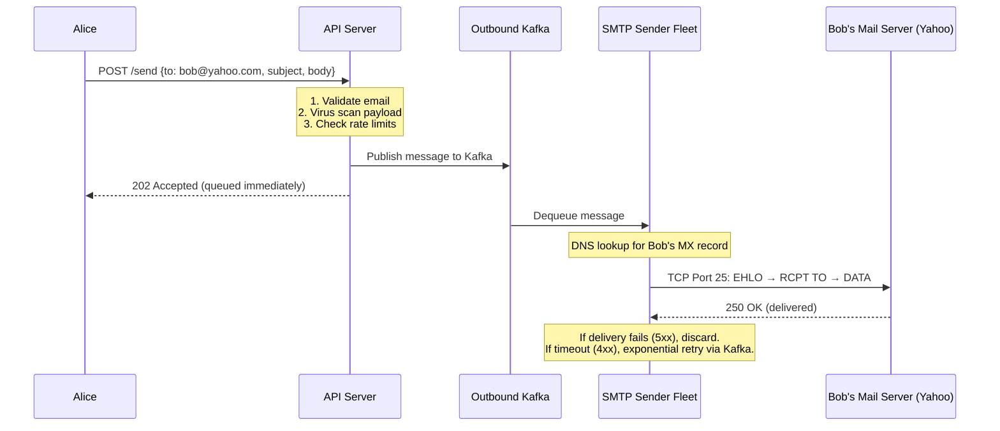
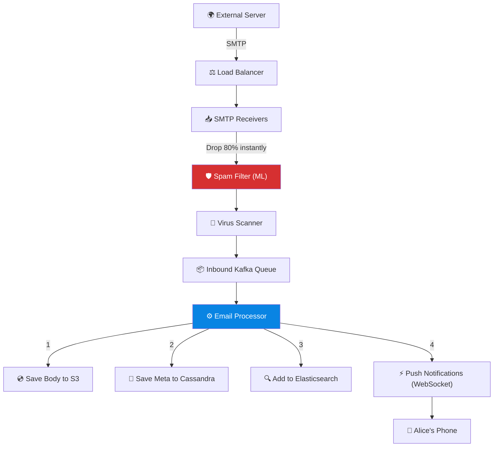

# Volume 2 - Chapter 8: Design a Distributed Email Service (e.g., Gmail)

> **Core Idea:** Email is one of the oldest internet protocols (1970s!) yet designing a modern email service at Gmail scale involves solving fascinating distributed systems problems: storing petabytes of emails, handling complex search across billions of messages, supporting real-time push notifications, and interoperating with every other email provider on Earth via the SMTP protocol. The hardest part is building a **search index** that lets users find any email from 10 years ago in milliseconds.

---

## 🎯 Step 1: Understand the Problem & Scope

### Clarifying the Requirements

```
You:  "Are we designing just the backend, or the full client?"
Int:  "Backend system design. Assume a web/mobile client exists."

You:  "What features?"
Int:  "Send emails, receive emails, search emails, folders/labels, attachments."

You:  "Scale?"
Int:  "1 billion total users. 500 million DAU. Average user sends 5 and receives 40 emails/day."

You:  "Average email size?"
Int:  "50 KB without attachments. 500 KB with attachments."

You:  "Do we need spam and virus filtering?"
Int:  "Absolutely. Assume 80% of incoming traffic is spam."
```

### 📋 Back-of-the-Envelope

| Metric | Calculation | Result |
|---|---|---|
| **Emails received/day** | 500M DAU × 40 emails | **20 Billion emails/day** |
| **Emails sent/day** | 500M × 5 | **2.5 Billion emails/day** |
| **Receive QPS** | 20B / 86400 | **~230,000 QPS (sustained writes)** |
| **Spam Volume** | 80% of 230k QPS | **~184,000 spam emails/sec dropped** |
| **Storage/day** | 20B × 50 KB avg | **~1 PB/day** |
| **Storage/year** | 1 PB × 365 | **~365 PB/year** |
| **Attachments %** | Assuming 10% have ~500KB attachments | **+1 PB/day extra** |

> **Takeaway:** Storage is the dominant challenge. 365 PB/year requires multi-tiered object storage (S3-like) for email bodies and attachments, plus a separate metadata DB for fast inbox queries, and an inverted index for searching.

---

## 📬 Step 2: Email Protocols (The Foundation)

### How Email Actually Works (Beginner)
Email isn't peer-to-peer. It goes through a relay chain, like physical mail:

```
Alice (Gmail) → Gmail SMTP Server → DNS lookup (finding Bob's MX records) → Bob's Company SMTP Server → Bob's Mailbox
```

### The 4 Protocols

| Protocol | Purpose | Detail / Analogy |
|---|---|---|
| **SMTP** (Simple Mail Transfer Protocol) | Sending email between servers | The postal truck carrying letters between post offices. Uses port 25. |
| **IMAP** (Internet Message Access Protocol) | Reading email (keeps mail on server) | Going to the post office and reading your letters there. Synced across devices. |
| **POP3** (Post Office Protocol) | Reading email (downloads & deletes) | Taking letters home and shredding the originals. Single device only. Legacy. |
| **JMAP / REST API** (Modern APIs) | Web/Mobile Client <-> Backend Server | JSON over HTTP. Modern webmail clients (like Gmail web) use proprietary REST/JMAP instead of IMAP. |

> **Design Choice:** Our system will use **SMTP** exclusively for talking to external servers (Yahoo, Outlook). Internal communication (Client → Our Server) will use a **modern REST/JMAP API**, but we expose an IMAP interface for 3rd-party apps (like Apple Mail).

---

## 🏗️ Step 3: API Design (Client to Server)

```
POST   /v1/emails/send                  → Sends a new email
GET    /v1/emails/messages?folder=inbox → Fetches inbox (paginated)
GET    /v1/emails/search?q=invoice      → Full-text search
POST   /v1/attachments/upload           → Chunked upload for attachments
```

---

## 🗄️ Step 4: Storage Architecture (The M.B.S. Pattern)

We split email storage into three layers: Metadata, Blob, Search (**M.B.S.**)

### 1. Metadata DB (Cassandra / Wide-Column)
Stores lightweight, query-able information about each email for fast inbox rendering.

```sql
CREATE TABLE email_metadata (
    user_id      UUID,                 -- Partition Key (All emails for Alice on one server)
    email_id     TIMEUUID,             -- Clustering Key (Auto-sorted by time)
    folder       TEXT,                 -- "inbox", "sent", "trash"
    subject      TEXT,
    sender       TEXT,
    has_attachment BOOLEAN,
    is_read      BOOLEAN,
    body_blob_id TEXT,                 -- URL to S3 blob
    PRIMARY KEY (user_id, email_id DESC)
);
```

**Why Cassandra?** Inbox loading is always `SELECT * FROM email_metadata WHERE user_id = X ORDER BY email_id DESC LIMIT 50`. Cassandra's partition key + clustering key design guarantees this is answered in a single sequential disk read. Perfect O(1) page loading.

### 2. Blob Storage (S3-compatible)
The actual email body (HTML) and attachments are stored as immutable blobs in object storage.
- **Key:** `emails/{user_id}/{email_id}/body.html`
- **Attachments:** `emails/{user_id}/{email_id}/files/pdf_hash.pdf`

**Why not store the body in Cassandra?** Email bodies can be 500 KB+. Storing them in the metadata DB would bloat the Cassandra partition sizes, thrash memory, and slow down inbox loading queries. Separating heavy blob data from lightweight metadata is a classic scalable pattern.

### 3. Search Index (Elasticsearch)
When a user searches "flight confirmation paris", we need full-text search across 10 years of emails. Cassandra CANNOT do this (`LIKE '%flight%'` would scan the entire DB!).
We pipe metadata into Elasticsearch to build an **Inverted Index**.

---

## 📤 Step 5: Sending an Email (The Outbound Path)

### Sequence Diagram


### Why Queue Before Sending?
SMTP delivery to external servers can take seconds (DNS lookup, TLS handshake, slow remote server). Queuing ensures the user gets an instant response (`202 Accepted`) while delivery happens asynchronously. If Yahoo's server is down, Kafka handles exponential backoff retries for up to 72 hours (the standard SMTP retry behavior) before generating a "Delivery Failed" bounce message.

### Outbound Spam & Security
- **DKIM (DomainKeys Identified Mail):** Senders cryptographically sign outgoing emails mathematically proving the email came from our servers.
- **SPF (Sender Policy Framework):** A DNS record stating "Only our IPs are allowed to send email on behalf of our domain."
- Without DKIM and SPF, Yahoo will throw our users' emails straight into the spam folder.

---

## 📥 Step 6: Receiving an Email (The Inbound Path)

This is the most dangerous part of the system. Anyone on the internet can hit our Port 25.



### Spam Filtering (Machine Learning)
Before accepting the email body, we check the sender's IP address against global blocklists. If malicious, we drop the TCP connection instantly.
Next, an ML model scores the content (phishing links, Nigerian prince keywords, domain reputation). 80% of volume is dropped here, saving petabytes of storage.

### The Email Processor (The Orchestrator)
A heavy worker fleet drains the inbound Kafka queue. For each email, it strictly performs four tasks:
1. Extract attachments and HTML body → Stream to S3.
2. Build lightweight metadata map → Write to Cassandra.
3. Extract text content → Index into Elasticsearch.
4. Publish a message to a Redis Pub/Sub channel which signals the WebSocket servers to push a real-time notification to the user's phone.

---

## 🔍 Step 7: Email Search (Staff-Level Deep Dive)

### The Inverted Index
Elasticsearch breaks every email into terms (tokens) and stores a map of `Term → [List of Email IDs]`.

```json
{
  "user_id": "alice_123",
  "word_index": {
    "flight": ["email_42", "email_1023", "email_5021"],
    "paris":  ["email_42", "email_789", "email_5021"],
    "ticket": ["email_42", "email_330"]
  }
}
```

If Alice searches `"flight paris"`, Elasticsearch fetches the lists for `flight` and `paris`, mathematically intersects them (finding `email_42` and `email_5021` exist in both), and returns them in milliseconds.

### Elasticsearch Sharding Strategy
Searching 1 billion users' emails on one ES cluster is impossible. We must shard.
- **Shard by `user_id`:** All of Alice's search data lives on EXACTLY ONE shard. When Alice searches, the API routes her query directly to her specific ES shard. No scatter-gather across the cluster needed!
- **Data tiering:** Hot data (last 3 months) lives on SSDs. Cold data (emails from 2014) lives on cheaper HDDs. Search queries check the Hot tier first, and only query the Cold tier if the user scrolls down or explicitly requests old data.

---

## 🖇️ Step 8: Attachments Handling

Attachments break systems because they are large (up to 25MB).

**Upload Flow:**
1. User uploads a 20MB video.
2. The API uses a **Presigned URL** to allow the client to upload the file DIRECTLY to S3, completely bypassing our API servers.
3. S3 returns an `attachment_reference_id`.
4. The client includes this simple ID in the final `POST /send` request.

**Deduplication Optimization:**
What if a manager sends a 5MB PDF to 1,000 employees inside the company? Storing 1,000 copies wastes 5GB of storage.
Instead, we calculate the `SHA-256` hash of the attachment. We store it once in S3 under `s3://attachments/hash_abcd123`. The 1,000 metadata rows simply contain a pointer to that hash. This saves petabytes of storage.

---

## ❓ Interview Quick-Fire Questions

**Q1: Why divide storage into Metadata (Cassandra), Blob (S3), and Search (ES)? Why not use PostgreSQL for everything?**
> Relational DBs fail at email scale. Storing 500KB blobs in Postgres bloats memory and destroys cache performance. Doing full-text search with `LIKE '%foo%'` forces full table scans. By splitting responsibilities: S3 handles cheap massive blobs, Cassandra handles O(1) inbox sequential reads, and Elasticsearch handles inverted index text search.

**Q2: What happens if an external SMTP server is offline when we try to send?**
> We don't block the user. The email sits in an Outbound Kafka queue. The SMTP Sender workers use an exponential backoff retry strategy (e.g., retry in 1min, 5min, 1hr, 24hr). If the email cannot be delivered within 72 hours, we generate an automated "Bounce" email back to the sender.

**Q3: How do you achieve real-time "New Email" notifications on the phone?**
> We use WebSockets or Server-Sent Events (SSE) for web, and APNS/FCM for mobile. When the Inbound Processor finishes saving the email to DBs, it publishes an event to Redis Pub/Sub. The WebSocket node hosting the user's connection receives this and pushes the alert to the client.

**Q4: How do you handle searching through attachments?**
> The Inbound Processor extracts text from common file types (PDFs, Word docs) using parsing libraries. This extracted text is appended to the `body_text` field sent to Elasticsearch. When a user searches, they are implicitly searching the attachment contents as well.

**Q5: What is the most resilient way to do Spam Filtering?**
> It's a pipeline. Step 1: Network level — drop connections from known bad IPs (Spamhaus). Step 2: Protocol level — verify SPF/DKIM records. Step 3: Fast ML text analysis (Naive Bayes). Step 4: Slow deep ML analysis (checking URLs against phishing databases, image OCR). Failing early saves compute resources.

---

## 📋 Summary — Quick Revision Table

| Component | Choice | Why |
|---|---|---|
| **Metadata** | **Cassandra / Wide-Column** | Partition by user_id. Fast inbox loading with clustering key on timestamp. |
| **Email bodies** | **S3 / Blob storage** | Separates large blobs from metadata. Cheap, durable, infinitely scalable. |
| **Search** | **Elasticsearch** | Inverted index for full-text search across billions of emails. Shard by user. |
| **Sending** | **Kafka queue → SMTP sender** | Async delivery with retry. User gets instant 202 Accepted. |
| **Receiving** | **SMTP Port 25 → Spam Filter** | ML spam filter rejects 80% of incoming email before storage. |
| **Attachments** | **Direct to S3 + Deduplication** | Clients upload direct via Presigned URLs. Store by SHA-256 hash. |
| **Push notifications** | **WebSocket / FCM** | Real-time "new email" alerts to mobile/web via Redis Pub/Sub. |

---

## 🧠 Memory Tricks

### **"M.B.S." — The Three Storage Layers**
1. **M**etadata (Cassandra) — Who sent what, when, which folder
2. **B**lob (S3) — The actual email body and attachments
3. **S**earch (Elasticsearch) — Full-text inverted index

### **"The Post Office" Analogy**
> SMTP = postal trucks between post offices. IMAP = visiting the post office to read your mail. POP3 = taking your mail home and burning the originals. Direct REST/JMAP = modern digital delivery.

---

> **📖 Previous Chapter:** [← Chapter 7: Design a Hotel Reservation System](/HLD_Vol2/chapter_7/design_a_hotel_reservation_system.md)  
> **📖 Up Next:** [Chapter 9 - Design an S3-like Object Storage System →](/HLD_Vol2/chapter_9/design_s3_object_storage.md)
