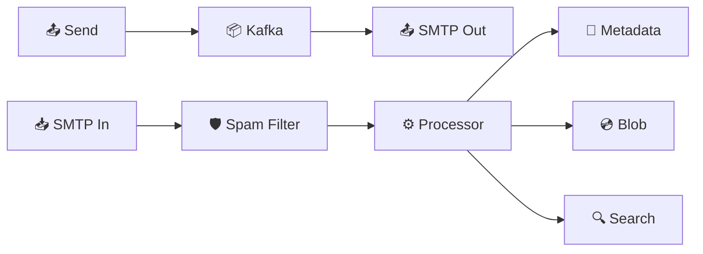

# Distributed Email Service — Quick Revision (Short Notes)

### Core Challenge
365 PB/year storage. Full-text search across billions of emails in <200ms.

---

### 1. Three Storage Layers ("M.B.S.")
| Layer | Tech | Stores |
|---|---|---|
| **M**etadata | Cassandra | Subject, sender, folder, timestamp, is_read |
| **B**lob | S3 | Email body HTML + attachments |
| **S**earch | Elasticsearch | Inverted index for full-text search |

### 2. Protocols
- **SMTP** — Sending between servers (postal truck)
- **IMAP** — Reading from server (read at post office)
- **POP3** — Download & delete (take mail home)

### 3. Sending Flow
`User → API → Kafka Queue → SMTP Sender → External Server`
- Async: user gets 202 Accepted instantly, delivery retries for up to 72 hours.
- SPF/DKIM/DMARC signatures prevent spam rejection.

### 4. Receiving Flow
`External SMTP → Spam Filter (ML, 80% rejected) → Virus Scan → Processor`
Processor writes to: Cassandra (metadata) + S3 (body) + Elasticsearch (index)

### 5. Search
Elasticsearch inverted index: `word → [email_ids]`. Intersect posting lists for multi-word queries.

---

### Architecture

