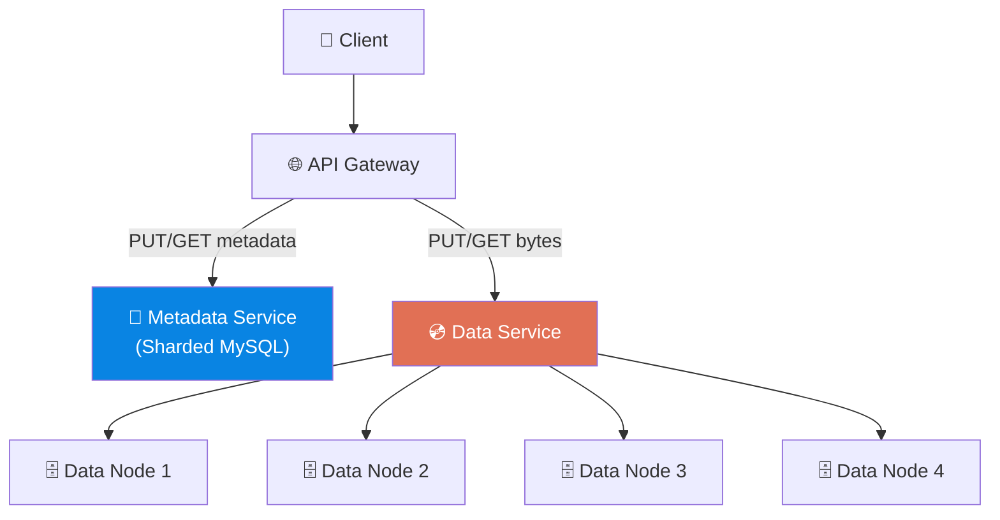
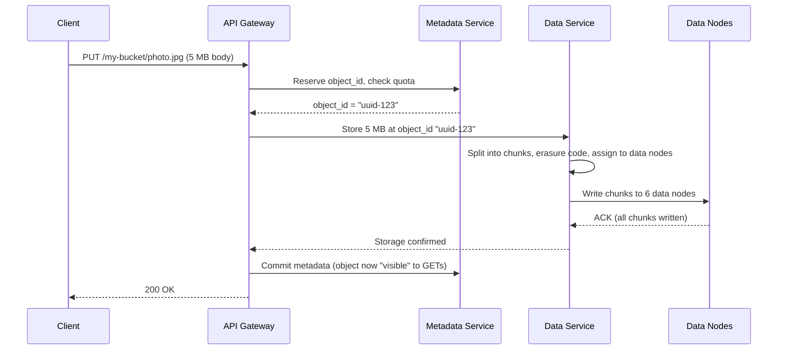

# Volume 2 - Chapter 9: Design an S3-like Object Storage System

> **Core Idea:** Object storage (like AWS S3) stores and retrieves arbitrary blobs of data (images, videos, backups) using simple HTTP PUT/GET operations. Unlike file systems (hierarchical directories) or block storage (fixed-size blocks for databases), object storage treats each object as a flat, immutable blob with a unique key. The design challenge is achieving **11 nines of durability (99.999999999%)** — meaning if you store 10 million objects, you'd expect to lose ONE object every 10,000 years. This requires sophisticated data placement, replication, and erasure coding.

---

## 🎯 Step 1: Understand the Problem & Scope

### Clarifying the Requirements

```
You:  "What operations do we need to support?"
Int:  "PUT (upload), GET (download), DELETE. No partial updates — objects are immutable."

You:  "Object sizes?"
Int:  "Anything from 1 KB to 5 GB. Most objects are 1-10 MB (images)."

You:  "Scale?"
Int:  "Store billions of objects. Hundreds of petabytes total. 100K reads/sec, 10K writes/sec."

You:  "What durability guarantee?"
Int:  "Eleven nines (99.999999999%). Data must never be lost."

You:  "Do we need to support sharing objects privately?"
Int:  "Yes, presigned URLs for temporary access."
```

### 📋 Back-of-the-Envelope

| Metric | Result |
|---|---|
| **Total objects** | ~10 Billion |
| **Total storage** | ~100 PB |
| **Write QPS** | 10,000 |
| **Read QPS** | 100,000 |
| **Average object size** | ~1 MB |
| **Metadata storage** | 10 Billion × 200 bytes = ~2 TB |
| **Ingress Bandwidth** | 10,000 QPS × 1 MB = ~10 GB/sec |
| **Egress Bandwidth** | 100,000 QPS × 1 MB = ~100 GB/sec |

> **Takeaway:** The metadata is surprisingly small (only 2 TB) and can easily fit in a standard distributed database. The data payload (100 PB) is massive and requires thousands of custom storage nodes. Network bandwidth is extreme, requiring massive load balancing.

---

## 🏗️ Step 2: API Design (RESTful)

```
PUT    /bucket-name/object-key     → Upload object (body = raw bytes)
GET    /bucket-name/object-key     → Download object
DELETE /bucket-name/object-key     → Mark object as deleted
HEAD   /bucket-name/object-key     → Get metadata (size, content-type, modified date)
GET    /bucket-name?prefix=photos/ → List objects ending with a prefix
```

### The "Folder" Illusion
Objects are addressed by `bucket + key`. There are no real directories. The `/` in `photos/vacation/img1.jpg` is just part of the string key.
"Folder listing" is simulated by filtering keys by prefix. 

When you call `GET /bucket-name?prefix=photos/&delimiter=/`, the API queries the metadata DB for keys starting with `photos/`, and groups anything after the next `/` into "CommonPrefixes" (which look like folders to the client).

---

## 💾 Step 3: Architecture — The Critical Split

### Separating Metadata from Data
Like standard distributed systems, we must separate two fundamentally different storage concerns:

**1. Metadata Store:** "Where is object X? How big is it? Who owns it?"
- Small records (~200 bytes per object).
- Requires strong consistency (can't have two objects at the exact same key).
- Must support fast lookups, prefix listing, and pagination.
- **Technology:** Sharded MySQL, TiDB, or CockroachDB.

**2. Data Store:** The actual bytes of the object.
- Large blobs (1 KB to 5 GB).
- Write-once, read-many (immutable).
- Must be extremely durable (11 nines).
- **Technology:** Custom distributed storage nodes with erasure coding.



---

## 📝 Step 4: Metadata Design

### Schema
```sql
CREATE TABLE objects (
    bucket_name VARCHAR(63),
    object_key  VARCHAR(1024),
    object_id   UUID,             -- Internal ID pointing to data location
    size        BIGINT,
    content_type VARCHAR(100),
    checksum    VARCHAR(64),      -- SHA-256 of object bytes
    created_at  TIMESTAMP,
    deleted_at  TIMESTAMP,        -- Soft delete
    PRIMARY KEY (bucket_name, object_key)
);

CREATE TABLE buckets (
    bucket_name VARCHAR(63) PRIMARY KEY,
    owner_id    INT,
    created_at  TIMESTAMP,
    region      VARCHAR(20)
);
```

### Sharding the Metadata
With 10 billion objects, a single MySQL instance can't hold all metadata efficiently (indexes get too large).
- **Partition Key:** `hash(bucket_name + object_key)`
- This distributes the metadata evenly across 100+ database shards.

---

## 🗄️ Step 5: Data Storage — How Bytes Are Actually Stored

### The Write Path (Uploading an Object)



### Chunking Large Objects
Objects larger than ~64 MB are split into fixed-size **chunks**. Each chunk is stored independently. The metadata tracks the ordered list of chunk IDs.
```
movie.mp4 (200 MB) → [chunk_1 (64MB), chunk_2 (64MB), chunk_3 (64MB), chunk_4 (8MB)]
```

### Data Node Architecture (Log-Structured Storage)
Each Data Node manages a physical disk. Rather than creating millions of tiny files on the Linux filesystem (one per object), which would cause extreme inode exhaustion and fragmentation, data nodes use a **Log-Structured Storage** approach:

1. The Data Node maintains a large contiguous file called a **Segment File** (e.g., 1 GB in size).
2. Incoming chunks are appended sequentially to the end of the current open Segment File.
3. An in-memory Hash Map (or RocksDB) maps `chunk_id → (segment_file_id, byte_offset, length)`.
4. When a Segment File reaches 1 GB, it is marked Read-Only, and a new one is opened.

> **Why this matters:** Sequential appends physically spin the HDD plate continuously, achieving 150+ MB/s write speeds, whereas random small file writes degrade to ~1 MB/s due to disk head seeking.

---

## 🛡️ Step 6: Durability — Achieving 11 Nines

If we lose data, the business dies. How do we ensure "Eleven Nines" (99.999999999%) of durability?

### Approach 1: Simple Replication (3 copies)
Store 3 copies of every object on 3 different servers in 3 different racks.
- **Durability math:** Probability of losing ALL 3 copies simultaneously ≈ `(0.01)^3 = 10^-6` → only 6 nines.
- **Storage overhead:** 3x (store 300 PB to hold 100 PB of data). Extremely expensive.

### Approach 2: Erasure Coding (The Real Solution)
Instead of storing 3 full copies, we split each object into **data chunks + parity chunks** using Reed-Solomon encoding.

#### Beginner Example: The RAID Analogy
Imagine you have a 4-digit number: `1234`. Instead of storing 3 copies (`1234`, `1234`, `1234`), you:
1. Split into 4 data pieces: `1`, `2`, `3`, `4`
2. Compute 2 parity pieces: `P1 = 1+2 = 3`, `P2 = 3+4 = 7`
3. Store all 6 pieces on 6 different servers: `[1, 2, 3, 4, P1=3, P2=7]`

If ANY 2 servers die, you can reconstruct the original `1234` from the remaining 4 pieces using the parity math.

#### The Real Math (8+4 Scheme)
S3 uses an **8+4 erasure coding scheme**:
- Split each 64MB chunk into 8 data pieces (8MB each).
- Compute 4 parity pieces (8MB each).
- Store all 12 pieces on 12 different servers across 3 different Availability Zones (Datacenters).
- **Can tolerate ANY 4 simultaneous server failures** without data loss. We could literally lose an entire datacenter (4 servers) and still serve the file.
- **Storage overhead:** 12/8 = **1.5x** (vs 3x for replication). Saves 50% storage costs!

**Durability math:** Probability of losing 5 out of 12 servers simultaneously across AZs ≈ `10^-12` → **12 nines! Exceeds our 11-nine target.**

---

## 🗑️ Step 7: Deletion and Garbage Collection

### The Problem
Objects are immutable and erasure-coded across 12 nodes. "Deleting" an object instantly from 12 locations over the network is complex and risky (what if 3 nodes are temporarily down? We get partial deletes).

### The Solution: Lazy Deletion + Compaction
1. **Soft Delete:** A user calls `DELETE /photo.jpg`. We instantly set `deleted_at = NOW()` in the Metadata DB. The object becomes invisible to clients immediately.
2. **Garbage Collector (Background):** A background script scans the Metadata DB for deleted objects. It tells the 12 Data Nodes: "You can delete chunk XYZ."
3. **Compaction:** The Data Node marks the chunk as deleted in its local RocksDB index. However, the data is still sitting inside the 1GB Segment File. 
4. Once a Segment File is >50% deleted data, a Compaction Thread reads the remaining valid chunks, writes them to a NEW Segment File, updates the local index, and physically deletes the old Segment File. (Similar to JVM Garbage Collection).

---

## 🧑‍💻 Step 8: Advanced Scenarios (Staff Level)

### 1. Multipart Uploads
We said objects can be 5 GB. If a user tries to upload 5 GB in a single PUT request and their Wi-Fi drops at 99%, they have to restart the entire upload.

**Solution:**
- The client breaks the 5 GB file into 100 parts of 50 MB.
- The client calls `POST /upload?uploads` to initiate. Gets an `upload_id`.
- The client uploads parts in parallel: `PUT /upload?partNumber=1&uploadId=123`.
- Once all parts are uploaded, client calls `POST /upload?uploadId=123` to Complete.
- The Server stitches them together in the metadata (just pointing to the ordered chunks). No data movement happens on the backend.

### 2. Presigned URLs
How do you safely let a user download a private file without giving them AWS credentials?
- The backend generates a signature using its secret key: `HMAC_SHA256(SecretKey, "GET /photo.jpg expires=1700000000")`.
- It appends this to the URL: `https://s3.com/photo.jpg?expires=1700...&sig=abcd123`
- The API Gateway mathematically verifies the signature. If valid and not expired, it serves the file. No database lookup required for authentication!

### 3. Consistency: Read-After-Write
S3 provides **strong consistency** for Read-After-Write. This means if you PUT a file and get a 200 OK, a GET request 1 millisecond later MUST return the new file.
- This is achieved because the Metadata DB is the arbiter of truth. 
- The Metadata DB is only updated AFTER all 12 data nodes acknowledge the write. 
- Therefore, the file is not visible to GETs until it is completely durable.

### 4. Multi-Region Replication
For disaster recovery, objects can be replicated to a different geographic continent. This is **asynchronous** — the primary region acknowledges the write immediately, and a background process copies chunks to the secondary region over the WAN.

---

## ❓ Interview Quick-Fire Questions

**Q1: Why not just use a POSIX File System (like ext4) instead of object storage?**
> File systems use hierarchical directories and inodes. When you reach 10 Billion files, the inode table grows too large for memory, resulting in massive disk thrashing just to look up a file path. File systems are not distributed by nature. Object storage flattens the hierarchy and separates the metadata (MySQL) from the raw bytes (Data nodes).

**Q2: What is the main advantage of Erasure Coding over Replication?**
> Cost savings. To achieve high durability with replication, you need 3 copies (3x overhead). With an 8+4 Erasure Coding scheme, you only need 1.5x overhead space while surviving 4 simultaneous hardware failures. When storing 100 Petabytes, saving 1.5x storage is worth tens of millions of dollars.

**Q3: Why use Log-Structured Storage for the Data Nodes?**
> If a Data Node saves 10 million 1KB images as individual files, the OS will run out of file descriptors and inodes. Furthermore, writing random small files to HDD disks is extremely slow due to disk head seek time. Log-structured storage appends all objects sequentially into massive 1GB segment files, maximizing write throughput.

**Q4: How do you handle hot partitions in the Metadata DB?**
> If many users upload files to a bucket named "logs" concurrently, the shard holding the "logs" prefix will overheat. We fix this by prefixing object keys with a hash. Instead of `logs/2026/04...`, we store it as `hash(filename)-logs/2026/04...`. This distributes the keys randomly across all shards.

**Q5: How does the system verify data hasn't suffered from "bit rot" on disk?**
> When the object is uploaded, the API Gateway calculates the SHA-256 checksum and saves it in the Metadata DB. When serving a GET request, the Data Node recalculates the checksum of the chunks. If they don't match, bit rot occurred. The system fetches the parity chunks from other servers to repair the corrupted chunk on the fly.

---

## 📋 Summary — Quick Revision Table

| Component | Choice | Why |
|---|---|---|
| **Metadata** | **Sharded Database (MySQL/TiDB)** | Strong consistency for key→location mapping. Supports prefix listing. |
| **Data storage** | **Log-structured append on Data Nodes** | Avoids filesystem inode exhaustion. Maximizes sequential disk write speed. |
| **Durability** | **Erasure coding (8+4)** | 12 nines durability at only 1.5x storage overhead (vs 3x for replication). |
| **Deletion** | **Lazy delete + background GC** | Avoids complex distributed deletes. Metadata marked instantly, chunks cleaned up later during compaction. |
| **Large Files** | **Multipart Uploads** | Parallel uploads, resumable upon network failure. |

---

## 🧠 Memory Tricks

### **"M.D.G." — The S3 Design Pillars**
1. **M**etadata separated from Data (two different systems, two different scaling needs)
2. **D**urability via Erasure Coding (split + parity → survive any 4 failures with only 1.5x overhead)
3. **G**arbage Collection for deletes (mark now, clean later)

### **"The Library" Analogy for Erasure Coding**
> Instead of photocopying an entire book 3 times (3x replication), tear the book into 8 chapters and write 4 summary sheets. Store all 12 pieces in different buildings. If any 4 buildings burn down, you can reconstruct the full book from the remaining 8 pieces. Way cheaper than 3 full copies!

---

> **📖 Previous Chapter:** [← Chapter 8: Design a Distributed Email Service](/HLD_Vol2/chapter_8/design_a_distributed_email_service.md)  
> **📖 Up Next:** [Chapter 10 - Design a Real-Time Gaming Leaderboard →](/HLD_Vol2/chapter_10/design_a_real_time_gaming_leaderboard.md)
