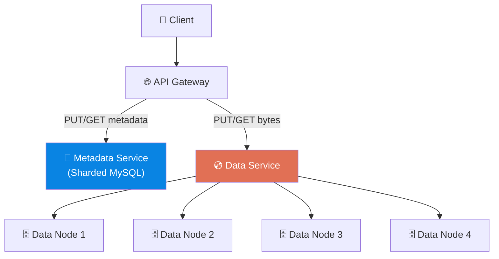
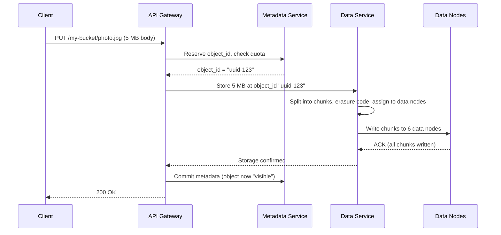

# Volume 2 - Chapter 9: Design an S3-like Object Storage System

> **Core Idea:** Object storage (like AWS S3) stores and retrieves arbitrary blobs of data (images, videos, backups) using simple HTTP PUT/GET operations. Unlike file systems (hierarchical directories) or block storage (fixed-size blocks for databases), object storage treats each object as a flat, immutable blob with a unique key. The design challenge is achieving **11 nines of durability (99.999999999%)** — meaning if you store 10 million objects, you'd expect to lose ONE object every 10,000 years. This requires sophisticated data placement, replication, and erasure coding.

---

## 🎯 Step 1: Understand the Problem & Scope

### Clarifying the Requirements

```
You:  "What operations do we need to support?"
Int:  "PUT (upload), GET (download), DELETE. No partial updates — objects are immutable."

You:  "Object sizes?"
Int:  "Anything from 1 KB to 5 GB. Most objects are 1-10 MB (images)."

You:  "Scale?"
Int:  "Store billions of objects. Hundreds of petabytes total. 100K reads/sec, 10K writes/sec."

You:  "What durability guarantee?"
Int:  "Eleven nines (99.999999999%). Data must never be lost."
```

### 📋 Back-of-the-Envelope

| Metric | Result |
|---|---|
| Total objects | ~10 Billion |
| Total storage | ~100 PB |
| Write QPS | 10,000 |
| Read QPS | 100,000 |
| Average object size | ~1 MB |

---

## 🏗️ Step 2: API Design

```
PUT    /bucket-name/object-key     → Upload object (body = raw bytes)
GET    /bucket-name/object-key     → Download object
DELETE /bucket-name/object-key     → Mark object as deleted
HEAD   /bucket-name/object-key     → Get metadata (size, content-type, modified date)
GET    /bucket-name?prefix=photos/ → List objects with prefix
```

Objects are addressed by `bucket + key`. There are no real directories — the `/` in `photos/vacation/img1.jpg` is just part of the key string. "Folder listing" is simulated by filtering keys by prefix.

---

## 💾 Step 3: Architecture — Separating Metadata from Data

### The Critical Split
Like email (Chapter 8), we separate two fundamentally different storage concerns:

**1. Metadata Store:** "Where is object X? How big is it? Who owns it?"
- Small records (~200 bytes per object)
- Requires strong consistency (can't have two objects at the same key)
- Must support fast lookups and prefix listing
- **Technology:** Sharded MySQL or a distributed KV store

**2. Data Store:** The actual bytes of the object.
- Large blobs (1 KB to 5 GB)
- Write-once, read-many (immutable)
- Must be extremely durable (11 nines)
- **Technology:** Custom distributed storage nodes with erasure coding



---

## 📝 Step 4: Metadata Design

### Schema
```sql
CREATE TABLE objects (
    bucket_name VARCHAR(63),
    object_key  VARCHAR(1024),
    object_id   UUID,             -- Internal ID pointing to data location
    size        BIGINT,
    content_type VARCHAR(100),
    checksum    VARCHAR(64),      -- SHA-256 of object bytes
    created_at  TIMESTAMP,
    PRIMARY KEY (bucket_name, object_key)
);

CREATE TABLE buckets (
    bucket_name VARCHAR(63) PRIMARY KEY,
    owner_id    INT,
    created_at  TIMESTAMP,
    region      VARCHAR(20)
);
```

### Sharding the Metadata
With 10 billion objects, a single MySQL instance can't hold all metadata. Shard by `hash(bucket_name + object_key)`.

---

## 🗄️ Step 5: Data Storage — How Bytes Are Actually Stored

### The Write Path (Uploading an Object)



### Chunking Large Objects
Objects larger than ~64 MB are split into fixed-size **chunks**. Each chunk is stored independently. The metadata tracks the ordered list of chunk IDs.
```
photo.jpg (200 MB) → [chunk_1 (64MB), chunk_2 (64MB), chunk_3 (64MB), chunk_4 (8MB)]
```

### Data Node Architecture
Each data node manages a physical disk. Rather than creating millions of tiny files (one per object), data nodes use a **Log-Structured Storage** approach:
- Objects are appended sequentially to large segment files (e.g., 1 GB each).
- An in-memory index maps `object_id → (segment_file, byte_offset, length)`.
- This eliminates the filesystem overhead of managing billions of individual files.

---

## 🛡️ Step 6: Durability — Achieving 11 Nines

### Approach 1: Simple Replication (3 copies)
Store 3 copies of every object on 3 different servers in 3 different racks.
- **Durability math:** Probability of losing ALL 3 copies simultaneously ≈ `(0.01)^3 = 10^-6` → only 6 nines.
- **Storage overhead:** 3x (store 300 PB to hold 100 PB of data). Extremely expensive.

### Approach 2: Erasure Coding (The Real Solution)
Instead of storing 3 full copies, we split each object into **data chunks + parity chunks** using Reed-Solomon encoding.

#### Beginner Example: The RAID Analogy
Imagine you have a 4-digit number: `1234`. Instead of storing 3 copies (`1234`, `1234`, `1234`), you:
1. Split into 4 data pieces: `1`, `2`, `3`, `4`
2. Compute 2 parity pieces: `P1 = 1+2 = 3`, `P2 = 3+4 = 7`
3. Store all 6 pieces on 6 different servers: `[1, 2, 3, 4, P1=3, P2=7]`

If ANY 2 servers die, you can reconstruct the original `1234` from the remaining 4 pieces using the parity math. (Real erasure coding uses Galois Field arithmetic, not simple addition.)

#### The Math (8+4 Scheme)
S3 uses an **8+4 erasure coding scheme**:
- Split each object into 8 data chunks.
- Compute 4 parity chunks (using Reed-Solomon).
- Store all 12 chunks on 12 different servers.
- **Can tolerate ANY 4 simultaneous server failures** without data loss.
- **Storage overhead:** 12/8 = 1.5x (vs 3x for replication). Saves 50% storage!

**Durability math:** Probability of losing 5+ out of 12 servers simultaneously ≈ `10^-12` → **12 nines! Exceeds our 11-nine target.**

---

## 🗑️ Step 7: Deletion and Garbage Collection

### The Problem
Objects are immutable and may be replicated/erasure-coded across many nodes. "Deleting" an object instantly from all locations is complex and risky (partial deletes = data corruption).

### The Solution: Lazy Deletion
1. **Mark as deleted:** Set a `deleted_at` timestamp in the metadata DB. Object becomes invisible to clients immediately.
2. **Garbage Collector (Background):** A periodic background job scans for objects marked as deleted and physically removes the chunks from data nodes.
3. **Compaction:** After chunks are removed, segment files have "holes." A compaction process rewrites segment files to reclaim space.

---

## 🧑‍💻 Step 8: Advanced Deep Dive

### Consistency: Read-After-Write
After a successful PUT, a subsequent GET must return the newly written object (not a stale "404 Not Found"). This requires the metadata commit to be synchronous — the PUT only returns 200 after metadata is durably written.

### Multi-Region Replication
For disaster recovery, objects can be replicated to a different geographic region. This is async — the primary region acknowledges the write immediately, and a background process copies chunks to the secondary region. RPO (Recovery Point Objective) is typically a few minutes.

### Versioning
S3 supports object versioning. Each PUT to the same key creates a new version:
```
my-bucket/config.json → v1 (original)
my-bucket/config.json → v2 (updated)
my-bucket/config.json → v3 (latest)
```
Old versions are retained until explicitly deleted. Implemented by storing `version_id` alongside the object key in the metadata table.

---

## 📋 Summary — Quick Revision Table

| Component | Choice | Why |
|---|---|---|
| **Metadata** | **Sharded MySQL** | Strong consistency for key→location mapping. Supports prefix listing. |
| **Data storage** | **Log-structured append on data nodes** | Avoids filesystem overhead of billions of small files. |
| **Durability** | **Erasure coding (8+4)** | 12 nines durability at only 1.5x storage overhead (vs 3x for replication). |
| **Deletion** | **Lazy delete + background GC** | Avoids complex distributed delete. Metadata marked instantly, chunks cleaned up later. |

---

## 🧠 Memory Tricks

### **"M.D.G." — The S3 Design Pillars**
1. **M**etadata separated from Data (two different systems, two different scaling needs)
2. **D**urability via Erasure Coding (split + parity → survive any 4 failures with only 1.5x overhead)
3. **G**arbage Collection for deletes (mark now, clean later)

### **"The Library" Analogy for Erasure Coding**
> Instead of photocopying an entire book 3 times (3x replication), tear the book into 8 chapters and write 4 summary sheets. Store all 12 pieces in different buildings. If any 4 buildings burn down, you can reconstruct the full book from the remaining 8 pieces. Way cheaper than 3 full copies!

---

> **📖 Previous Chapter:** [← Chapter 8: Design a Distributed Email Service](/HLD_Vol2/chapter_8/design_a_distributed_email_service.md)  
> **📖 Up Next:** Chapter 10 - Design a Real-Time Gaming Leaderboard
