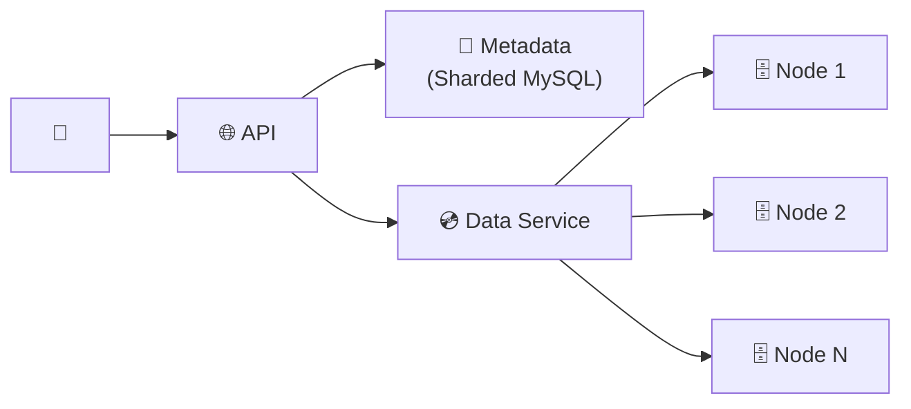

# S3-like Object Storage — Quick Revision (Short Notes)

### Core Challenge
Store 100 PB of objects with **11 nines durability** (lose 1 object per 10,000 years).

---

### 1. Metadata vs Data Split
| Layer | Tech | What it stores |
|---|---|---|
| Metadata | Sharded MySQL | Key → object_id, size, checksum, location |
| Data | Custom data nodes | Raw bytes, erasure-coded chunks in segment files |

### 2. Erasure Coding (8+4 scheme)
- Split object into 8 data chunks + compute 4 parity chunks = 12 total
- Store on 12 different servers
- **Survive ANY 4 failures** → 12 nines durability
- **Only 1.5x storage overhead** (vs 3x for simple replication)

### 3. Data Node Storage
- Objects NOT stored as individual files (billions of files = filesystem meltdown)
- Appended to large **segment files** (~1GB). In-memory index: `object_id → (file, offset, length)`

### 4. Deletion
- **Lazy:** Mark deleted in metadata (instant). Background GC physically removes chunks later.
- Compaction reclaims segment file space.

### 5. Write Path
`Client PUT → API → Metadata reserve → Data Service (chunk + erasure code + write to nodes) → Metadata commit → 200 OK`

---

### Architecture

### Memory Trick: "The Library Analogy"
Tear the book into 8 chapters + write 4 summary sheets = 12 pieces in 12 buildings. Any 4 burn down? Reconstruct from remaining 8.
